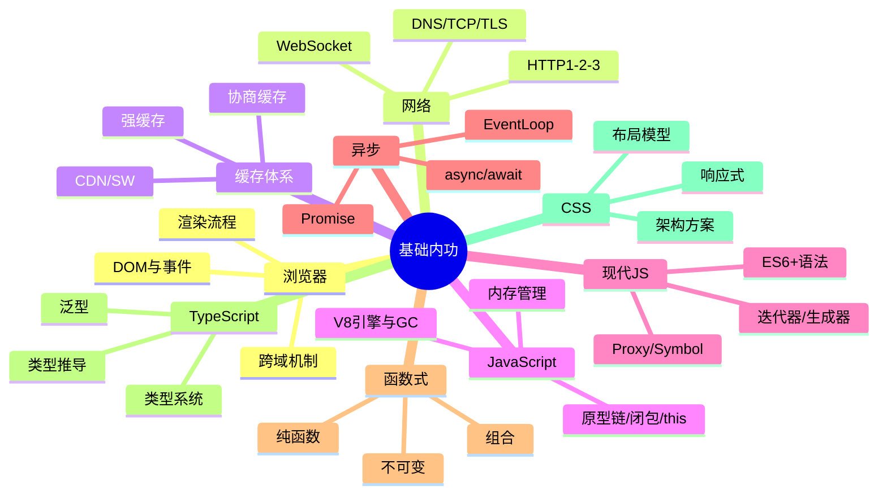
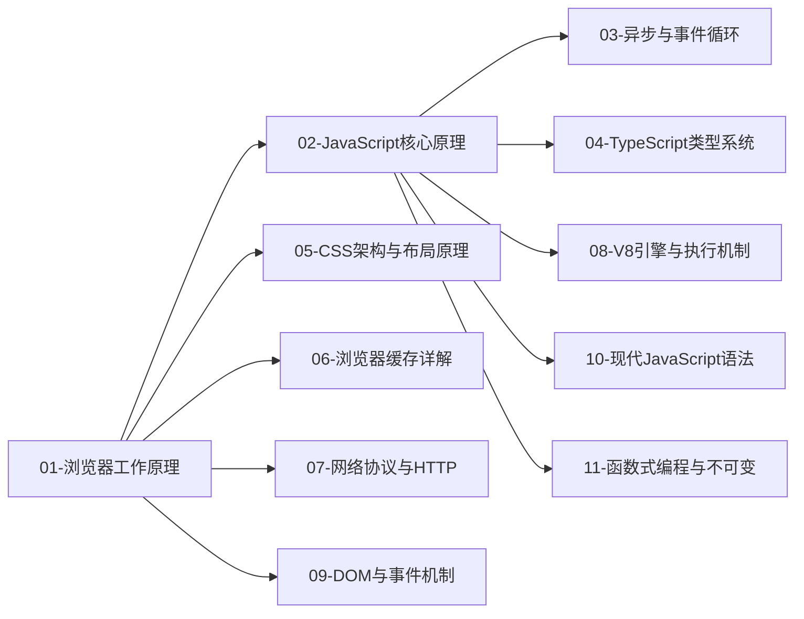

# 01-基础内功 · 本章导读

## 模块定位

基础内功是整个前端架构师知识体系的**地基**。不理解浏览器如何工作、JavaScript 如何执行、CSS 如何布局，后续框架原理、工程化、架构设计都会变成"空中楼阁"。

## 知识地图

## 章节依赖关系

**建议顺序：** 01 → 07 → 06 → 09 → 02 → 08 → 10 → 11 → 03 → 04 → 05
（浏览器/网络/缓存/DOM 一组；JS 核心/V8/现代语法/函数式一组；04 可与 03 并行）

## 前置要求

- 有 HTML/CSS/JavaScript 基础语法经验
- 能在浏览器 DevTools 中查看 Network、Elements 面板
- 本地可运行 Node.js（用于 TS 示例）

## 学习建议

1. **浏览器原理**是理解性能优化、渲染策略的前提，务必先学
2. **JavaScript 核心原理**篇幅最大，建议分 3-4 天消化，每学一个概念就写小 demo 验证
3. **事件循环**是面试高频 + 日常调试必备，结合 `console.log` 顺序题反复练习
4. **TypeScript** 不要死记语法，重点理解"类型即约束"的设计思想
5. **CSS 架构**偏工程实践，可与实际项目对照阅读

## 本章文件列表

| 文件 | 预计阅读时间 |
|------|-------------|
| [01-浏览器工作原理](./01-浏览器工作原理.md) | 2-3 小时 |
| [02-JavaScript核心原理](./02-JavaScript核心原理.md) | 4-5 小时 |
| [03-异步与事件循环](./03-异步与事件循环.md) | 2-3 小时 |
| [04-TypeScript类型系统](./04-TypeScript类型系统.md) | 3-4 小时 |
| [05-CSS架构与布局原理](./05-CSS架构与布局原理.md) | 2-3 小时 |
| [06-浏览器缓存详解](./06-浏览器缓存详解.md) | 2-3 小时 |
| [07-网络协议与HTTP详解](./07-网络协议与HTTP详解.md) | 3-4 小时 |
| [08-V8引擎与JavaScript执行机制](./08-V8引擎与JavaScript执行机制.md) | 3-4 小时 |
| [09-DOM与事件机制](./09-DOM与事件机制.md) | 2-3 小时 |
| [10-现代JavaScript语法(ES6+)](./10-现代JavaScript语法(ES6+).md) | 3-4 小时 |
| [11-函数式编程与不可变数据](./11-函数式编程与不可变数据.md) | 2-3 小时 |
| [12-数据结构与算法手撕](./12-数据结构与算法手撕.md) | 4-6 小时 |
| [13-手写题合集](./13-手写题合集.md) | 3-4 小时 |

## 大厂面试冲刺

本模块新增 **12-算法手撕** 与 **13-手写题合集**，配合各章「面试高频问答（含追问链）」使用。建议复习顺序：原理章节 → 手写题 → 模拟面试追问。

## 自测清单

完成本模块后，你应该能回答：

- [ ] 从输入 URL 到页面展示，浏览器经历了哪些步骤？
- [ ] 重排（reflow）和重绘（repaint）的区别是什么？如何减少？
- [ ] 解释原型链查找过程，`new` 操作符做了什么？
- [ ] 闭包是什么？什么场景下会造成内存泄漏？
- [ ] 宏任务和微任务的区别？`Promise.then` 和 `setTimeout` 谁先执行？
- [ ] TypeScript 中 `interface` 和 `type` 的区别？泛型约束怎么用？
- [ ] Flex 和 Grid 各自适合什么布局场景？
- [ ] 强缓存与协商缓存的区别？`no-cache` 和 `no-store` 有何不同？
- [ ] 为什么「HTML 用 no-cache + 静态资源长缓存」能做到发版即更新？
- [ ] 一次请求经过哪些网络阶段？HTTP/1.1、HTTP/2、HTTP/3 的核心区别？
- [ ] HTTPS/TLS 握手如何同时用非对称与对称加密？
- [ ] V8 如何执行 JS（AST→字节码→JIT）？隐藏类与内联缓存是什么？
- [ ] 分代垃圾回收的原理？什么样的引用会导致内存泄漏？
- [ ] 事件流的三个阶段？事件委托的原理与优势？
- [ ] `??` 与 `||` 的区别？Proxy 如何支撑 Vue 3 响应式？
- [ ] 什么是纯函数？为什么 React 状态更新必须不可变？
- [ ] 能手写 new/call/bind/Promise.all/防抖节流/深拷贝？
- [ ] LRU、反转链表、无重复子串、层序遍历能否独立实现？
- [ ] 能手写堆/并查集/拓扑排序？接雨水、LIS、编辑距离能否口述思路？
