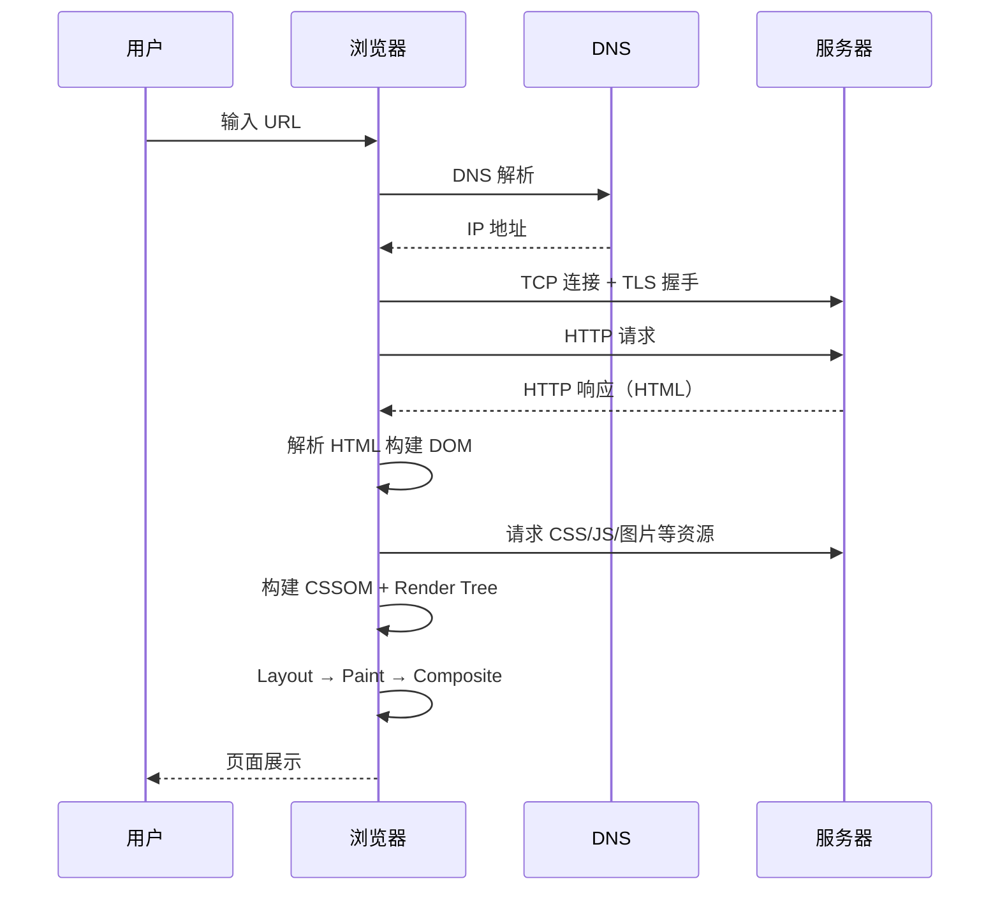
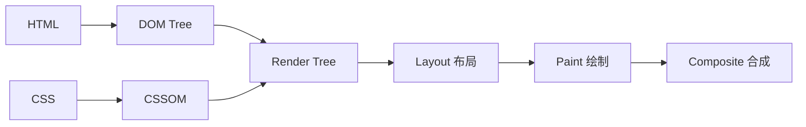
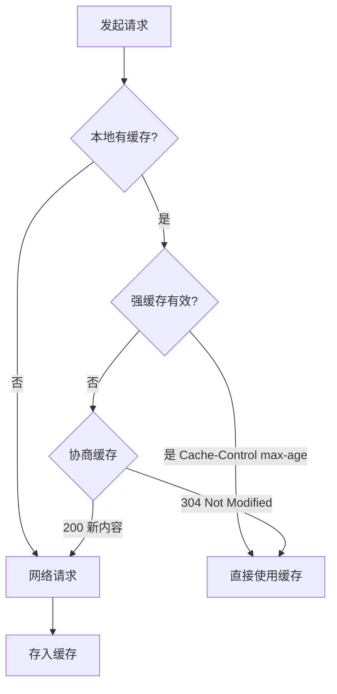
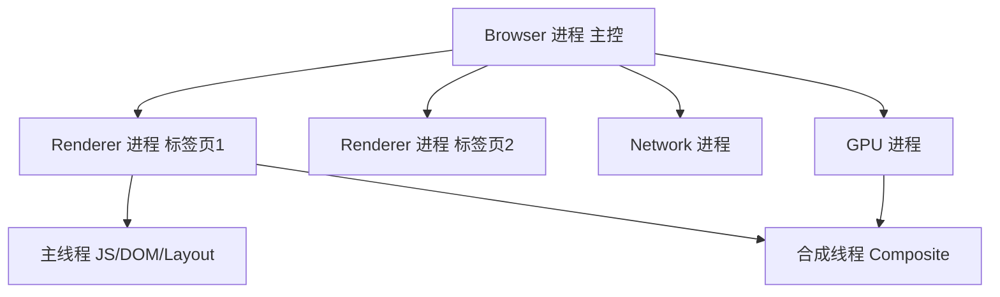
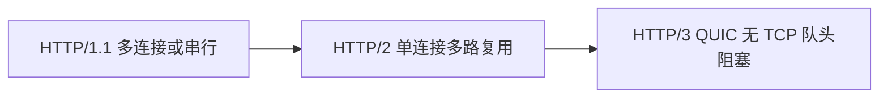

# 浏览器工作原理

## 学习目标

- 理解从输入 URL 到页面渲染的完整流程
- 掌握浏览器渲染管线：解析 → 布局 → 绘制 → 合成
- 理解重排（reflow）与重绘（repaint）的区别及优化策略
- 掌握 HTTP 缓存机制（强缓存 vs 协商缓存）
- 理解跨域的本质及常见解决方案

## 为什么需要

前端代码最终运行在浏览器中。不理解浏览器如何解析 HTML、加载资源、渲染像素，就无法：

- 解释"为什么改一个 CSS 属性会导致整页卡顿"
- 设计合理的缓存策略减少重复请求
- 正确处理跨域问题
- 在架构层面做 SSR/CSR 等渲染策略选型

**架构师视角：** 浏览器是前端的第一层"运行时"，其工作原理决定了性能上限和安全边界。

## 核心原理

### 1. 从 URL 到页面



**关键步骤说明：**

| 步骤 | 说明 |
|------|------|
| DNS 解析 | 域名 → IP，有缓存层级（浏览器 → OS → 路由器 → ISP） |
| TCP/TLS | 建立连接，HTTPS 需额外 TLS 握手 |
| 请求响应 | 浏览器发送 HTTP 请求，服务器返回 HTML |
| 解析 HTML | 自上而下构建 DOM 树，遇到 `<script>` 可能阻塞 |
| 构建 CSSOM | 解析 CSS 构建 CSS Object Model |
| Render Tree | DOM + CSSOM 合并，不含 `display:none` 节点 |
| Layout | 计算每个节点的几何信息（位置、大小） |
| Paint | 填充像素（颜色、边框、阴影等） |
| Composite | 合成层，GPU 加速 |

### 2. 渲染管线详解



**重排（Reflow）vs 重绘（Repaint）：**

| 操作 | 触发条件 | 代价 |
|------|---------|------|
| 重排 | 改变几何属性（width、height、position、display） | 高：需重新 Layout |
| 重绘 | 改变视觉属性（color、background、visibility） | 中：跳过 Layout，仍 Paint |
| 合成 | 仅 transform、opacity 等 | 低：GPU 合成层 |

```javascript
// 触发重排 — 读写交替导致强制同步布局（Layout Thrashing）
const el = document.getElementById('box');
el.style.width = el.offsetWidth + 10 + 'px'; // 读 offsetWidth 强制 layout

// 优化：批量读写分离
const width = el.offsetWidth;
el.style.width = width + 10 + 'px';

// 仅触发合成 — 性能最优
el.style.transform = 'translateX(100px)';
el.style.opacity = '0.5';
```

### 3. HTTP 缓存机制



**强缓存（不发请求）：**

```
Cache-Control: max-age=31536000, immutable
Expires: Wed, 21 Oct 2026 07:28:00 GMT  # HTTP/1.0，已被 Cache-Control 取代
```

**协商缓存（发请求，服务器决定 304 或 200）：**

```
# 请求头
If-None-Match: "abc123"      # 对应 ETag
If-Modified-Since: ...       # 对应 Last-Modified

# 响应头
ETag: "abc123"
Last-Modified: Wed, 21 Oct 2025 07:28:00 GMT
```

**架构实践：**

- 带 hash 的静态资源（`app.a1b2c3.js`）→ `max-age=1年, immutable`
- `index.html` → `no-cache` 或短 max-age，确保能获取最新入口
- API 数据 → 通常不缓存，或 ETag 协商

### 4. 跨域机制

**同源策略：** 协议 + 域名 + 端口 三者相同才同源。

跨域是**浏览器**的安全策略，不是服务器限制。服务器可以响应，但浏览器会拦截 JS 读取。

**常见解决方案：**

| 方案 | 原理 | 适用场景 |
|------|------|---------|
| CORS | 服务器设置 `Access-Control-Allow-Origin` | 最标准，API 跨域 |
| 代理 | 开发/部署时同源转发 | 开发环境、BFF 层 |
| JSONP | `<script>` 不受同源限制 | 仅 GET，已过时 |
| postMessage | 窗口间通信 | iframe、多窗口 |

```javascript
// CORS 预检请求（Preflight）
// 当请求方法非 GET/HEAD/POST，或 Content-Type 非简单类型时触发 OPTIONS

// 简单请求示例
fetch('https://api.example.com/data', {
  method: 'GET',
  credentials: 'include' // 需服务器 Access-Control-Allow-Credentials: true
});
```

## 关键机制与代码示例

### 关键渲染路径优化

```html
<!-- 1. CSS 放 head，避免 FOUC -->
<link rel="stylesheet" href="critical.css">

<!-- 2. JS 放 body 末尾或使用 defer/async -->
<script defer src="app.js"></script>
<!-- defer: DOM 解析完后按序执行 -->
<!-- async: 下载完立即执行，不保证顺序 -->

<!-- 3. 预连接、预加载 -->
<link rel="preconnect" href="https://api.example.com">
<link rel="preload" href="font.woff2" as="font" crossorigin>
```

### Cookie 与 Storage

```javascript
// Cookie — 自动随请求发送，有大小限制（约 4KB）
document.cookie = 'token=abc; Secure; HttpOnly; SameSite=Strict';

// localStorage — 持久化，同源共享，约 5-10MB
localStorage.setItem('theme', 'dark');

// sessionStorage — 标签页级别，关闭即清除
sessionStorage.setItem('formDraft', JSON.stringify(data));

// IndexedDB — 大容量结构化存储，异步 API
```

### 5. 浏览器多进程架构

现代浏览器采用**多进程**架构，隔离故障、提升安全与性能：



| 进程 | 职责 |
|------|------|
| Browser | 地址栏、书签、网络请求协调 |
| Renderer | 每个标签页（或站点组）独立，DOM/CSS/JS 渲染 |
| GPU | 合成层、3D、Canvas 加速 |
| Network | HTTP/HTTPS 请求 |
| Plugin/Utility | 插件、解码等 |

**Site Isolation：** Chrome 将不同 Site 放入不同 Renderer 进程，防止 Spectre 等侧信道攻击。

### 6. HTML 解析与预加载扫描器

HTML 解析是**增量**的，自上而下构建 DOM。遇到 `<script>` 无 `defer/async` 会**阻塞解析**。

**预加载扫描器（Preload Scanner）：** 主解析器阻塞时，扫描器提前发现 `<link>`、`<script>`、`` 等资源并发起请求，不阻塞 DOM 构建。

```html
<!-- 解析到 script 时，扫描器已并行请求 CSS 和图片 -->
<link rel="stylesheet" href="style.css">
<script src="blocking.js"></script> <!-- 阻塞 -->
 <!-- 扫描器可能已预请求 -->
```

### 7. HTTP/1.1 vs HTTP/2 vs HTTP/3

| 版本 | 关键特性 | 局限 |
|------|---------|------|
| HTTP/1.1 | 持久连接、管道化（少用） | 队头阻塞（同一连接请求串行） |
| HTTP/2 | 多路复用、头部压缩、Server Push | TCP 层队头阻塞 |
| HTTP/3 | 基于 QUIC（UDP），独立流 | 部署较新 |



**架构实践：** HTTP/2+ 减少域名分片需求；静态资源合并策略可调整；HTTPS 是 HTTP/2 前提。

### 8. 缓存存储位置

| 位置 | 说明 | 生命周期 |
|------|------|---------|
| Memory Cache | 内存，当前文档 | 关闭标签页即失 |
| Disk Cache | 磁盘 | 持久，按 Cache-Control |
| Service Worker Cache | SW 控制 | 可离线策略 |
| Push Cache | HTTP/2 Push（已弱化） | 会话级 |

**查找顺序：** 通常 Memory → Disk → 网络。DevTools Network 面板可查看 `(memory cache)` / `(disk cache)`。

### 9. 分层与合成（Compositing Layers）

某些元素会提升为**独立合成层**，由 GPU 单独合成：

- `transform`、`opacity` 动画
- `will-change: transform`
- `<video>`、`<canvas>`、3D transform
- 层数过多会增加内存，需适度

```css
.animated {
  will-change: transform; /* 提示浏览器提前建层，动画完可移除 */
  transform: translateZ(0); /* 旧 hack，慎用 */
}
```

### 10. DOMContentLoaded vs load

| 事件 | 触发时机 |
|------|---------|
| `DOMContentLoaded` | HTML 解析完成，defer 脚本已执行，不等待图片/样式表 |
| `load` | 所有资源（图片、iframe 等）加载完成 |

```javascript
document.addEventListener('DOMContentLoaded', () => {
  // 可操作 DOM，适合初始化
});
window.addEventListener('load', () => {
  // 适合依赖图片尺寸的逻辑
});
```

### 11. Site vs Origin

| 概念 | 定义 | 示例 |
|------|------|------|
| **Origin 源** | 协议 + 域名 + 端口 | `https://example.com:443` |
| **Site 站点** | eTLD+1（有效顶级域+1） | `example.com`（含子域） |

`https://a.example.com` 与 `https://b.example.com` **同源不同站**（子域不同），Cookie `Domain=.example.com` 可共享，但同源策略按 Origin 严格隔离。

## 常见误区与最佳实践

| 误区 | 正确理解 |
|------|---------|
| "改 color 也会重排" | color 只触发重绘，不触发重排 |
| "缓存越久越好" | HTML 入口不宜长缓存，否则用户拿不到新版本 |
| "CORS 是后端的事" | 前端需理解预检、credentials，正确配置请求 |
| "localStorage 可以存敏感信息" | XSS 可读取，敏感 token 应 HttpOnly Cookie |

**最佳实践：**

- 使用 DevTools Performance 面板分析 Layout/Paint 耗时
- 动画优先 `transform` + `opacity`，启用 GPU 合成
- 静态资源文件名带 content hash，配合 CDN 长缓存
- API 跨域统一走 BFF 或网关，减少前端 CORS 复杂度

## 小结

- 浏览器渲染管线：DOM + CSSOM → Render Tree → Layout → Paint → Composite
- 多进程架构：Renderer 隔离标签页，主线程与合成线程分工
- 重排代价最高，重绘次之，合成最优
- HTTP 缓存分强缓存与协商缓存；HTTP/2/3 改善传输效率
- 跨域是浏览器安全策略，CORS 是最标准的解决方案
- 理解这些原理是性能优化和架构选型的基础

## 延伸阅读

- [Inside look at modern web browser (Chrome)](https://developer.chrome.com/blog/inside-browser-part1/)
- [MDN: Critical rendering path](https://developer.mozilla.org/en-US/docs/Web/Performance/Critical_rendering_path)
- [HTTP 缓存 - MDN](https://developer.mozilla.org/en-US/docs/Web/HTTP/Caching)
- 《Web 性能权威指南》
