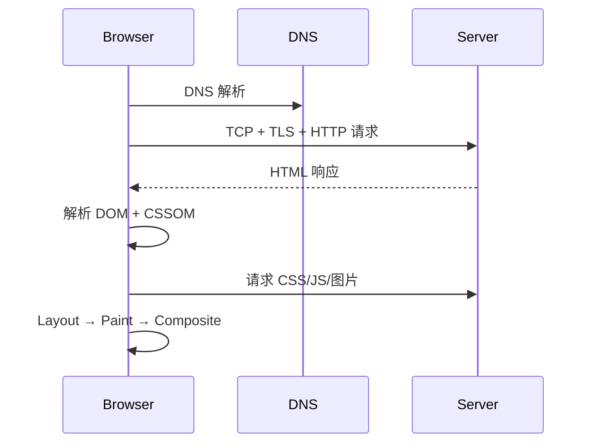
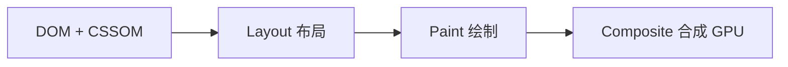
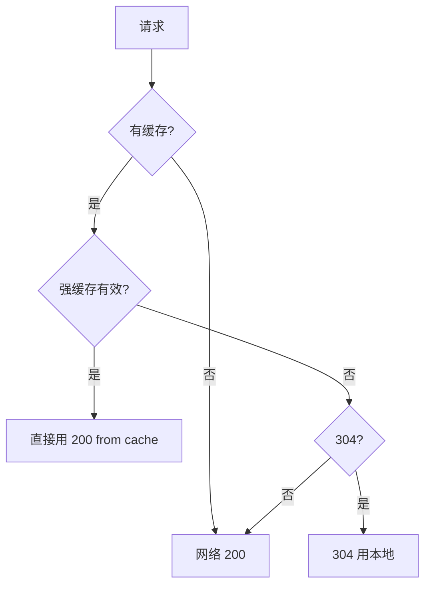

# 浏览器工作原理

## 学习目标

- 读懂从 URL 到页面展示的完整链路，并能用 DevTools 逐步验证
- 掌握渲染管线，能区分重排/重绘/合成并用 Performance 面板定位
- 能在项目中配置 HTTP 缓存策略，并用 Network 面板验证命中
- 能排查跨域、资源阻塞、Layout Thrashing 等真实问题

## 为什么需要

前端代码最终运行在浏览器中。作为开发者，你需要回答：

1. **页面为什么慢？** —— 卡在 DNS、TTFB、资源下载还是渲染？
2. **改了 CSS 为什么卡？** —— 触发了重排还是合成？
3. **缓存为什么没生效？** —— 强缓存还是协商缓存？HTML 该不该长缓存？
4. **跨域报错怎么修？** —— 是 CORS 配置还是前端请求方式问题？

> 核心心法：**浏览器不是黑盒。** Network 看加载，Performance 看渲染，Application 看缓存——三个面板覆盖 80% 的日常排查。

---

## 一、心智模型：用户抱怨 → 排查方向

| 用户/现象 | 可能环节 | 先打开的面板 |
|----------|---------|-------------|
| "页面白屏很久" | TTFB 慢、JS 阻塞解析 | Network（瀑布图） |
| "滚动/动画卡顿" | 重排、主线程长任务 | Performance |
| "改了样式整页抖" | 强制同步布局 | Performance → Layout |
| "刷新还是旧资源" | 缓存策略错误 | Network → Size 列 |
| "接口跨域报错" | CORS / 代理 | Network → 看 OPTIONS |
| "按钮点完页面跳" | 布局偏移 CLS | Performance → Experience |

---

## 二、从 URL 到页面：读懂 + 定位 + 验证

### 2.1 完整链路（理论速览）



| 步骤 | 开发者关注点 |
|------|-------------|
| DNS | 首次慢？考虑 dns-prefetch |
| TTFB | >600ms 需查后端/CDN |
| HTML 解析 | `<script>` 无 defer 会阻塞 |
| 资源加载 | 并发数、优先级、缓存 |
| 渲染 | 重排 > 重绘 > 合成（代价递增） |

### 2.2 用 Network 面板定位加载问题

**操作步骤：**

1. DevTools → **Network** → 勾选 **Disable cache**（开发时）
2. 刷新页面，看瀑布图
3. 关注：**Waiting (TTFB)**、**Content Download**、**Size** 列

```
Size 列含义：
- (disk cache) / (memory cache) → 强缓存命中，无网络请求
- 304 + 很小体积 → 协商缓存命中
- 200 + 完整大小 → 真正下载
```

**案例：TTFB 3s**

- Network 点 HTML 文档 → Timing → 看 **Waiting for server response**
- 若 TTFB 大：查后端、CDN、数据库；前端可 SSR 缓存、减少重定向链
- 验证：修复后 TTFB 应 <600ms（良好）

### 2.3 渲染管线：重排 / 重绘 / 合成



| 操作 | 触发 | 代价 | 开发建议 |
|------|------|------|---------|
| 改 width/height/top | 重排 | 高 | 避免循环读写 layout |
| 改 color/background | 重绘 | 中 | 可接受 |
| 改 transform/opacity | 合成 | 低 | 动画首选 |

**定位 Layout Thrashing（强制同步布局）：**

1. Performance 录制 → 找紫色 **Layout** 条
2. 若 Main 线程出现 **Forced reflow** 警告 → 读写 DOM 几何属性交替

```javascript
// 错误 — 每次循环强制 layout
boxes.forEach(box => {
  box.style.width = box.offsetWidth + 10 + 'px';
});

// 正确 — 批量读，再批量写
const widths = boxes.map(b => b.offsetWidth);
boxes.forEach((box, i) => {
  box.style.width = widths[i] + 10 + 'px';
});
```

**验证：** Performance 中 Layout 次数从 N 次降为 1 次。

---

## 三、HTTP 缓存：读懂 + 配置 + 验证

### 3.1 决策流程



### 3.2 项目落地配置

**Nginx 示例：**

```nginx
# 带 hash 的静态资源 — 永久缓存
location ~* \.(js|css|woff2)$ {
  expires 1y;
  add_header Cache-Control "public, immutable";
}

# HTML 入口 — 必须能拿到新版本
location = /index.html {
  add_header Cache-Control "no-cache";
}
```

**验证步骤：**

1. 首次访问：Network 中 JS 为 200，Size 完整
2. 刷新：Size 显示 `(disk cache)` 或 `(memory cache)`
3. 改 `index.html` 后：HTML 200，新 JS hash 文件名 200

### 3.3 排查：缓存不生效

| 现象 | 原因 | 解决 |
|------|------|------|
| 总 200 无 cache | 未设 Cache-Control | 服务端加 header |
| HTML 旧版 | HTML 被长缓存 | HTML 用 no-cache |
| 304 但内容旧 | ETag 未变 | 构建改 hash |

---

## 四、跨域：读懂 + 定位 + 解决

**同源：** 协议 + 域名 + 端口 相同。

**错误示例：** `Access to fetch at 'https://api.com' from origin 'https://app.com' has been blocked by CORS`

**定位：**

1. Network → 失败请求 → 是否有 **OPTIONS** 预检？
2. 看 Response Headers 是否有 `Access-Control-Allow-Origin`

**解决对照表：**

| 场景 | 方案 |
|------|------|
| 自有 API | 后端加 CORS header |
| 开发环境 | Vite proxy |
| 生产 BFF | 同源 `/api` 转发 |
| 带 Cookie | `credentials: 'include'` + `Allow-Credentials: true` + 具体 Origin（不能 `*`） |

```javascript
// vite.config.ts 开发代理
export default defineConfig({
  server: {
    proxy: {
      '/api': { target: 'https://api.example.com', changeOrigin: true }
    }
  }
});
```

---

## 五、项目落地步骤（Checklist）

### 步骤 1：关键渲染路径优化（1 天）

```html
<link rel="stylesheet" href="critical.css">
<link rel="preconnect" href="https://api.example.com">
<script defer src="app.js"></script>
```

- [ ] CSS 在 head，非关键 CSS 异步
- [ ] JS 用 defer/async，避免阻塞
- [ ] 首屏图 preload + width/height

### 步骤 2：缓存策略（半天）

- [ ] 静态资源 filename 带 contenthash
- [ ] CDN + 长缓存 immutable
- [ ] index.html no-cache
- [ ] Network 验证 disk cache

### 步骤 3：性能基线（半天）

- [ ] Lighthouse 记录 FCP/LCP/TBT
- [ ] Performance 录制，记录 Layout 次数
- [ ] 建立 before 数据

---

## 六、排查实战案例

### 案例 A：首屏白屏 4 秒

1. **现象：** 用户反馈打开慢
2. **Network：** HTML TTFB 200ms 正常；`app.js` 2.8MB，下载 2.5s；无 defer，阻塞解析
3. **修复：** 代码分割 + defer + 路由 lazy
4. **验证：** FCP 4s → 1.2s，DOMContentLoaded 提前 2s

### 案例 B：动画卡顿

1. **Performance：** 每帧多个 Layout，Main 有 Forced reflow
2. **代码：** 动画改 `left`，且 JS 循环读 `offsetWidth`
3. **修复：** `transform: translateX()` + 批量读写
4. **验证：** Layout 从 60 次/秒 → 0，FPS 稳定 60

### 案例 C：发版后用户仍看到旧版

1. **Network：** index.html `(disk cache)` 且 max-age=31536000
2. **修复：** HTML 改 `Cache-Control: no-cache`，JS 保持 hash + 长缓存
3. **验证：** 发版后用户刷新即拿到新 index.html

---

## 常见误区与最佳实践

| 误区 | 正确理解 |
|------|---------|
| "改 color 也会重排" | color 只重绘 |
| "缓存越久越好" | HTML 入口不能长缓存 |
| "CORS 纯后端事" | 前端需懂预检、credentials |
| "localStorage 存 token" | XSS 可窃，用 HttpOnly Cookie |

**可执行清单：**

- [ ] 动画只用 transform/opacity
- [ ] 静态资源 hash + CDN 长缓存
- [ ] API 跨域统一 BFF 或网关
- [ ] 性能问题先 Network 再 Performance
- [ ] 发版前检查 index.html 缓存策略

## 小结

- 加载看 Network，渲染看 Performance，缓存看 Application/Network Size
- 重排 > 重绘 > 合成，优化动画和 DOM 读写
- 缓存：JS/CSS 长缓存 + HTML 短缓存/no-cache
- 跨域：CORS 标准解，开发用 proxy
- 每个问题都有「面板定位 → 代码修复 → 指标验证」闭环

## 延伸阅读

- [Chrome DevTools Network](https://developer.chrome.com/docs/devtools/network)
- [Critical rendering path - MDN](https://developer.mozilla.org/en-US/docs/Web/Performance/Critical_rendering_path)
- [HTTP Caching - MDN](https://developer.mozilla.org/en-US/docs/Web/HTTP/Caching)
