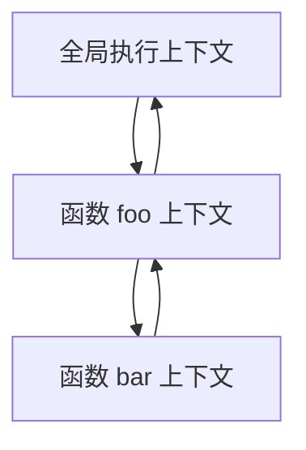
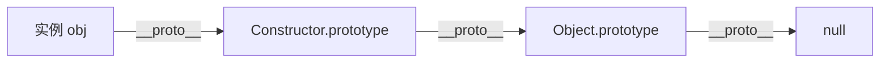
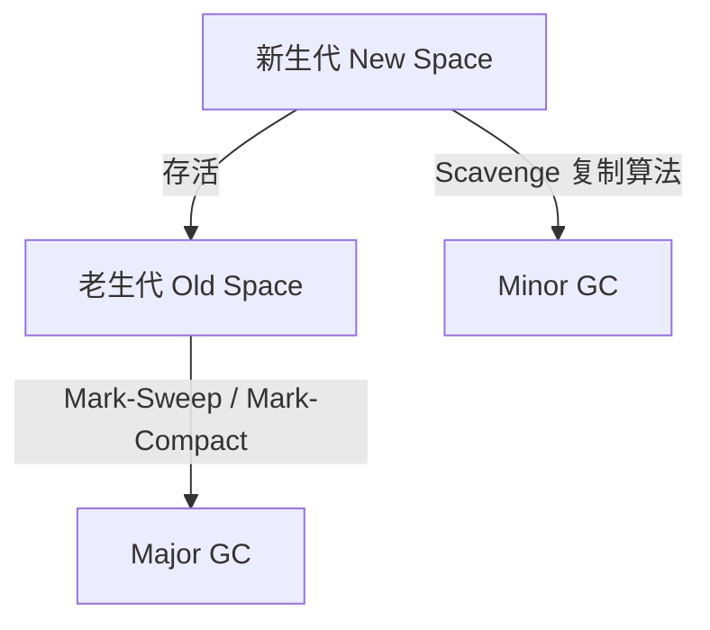

# JavaScript 核心原理

## 学习目标

- 理解 JavaScript 的执行模型：执行上下文、调用栈、作用域链
- 掌握原型链机制及 `new`、继承的实现原理
- 理解闭包的形成条件与应用场景
- 了解 V8 内存管理与垃圾回收机制
- 能识别常见内存泄漏场景

## 为什么需要

JavaScript 是前端的核心语言。框架（React/Vue）、构建工具、Node.js 都建立在 JS 之上。不理解：

- **原型链** → 无法正确实现继承、读懂框架源码
- **闭包** → 无法理解模块模式、React Hooks 闭包陷阱
- **作用域** → 无法解释 `var`/`let`/`const` 差异和 `this` 绑定
- **内存管理** → 无法排查内存泄漏、优化长列表性能

## 核心原理

### 1. 执行上下文与调用栈



**执行上下文包含：**

| 组成部分 | 说明 |
|---------|------|
| Variable Environment | `var`、函数声明 |
| Lexical Environment | `let`/`const`、块级作用域 |
| `this` 绑定 | 由调用方式决定 |
| Outer Environment Reference | 指向外层词法环境，形成作用域链 |

```javascript
// 执行过程示意
var a = 1;
function foo() {
  var b = 2;
  function bar() {
    var c = 3;
    console.log(a, b, c); // 1, 2, 3 — 沿作用域链查找
  }
  bar();
}
foo();
```

### 2. 原型链

每个对象都有内部 `[[Prototype]]`（可通过 `__proto__` 或 `Object.getPrototypeOf` 访问）。



```javascript
function Person(name) {
  this.name = name;
}
Person.prototype.sayHi = function() {
  console.log(`Hi, ${this.name}`);
};

const p = new Person('Alice');

// new 做了什么？
// 1. 创建空对象 obj
// 2. obj.__proto__ = Person.prototype
// 3. 执行 Person.call(obj, ...)
// 4. 返回 obj

// 属性查找：p.sayHi → p 自身没有 → Person.prototype → Object.prototype → null
console.log(p.sayHi === Person.prototype.sayHi); // true
```

**继承的 ES6 写法（语法糖，底层仍是原型）：**

```javascript
class Animal {
  constructor(name) { this.name = name; }
  speak() { console.log(`${this.name} makes a sound`); }
}

class Dog extends Animal {
  constructor(name, breed) {
    super(name); // 相当于 Animal.call(this, name)
    this.breed = breed;
  }
  speak() {
    super.speak();
    console.log(`${this.name} barks`);
  }
}
```

### 3. 闭包

**定义：** 函数能够访问其词法作用域外的变量，即使外层函数已执行完毕。

```javascript
function createCounter() {
  let count = 0; // 被内层函数引用，不会被 GC
  return {
    increment() { return ++count; },
    decrement() { return --count; },
    getCount() { return count; }
  };
}

const counter = createCounter();
counter.increment(); // 1
counter.increment(); // 2
// count 变量存在于闭包中，外部无法直接访问
```

**闭包的应用：**

```javascript
// 1. 模块模式 — 私有变量
const module = (function() {
  let privateVar = 0;
  return {
    getPrivate() { return privateVar; },
    setPrivate(v) { privateVar = v; }
  };
})();

// 2. 柯里化
function multiply(a) {
  return function(b) {
    return a * b;
  };
}
const double = multiply(2);
double(5); // 10

// 3. 循环中的闭包陷阱（经典面试题）
for (var i = 0; i < 3; i++) {
  setTimeout(() => console.log(i), 100); // 3, 3, 3
}
// 解决：let 块级作用域 或 IIFE
for (let j = 0; j < 3; j++) {
  setTimeout(() => console.log(j), 100); // 0, 1, 2
}
```

### 4. this 绑定规则

| 调用方式 | this 指向 |
|---------|----------|
| 普通函数调用 | 非严格模式：全局对象；严格模式：undefined |
| 方法调用 | 调用者对象 |
| `call/apply/bind` | 显式指定的对象 |
| `new` | 新创建的对象 |
| 箭头函数 | 词法 this，继承外层 |

```javascript
const obj = {
  name: 'obj',
  regular() { console.log(this.name); },
  arrow: () => console.log(this.name)
};
obj.regular(); // 'obj'
obj.arrow();   // undefined（箭头函数无自己的 this）

// 显式绑定
function greet() { console.log(this.name); }
greet.call({ name: 'Alice' }); // 'Alice'
const boundGreet = greet.bind({ name: 'Bob' });
boundGreet(); // 'Bob'
```

### 5. 内存管理与垃圾回收

V8 使用**分代垃圾回收**：



**可达性（Reachability）：** 从根（全局对象、当前执行栈）出发，无法到达的对象会被回收。

**常见内存泄漏：**

```javascript
// 1. 意外的全局变量
function leak() {
  accidentalGlobal = 'oops'; // 无 var/let/const
}

// 2. 未清理的定时器/监听器
const timer = setInterval(() => { /* ... */ }, 1000);
// 组件卸载时需 clearInterval(timer)

// 3. 闭包持有大对象
function createHandler() {
  const hugeData = new Array(1e6).fill('x');
  return function handler() {
    // hugeData 被闭包引用，无法释放
    console.log(hugeData.length);
  };
}

// 4. DOM 引用（Detached DOM）
const elements = [];
function addElement() {
  const div = document.createElement('div');
  document.body.appendChild(div);
  elements.push(div); // div 从 DOM 移除后，elements 仍引用
}
```

## 常见误区与最佳实践

| 误区 | 正确理解 |
|------|---------|
| "闭包就是内存泄漏" | 闭包是特性，只有不当使用才泄漏 |
| "原型链就是继承" | 原型是委托机制，继承是语法层面的概念 |
| "箭头函数可以完全替代普通函数" | 箭头函数无 arguments、无 constructor、不能 new |
| "typeof null === 'object'" | 历史 bug，判断 null 用 `x === null` |

**最佳实践：**

- 优先 `let`/`const`，避免 `var` 提升问题
- 理解 `this` 后再用箭头函数，避免在对象方法中误用
- 组件/模块销毁时清理定时器、事件监听、闭包引用
- 使用 Chrome DevTools Memory 面板做堆快照分析泄漏

## 小结

- 执行上下文 + 作用域链决定变量查找
- 原型链是 JS 对象继承的底层机制
- 闭包 = 函数 + 其引用的词法环境
- `this` 由调用方式决定，箭头函数继承外层
- 垃圾回收基于可达性，注意清理引用避免泄漏

## 延伸阅读

- [You Don't Know JS 系列](https://github.com/getify/You-Dont-Know-JS)
- [MDN: Closures](https://developer.mozilla.org/en-US/docs/Web/JavaScript/Closures)
- [V8 垃圾回收机制](https://v8.dev/blog/trash-talk)
- 《JavaScript 高级程序设计》第 4 版
