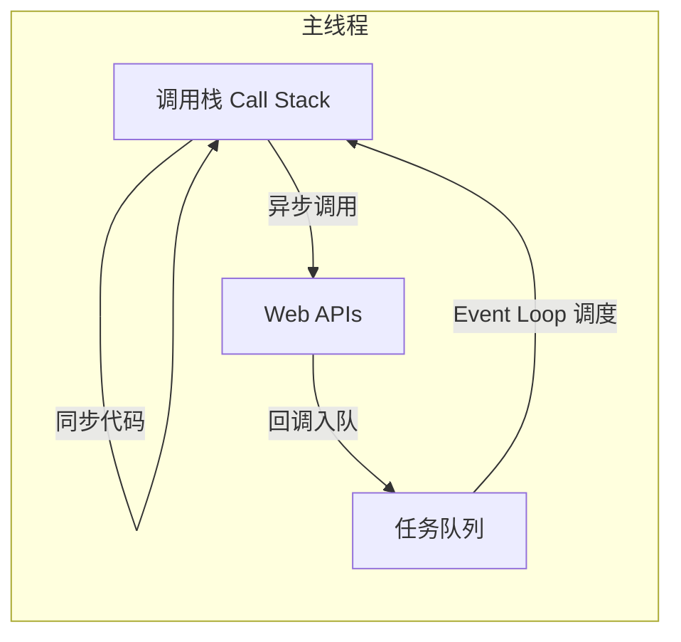
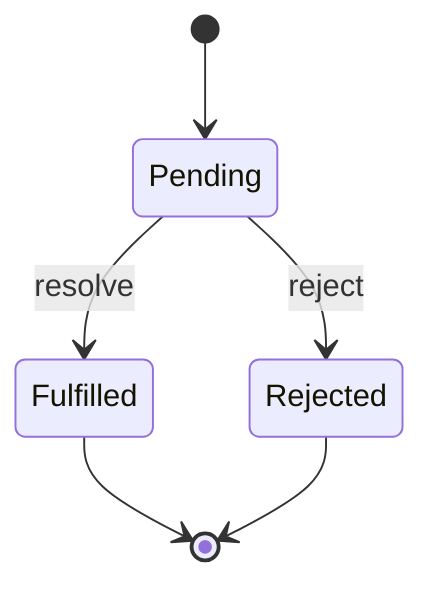

# 异步与事件循环

## 学习目标

- 理解 JavaScript 单线程模型与异步的必要性
- 掌握 Event Loop 机制：调用栈、任务队列、微任务/宏任务
- 理解 Promise 的状态机与链式调用原理
- 掌握 async/await 的语法糖本质与错误处理
- 能分析复杂异步代码的执行顺序

## 为什么需要

浏览器中 JS 负责 DOM 操作、用户交互，若采用多线程直接操作 DOM 会产生竞态。因此 JS 是**单线程**的，异步 I/O 通过 Event Loop 实现，不阻塞主线程。

不理解 Event Loop，就无法：

- 解释 `setTimeout(fn, 0)` 为何不是"立即执行"
- 理解 React 18 的 `automatic batching` 与微任务的关系
- 正确设计异步流程、避免竞态条件
- 排查"明明 await 了却还没更新"的时序问题

## 核心原理

### 1. 单线程与异步



**执行顺序：**

1. 同步代码入栈执行，直至栈空
2. 执行所有**微任务**（microtask）
3. 取一个**宏任务**（macrotask）执行
4. 重复 2-3

### 2. 宏任务 vs 微任务

| 类型 | 常见 API | 优先级 |
|------|---------|--------|
| 宏任务 Macrotask | `setTimeout`、`setInterval`、`setImmediate`（Node）、I/O、UI rendering | 低 |
| 微任务 Microtask | `Promise.then/catch/finally`、`queueMicrotask`、`MutationObserver` | 高 |

```javascript
console.log('1');

setTimeout(() => console.log('2'), 0);

Promise.resolve().then(() => console.log('3'));

console.log('4');

// 输出：1 → 4 → 3 → 2
// 解释：
// 1, 4 同步
// 3 微任务（Promise）
// 2 宏任务（setTimeout）
```

**复杂示例：**

```javascript
console.log('start');

setTimeout(() => {
  console.log('timeout1');
  Promise.resolve().then(() => console.log('promise in timeout1'));
}, 0);

Promise.resolve().then(() => {
  console.log('promise1');
  setTimeout(() => console.log('timeout in promise1'), 0);
});

Promise.resolve().then(() => console.log('promise2'));

console.log('end');

// 输出：start → end → promise1 → promise2 → timeout1 → promise in timeout1 → timeout in promise1
```

### 3. Promise 原理

Promise 是**状态机**，三种状态且不可逆：



**简化版 Promise 实现（理解原理）：**

```javascript
class MyPromise {
  constructor(executor) {
    this.state = 'pending';
    this.value = undefined;
    this.callbacks = [];

    const resolve = (val) => {
      if (this.state !== 'pending') return;
      this.state = 'fulfilled';
      this.value = val;
      this.callbacks.forEach(fn => fn());
    };

    const reject = (err) => {
      if (this.state !== 'pending') return;
      this.state = 'rejected';
      this.value = err;
      this.callbacks.forEach(fn => fn());
    };

    try {
      executor(resolve, reject);
    } catch (e) {
      reject(e);
    }
  }

  then(onFulfilled, onRejected) {
    return new MyPromise((resolve, reject) => {
      const run = () => {
        queueMicrotask(() => {
          try {
            const handler = this.state === 'fulfilled' ? onFulfilled : onRejected;
            const result = handler ? handler(this.value) : this.value;
            if (result instanceof MyPromise) {
              result.then(resolve, reject);
            } else if (this.state === 'fulfilled') {
              resolve(result);
            } else {
              reject(result);
            }
          } catch (e) {
            reject(e);
          }
        });
      };

      if (this.state === 'pending') {
        this.callbacks.push(run);
      } else {
        run();
      }
    });
  }
}
```

**链式调用：** 每个 `then` 返回新 Promise，支持值穿透和错误冒泡。

```javascript
Promise.resolve(1)
  .then(x => x + 1)      // 2
  .then(x => { throw new Error('fail'); })
  .catch(err => 0)       // 捕获错误，返回 0
  .then(x => x + 1)      // 1
  .then(console.log);    // 1
```

### 4. async/await

`async/await` 是 Promise 的语法糖：

```javascript
// async 函数始终返回 Promise
async function fetchUser(id) {
  const res = await fetch(`/api/users/${id}`); // 暂停，让出主线程
  if (!res.ok) throw new Error('Not found');
  return res.json(); // 等价于 Promise.resolve(res.json())
}

// 等价于
function fetchUser(id) {
  return fetch(`/api/users/${id}`)
    .then(res => {
      if (!res.ok) throw new Error('Not found');
      return res.json();
    });
}
```

**错误处理：**

```javascript
async function main() {
  try {
    const user = await fetchUser(1);
    console.log(user);
  } catch (err) {
    console.error('Failed:', err.message);
  }
}

// 或
fetchUser(1)
  .then(user => console.log(user))
  .catch(err => console.error(err));
```

**并行 vs 串行：**

```javascript
// 串行 — 慢
const a = await fetchA();
const b = await fetchB();

// 并行 — 快
const [a, b] = await Promise.all([fetchA(), fetchB()]);

// 竞态 — 谁先完成用谁
const first = await Promise.race([fetchA(), fetchB()]);

// 全部完成（无论成败）
const results = await Promise.allSettled([fetchA(), fetchB()]);
```

### 5. Node.js Event Loop 差异

Node.js 有多个阶段（Timers → Pending → Idle → Poll → Check → Close），与浏览器不完全相同。前端架构师需了解：

- `process.nextTick` 优先级高于 Promise 微任务
- `setImmediate` vs `setTimeout(0)` 在 Node 中行为不同
- 浏览器环境以 HTML 规范为准

### 6. 回调地狱与 Promise 演进

```javascript
// 回调地狱 — 嵌套深、错误难统一处理
getData(function(a) {
  getMoreData(a, function(b) {
    getMoreData(b, function(c) { /* ... */ });
  });
});

// Promise 链式扁平化
getData()
  .then(a => getMoreData(a))
  .then(b => getMoreData(b))
  .then(c => { /* ... */ })
  .catch(err => { /* 统一错误 */ });
```

### 7. Promise.any 与并发控制

```javascript
// Promise.any — 任一 fulfilled 即 resolve，全 reject 才 reject
Promise.any([fetch('/api1'), fetch('/api2')]);

// 并发数限制 — 控制同时进行的请求数
async function pool(tasks, limit) {
  const results = [];
  const executing = new Set();
  for (const task of tasks) {
    const p = task().then(r => { executing.delete(p); return r; });
    results.push(p);
    executing.add(p);
    if (executing.size >= limit) await Promise.race(executing);
  }
  return Promise.all(results);
}
```

### 8. AbortController 取消请求

```javascript
const controller = new AbortController();
fetch('/api/data', { signal: controller.signal })
  .then(res => res.json())
  .catch(err => {
    if (err.name === 'AbortError') console.log('已取消');
  });

// 取消
controller.abort();
```

### 9. requestAnimationFrame 与 requestIdleCallback

```javascript
// rAF — 下一帧 repaint 前执行，适合动画
function animate() {
  el.style.transform = `translateX(${x}px)`;
  x += 2;
  if (x < 500) requestAnimationFrame(animate);
}
requestAnimationFrame(animate);

// rIC — 空闲时执行低优先级任务（React Scheduler 思想类似）
requestIdleCallback((deadline) => {
  while (deadline.timeRemaining() > 0 && tasks.length) {
    runTask(tasks.shift());
  }
});
```

**微任务与渲染：** 一轮 Event Loop 中，微任务全部执行完后，浏览器才可能进行渲染（若需要）。

### 10. Generator 实现 async 原理

```javascript
function asyncToGenerator(generatorFn) {
  return function(...args) {
    const gen = generatorFn.apply(this, args);
    return new Promise((resolve, reject) => {
      function step(key, arg) {
        let result;
        try { result = gen[key](arg); } catch (e) { return reject(e); }
        const { value, done } = result;
        if (done) return resolve(value);
        return Promise.resolve(value).then(
          v => step('next', v),
          e => step('throw', e)
        );
      }
      step('next');
    });
  };
}
// Babel 编译 async/await 即类似此模式
```

## 常见误区与最佳实践

| 误区 | 正确理解 |
|------|---------|
| "setTimeout(fn, 0) 立即执行" | 至少等当前栈空 + 微任务清空后才执行 |
| "await 会阻塞线程" | 暂停 async 函数，不阻塞主线程，其他任务仍可执行 |
| "Promise 是微任务所以比 setTimeout 快" | 同轮 Event Loop 内微任务先于宏任务，但下一轮宏任务可能更早注册 |
| "不需要 catch 的 Promise" | 未捕获的 rejection 会导致 Unhandled Promise Rejection |

**最佳实践：**

- 并发请求用 `Promise.all`，需容错用 `allSettled`
- async 函数内始终 try/catch 或 .catch()
- 避免在循环中 await 导致串行，改用 `Promise.all`
- 理解微任务时机，React 18 的 state 批更新与 flushSync 与此相关

## 小结

- JS 单线程 + Event Loop 实现异步
- 每轮：执行栈空 → 清空微任务 → 执行一个宏任务
- Promise 是状态机，then 返回新 Promise 形成链
- async/await 是 Promise 语法糖，await 暂停函数不阻塞线程
- 宏任务：setTimeout 等；微任务：Promise.then 等
- AbortController、并发控制、rAF 是工程实践必备

## 延伸阅读

- [Tasks, microtasks, queues and schedules - Jake Archibald](https://jakearchibald.com/2015/tasks-microtasks-queues-and-schedules/)
- [MDN: Event Loop](https://developer.mozilla.org/en-US/docs/Web/JavaScript/Event_loop)
- [Promise A+ 规范](https://promisesaplus.com/)
- Node.js [Event Loop 文档](https://nodejs.org/en/docs/guides/event-loop-timers-and-nexttick)
