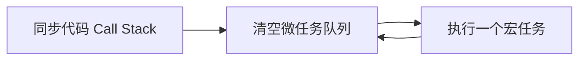

# 异步与事件循环

## 学习目标

- 读懂 Event Loop，能预测任意代码的输出顺序
- 能在项目中正确处理并发、取消、竞态
- 掌握 async/await 错误处理与性能模式
- 能排查「await 了但没更新」「重复请求」等真实 bug

## 为什么需要

JS 单线程，异步是一切的基座。不懂 Event Loop：

- 解释不了 `setTimeout(fn, 0)` 为何不立即执行
- React 批更新、Vue nextTick 理解不透
- 搜索框竞态（旧结果覆盖新结果）修不好
- 页面卸载后仍 setState 报错

> 核心心法：**先同步，再微任务清队，再一个宏任务——循环。** 所有时序问题都回到这条规则。

---

## 一、心智模型



| 类型 | 例子 | 顺序 |
|------|------|------|
| 同步 | 普通代码 | 最先 |
| 微任务 | Promise.then、queueMicrotask | 同步后、宏任务前 |
| 宏任务 | setTimeout、I/O、requestAnimationFrame | 每轮一个 |

**自测题（应能秒答）：**

```javascript
console.log(1);
setTimeout(() => console.log(2), 0);
Promise.resolve().then(() => console.log(3));
console.log(4);
// 1 4 3 2
```

---

## 二、Promise：读懂 + 手写 + 项目用法

### 链式与错误

```javascript
fetch('/api/user')
  .then(r => { if (!r.ok) throw new Error(r.status); return r.json(); })
  .then(data => render(data))
  .catch(err => showError(err)); // 统一捕获
```

**反模式：** 忘记 catch → Unhandled rejection

```javascript
// 项目规范：async 函数顶层 try/catch 或 .catch
async function load() {
  try {
    const data = await fetchData();
    return data;
  } catch (e) {
    report(e);
    throw e;
  }
}
```

---

## 三、async/await 实战模式

### 串行 vs 并行

```javascript
// 慢 — 串行
const a = await fetchA();
const b = await fetchB();

// 快 — 并行
const [a, b] = await Promise.all([fetchA(), fetchB()]);

// 部分成功
const results = await Promise.allSettled([fetchA(), fetchB()]);
```

### 并发数控制（上传/批量请求）

```javascript
async function pool(tasks, limit) {
  const ret = [];
  const executing = [];
  for (const task of tasks) {
    const p = Promise.resolve().then(() => task()).then(r => {
      executing.splice(executing.indexOf(p), 1);
      return r;
    });
    ret.push(p);
    executing.push(p);
    if (executing.length >= limit) await Promise.race(executing);
  }
  return Promise.all(ret);
}
// 用法：await pool(files.map(f => () => upload(f)), 3);
```

---

## 四、AbortController：取消请求

```javascript
const controller = new AbortController();

async function search(q) {
  const res = await fetch(`/api/search?q=${q}`, {
    signal: controller.signal
  });
  return res.json();
}

// 新输入时取消上一次
let ctrl;
function onInput(q) {
  ctrl?.abort();
  ctrl = new AbortController();
  search(q, ctrl.signal).then(render);
}
```

**React 中：**

```javascript
useEffect(() => {
  const ctrl = new AbortController();
  fetch(url, { signal: ctrl.signal }).then(setData);
  return () => ctrl.abort();
}, [url]);
```

---

## 五、竞态问题：定位 + 解决

**现象：** 快速输入「abc」，界面显示「a」的结果

```javascript
let seq = 0;
async function search(q) {
  const id = ++seq;
  const data = await fetch(`/api?q=${q}`).then(r => r.json());
  if (id !== seq) return; // 丢弃过期响应
  setResults(data);
}
```

或用 **React Query / SWR** 自动处理 stale request。

---

## 六、与渲染的关系

- 微任务在本轮宏任务前全部执行完
- `await` 让出主线程，不阻塞其他任务
- `requestAnimationFrame` 在下一帧 paint 前，适合动画
- React 18：setTimeout 内 setState 也会批处理（微任务/macrotask 边界相关）

---

## 七、项目落地步骤

1. **规范：** 所有 fetch 带 abort；列表搜索加竞态防护
2. **禁止：** 循环里无脑 await（改 Promise.all）
3. **工具：** unhandledrejection 全局上报
4. **Review：** async 函数是否有 catch？

```javascript
window.addEventListener('unhandledrejection', e => {
  report(e.reason);
});
```

---

## 排查实战案例

### 案例 A：顺序题面试挂

- **题：** 复杂 Promise + setTimeout 嵌套
- **法：** 画表：同步 → 微任务队列 → 宏任务，逐步出队

### 案例 B：卸载后 setState

- **现象：** Can't perform state update on unmounted component
- **修复：** AbortController + cleanup；或 ignore flag

### 案例 C：批量导入只成功一部分

- **原因：** 串行 + 无并发限制，部分超时
- **修复：** pool(tasks, 5) + 重试
- **验证：** 成功率 100%，总时间降 70%

---

## 常见误区与最佳实践

| 误区 | 正确理解 |
|------|---------|
| setTimeout(0) 立即 | 至少等栈空+微任务 |
| await 阻塞线程 | 只暂停 async 函数 |
| Promise 不必 catch | 必须处理 rejection |

**可执行清单：**

- [ ] 并行用 all，容错用 allSettled
- [ ] 搜索/路由请求可 abort
- [ ] 竞态用序号或 Query 库
- [ ] 全局 unhandledrejection 监控

## 小结

- Event Loop：同步 → 微任务 → 宏任务
- 项目必备：并行、取消、竞态、错误处理
- DevTools 无专门面板，靠理解 + console 验证顺序
- React/Vue 调度都建立在微任务之上

## 延伸阅读

- [Tasks, microtasks - Jake Archibald](https://jakearchibald.com/2015/tasks-microtasks-queues-and-schedules/)
- [MDN Event Loop](https://developer.mozilla.org/en-US/docs/Web/JavaScript/Event_loop)
