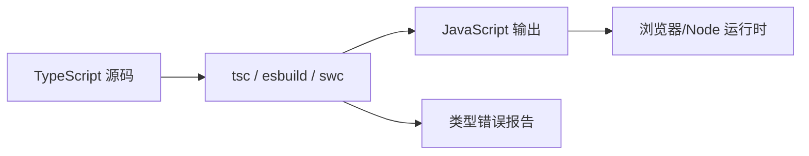

# TypeScript 类型系统

## 学习目标

- 理解 TypeScript 的设计哲学：类型即约束、编译期检查
- 掌握基础类型、联合/交叉类型、类型收窄
- 理解泛型与泛型约束的使用场景
- 掌握类型推导、工具类型的原理
- 了解 `tsconfig` 关键配置项

## 为什么需要

大型前端项目面临：

- **运行时错误**：`undefined is not a function` 等需在上线前发现
- **API 契约**：前后端、模块间需要明确的接口定义
- **重构安全**：改一处类型，编译器帮你找出所有影响点
- **IDE 体验**：自动补全、跳转定义依赖类型信息

TypeScript 不是"带类型的 JavaScript"，而是**用类型系统约束程序正确性**的工具。架构师需要能用类型设计 API、约束团队代码质量。

## 核心原理

### 1. 类型检查发生在编译期



**关键认知：** 类型在运行时会被擦除（erase），不存在于最终 JS 中。类型检查只在编译阶段进行。

```typescript
// 编译前
function add(a: number, b: number): number {
  return a + b;
}
add(1, '2'); // 编译错误

// 编译后（类型被擦除）
function add(a, b) {
  return a + b;
}
```

### 2. 结构化类型（Structural Typing）

TS 采用**鸭子类型**：只要结构兼容，就认为类型兼容。

```typescript
interface Point {
  x: number;
  y: number;
}

interface NamedPoint {
  x: number;
  y: number;
  name: string;
}

function printPoint(p: Point) {
  console.log(p.x, p.y);
}

const np: NamedPoint = { x: 1, y: 2, name: 'A' };
printPoint(np); // OK — NamedPoint 包含 Point 所需属性
```

### 3. 基础类型与类型组合

```typescript
// 基础类型
let n: number = 42;
let s: string = 'hello';
let b: boolean = true;
let u: undefined = undefined;
let nu: null = null;
let sym: symbol = Symbol('id');

// 数组与元组
let arr: number[] = [1, 2, 3];
let tuple: [string, number] = ['age', 25];

// 联合类型 — 或
type Status = 'pending' | 'success' | 'error';
type ID = string | number;

// 交叉类型 — 且
type Employee = Person & { employeeId: string };

// 字面量类型
type Direction = 'up' | 'down' | 'left' | 'right';
```

### 4. 类型收窄（Type Narrowing）

```typescript
function padLeft(value: string | number, padding: string | number) {
  if (typeof value === 'number') {
    // 此处 value 被收窄为 number
    return ' '.repeat(padding as number) + value;
  }
  return padding + value;
}

// discriminated union — 架构中常用
interface Circle {
  kind: 'circle';
  radius: number;
}
interface Square {
  kind: 'square';
  side: number;
}
type Shape = Circle | Square;

function area(shape: Shape): number {
  switch (shape.kind) {
    case 'circle': return Math.PI * shape.radius ** 2;
    case 'square': return shape.side ** 2;
  }
}
```

### 5. 泛型与约束

泛型让类型**参数化**，在保持类型安全的同时复用逻辑。

```typescript
// 基础泛型
function identity<T>(arg: T): T {
  return arg;
}
identity<number>(42);
identity('hello'); // 类型推导为 string

// 泛型约束
interface HasLength {
  length: number;
}
function logLength<T extends HasLength>(arg: T): T {
  console.log(arg.length);
  return arg;
}
logLength('hello');  // OK
logLength([1, 2, 3]); // OK
// logLength(123);   // Error

// 泛型在 API 设计中的应用
interface ApiResponse<T> {
  code: number;
  data: T;
  message: string;
}

async function fetchData<T>(url: string): Promise<ApiResponse<T>> {
  const res = await fetch(url);
  return res.json();
}

interface User { id: number; name: string; }
const result = await fetchData<User>('/api/user/1');
// result.data 类型为 User
```

### 6. 工具类型原理

内置工具类型基于**条件类型**和**映射类型**实现：

```typescript
// Partial — 所有属性可选
type Partial<T> = {
  [P in keyof T]?: T[P];
};

// Required — 所有属性必填
type Required<T> = {
  [P in keyof T]-?: T[P];
};

// Pick — 选取部分属性
type Pick<T, K extends keyof T> = {
  [P in K]: T[P];
};

// Omit — 排除部分属性
type Omit<T, K extends keyof any> = Pick<T, Exclude<keyof T, K>>;

// 使用示例
interface User {
  id: number;
  name: string;
  email: string;
}

type UserUpdate = Partial<Pick<User, 'name' | 'email'>>;
// { name?: string; email?: string; }
```

### 7. interface vs type

| 特性 | interface | type |
|------|-----------|------|
| 扩展 | 可 declaration merge | 不可合并 |
| 联合/交叉 | 不支持直接联合 | 支持 |
| 适用 | 对象形状、类实现 | 联合、元组、复杂类型 |

```typescript
// 推荐：对象结构用 interface
interface User {
  id: number;
  name: string;
}

// 推荐：联合、工具类型用 type
type Result = { success: true; data: User } | { success: false; error: string };
```

### 8. tsconfig 关键配置

```json
{
  "compilerOptions": {
    "strict": true,
    "noImplicitAny": true,
    "strictNullChecks": true,
    "esModuleInterop": true,
    "skipLibCheck": true,
    "moduleResolution": "bundler",
    "target": "ES2020",
    "module": "ESNext",
    "jsx": "react-jsx",
    "paths": {
      "@/*": ["./src/*"]
    }
  },
  "include": ["src/**/*"],
  "exclude": ["node_modules"]
}
```

## 常见误区与最佳实践

| 误区 | 正确理解 |
|------|---------|
| "any 方便，先用 any" | any 关闭类型检查，失去 TS 价值，用 unknown 替代 |
| "类型越复杂越好" | 类型为业务服务，可读性优先 |
| "运行时类型安全靠 TS" | TS 仅编译期，运行时需 zod/io-ts 等校验 |
| "interface 和 type 随便选" | 对象用 interface，联合/复杂用 type |

**最佳实践：**

- 开启 `strict: true`，团队统一严格模式
- API 层定义清晰的 Request/Response 类型
- 使用 discriminated union 建模状态机
- 复杂类型提取为独立 type，加 JSDoc 注释
- 架构层面：共享类型包（monorepo 中的 `@repo/types`）

## 小结

- TS 在编译期做类型检查，运行时类型被擦除
- 结构化类型：形状兼容即类型兼容
- 泛型 + 约束实现类型安全的复用
- 工具类型基于映射类型和条件类型
- 用类型设计 API，是架构师约束代码质量的重要手段

## 延伸阅读

- [TypeScript Handbook](https://www.typescriptlang.org/docs/handbook/intro.html)
- [Type Challenges](https://github.com/type-challenges/type-challenges)
- [Total TypeScript](https://www.totaltypescript.com/)
- 《Programming TypeScript》
