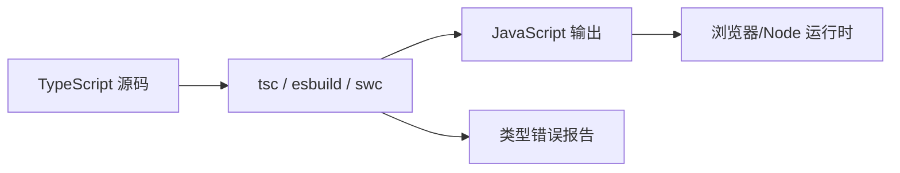

# TypeScript 类型系统

## 学习目标

- 理解 TypeScript 的设计哲学：类型即约束、编译期检查
- 掌握基础类型、联合/交叉类型、类型收窄
- 理解泛型与泛型约束的使用场景
- 掌握类型推导、工具类型的原理
- 了解 `tsconfig` 关键配置项

## 为什么需要

大型前端项目面临：

- **运行时错误**：`undefined is not a function` 等需在上线前发现
- **API 契约**：前后端、模块间需要明确的接口定义
- **重构安全**：改一处类型，编译器帮你找出所有影响点
- **IDE 体验**：自动补全、跳转定义依赖类型信息

TypeScript 不是"带类型的 JavaScript"，而是**用类型系统约束程序正确性**的工具。架构师需要能用类型设计 API、约束团队代码质量。

## 核心原理

### 1. 类型检查发生在编译期



**关键认知：** 类型在运行时会被擦除（erase），不存在于最终 JS 中。类型检查只在编译阶段进行。

```typescript
// 编译前
function add(a: number, b: number): number {
  return a + b;
}
add(1, '2'); // 编译错误

// 编译后（类型被擦除）
function add(a, b) {
  return a + b;
}
```

### 2. 结构化类型（Structural Typing）

TS 采用**鸭子类型**：只要结构兼容，就认为类型兼容。

```typescript
interface Point {
  x: number;
  y: number;
}

interface NamedPoint {
  x: number;
  y: number;
  name: string;
}

function printPoint(p: Point) {
  console.log(p.x, p.y);
}

const np: NamedPoint = { x: 1, y: 2, name: 'A' };
printPoint(np); // OK — NamedPoint 包含 Point 所需属性
```

### 3. 基础类型与类型组合

```typescript
// 基础类型
let n: number = 42;
let s: string = 'hello';
let b: boolean = true;
let u: undefined = undefined;
let nu: null = null;
let sym: symbol = Symbol('id');

// 数组与元组
let arr: number[] = [1, 2, 3];
let tuple: [string, number] = ['age', 25];

// 联合类型 — 或
type Status = 'pending' | 'success' | 'error';
type ID = string | number;

// 交叉类型 — 且
type Employee = Person & { employeeId: string };

// 字面量类型
type Direction = 'up' | 'down' | 'left' | 'right';
```

### 4. 类型收窄（Type Narrowing）

```typescript
function padLeft(value: string | number, padding: string | number) {
  if (typeof value === 'number') {
    // 此处 value 被收窄为 number
    return ' '.repeat(padding as number) + value;
  }
  return padding + value;
}

// discriminated union — 架构中常用
interface Circle {
  kind: 'circle';
  radius: number;
}
interface Square {
  kind: 'square';
  side: number;
}
type Shape = Circle | Square;

function area(shape: Shape): number {
  switch (shape.kind) {
    case 'circle': return Math.PI * shape.radius ** 2;
    case 'square': return shape.side ** 2;
  }
}
```

### 5. 泛型与约束

泛型让类型**参数化**，在保持类型安全的同时复用逻辑。

```typescript
// 基础泛型
function identity<T>(arg: T): T {
  return arg;
}
identity<number>(42);
identity('hello'); // 类型推导为 string

// 泛型约束
interface HasLength {
  length: number;
}
function logLength<T extends HasLength>(arg: T): T {
  console.log(arg.length);
  return arg;
}
logLength('hello');  // OK
logLength([1, 2, 3]); // OK
// logLength(123);   // Error

// 泛型在 API 设计中的应用
interface ApiResponse<T> {
  code: number;
  data: T;
  message: string;
}

async function fetchData<T>(url: string): Promise<ApiResponse<T>> {
  const res = await fetch(url);
  return res.json();
}

interface User { id: number; name: string; }
const result = await fetchData<User>('/api/user/1');
// result.data 类型为 User
```

### 6. 工具类型原理

内置工具类型基于**条件类型**和**映射类型**实现：

```typescript
// Partial — 所有属性可选
type Partial<T> = {
  [P in keyof T]?: T[P];
};

// Required — 所有属性必填
type Required<T> = {
  [P in keyof T]-?: T[P];
};

// Pick — 选取部分属性
type Pick<T, K extends keyof T> = {
  [P in K]: T[P];
};

// Omit — 排除部分属性
type Omit<T, K extends keyof any> = Pick<T, Exclude<keyof T, K>>;

// 使用示例
interface User {
  id: number;
  name: string;
  email: string;
}

type UserUpdate = Partial<Pick<User, 'name' | 'email'>>;
// { name?: string; email?: string; }
```

### 7. interface vs type

| 特性 | interface | type |
|------|-----------|------|
| 扩展 | 可 declaration merge | 不可合并 |
| 联合/交叉 | 不支持直接联合 | 支持 |
| 适用 | 对象形状、类实现 | 联合、元组、复杂类型 |

```typescript
// 推荐：对象结构用 interface
interface User {
  id: number;
  name: string;
}

// 推荐：联合、工具类型用 type
type Result = { success: true; data: User } | { success: false; error: string };
```

### 8. tsconfig 关键配置

```json
{
  "compilerOptions": {
    "strict": true,
    "noImplicitAny": true,
    "strictNullChecks": true,
    "esModuleInterop": true,
    "skipLibCheck": true,
    "moduleResolution": "bundler",
    "target": "ES2020",
    "module": "ESNext",
    "jsx": "react-jsx",
    "paths": {
      "@/*": ["./src/*"]
    }
  },
  "include": ["src/**/*"],
  "exclude": ["node_modules"]
}
```

### 9. 条件类型与 infer

```typescript
// 条件类型 — T extends U ? X : Y
type IsString<T> = T extends string ? true : false;

// infer — 在 extends 子句中推断类型
type ReturnType<T> = T extends (...args: any[]) => infer R ? R : never;

type Parameters<T> = T extends (...args: infer P) => any ? P : never;

// 提取 Promise 内部类型
type Awaited<T> = T extends Promise<infer U> ? U : T;
```

### 10. 映射类型与模板字面量类型

```typescript
// 映射类型进阶 — 键重映射
type Getters<T> = {
  [K in keyof T as `get${Capitalize<string & K>}`]: () => T[K];
};

// 模板字面量类型
type EventName = 'click' | 'focus';
type HandlerName = `on${Capitalize<EventName>}`; // 'onClick' | 'onFocus'

type Route = `/${string}`;
```

### 11. keyof / typeof / 索引访问

```typescript
const user = { id: 1, name: 'Alice' };
type User = typeof user;           // { id: number; name: string }
type UserKeys = keyof User;        // 'id' | 'name'
type UserName = User['name'];      // string

function getProp<T, K extends keyof T>(obj: T, key: K): T[K] {
  return obj[key];
}
```

### 12. 类型守卫与断言函数

```typescript
function isString(val: unknown): val is string {
  return typeof val === 'string';
}

function assertIsNumber(val: unknown): asserts val is number {
  if (typeof val !== 'number') throw new Error('Not a number');
}

function process(val: unknown) {
  if (isString(val)) console.log(val.toUpperCase()); // val: string
}
```

### 13. unknown 与 never

```typescript
// unknown — 安全的 any，使用前必须收窄
function parse(input: unknown) {
  if (typeof input === 'string') return JSON.parse(input);
}

// never — 永不存在的类型，穷尽检查
type Shape = Circle | Square;
function area(s: Shape): number {
  switch (s.kind) {
    case 'circle': return Math.PI * s.radius ** 2;
    case 'square': return s.side ** 2;
    default: {
      const _exhaustive: never = s; // 新增类型时编译报错
      return _exhaustive;
    }
  }
}
```

### 14. 声明文件与 declare

```typescript
// global.d.ts
declare global {
  interface Window {
    __APP_CONFIG__: { apiUrl: string };
  }
}

// 模块声明 — 无类型的第三方库
declare module 'legacy-lib' {
  export function doSomething(): void;
}
```

### 15. 枚举与 const enum

```typescript
enum Status { Pending, Success, Error }
const enum Direction { Up, Down } // 编译时内联，无运行时对象

// 推荐：联合字面量替代 enum（Tree Shaking 更好）
type Status = 'pending' | 'success' | 'error';
```

### 16. 协变与逆变（简介）

函数参数类型**逆变**（更宽），返回值**协变**（更窄）。`strictFunctionTypes` 下，`(x: Animal) => void` 不能赋给 `(x: Dog) => void`。理解此概念有助于读懂复杂泛型约束。

---

## 实战落地：从接口到组件的类型闭环

### 步骤 1：定义 API 类型（Monorepo 共享包）

```typescript
// packages/types/src/user.ts
export interface User {
  id: string;
  name: string;
  role: 'admin' | 'user';
}
export interface ApiResponse<T> {
  code: number;
  data: T;
  message: string;
}
```

### 步骤 2：fetch 层泛型约束

```typescript
async function get<T>(url: string): Promise<T> {
  const res = await fetch(url);
  const json: ApiResponse<T> = await res.json();
  if (json.code !== 0) throw new Error(json.message);
  return json.data;
}
const user = await get<User>('/api/user/1'); // user 自动推断
```

### 步骤 3：运行时校验（TS 不能替代）

```typescript
import { z } from 'zod';
const UserSchema = z.object({ id: z.string(), name: z.string(), role: z.enum(['admin', 'user']) });
const user = UserSchema.parse(await res.json()); // 边界外数据必校验
```

### 案例：重构前后

- **Before：** `any` 满天飞，改字段线上才报错
- **After：** 共享 `@repo/types`，改接口编译期全项目报错
- **验证：** `pnpm build` 0 error；IDE 跳转定义正常

---

## 进阶运用：类型驱动的真实场景

### 1. 用 discriminated union 建模请求状态机

```typescript
// 把「加载中/成功/失败」做成互斥状态，杜绝非法组合（如 loading 又有 data）
type Async<T> =
  | { status: 'idle' }
  | { status: 'loading' }
  | { status: 'success'; data: T }
  | { status: 'error'; error: string };

function render(state: Async<User>) {
  switch (state.status) {
    case 'success': return state.data.name; // 此分支才有 data
    case 'error':   return state.error;     // 此分支才有 error
    default:        return 'loading...';
  }
}
```

### 2. 用泛型约束封装类型安全的工具

```typescript
// 事件总线：事件名与 payload 类型强绑定
type Events = { login: { userId: string }; logout: void };

class Bus<E extends Record<string, any>> {
  on<K extends keyof E>(name: K, fn: (p: E[K]) => void) {}
  emit<K extends keyof E>(name: K, payload: E[K]) {}
}
const bus = new Bus<Events>();
bus.emit('login', { userId: '1' }); // 错传 payload 直接编译报错
```

### 3. 类型与运行时的边界（最易踩坑）

```typescript
// TS 只在编译期存在，外部数据（接口/localStorage/URL）运行时不可信
const raw = JSON.parse(localStorage.getItem('user')!); // any，骗过编译器
// 正确：边界处用 zod 校验后再获得可信类型
const user = UserSchema.parse(raw); // 运行时校验 + 类型推断双保险
```

---

## 排查实战

### 案例 A：读不懂的类型报错

- **现象：** `Type 'X' is not assignable to type 'Y'` 一大段嵌套报错
- **方法：** 从**最内层**「Types of property 'xxx' are incompatible」往外读；用 IDE hover 看展开类型；用辅助类型 `type _ = X` 临时定位
- **验证：** 定位到具体不兼容属性后修正

### 案例 B：any 悄悄蔓延

- **现象：** 某处 `as any` 后，下游全失去类型保护
- **定位：** 开启 `noImplicitAny`；ESLint `@typescript-eslint/no-explicit-any` 报警
- **修复：** 改 `unknown` + 类型守卫收窄，或补全类型
- **验证：** 移除 any 后下游恢复补全与检查

### 案例 C：第三方库无类型声明

- **现象：** `Could not find a declaration file for module 'xxx'`
- **修复：** 装 `@types/xxx`；没有则写 `declare module 'xxx'` 兜底
- **验证：** 导入不再报错，关键 API 有类型

### 案例 D：类型体操过度，编译变慢/难维护

- **现象：** 多层条件类型嵌套，IDE 卡、报错天书
- **修复：** 拆分中间类型加注释；能用简单类型就别炫技
- **验证：** 类型可读，`tsc` 速度恢复

---

## 常见误区与最佳实践

| 误区 | 正确理解 |
|------|---------|
| "any 方便，先用 any" | any 关闭类型检查，失去 TS 价值，用 unknown 替代 |
| "类型越复杂越好" | 类型为业务服务，可读性优先 |
| "运行时类型安全靠 TS" | TS 仅编译期，运行时需 zod/io-ts 等校验 |
| "interface 和 type 随便选" | 对象用 interface，联合/复杂用 type |

**最佳实践：**

- 开启 `strict: true`，团队统一严格模式
- API 层定义清晰的 Request/Response 类型
- 使用 discriminated union 建模状态机
- 复杂类型提取为独立 type，加 JSDoc 注释
- 架构层面：共享类型包（monorepo 中的 `@repo/types`）

**可执行清单：**

- [ ] `tsconfig` 开启 `strict`、`noImplicitAny`、`strictNullChecks`
- [ ] 禁止 `any`，未知数据用 `unknown` + 类型守卫
- [ ] 外部数据（接口/storage/URL）边界用 zod 等运行时校验
- [ ] 互斥状态用 discriminated union + `never` 穷尽检查
- [ ] 公共类型抽到共享包，避免重复定义
- [ ] ESLint 接入 `@typescript-eslint`，CI 跑 `tsc --noEmit`

## 手写工具类型（面试高频）

```typescript
type MyPick<T, K extends keyof T> = { [P in K]: T[P] };
type MyOmit<T, K extends keyof T> = Pick<T, Exclude<keyof T, K>>;
type DeepReadonly<T> = T extends object
  ? { readonly [P in keyof T]: DeepReadonly<T[P]> } : T;
type GetReturnType<T> = T extends (...args: unknown[]) => infer R ? R : never;
```

## 面试高频问答（追问链）

> 大厂对一个考点通常追问到能力边界：**概念 → 机制 → 边界 → ⭐ 原理（触底）→ 实战（落地）**。实战层是区分「背过」和「做过」的关键。

### 链一：类型系统基础

1. **概念**：interface 和 type 区别？→ interface 可声明合并、extends；type 可联合/交叉/映射/条件类型。
2. **机制**：什么是结构化类型？→ 看形状不看名义（鸭子类型），属性满足即兼容。
3. **边界**：协变和逆变？→ 返回值协变（可更具体）、参数逆变（可更宽）；TS 默认方法参数双变。
4. ⭐ **原理（触底）**：类型在运行时存在吗？怎么保证运行时安全？→ 编译后类型擦除，运行时不存在；外部数据需 Zod/io-ts 等运行时校验。
5. **实战（落地）**：接口数据怎么保证类型安全？→ 定义 Zod schema 校验 API 响应，校验失败上报并降级；CI 跑 tsc --noEmit 门禁；改接口后 schema 与类型同步更新，单测覆盖异常 payload。

### 链二：高级类型与类型编程

1. **概念**：unknown / never / any 区别？→ unknown 需收窄才能用；never 不可达/空集；any 放弃检查。
2. **机制**：条件类型 + infer 怎么用？→ `T extends (...args)=>infer R ? R : never` 提取返回值。
3. **应用**：手写一个 DeepReadonly？→ 映射类型 + 递归（见本章手写工具类型）。
4. ⭐ **原理（触底）**：类型体操过度有什么代价？→ 编译变慢、报错难读、维护成本高；架构上应权衡类型安全与可读性。
5. **实战（落地）**：团队怎么控制 TS 复杂度？→ 公共类型放 shared 包、业务用 infer 工具类型而非嵌套三层；设编译耗时基线；CR 拒绝无收益的体操，优先 Zod + 简单泛型。

## 小结

- TS 在编译期做类型检查，运行时类型被擦除
- 结构化类型：形状兼容即类型兼容
- 泛型 + 约束实现类型安全的复用
- 工具类型基于映射类型和条件类型
- 条件类型 + infer 是高级类型编程核心
- 用类型设计 API，是架构师约束代码质量的重要手段

## 延伸阅读

- [TypeScript Handbook](https://www.typescriptlang.org/docs/handbook/intro.html)
- [Type Challenges](https://github.com/type-challenges/type-challenges)
- [Total TypeScript](https://www.totaltypescript.com/)
- 《Programming TypeScript》
