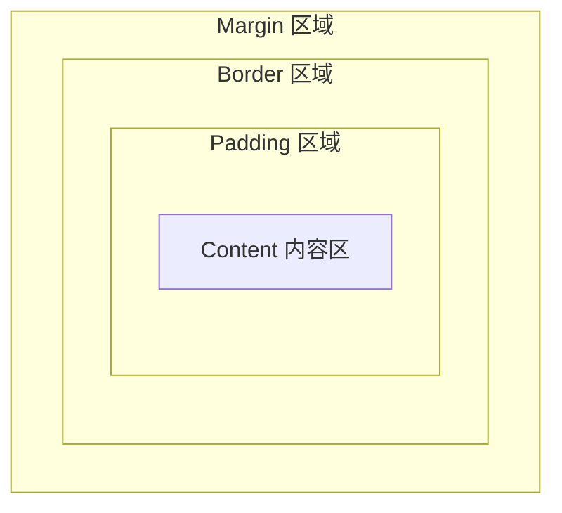
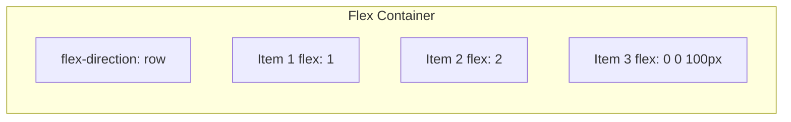
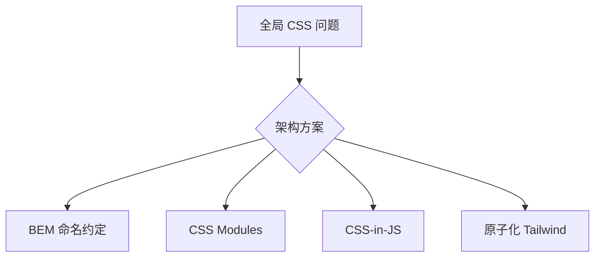

# CSS 架构与布局原理

## 学习目标

- 理解 CSS 盒模型、BFC、层叠与继承
- 掌握 Flexbox 与 Grid 的布局原理及适用场景
- 了解 CSS 架构方案：BEM、CSS Modules、CSS-in-JS、原子化
- 理解响应式设计与多端适配策略
- 能从架构角度选择 CSS 组织方式

## 为什么需要

CSS 看似简单，却是大型前端项目维护成本的来源：

- 全局样式污染、特异性战争
- 组件样式难以复用与隔离
- 多端适配（PC/移动/大屏）策略混乱
- 设计系统与主题化缺乏统一 token

架构师需要为团队选定 CSS 方案，平衡开发效率、可维护性、运行时性能。

## 核心原理

### 1. 盒模型



```css
/* 标准盒模型：width = content */
.box {
  box-sizing: content-box;
  width: 200px;
  padding: 10px;
  border: 2px solid;
  /* 实际占用宽度 = 200 + 20 + 4 = 224px */
}

/* 推荐：border-box，width 包含 padding 和 border */
.box {
  box-sizing: border-box;
  width: 200px;
  padding: 10px;
  border: 2px solid;
  /* 实际占用宽度 = 200px */
}

*, *::before, *::after {
  box-sizing: border-box;
}
```

### 2. BFC（块级格式化上下文）

BFC 是独立布局区域，内部布局不影响外部。

**触发 BFC 的条件：**

- `float` 不为 none
- `position` 为 absolute/fixed
- `display: flow-root`（推荐）
- `overflow` 不为 visible

**应用：**

```css
/* 清除浮动 */
.clearfix::after {
  content: '';
  display: block;
  clear: both;
}
/* 或使用 display: flow-root 触发 BFC */

/* 防止 margin 折叠 */
.wrapper {
  display: flow-root;
}

/* 自适应两栏布局 */
.sidebar { float: left; width: 200px; }
.main { overflow: hidden; } /* 触发 BFC，不与 float 重叠 */
```

### 3. Flexbox 布局原理

Flex 是一维布局：主轴 + 交叉轴。



```css
.container {
  display: flex;
  flex-direction: row;      /* 主轴方向 */
  justify-content: center;  /* 主轴对齐 */
  align-items: center;      /* 交叉轴对齐 */
  gap: 16px;
}

.item {
  flex: 1 1 auto; /* flex-grow flex-shrink flex-basis */
  /* flex: 1 等价于 flex: 1 1 0% */
}
```

**适用场景：** 导航栏、卡片内对齐、等分布局、垂直居中

### 4. Grid 布局原理

Grid 是二维布局：行 + 列。

```css
.grid {
  display: grid;
  grid-template-columns: repeat(3, 1fr);
  grid-template-rows: auto 1fr auto;
  gap: 24px;
}

.header { grid-column: 1 / -1; } /* 跨所有列 */
.sidebar { grid-row: 2; grid-column: 1; }
.main { grid-row: 2; grid-column: 2 / 4; }
```

**适用场景：** 页面整体布局、复杂二维网格、仪表盘

| 对比 | Flex | Grid |
|------|------|------|
| 维度 | 一维 | 二维 |
| 适用 | 组件内部、线性排列 | 页面级、复杂网格 |
| 对齐 | 强 | 更强 |

### 5. 层叠、继承与特异性

**特异性（Specificity）：** 内联 > ID > 类/属性/伪类 > 元素

```
!important > 内联 style > #id > .class > element
```

**架构启示：** 避免高特异性选择器，组件样式保持扁平。

### 6. CSS 架构方案对比



| 方案 | 原理 | 优点 | 缺点 |
|------|------|------|------|
| **BEM** | Block__Element--Modifier 命名 | 无运行时开销、简单 | 类名冗长、靠约定 |
| **CSS Modules** | 构建时 hash 类名，局部作用域 | 真正隔离、零运行时 | 需构建工具 |
| **CSS-in-JS** | JS 中写样式，运行时/编译时生成 | 动态主题、组件化 | 运行时成本（styled-components） |
| **Tailwind** | 原子类组合 | 开发快、设计一致 | HTML 类名多、学习曲线 |

**BEM 示例：**

```html
<div class="card card--featured">
  <h2 class="card__title">Title</h2>
  <button class="card__button card__button--primary">Action</button>
</div>
```

**CSS Modules 示例：**

```css
/* Button.module.css */
.primary { background: blue; }
```

```tsx
import styles from './Button.module.css';
<button className={styles.primary}>Click</button>
// 编译后 class="Button_primary_x7f2a"
```

**Design Token 与主题化：**

```css
:root {
  --color-primary: #0066cc;
  --color-text: #333;
  --spacing-md: 16px;
  --radius-sm: 4px;
}

[data-theme="dark"] {
  --color-primary: #4da6ff;
  --color-text: #eee;
}

.button {
  background: var(--color-primary);
  padding: var(--spacing-md);
  border-radius: var(--radius-sm);
}
```

### 7. 响应式设计

```css
/* Mobile First */
.container { padding: 16px; }

@media (min-width: 768px) {
  .container { padding: 24px; max-width: 720px; }
}

@media (min-width: 1024px) {
  .container { max-width: 960px; }
}

/* 容器查询 — 组件级响应式 */
.card-container {
  container-type: inline-size;
}
@container (min-width: 400px) {
  .card { flex-direction: row; }
}
```

### 8. 定位与层叠上下文

```css
/* position 取值 */
.static   { position: static; }   /* 默认 */
.relative { position: relative; top: 10px; } /* 相对自身偏移 */
.absolute { position: absolute; } /* 相对最近定位祖先 */
.fixed    { position: fixed; }    /* 相对视口 */
.sticky   { position: sticky; top: 0; } /* 滚动到阈值后 fixed */
```

**层叠上下文：** 由 `position`+`z-index`、`opacity<1`、`transform`、`filter` 等创建。`z-index` 仅在同一层叠上下文内比较。

### 9. 单位体系

| 单位 | 说明 |
|------|------|
| `px` | 绝对像素 |
| `rem` | 相对根元素 `html` font-size |
| `em` | 相对当前元素 font-size |
| `vw/vh` | 视口宽/高 1% |
| `%` | 相对父元素 |

```css
html { font-size: 16px; }
.title { font-size: 1.5rem; } /* 24px */
.fluid { font-size: clamp(1rem, 2vw + 1rem, 2rem); } /* 流体排版 */
```

### 10. 居中方案汇总

```css
/* Flex */
.center-flex { display: flex; justify-content: center; align-items: center; }

/* Grid */
.center-grid { display: grid; place-items: center; }

/* 绝对定位 + transform */
.center-abs {
  position: absolute;
  top: 50%; left: 50%;
  transform: translate(-50%, -50%);
}
```

### 11. transition / animation 与性能

```css
.box {
  transition: transform 0.3s ease, opacity 0.3s;
}
.box:hover { transform: scale(1.05); } /* 仅合成层，性能好 */

@keyframes fadeIn {
  from { opacity: 0; }
  to { opacity: 1; }
}
.animate { animation: fadeIn 0.5s ease; }
```

避免动画 `width`/`height`/`top`/`left`，优先 `transform`/`opacity`。

### 12. 现代 CSS 特性

```css
/* :has() — 父选择子 */
.card:has(img) { padding-top: 0; }

/* 原生嵌套（现代浏览器） */
.card {
  & .title { font-weight: bold; }
}

/* @layer — 层叠顺序控制 */
@layer reset, base, components, utilities;

/* 容器查询深入 */
@container card (min-width: 400px) {
  .card-body { display: grid; grid-template-columns: 1fr 1fr; }
}
```

### 13. 预处理器与 PostCSS

| 工具 | 作用 |
|------|------|
| Sass/Less | 变量、嵌套、混入，编译为 CSS |
| PostCSS | 插件生态：Autoprefixer、cssnano、preset-env |

现代项目常直接用 CSS Variables + 原生嵌套，PostCSS 仅做 autoprefixer 和压缩。

---

## 实战落地：布局 bug 排查三步法

### 步骤 1：DevTools 看盒模型

Elements → Computed → 展开 box model，看 margin 折叠、padding 是否预期。

### 步骤 2：z-index 不生效

99% 是**层叠上下文**问题：父元素 `opacity<1` / `transform` 创建新上下文。在 Elements 勾选 **Show stacking context**（Experiments）或逐层查父级。

### 步骤 3：Flex 子项被挤压

```css
.flex-child { flex-shrink: 0; min-width: 0; } /* 文字溢出常用 min-width:0 */
```

### 案例：Modal 被挡在下面

- **现象：** Modal z-index:9999 仍被 header 盖住
- **定位：** header 有 `transform`，自成上下文
- **修复：** Modal portal 到 `document.body` 或去掉 header transform
- **验证：** 任意页面 Modal 最顶层

### 架构选型落地（团队决策表）

| 团队规模 | 推荐 | 第一步 |
|---------|------|--------|
| 小 | Tailwind + token | 配 `@tailwindcss` + CSS 变量主题 |
| 中 | CSS Modules | 组件 `.module.css` + Stylelint |
| 大 | Token + 组件库 | Style Dictionary 出 CSS/JS |

## 常见误区与最佳实践

| 误区 | 正确理解 |
|------|---------|
| "!important 解决问题" | 破坏层叠秩序，应降低特异性 |
| "Flex 可以替代 Grid" | 一维 vs 二维，场景不同 |
| "Tailwind 不是 CSS" | 是原子化 CSS 架构，仍是 CSS |
| "CSS-in-JS 一定慢" | 编译时方案（Vanilla Extract）无运行时 |

**架构选型建议：**

- 小团队/快速迭代：Tailwind + Design Token
- 大型组件库：CSS Modules 或 CSS-in-JS（编译时）
- 设计系统：Token + CSS Variables，支持主题切换
- 避免全局 CSS 无约束增长，建立 Stylelint 规则

## 经典布局手撕（面试高频）

### 水平垂直居中

```css
/* Flex（推荐） */
.center { display: flex; justify-content: center; align-items: center; }

/* Grid */
.center { display: grid; place-items: center; }

/* 绝对定位 + transform */
.center { position: relative; }
.center .child {
  position: absolute; top: 50%; left: 50%;
  transform: translate(-50%, -50%);
}
```

### 两栏布局（左固定右自适应）

```css
.layout { display: flex; }
.sidebar { width: 200px; flex-shrink: 0; }
.main { flex: 1; }
```

### 三栏布局（双飞翼）

```html
<div class="container">
  <div class="main-wrap"><div class="main">主内容</div></div>
  <div class="left">左</div>
  <div class="right">右</div>
</div>
```

```css
.container { overflow: hidden; }
.main-wrap { float: left; width: 100%; }
.main { margin: 0 200px; }
.left { float: left; width: 200px; margin-left: -100%; }
.right { float: left; width: 200px; margin-left: -200px; }
```

### 1px 边框问题（Retina）

```css
.border-1px {
  position: relative;
}
.border-1px::after {
  content: ''; position: absolute; inset: 0;
  border: 1px solid #ccc;
  transform: scaleY(0.5);
  transform-origin: 0 0;
}
```

### BFC 触发与应用

- 触发：`overflow: hidden`、`display: flow-root`、`float`、`position: absolute`
- 应用：清除浮动、阻止 margin 折叠、自适应两栏

## 面试高频问答（追问链）

> 大厂对一个考点通常追问到能力边界：**概念 → 机制 → 边界 → ⭐ 原理（触底）→ 实战（落地）**。实战层是区分「背过」和「做过」的关键。

### 链一：BFC 与布局

1. **概念**：BFC 是什么？→ 块级格式化上下文，内部布局与外界隔离。
2. **机制**：怎么触发？→ overflow 非 visible、display:flow-root、float、绝对定位。
3. **应用**：解决什么问题？→ 清除浮动、阻止 margin 折叠、自适应两栏。
4. ⭐ **原理（触底）**：margin 折叠为什么发生？怎么彻底避免？→ 同一 BFC 内相邻块垂直 margin 合并；用 flow-root 隔离或改 padding。
5. **实战（落地）**：两栏布局 footer 高度不对怎么修？→ DevTools 查 margin 折叠；父级加 `display:flow-root` 或改 padding；改前后截图对比，多端验收。

### 链二：层叠上下文与 z-index

1. **概念**：z-index 为什么有时不生效？→ 只在同一层叠上下文内比较。
2. **机制**：什么创建层叠上下文？→ 根元素、定位+z-index、transform、opacity<1、filter、will-change。
3. **应用**：Modal 被父级挡住怎么办？→ 父级有 transform 形成新上下文；用 Portal 挂到 body。
4. ⭐ **原理（触底）**：为什么 transform 既影响层叠又影响合成层？→ 两者都源于它创建独立渲染层，是合成优化的副作用。
5. **实战（落地）**：Modal 被挡住怎么快速定位？→ Elements 向上查父级 transform/opacity；改 Portal 挂 body + z-index；Layers 面板确认层级，键盘 Tab 验证可聚焦。

### 链三：布局选型与适配

1. **概念**：Flex 和 Grid 怎么选？→ 一维 Flex，二维 Grid。
2. **应用**：移动端适配方案？→ rem(flexible)、vw/vh、媒体查询，现推荐 vw + clamp。
3. ⭐ **原理（触底）**：1px 边框在 Retina 为什么变粗？怎么解？→ CSS 像素 ≠ 物理像素，dpr>1 时 1px 占多个物理像素；用 transform: scaleY(0.5) 伪元素或 0.5px。
4. **实战（落地）**：移动端 1px 方案怎么选型落地？→ 列表分割线用伪元素 scale；边框组件封装 hairline 类；真机 dpr=2/3 截图对比，设计走查验收。

## 小结

- 盒模型用 `border-box`，BFC 解决浮动与 margin 问题
- Flex 一维、Grid 二维，按场景选择
- CSS 架构核心是**作用域隔离**与**命名规范**
- Design Token 是设计系统的基础
- 定位、层叠上下文、单位体系是布局基础
- Mobile First + 容器查询 + 现代 CSS 实现响应式

## 延伸阅读

- [MDN: Flexbox](https://developer.mozilla.org/en-US/docs/Web/CSS/CSS_flexible_box_layout)
- [MDN: Grid](https://developer.mozilla.org/en-US/docs/Web/CSS/CSS_grid_layout)
- [BEM 方法论](https://en.bem.info/)
- [Tailwind CSS 文档](https://tailwindcss.com/docs)
- 《CSS 揭秘》
