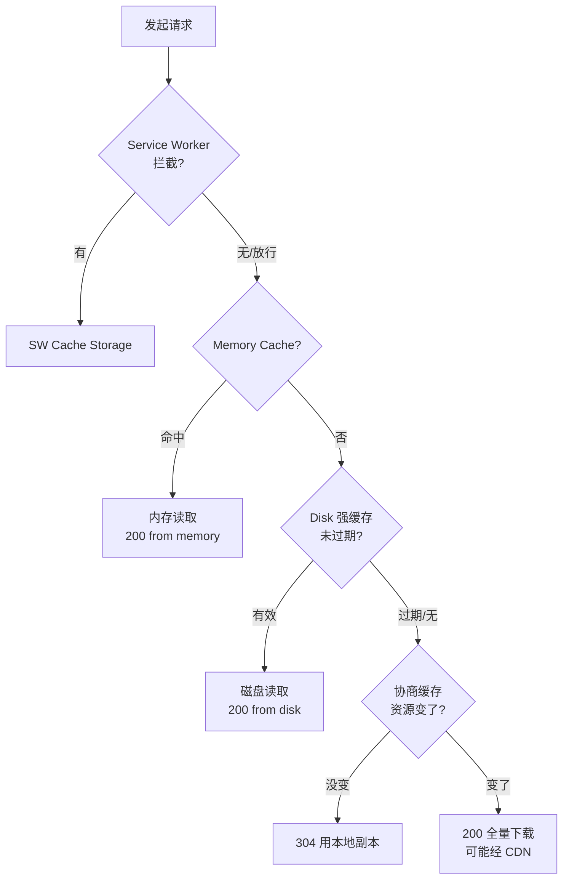
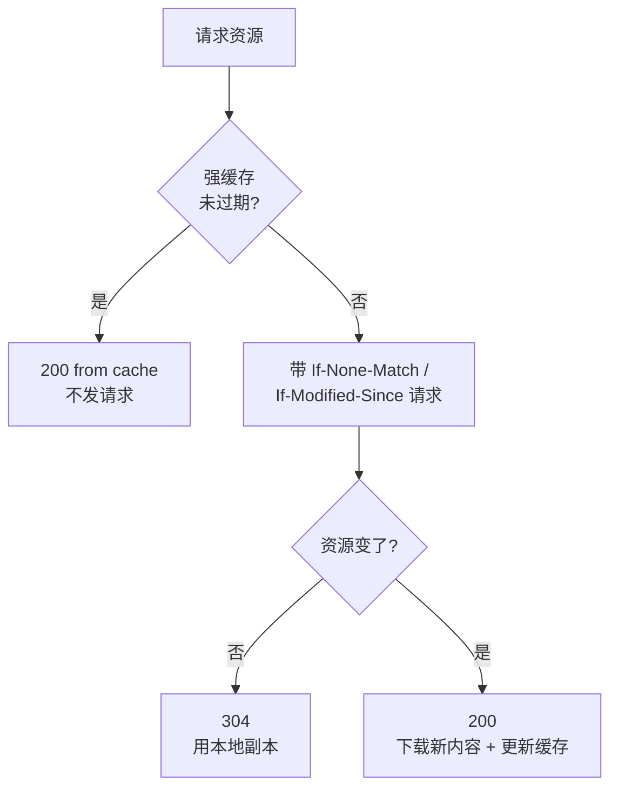
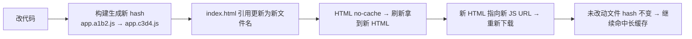

# 浏览器缓存详解

## 学习目标

- 读懂浏览器缓存的完整分层：Service Worker → Memory → Disk → CDN
- 掌握强缓存与协商缓存每个响应头的含义和优先级
- 能为不同资源（HTML/JS/CSS/图片/API）设计正确的缓存策略
- 能用 DevTools 验证命中、排查"发版不更新/刷新拿旧资源"

## 为什么需要

缓存是前端性能的「免费午餐」：命中强缓存等于 0 网络请求、0 等待。但配错一行 `Cache-Control`，轻则发版用户看旧页面，重则用户永远刷不出新版本。前端必须**亲手掌控**缓存头，而不是甩给后端。

> 核心心法：**能不发请求就不发（强缓存），必须发也只回 304（协商缓存）。** 前端的全部工作就是用响应头决定每个资源落在哪一层。

---

## 一、心智模型：缓存命中顺序

浏览器拿到请求后，从快到慢逐层查找：



| 层 | 位置 | 谁控制 | 失效时机 |
|----|------|--------|---------|
| Service Worker | JS 可编程缓存 | 你写的 SW 代码 | 你的策略 |
| Memory Cache | 内存 | 浏览器 | 关闭 Tab |
| Disk Cache（强缓存） | 磁盘 | `Cache-Control` | max-age 到期 |
| 协商缓存 | 服务器比对 | `ETag`/`Last-Modified` | 内容变化 |
| CDN 缓存 | 边缘节点 | `s-maxage` | CDN 策略 |

> Memory vs Disk：浏览器自行决定，一般体积小/高频用内存、大文件用磁盘。前端不可控，关注 Disk 即可。

---

## 二、强缓存：根本不发请求

强缓存有效期内，浏览器**直接用本地副本，零网络请求**（Network 显示 `(memory cache)`/`(disk cache)`）。

### 2.1 Cache-Control（现代标准，优先级最高）

```http
Cache-Control: public, max-age=31536000, immutable
```

**完整指令参考表：**

| 指令 | 含义 | 典型场景 |
|------|------|---------|
| `max-age=秒` | 强缓存有效期 | 静态资源 1 年 |
| `s-maxage=秒` | 仅对 CDN/代理生效，覆盖 max-age | CDN 单独控制 |
| `public` | 浏览器 + 代理都可缓存 | 公共静态资源 |
| `private` | 仅浏览器可缓存 | 含用户信息的页面 |
| `no-cache` | 可缓存，但每次都走协商验证 | HTML 入口 |
| `no-store` | 完全不缓存 | 敏感接口、支付页 |
| `immutable` | 资源永不变，刷新也不发协商请求 | hash 静态资源 |
| `must-revalidate` | 过期后必须验证，不可用过期副本 | 关键数据 |
| `stale-while-revalidate=秒` | 先用旧的，后台静默更新 | 体验优先的资源 |

### 2.2 关键区分（最易错）

```
max-age=0       → 立即过期，每次走协商（≈ no-cache）
no-cache        → 每次走协商缓存（不是不缓存！）
no-store        → 真正完全禁用缓存
```

⚠️ `no-cache` 字面像"不缓存"，实际是"缓存但每次问服务器"。真正禁用是 `no-store`。

### 2.3 Expires / Pragma（遗留）

```http
Expires: Wed, 09 Jun 2027 03:00:00 GMT   # 绝对时间，受客户端时钟影响
Pragma: no-cache                          # HTTP/1.0 老古董
```

优先级：`Cache-Control` > `Expires`。新项目只用 `Cache-Control`，了解旧头即可。

---

## 三、协商缓存：发请求，但没变就回 304

强缓存过期后，浏览器带「身份标识」去问服务器，没变返回 `304 Not Modified`（无响应体，省带宽）。

### 3.1 ETag / If-None-Match（精确，推荐）

```http
首次响应:   ETag: "33a64df5"
再次请求:   If-None-Match: "33a64df5"
服务器比对: 没变 → 304 (无 body) ; 变了 → 200 (新 ETag + 新 body)
```

- **强 ETag** `"abc"`：字节级一致。
- **弱 ETag** `W/"abc"`：语义一致即可（允许压缩差异等）。

ETag 通常基于内容 hash，**内容变才变**，最精确。

### 3.2 Last-Modified / If-Modified-Since（兜底，按秒）

```http
首次响应:   Last-Modified: Tue, 09 Jun 2026 03:00:00 GMT
再次请求:   If-Modified-Since: Tue, 09 Jun 2026 03:00:00 GMT
```

缺点：精度仅到秒；内容没变但修改时间变了会误判为"已变"。

### 3.3 优先级

**ETag 优先于 Last-Modified。** 两者都有时，服务器优先校验 ETag。

---

## 四、完整决策流程（强 + 协商）



---

## 五、前端缓存策略（最核心实践）

记住一张表，覆盖 90% 场景：

| 资源 | 策略 | 原因 |
|------|------|------|
| `index.html` | `no-cache`（或短 max-age） | 入口必须能拿到最新版 |
| `app.[contenthash].js/css` | `max-age=31536000, immutable` | 文件名带 hash，内容变→名变→天然失效 |
| 图片/字体（带 hash） | 长缓存 + immutable | 同上 |
| 图片（不带 hash，如用户头像） | 短 max-age + ETag | 可能被替换 |
| API 接口 | `no-store` 或短 max-age | 数据实时性 |

### 5.1 为什么 "HTML 短 + 静态资源长" 是黄金组合



这就是 Webpack/Vite 默认给文件名加 `contenthash` 的根本原因——**用文件名当缓存版本号**，无需手动清缓存，发版即更新。

### 5.2 Nginx 落地配置

```nginx
# 带 hash 的静态资源 —— 永久强缓存
location ~* \.(js|css|woff2|png|jpg|svg)$ {
  expires 1y;
  add_header Cache-Control "public, immutable";
}

# HTML 入口 —— 每次协商，保证拿到新版本
location = /index.html {
  add_header Cache-Control "no-cache";
}
```

### 5.3 构建侧（Vite 示例）

```javascript
// vite.config.js — 产物自动带 contenthash（默认行为）
export default {
  build: {
    rollupOptions: {
      output: {
        entryFileNames: 'assets/[name].[hash].js',
        chunkFileNames: 'assets/[name].[hash].js',
        assetFileNames: 'assets/[name].[hash][extname]',
      },
    },
  },
};
```

---

## 六、CDN 缓存（多一层）

CDN 在浏览器和源站之间多一层边缘缓存：

```http
Cache-Control: public, max-age=600, s-maxage=86400, stale-while-revalidate=60
```

- `max-age=600`：浏览器缓存 10 分钟
- `s-maxage=86400`：CDN 边缘缓存 1 天（覆盖 max-age）
- `stale-while-revalidate=60`：过期 60s 内先返回旧的，后台回源更新

**发版 CDN 不更新？** 两种解法：

1. 文件名带 hash（推荐）：新文件新 URL，天然不冲突。
2. CDN 刷新/预热：发版后调 CDN API 刷新 `index.html`。

`Vary` 头：告诉缓存「按哪些请求头区分缓存版本」，常见 `Vary: Accept-Encoding`（区分 gzip/br）。

---

## 七、Service Worker 缓存（可编程，PWA 用）

SW 是位于网络层之上的可编程缓存，能拦截所有请求，实现离线访问。

```javascript
// sw.js — Cache First 策略（静态资源优先读缓存）
self.addEventListener('fetch', (e) => {
  e.respondWith(
    caches.match(e.request).then(cached =>
      cached || fetch(e.request).then(res => {
        const copy = res.clone();
        caches.open('v1').then(c => c.put(e.request, copy));
        return res;
      })
    )
  );
});
```

**常见策略：**

| 策略 | 适用 |
|------|------|
| Cache First | 静态资源、字体 |
| Network First | API、实时数据 |
| Stale-While-Revalidate | 图片、非关键资源 |

> SW 优先级高于 HTTP 缓存，但更新有「版本滞后」坑：旧 SW 会缓存旧资源，需 `skipWaiting()` + 版本号管理。

---

## 八、三种刷新行为的区别（必知）

| 操作 | 行为 |
|------|------|
| 地址栏回车 / 链接跳转 | 最大化使用缓存（强缓存优先） |
| 普通刷新（F5） | 强缓存失效，走协商缓存（发 If-None-Match） |
| 硬刷新（Ctrl+F5 / Shift+刷新） | 跳过所有缓存，全部重新下载 |

> 排查缓存问题时，先用普通刷新复现，再用硬刷新对比，能快速判断是强缓存还是协商缓存的问题。

---

## 九、DevTools 验证

1. **Network → Size 列**：
   - `(memory cache)` / `(disk cache)` → 强缓存命中（无请求）
   - `304` + 很小体积 → 协商缓存命中
   - `200` + 完整体积 → 真正下载
2. 点资源 → **Headers** → 看 `Cache-Control` / `ETag` 是否符合预期。
3. **Application → Cache Storage**：查看 Service Worker 缓存内容。
4. 开发时勾 **Disable cache** 排除缓存干扰。

---

## 排查实战

### 案例 A：发版后用户仍看到旧页面

- **Network：** `index.html` 显示 `(disk cache)`，且 `max-age=31536000`
- **根因：** HTML 被设了长强缓存，用户拿不到引用新 JS 的新 HTML
- **修复：** HTML 改 `Cache-Control: no-cache`，JS 保持 hash + 长缓存
- **验证：** 发版后普通刷新即拿到新 `index.html` → 新 JS

### 案例 B：改了内容但浏览器还是旧的

- **现象：** 资源返回 304，内容是旧的
- **根因：** 文件名没带 hash，ETag/Last-Modified 没变
- **修复：** 构建产物带 `contenthash`
- **验证：** 内容变 → 文件名变 → 新 200 下载

### 案例 C：CDN 上更新了但用户没生效

- **根因：** CDN 边缘节点缓存了旧 `index.html`（`s-maxage` 较长）
- **修复：** 发版调 CDN 刷新接口，或 HTML 设 `s-maxage=0`
- **验证：** 响应头 `X-Cache: MISS` 后重新回源

### 案例 D：Service Worker 导致永远加载旧版

- **根因：** 旧 SW 用 Cache First 缓存了旧资源，新 SW 未激活
- **修复：** SW 加版本号 + `self.skipWaiting()` + `clients.claim()`，并清理旧 cache
- **验证：** Application → Service Workers 看到新版本 activated

---

## 常见误区与最佳实践

| 误区 | 正确理解 |
|------|---------|
| "no-cache 是不缓存" | 是「缓存但每次协商」，no-store 才是不缓存 |
| "缓存越久越好" | HTML 入口绝不能长缓存 |
| "缓存是后端的事" | 前端要主导策略、配构建 hash、验证命中 |
| "max-age=0 等于禁用" | 只是立即过期走协商，仍可能 304 |
| "ETag 一定比 Last-Modified 好" | ETag 精确但有计算/分布式一致性成本 |

**可执行清单：**

- [ ] 静态资源构建带 `contenthash`
- [ ] JS/CSS/字体：`max-age=1年, immutable`
- [ ] `index.html`：`no-cache`
- [ ] API：按实时性设 `no-store` 或短 max-age
- [ ] CDN 用 `s-maxage` 单独控制边缘缓存
- [ ] 发版前检查 HTML 缓存头，必要时刷新 CDN
- [ ] Network Size 列验证命中层级

## 面试高频问答（追问链）

> 大厂对一个考点通常追问到能力边界：**概念 → 机制 → 边界 → ⭐ 原理（触底）→ 实战（落地）**。实战层是区分「背过」和「做过」的关键。

### 链一：缓存机制（必问）

1. **概念**：强缓存和协商缓存区别？→ 强缓存不发请求（200 from cache）；协商发请求可能 304。
2. **机制**：各看什么头？→ 强缓存看 Cache-Control(max-age)/Expires；协商看 ETag/Last-Modified。
3. **边界**：ETag 和 Last-Modified 区别与优先级？→ ETag 内容哈希更精确、优先；Last-Modified 秒级、改名不变内容会误判。
4. **应用**：no-cache 和 no-store 区别？→ no-cache 可缓存但每次需协商；no-store 完全不缓存。
5. ⭐ **原理（触底）**：为什么「HTML no-cache + 静态资源 immutable 长缓存」能做到发版即更新？→ HTML 每次校验拿到新版本，其引用的带 hash 资源名变化即触发新下载，旧 hash 仍命中长缓存，零等待无脏数据。
6. **实战（落地）**：发版后用户看到旧版怎么排查？→ Network 看 HTML 是否 304/Size 列；查 Cache-Control 配置；强刷 vs 普通刷新对比；修 Nginx/CDN 头后复测发版流程。

### 链二：多层缓存与离线

1. **概念**：缓存命中顺序？→ Service Worker → Memory Cache → Disk Cache → 网络。
2. **机制**：CDN 缓存怎么单独控制？→ `s-maxage` 控制共享缓存，与浏览器 max-age 分离。
3. **边界**：SW 缓存和 HTTP 缓存区别？→ SW 可编程（Stale-While-Revalidate 等策略）；HTTP 靠响应头被动。
4. ⭐ **原理（触底）**：SW 导致用户永远看旧版怎么排查和兜底？→ 检查 SW 更新流程（updatefound→提示刷新）；设版本号、skipWaiting 谨慎、提供 SW 注销逃生通道。
5. **实战（落地）**：PWA 缓存策略怎么落地？→ 静态资源 CacheFirst + API NetworkFirst；Application 面板查 SW 缓存命中；发版弹窗提示刷新，提供「清除缓存」入口，监控旧版访问占比。

## 小结

- 命中顺序：SW → Memory → Disk（强缓存）→ 协商缓存（304）→ 下载
- 强缓存看 `Cache-Control`（max-age/immutable/no-store…），不发请求
- 协商缓存看 `ETag`（优先）/`Last-Modified`，发请求但回 304
- 黄金组合：**hash 静态资源长缓存 immutable + HTML no-cache**
- CDN 用 `s-maxage`，PWA 用 Service Worker 可编程缓存
- 每个缓存问题都能用「Network Size 列 → Headers → 修复 → 验证」闭环排查

## 延伸阅读

- [MDN: HTTP 缓存](https://developer.mozilla.org/zh-CN/docs/Web/HTTP/Caching)
- [Cache-Control 指令大全](https://developer.mozilla.org/zh-CN/docs/Web/HTTP/Headers/Cache-Control)
- [web.dev: HTTP caching](https://web.dev/articles/http-cache)
- [Service Worker 缓存策略](https://developer.chrome.com/docs/workbox/caching-strategies-overview)
