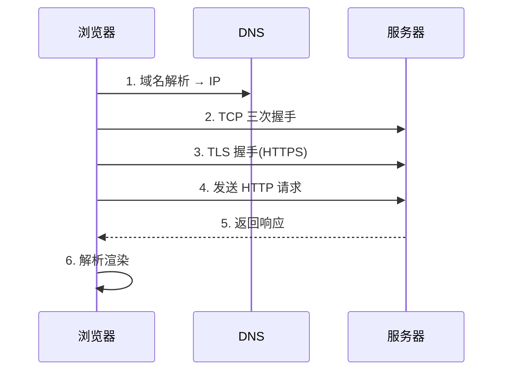
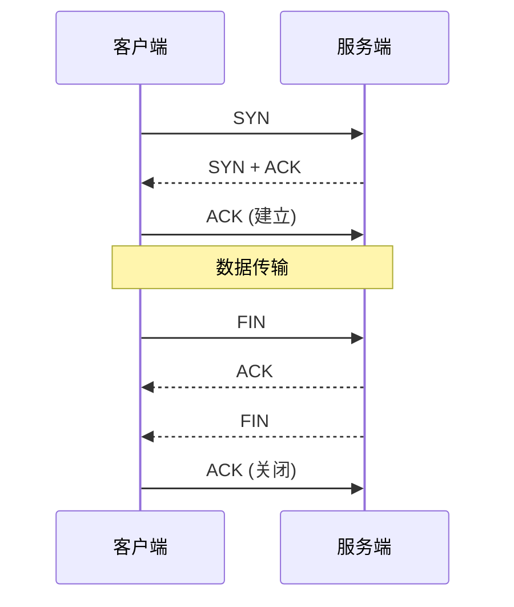
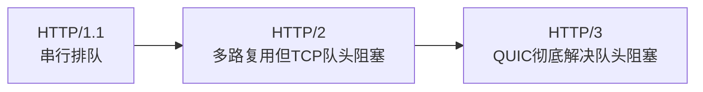
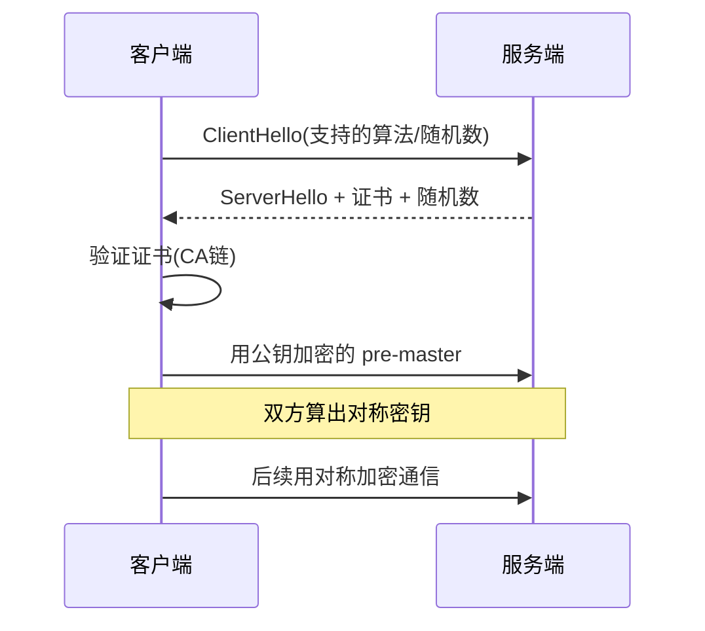

# 网络协议与 HTTP 详解

## 学习目标

- 理解一次请求经过的完整网络栈：DNS → TCP → TLS → HTTP
- 掌握 HTTP/1.1、HTTP/2、HTTP/3 的演进与性能差异
- 读懂 TLS 握手、HTTPS 如何加密
- 能用网络知识优化首屏与排查连接问题

## 为什么需要

前端每天都在发请求，但「请求慢」的根因可能藏在任何一层：DNS 解析、TCP 建连、TLS 握手、协议队头阻塞。不理解网络栈，你只能盲目地「重试」「加 loading」，无法真正定位与优化。网络是前端性能的地基。

> 核心心法：**一次请求的耗时 = DNS + TCP + TLS + 请求/响应 + 内容下载。** 优化与排查都要先定位到具体哪一段。

---

## 一、一次请求的完整链路



对应 DevTools → Network → Timing 面板的分段：

| 阶段 | Timing 字段 | 优化手段 |
|------|------------|---------|
| DNS 解析 | DNS Lookup | `dns-prefetch`、减少域名数 |
| TCP 建连 | Initial connection | `preconnect`、keep-alive、HTTP/2 复用 |
| TLS 握手 | SSL | TLS 1.3、会话复用、`preconnect` |
| 等待响应 | Waiting (TTFB) | 后端优化、CDN、SSR 缓存 |
| 内容下载 | Content Download | 压缩、分包、CDN |

---

## 二、DNS 解析

域名 → IP 的过程，逐级缓存查找：

```
浏览器缓存 → 操作系统缓存 → 路由器缓存 → 本地 DNS(运营商) → 根/顶级/权威 DNS
```

**前端优化：**

```html
<!-- 提前解析第三方域名的 DNS -->
<link rel="dns-prefetch" href="https://cdn.example.com">
<!-- 更进一步：提前建立连接（DNS+TCP+TLS） -->
<link rel="preconnect" href="https://api.example.com" crossorigin>
```

> 减少使用的域名数量能减少 DNS 解析与连接开销；但适度的域名分片在 HTTP/1.1 下可提高并发（HTTP/2 后不再需要）。

---

## 三、TCP 与连接管理

### 3.1 三次握手 / 四次挥手



建连有 RTT 成本，所以**复用连接**至关重要。

### 3.2 队头阻塞（HoL Blocking）

- **TCP 层：** 丢包会阻塞其后所有数据（HTTP/2 仍受此影响）。
- **HTTP/1.1 层：** 一个连接同一时刻只能处理一个请求/响应，后续请求排队。

这是 HTTP 协议演进的核心驱动力。

---

## 四、HTTP 协议演进（重点）

| 特性 | HTTP/1.1 | HTTP/2 | HTTP/3 |
|------|----------|--------|--------|
| 传输层 | TCP | TCP | **QUIC(UDP)** |
| 多路复用 | ✗（队头阻塞） | ✓（一个连接多流） | ✓ |
| 队头阻塞 | 有（应用层） | TCP 层仍有 | **彻底解决** |
| 头部压缩 | ✗ | HPACK | QPACK |
| 服务端推送 | ✗ | 有（已少用） | 有 |
| 建连 | 慢 | 慢 | **0-RTT/1-RTT** |

### 4.1 HTTP/1.1 的痛点

- 队头阻塞：浏览器对同域名限制 6 个 TCP 连接，请求多了就排队。
- 头部冗余：每次请求重复发送 Cookie、UA 等。
- 应对（历史方案）：雪碧图、域名分片、资源合并——**HTTP/2 后这些反成负担**。

### 4.2 HTTP/2 的改进

- **多路复用：** 一个 TCP 连接上并发多个「流」，互不阻塞（应用层）。
- **头部压缩 HPACK：** 用静态表 + 动态表去重。
- **二进制分帧：** 数据拆成帧，可乱序发送再重组。
- **遗留问题：** 底层仍是 TCP，丢包仍会触发 TCP 层队头阻塞。

### 4.3 HTTP/3 + QUIC

- 基于 **UDP** 自实现 QUIC，每个流独立，**单流丢包不影响其他流**。
- 集成 TLS 1.3，连接建立更快（0-RTT 复用）。
- 移动网络切换（WiFi↔4G）连接不中断（Connection ID）。



---

## 五、HTTPS 与 TLS

### 5.1 解决的问题

- **加密：** 防窃听（对称加密传数据）
- **完整性：** 防篡改（消息认证码）
- **身份认证：** 防钓鱼（证书 + CA 信任链）

### 5.2 TLS 握手（混合加密）



- **非对称加密**（RSA/ECDHE）：仅用于安全协商出对称密钥（慢但安全）。
- **对称加密**（AES）：握手后用它加密实际数据（快）。
- **TLS 1.3：** 握手从 2-RTT 降到 1-RTT，支持 0-RTT 会话复用。

---

## 六、HTTP 报文核心

### 6.1 请求方法语义

| 方法 | 语义 | 幂等 | 安全(只读) |
|------|------|------|-----------|
| GET | 获取 | ✓ | ✓ |
| POST | 创建/提交 | ✗ | ✗ |
| PUT | 全量更新 | ✓ | ✗ |
| PATCH | 部分更新 | ✗ | ✗ |
| DELETE | 删除 | ✓ | ✗ |

> 幂等性影响重试策略：GET/PUT/DELETE 可安全重试，POST 重试需后端做幂等键。

### 6.2 常见状态码

| 码 | 含义 | 前端处理 |
|----|------|---------|
| 200/201/204 | 成功 | 正常 |
| 301/302/304 | 重定向/协商缓存 | 304 用本地 |
| 400/401/403/404 | 客户端错误 | 401 跳登录，403 提示无权限 |
| 429 | 限流 | 退避重试 |
| 500/502/503/504 | 服务端错误 | 降级/重试 |

---

## 七、WebSocket（实时通信）

HTTP 是「请求-响应」单向发起，实时场景（聊天、推送、协同）需要全双工：

```javascript
const ws = new WebSocket('wss://example.com/socket');
ws.onopen = () => ws.send(JSON.stringify({ type: 'subscribe' }));
ws.onmessage = (e) => handle(JSON.parse(e.data));
ws.onclose = () => reconnectWithBackoff();   // 断线重连
```

- 通过 HTTP `Upgrade` 头从 HTTP 切换到 WebSocket 协议。
- 需自己实现：心跳保活、断线重连（指数退避）、消息顺序。
- 替代方案对比：SSE（服务端单向推送，更简单）、长轮询（兼容兜底）。

---

## 八、运用：首屏网络优化清单

```html
<link rel="preconnect" href="https://api.example.com" crossorigin>
<link rel="dns-prefetch" href="https://cdn.example.com">
<link rel="preload" href="/fonts/main.woff2" as="font" crossorigin>
```

- [ ] 启用 HTTP/2 或 HTTP/3（CDN/网关支持）
- [ ] TLS 1.3 + 会话复用
- [ ] 关键第三方域 `preconnect`
- [ ] 开启 Brotli/Gzip 压缩
- [ ] 静态资源走 CDN 就近接入
- [ ] 减少重定向链（每次重定向多一个 RTT）

---

## 排查实战

### 案例 A：接口偶发很慢

- **定位：** Network → Timing 看是 DNS、Connection 还是 Waiting 大
- **若 Connection 大：** 未复用连接/未上 HTTP/2 → 启用 keep-alive、HTTP/2
- **验证：** 同域请求复用同一连接，连接耗时趋零

### 案例 B：升级 HTTP/2 后仍慢

- **原因：** 沿用了 HTTP/1.1 时代的雪碧图/域名分片，反而阻碍多路复用
- **修复：** 合并回单域名，拆分大资源
- **验证：** 多请求并发，无排队

### 案例 C：HTTPS 页面证书告警

- **原因：** 证书过期/域名不匹配/中间证书缺失
- **修复：** 更新证书、补全证书链
- **验证：** 浏览器锁标正常，SSL Labs 评级 A

---

## 常见误区与最佳实践

| 误区 | 正确理解 |
|------|---------|
| "HTTP/2 = 一定更快" | 需配合去掉 1.1 优化、且受 TCP 队头阻塞 |
| "HTTPS 只是加密" | 还含完整性 + 身份认证 |
| "域名分片提升性能" | 仅 HTTP/1.1；HTTP/2 后是负担 |
| "POST 比 GET 安全" | 都明文（HTTPS 才加密），语义不同 |
| "WebSocket 不会断" | 必须做心跳 + 重连 |

## 跨域完整专题（面试必考）

| 方案 | 适用 |
|------|------|
| CORS | 标准，服务端配 Allow-Origin |
| Nginx 反代 | 生产同源 |
| 开发 proxy | 仅 dev |
| postMessage | 跨窗口 |
| JSONP | 只读 GET，已过时 |

预检：非简单方法/自定义头 → OPTIONS → 通过后再发真实请求。

## 面试高频问答（追问链）

> 大厂对一个考点通常追问到能力边界：**概念 → 机制 → 边界 → ⭐ 原理（触底）→ 实战（落地）**。实战层是区分「背过」和「做过」的关键。

### 链一：TCP 与队头阻塞

1. **概念**：TCP 三次握手为什么是三次？→ 双方确认收发能力，防止历史连接。
2. **机制**：四次挥手为什么多一次？→ 被动方先 ACK 再处理剩余数据后才 FIN。
3. **边界**：队头阻塞（HoL）在各层怎么体现？→ TCP 层丢包阻塞后续；HTTP/1.1 连接串行阻塞。
4. **应用**：HTTP/2 怎么缓解？还剩什么问题？→ 多路复用解决应用层 HoL，但仍受 TCP 层 HoL。
5. ⭐ **原理（触底）**：HTTP/3 为什么换 QUIC/UDP？→ QUIC 在 UDP 上实现独立流，单流丢包不阻塞其他流，彻底解决 TCP 层 HoL，且 0-RTT 建连。
6. **实战（落地）**：首屏 TTFB 偏高怎么分段优化？→ Network 瀑布拆 DNS/TCP/TLS/等待；加 preconnect、HTTP/2、CDN 边缘；优化前后 RUM TTFB P75 对比，定位瓶颈段。

### 链二：HTTPS

1. **概念**：HTTPS 怎么保证安全？→ 非对称协商密钥 + 对称加密数据 + 证书认证身份。
2. **机制**：握手流程？→ ClientHello → 证书 → 密钥协商 → 切换对称加密。
3. **边界**：为什么不全程用非对称？→ 非对称慢，仅用于交换对称密钥。
4. ⭐ **原理（触底）**：中间人能不能伪造证书？CA 信任链怎么防？→ 证书由受信 CA 签名，浏览器验证链路到根 CA；伪造无有效签名会告警，HSTS + 证书钉扎进一步防降级。
5. **实战（落地）**：全站 HTTPS 怎么推进？→ 配 HSTS + 301 跳转；securityheaders.com 验收；混合内容用 CSP upgrade-insecure-requests；监控证书过期告警，灰度切 HTTPS 观察错误率。

### 链三：CORS 与实时通信

1. **概念**：简单请求和预检请求？→ 非简单方法/头触发 OPTIONS 预检。
2. **机制**：预检缓存怎么减少？→ `Access-Control-Max-Age`。
3. **边界**：WebSocket 受同源策略限制吗？→ 不受 CORS 限制，但服务端应校验 Origin。
4. ⭐ **原理（触底）**：WebSocket 和长轮询、SSE 怎么选？→ 双向高频用 WS；服务端单向推送用 SSE（自动重连、走 HTTP）；兼容兜底用长轮询。
5. **实战（落地）**：IM 长连接怎么保活和重连？→ 30s 心跳 + 指数退避重连；断线后拉取 lastSeq 补偿；监控连接存活率与重连成功率，弱网模拟验证。

## 小结

- 一次请求 = DNS + TCP + TLS + 请求响应 + 下载，逐段定位
- HTTP 演进主线：解决队头阻塞（1.1 串行 → 2 多路复用 → 3 QUIC）
- HTTPS = 非对称协商密钥 + 对称加密数据 + 证书认证
- 实时通信用 WebSocket，需自管心跳与重连
- 优化首屏：preconnect/HTTP2/压缩/CDN/减少重定向

## 延伸阅读

- [MDN: HTTP 概述](https://developer.mozilla.org/zh-CN/docs/Web/HTTP/Overview)
- [HTTP/2 explained](https://http2-explained.haxx.se/)
- [HTTP/3 explained](https://http3-explained.haxx.se/)
- [High Performance Browser Networking](https://hpbn.co/)
