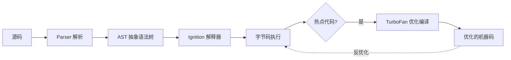
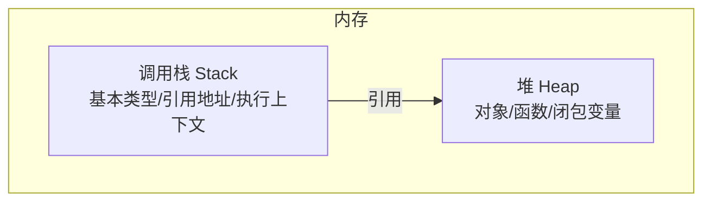

# V8 引擎与 JavaScript 执行机制

## 学习目标

- 理解 JS 从源码到执行的完整流程：解析 → 字节码 → JIT
- 掌握 V8 的优化机制：隐藏类、内联缓存，并写出对引擎友好的代码
- 理解垃圾回收（分代 + 标记清除）原理与内存优化
- 能解释「为什么这段代码慢/被反优化」

## 为什么需要

JS 是解释执行还是编译执行？为什么对象属性顺序会影响性能？为什么 `delete` 慢？这些问题的答案都在引擎里。理解 V8（Chrome/Node/Edge 的引擎）的工作方式，才能写出真正高性能的代码，而非凭感觉「优化」。

> 核心心法：**V8 喜欢「可预测、形状稳定」的代码。** 类型一致、结构固定的对象能被深度优化；多变的类型与结构会触发反优化。

---

## 一、从源码到执行：整体流程



- **Parser → AST：** 词法分析 + 语法分析，生成抽象语法树。V8 用「惰性解析」：先跳过函数体，调用时再解析，加快启动。
- **Ignition（解释器）：** 把 AST 编译成**字节码**并执行（比直接跑 AST 快、占用内存少）。
- **TurboFan（优化编译器）：** 监控运行，把「热点代码」（频繁执行）编译成高度优化的机器码。
- **反优化（Deopt）：** 若运行时假设被打破（如类型突变），从机器码退回字节码——这很昂贵，要避免。

> 所以 JS 是「解释 + 即时编译（JIT）」混合，而非纯解释。

---

## 二、隐藏类（Hidden Class / Shape）

JS 对象是动态的，但 V8 内部为相同「形状」的对象创建**隐藏类**，把属性访问从字典查找优化为固定偏移量访问（接近 C++ 结构体）。

```javascript
function Point(x, y) {
  this.x = x;   // 创建/复用隐藏类 C1 (含 x)
  this.y = y;   // 过渡到隐藏类 C2 (含 x,y)
}
const p1 = new Point(1, 2); // 隐藏类 C2
const p2 = new Point(3, 4); // 复用 C2 → 可优化
```

**破坏隐藏类复用的反模式：**

```javascript
// 1. 属性赋值顺序不一致 → 不同隐藏类
const a = {}; a.x = 1; a.y = 2;  // C: x→y
const b = {}; b.y = 1; b.x = 2;  // 不同 shape，无法共享优化

// 2. 后续动态增删属性 → 隐藏类过渡/退化
p1.z = 5;       // 新增隐藏类过渡
delete p1.x;    // delete 让对象退化为字典模式（慢）
```

**最佳实践：**

- 在构造函数里**一次性、固定顺序**初始化所有属性
- 不要 `delete` 属性，用 `obj.x = null` 或 `undefined`
- 同类对象保持相同结构

---

## 三、内联缓存（Inline Cache, IC）

V8 记住某处属性访问命中的隐藏类，下次相同形状直接走快速路径：

```javascript
function getX(point) {
  return point.x;   // 第一次：查找并缓存 point 的隐藏类与 x 的偏移
}                    // 后续相同隐藏类 → 命中 IC，极快
```

- **单态（monomorphic）：** 该处只见过一种隐藏类 → 最快。
- **多态（polymorphic）：** 见过几种 → 较慢。
- **巨态（megamorphic）：** 见过很多种 → 退化为通用查找，最慢。

> 启示：让同一段代码处理「形状一致」的对象。给函数传结构千变万化的对象会让 IC 退化。

---

## 四、垃圾回收（GC）

JS 自动管理内存。V8 用**分代式 GC**——基于「大部分对象朝生暮死」的假设。


### 4.1 新生代：Scavenge（复制算法）

- 空间分 From / To 两半，存活对象从 From 复制到 To，清空 From。
- 速度快，适合大量短命对象（如临时变量、中间结果）。
- 多次存活的对象「晋升」到老生代。

### 4.2 老生代：标记-清除 + 标记-整理


- **标记：** 从 GC Roots（全局对象、栈、活动函数）出发，标记所有可达对象。
- **清除：** 回收未标记对象。
- **整理：** 移动对象消除碎片。
- **可达性是关键：** 不可达即可回收。所谓「内存泄漏」就是**本该回收的对象仍被引用**（全局变量、未清的监听器/定时器、闭包持有）。

### 4.3 增量与并发

V8 把 GC 拆成小步（增量标记）并放到后台线程（并发），减少「Stop-The-World」卡顿。

---

## 五、调用栈、堆与执行上下文



- **栈：** 后进先出，存放执行上下文、基本类型值、对象的引用地址。函数调用入栈、返回出栈。
- **堆：** 存放对象、数组、函数等引用类型的实际数据。
- **栈溢出：** 递归无终止 → `Maximum call stack size exceeded`。
- 这解释了为何基本类型「按值」、引用类型「按引用」传递。

---

## 六、运用：写引擎友好的高性能代码

```javascript
// 1. 对象结构稳定（避免后续增删属性）
class User {
  constructor(id, name) {
    this.id = id;
    this.name = name;
    this.active = false;  // 即使暂无值也先声明
  }
}

// 2. 数组保持元素类型一致（V8 有 SMI/Double/Object 元素种类）
const nums = [1, 2, 3];        // PACKED_SMI，快
// nums.push('x');             // 类型混入 → 退化为 PACKED_ELEMENTS

// 3. 避免稀疏数组（产生「洞」会退化为字典模式）
const arr = [];
arr[1000] = 1;                 // 稀疏，慢

// 4. 热点循环里避免 try/catch（历史上阻碍优化，现代已改善但仍谨慎）
```

**性能分析工具：**

- Chrome DevTools → **Performance** 看长任务、调用树
- **Memory** → Heap snapshot 找泄漏（Detached DOM、Closure 增长）
- Node：`--prof`、`--trace-opt`/`--trace-deopt` 看优化/反优化

---

## 排查实战

### 案例 A：热点函数突然变慢

- **定位：** `--trace-deopt` 显示该函数被反优化
- **原因：** 传入对象形状不一致（有时有某属性，有时没有）
- **修复：** 统一对象结构，缺省值先初始化
- **验证：** 不再 deopt，Performance 中该函数耗时下降

### 案例 B：内存持续增长不回收

- **定位：** Heap snapshot 对比，发现某缓存 Map 只增不减
- **原因：** 全局 Map 持有对象引用 → 一直可达，GC 无法回收
- **修复：** 用 `WeakMap`/`WeakRef` 或主动清理
- **验证：** 多轮操作后堆稳定

### 案例 C：大数组操作卡顿

- **原因：** 数组元素类型混杂导致退化
- **修复：** 保持元素同类型，数值数组考虑 `TypedArray`
- **验证：** 操作耗时显著下降

---

## 常见误区与最佳实践

| 误区 | 正确理解 |
|------|---------|
| "JS 是纯解释执行" | 解释 + JIT 混合 |
| "对象想加啥属性加啥" | 结构稳定才能被优化 |
| "delete 无所谓" | 会让对象退化为字典模式 |
| "GC 全自动不用管" | 引用未释放就是泄漏 |
| "微优化最重要" | 先用 Profiler 找真瓶颈 |

**可执行清单：**

- [ ] 对象在构造时固定顺序初始化全部属性
- [ ] 不用 `delete`，用 null 置空
- [ ] 数组元素保持同类型，避免稀疏
- [ ] 缓存大对象用 WeakMap，及时清理
- [ ] 性能问题先 Profiler 定位再优化

## 面试高频问答（追问链）

> 大厂对一个考点通常追问到能力边界：**概念 → 机制 → 边界 → ⭐ 原理（触底）→ 实战（落地）**。实战层是区分「背过」和「做过」的关键。

### 链一：V8 执行与优化

1. **概念**：V8 执行流程？→ 解析 → AST → Ignition 字节码 → 热点 TurboFan JIT → 机器码。
2. **机制**：隐藏类（Hidden Class）是什么？→ 同形状对象共享，加速属性访问。
3. **边界**：什么导致 Deopt？→ 类型/结构变化、属性顺序不一致、arguments 泄漏。
4. **应用**：怎么写对 V8 友好的代码？→ 对象形状稳定、属性顺序一致、数组元素同类型。
5. ⭐ **原理（触底）**：内联缓存（IC）怎么工作？为什么多态会变慢？→ IC 缓存属性访问的隐藏类→偏移；单态最快，多态查多个，巨态退化为字典查找。
6. **实战（落地）**：热路径对象访问慢怎么优化？→ Performance 火焰图定位；统一对象属性顺序、避免动态增删键；Benchmark 对比优化前后，长列表渲染耗时下降可量化。

### 链二：内存与 GC

1. **概念**：V8 分代 GC？→ 新生代 Scavenge 复制；老生代标记清除 + 整理。
2. **机制**：什么是晋升？→ 新生代存活两轮晋升老生代。
3. **边界**：常见内存泄漏来源？→ 全局变量、未清监听器、闭包引用、Detached DOM、定时器。
4. ⭐ **原理（触底）**：怎么用三快照法定位泄漏？→ Heap snapshot 反复操作取三次对比，看持续增长的对象与 Retainers 引用链，定位未释放的根。
5. **实战（落地）**：页面越用越卡怎么排查？→ Memory 三快照找 Detached DOM/闭包；清事件监听和定时器；修复后重复操作 30 分钟，堆内存曲线趋于平稳。

## 小结

- V8 流程：源码 → AST → 字节码(Ignition) → 热点 JIT(TurboFan) → 机器码
- 隐藏类 + 内联缓存让稳定结构的对象访问极快
- 分代 GC：新生代复制、老生代标记清除整理；泄漏=对象仍可达
- 栈存执行上下文与引用、堆存对象数据
- 高性能代码 = 形状稳定 + 类型一致 + 及时释放引用

## 延伸阅读

- [V8 官方博客](https://v8.dev/blog)
- [How JavaScript works (V8)](https://blog.sessionstack.com/how-javascript-works-inside-the-v8-engine-5-tips-on-how-to-write-optimized-code-ac089e62b12e)
- [V8 Hidden Classes](https://v8.dev/docs/hidden-classes)
- [JavaScript 内存管理 - MDN](https://developer.mozilla.org/zh-CN/docs/Web/JavaScript/Memory_management)
