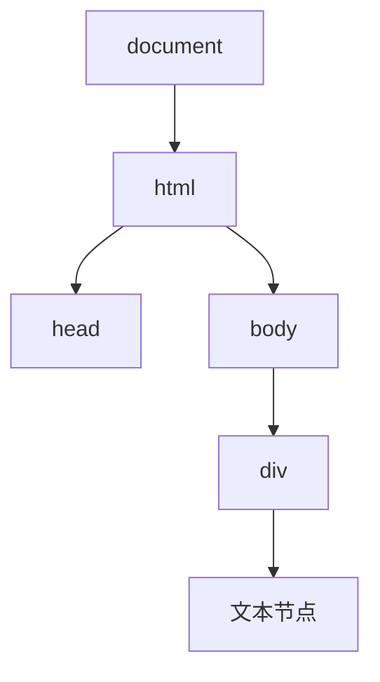
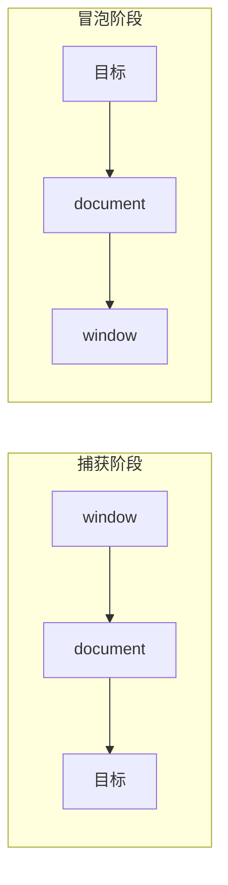
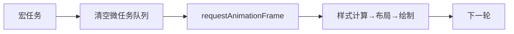

# DOM 与事件机制

## 学习目标

- 理解 DOM 树、节点类型与高效操作 DOM 的原理
- 掌握事件流三阶段、事件委托、自定义事件
- 理解事件循环与 DOM 更新、渲染的时机关系
- 能用观察者类 API（Intersection/Mutation/Resize）替代低效轮询

## 为什么需要

DOM 是 JS 操作页面的接口，也是性能瓶颈高发区。「列表渲染卡」「滚动监听掉帧」「事件绑了几千个」这些问题，根因都在对 DOM 与事件机制理解不足。框架（React/Vue）帮你管理 DOM，但底层原理决定了你能否写出高性能组件、排查诡异的事件 bug。

> 核心心法：**DOM 操作很贵（跨 JS 引擎与渲染引擎边界），事件要善用冒泡委托，监听要善用观察者而非轮询。**

---

## 一、DOM 本质

DOM（文档对象模型）是 HTML 文档的树状对象表示。JS 通过它读写页面。



**节点类型：** 元素节点、文本节点、属性节点、注释节点等（`nodeType` 区分）。

### 为什么 DOM 操作慢

JS 引擎（V8）和渲染引擎（Blink）是两套系统，每次 DOM 操作都要跨边界通信；且修改几何属性可能触发重排。**减少 DOM 操作次数、批量化**是核心优化。

```javascript
// 慢：循环中逐次插入 → 多次重排
for (let i = 0; i < 1000; i++) {
  list.appendChild(document.createElement('li'));
}

// 快：用 DocumentFragment 离线构建，一次插入
const frag = document.createDocumentFragment();
for (let i = 0; i < 1000; i++) {
  frag.appendChild(document.createElement('li'));
}
list.appendChild(frag);   // 仅一次重排
```

---

## 二、事件流：捕获 → 目标 → 冒泡

一个事件从 window 向下传到目标，再向上冒泡回 window：



```javascript
// 第三参数 true = 捕获阶段触发；默认 false = 冒泡阶段
el.addEventListener('click', handler, true);   // 捕获
el.addEventListener('click', handler, false);  // 冒泡（常用）
```

**控制事件传播：**

| 方法 | 作用 |
|------|------|
| `e.stopPropagation()` | 阻止继续传播（冒泡/捕获） |
| `e.stopImmediatePropagation()` | 阻止传播 + 同元素其他监听器 |
| `e.preventDefault()` | 阻止默认行为（如链接跳转、表单提交） |

> `return false` 在原生 DOM 中不等价于 preventDefault，框架里语义也不同，避免依赖它。

---

## 三、事件委托（高频实践）

利用冒泡，把子元素的事件统一绑在父元素上，**一个监听器处理所有子元素**：

```javascript
// 不好：1000 个 li 各绑一个监听器
// 好：父元素一个监听器
list.addEventListener('click', (e) => {
  const li = e.target.closest('li');
  if (!li) return;
  handleItem(li.dataset.id);
});
```

**优势：**

- 内存省：N 个元素 → 1 个监听器
- 动态元素自动生效：新增的 li 无需重新绑定
- React 的合成事件本质就是在根节点做事件委托

---

## 四、事件循环与 DOM 渲染时机

DOM 修改不会「立刻」反映到屏幕，浏览器在事件循环的「渲染时机」统一绘制：



```javascript
// rAF：在下一次重绘前执行，适合动画与 DOM 读写分离
requestAnimationFrame(() => {
  el.style.transform = `translateX(${x}px)`;
});

// 强制同步布局陷阱：读写交替触发多次重排
el.style.width = '100px';
const w = el.offsetWidth;   // 强制 flush 布局
el.style.height = w + 'px'; // 又触发重排
```

> 读写分离：先批量读几何属性，再批量写样式，避免 Layout Thrashing（见浏览器渲染原理）。

---

## 五、观察者类 API（替代轮询，高性能）

### 5.1 IntersectionObserver（元素是否进入视口）

```javascript
// 图片懒加载 / 无限滚动 / 曝光埋点
const io = new IntersectionObserver((entries) => {
  entries.forEach(e => {
    if (e.isIntersecting) {
      e.target.src = e.target.dataset.src;
      io.unobserve(e.target);
    }
  });
});
document.querySelectorAll('img[data-src]').forEach(img => io.observe(img));
```

比监听 `scroll` + `getBoundingClientRect()` 高效得多（不阻塞主线程）。

### 5.2 MutationObserver（DOM 结构变化）

```javascript
const mo = new MutationObserver((mutations) => {
  mutations.forEach(m => console.log(m.type, m.addedNodes));
});
mo.observe(target, { childList: true, subtree: true, attributes: true });
```

### 5.3 ResizeObserver（元素尺寸变化）

```javascript
const ro = new ResizeObserver(entries => {
  for (const e of entries) relayout(e.contentRect);
});
ro.observe(chartContainer);   // 替代 window.resize 做局部响应
```

---

## 六、自定义事件（组件解耦通信）

```javascript
// 派发
el.dispatchEvent(new CustomEvent('cart:add', {
  detail: { id: 123, qty: 2 },
  bubbles: true,
}));

// 监听
document.addEventListener('cart:add', (e) => {
  updateCart(e.detail);
});
```

适合跨组件/跨框架通信、微前端间通信。

---

## 排查实战

### 案例 A：长列表绑定卡顿、内存高

- **原因：** 每个 item 各绑监听器
- **修复：** 事件委托，父级一个监听器
- **验证：** 监听器数量骤降，内存稳定

### 案例 B：滚动监听掉帧

- **原因：** `scroll` 里同步 `getBoundingClientRect()` 强制布局
- **修复：** 改用 IntersectionObserver；必要时 scroll 加节流 + rAF
- **验证：** Performance 中无 Forced reflow，FPS 稳定

### 案例 C：弹层点击「穿透」/重复触发

- **原因：** 事件冒泡到父级、或捕获/冒泡阶段都绑了
- **修复：** 精确 `stopPropagation`，理清绑定阶段
- **验证：** 只触发预期处理

---

## 常见误区与最佳实践

| 误区 | 正确理解 |
|------|---------|
| "每个元素都要绑监听" | 用事件委托 |
| "scroll 监听做懒加载" | IntersectionObserver 更高效 |
| "DOM 改了立即就重排" | 浏览器批量在渲染时机处理 |
| "stopPropagation 随便用" | 会破坏委托，谨慎 |
| "innerHTML 拼接最方便" | 有 XSS 风险，且全量重建 |

**可执行清单：**

- [ ] 批量 DOM 操作用 DocumentFragment
- [ ] 列表交互用事件委托
- [ ] 曝光/懒加载/无限滚动用 IntersectionObserver
- [ ] 尺寸响应用 ResizeObserver
- [ ] 动画与 DOM 写入放进 requestAnimationFrame
- [ ] 读写分离避免强制同步布局

## 手写实现（面试必考）

```javascript
function delegate(parent, selector, event, handler) {
  parent.addEventListener(event, e => {
    const t = e.target.closest(selector);
    if (t && parent.contains(t)) handler.call(t, e);
  });
}
```

## 面试高频问答（追问链）

> 大厂对一个考点通常追问到能力边界：**概念 → 机制 → 边界 → ⭐ 原理（触底）→ 实战（落地）**。实战层是区分「背过」和「做过」的关键。

### 链一：事件流与委托

1. **概念**：事件流三阶段？→ 捕获 → 目标 → 冒泡。
2. **机制**：addEventListener 第三参？→ true 捕获阶段、false/默认冒泡阶段。
3. **应用**：事件委托优点？→ 少监听、支持动态元素、省内存。
4. **边界**：哪些事件不冒泡？委托失效怎么办？→ focus/blur/scroll 不冒泡，用捕获或 focusin/focusout。
5. ⭐ **原理（触底）**：`stopPropagation` 和 `stopImmediatePropagation` 区别？preventDefault 呢？→ 前者停止向上传播、后者还阻止同元素其余监听器；preventDefault 只阻默认行为不停传播。
6. **实战（落地）**：动态列表点击委托怎么写？→ 父容器监听 click，event.target 匹配 `[data-id]`；不冒泡的 focus 用捕获；改后增删节点无需重绑，单测模拟点击验证。

### 链二：渲染时机与观察者

1. **概念**：微任务、rAF、setTimeout 与渲染顺序？→ 微任务 → rAF（渲染前）→ 绘制 → setTimeout。
2. **应用**：连续 DOM 读写怎么避免抖动？→ 用 rAF 批量、读写分离。
3. **边界**：IntersectionObserver 相比 scroll 监听好在哪？→ 异步、不阻塞主线程、不强制布局。
4. ⭐ **原理（触底）**：为什么 scroll 里读 getBoundingClientRect 卡顿，而 IO 不卡？→ 同步读几何强制重排（Layout Thrashing）；IO 由浏览器在合成阶段异步计算交叉比，不触发同步布局。
5. **实战（落地）**：图片懒加载怎么落地？→ IntersectionObserver rootMargin 预加载；替换 scroll 监听；Network 看滚动时才请求图片；LCP/带宽对比优化前后。

## 小结

- DOM 操作跨引擎边界且可能触发重排，要批量化
- 事件流三阶段：捕获 → 目标 → 冒泡；善用委托
- DOM 更新在事件循环的渲染时机统一绘制，用 rAF 协调
- 观察者 API（Intersection/Mutation/Resize）替代低效轮询
- 自定义事件适合解耦通信

## 延伸阅读

- [MDN: 事件介绍](https://developer.mozilla.org/zh-CN/docs/Learn/JavaScript/Building_blocks/Events)
- [MDN: IntersectionObserver](https://developer.mozilla.org/zh-CN/docs/Web/API/Intersection_Observer_API)
- [What forces layout/reflow](https://gist.github.com/paulirish/5d52fb081b3570c81e3a)
