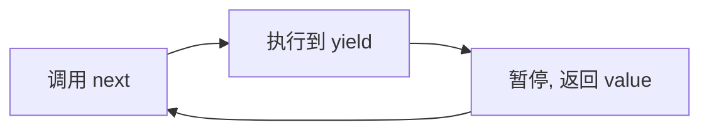

# 现代 JavaScript（ES6+ 到 ES2023）

## 学习目标

- 系统掌握 ES6+ 关键特性的原理与适用场景
- 理解迭代器/生成器、Proxy/Reflect、Symbol 的底层机制
- 能用现代语法写出更简洁、健壮的代码
- 了解各特性的兼容性与编译降级

## 为什么需要

现代框架与库大量使用 ES6+ 特性：Vue 3 的响应式基于 Proxy，async/await 基于 Generator，迭代协议支撑 `for...of` 和解构。不懂这些机制，就读不懂源码、用不好语言。同时，写出现代、简洁、不易出错的代码是工程素养的体现。

> 核心心法：**新语法不只是「语法糖」，背后是协议与机制。** 理解机制才能在框架源码和复杂场景中游刃有余。

---

## 一、变量与作用域：let / const

```javascript
// var：函数作用域 + 提升，易出 bug
// let/const：块级作用域 + 暂时性死区(TDZ)
{
  console.log(x); // ReferenceError（TDZ，不是 undefined）
  let x = 1;
}
```

- `const` 声明的是**绑定不可变**，对象内容仍可改（`const o = {}; o.a = 1` 合法）。
- 默认用 `const`，需重新赋值才用 `let`，杜绝 `var`。

---

## 二、解构、展开、默认值

```javascript
// 解构 + 默认值 + 重命名
const { name, age = 18, info: { city } = {} } = user;

// 数组解构交换
[a, b] = [b, a];

// 展开：浅拷贝 / 合并 / 收集
const clone = { ...obj };
const merged = { ...defaults, ...overrides };
const [first, ...rest] = list;

// 函数参数解构（React props 常见）
function Card({ title, onClick }) {}
```

> 展开是**浅拷贝**：嵌套对象仍共享引用，深层修改会互相影响（见函数式编程篇的不可变更新）。

---

## 三、Symbol：唯一标识与元编程

```javascript
const id = Symbol('id');        // 唯一，不与任何 key 冲突
const obj = { [id]: 123 };
// Symbol 属性不被 for...in / Object.keys 枚举 → 适合「隐藏」元数据

// 知名 Symbol：定制语言行为
class Range {
  constructor(start, end) { this.start = start; this.end = end; }
  [Symbol.iterator]() {       // 让对象可被 for...of / 展开
    let cur = this.start, end = this.end;
    return { next: () => cur <= end
      ? { value: cur++, done: false }
      : { value: undefined, done: true } };
  }
}
console.log([...new Range(1, 3)]); // [1,2,3]
```

---

## 四、迭代协议：Iterator 与 Generator

### 4.1 可迭代协议

实现 `[Symbol.iterator]` 的对象可用于 `for...of`、展开、解构。数组、Map、Set、字符串天生可迭代。

### 4.2 Generator（生成器）

函数执行可暂停/恢复，是 async/await 的底层基础：

```javascript
function* idGen() {
  let id = 1;
  while (true) yield id++;   // 每次 next() 在 yield 处暂停
}
const gen = idGen();
gen.next().value; // 1
gen.next().value; // 2

// 应用：惰性序列、自定义迭代、协程式异步控制（redux-saga）
```



---

## 五、Proxy 与 Reflect（拦截与元编程）

Proxy 拦截对象的基本操作，是 **Vue 3 响应式的核心**：

```javascript
const raw = { count: 0 };
const state = new Proxy(raw, {
  get(target, key, receiver) {
    track(target, key);                    // 依赖收集
    return Reflect.get(target, key, receiver);
  },
  set(target, key, value, receiver) {
    const ok = Reflect.set(target, key, value, receiver);
    trigger(target, key);                  // 触发更新
    return ok;
  },
});
state.count++;   // 自动触发 get + set 拦截
```

- **Proxy** 能拦截 get/set/has/deleteProperty/apply 等 13 种操作。
- **Reflect** 提供与拦截器对应的默认行为方法，保证 `this`/receiver 正确。
- 相比 `Object.defineProperty`（Vue 2），Proxy 能监听新增属性、数组索引、删除——这是 Vue 3 重写响应式的原因。

---

## 六、异步语法：Promise / async-await

```javascript
// 并发而非串行
const [user, posts] = await Promise.all([fetchUser(), fetchPosts()]);

// 容错并发
const results = await Promise.allSettled(tasks);

// 竞速（最快成功）
const fastest = await Promise.any([cdn1(), cdn2()]);
```

详见 [03-异步与事件循环](./03-异步与事件循环.md)。要点：async 函数返回 Promise，`await` 暂停在微任务恢复。

---

## 七、实用操作符与 API

```javascript
// 可选链：安全访问深层属性
const city = user?.address?.city;
// 短路调用
user.save?.();

// 空值合并：仅 null/undefined 才用默认（区别于 ||）
const count = data.count ?? 0;     // 0 会保留，|| 会被当 falsy
const port = config.port || 3000;  // 0 会被覆盖（陷阱）

// 逻辑赋值
obj.list ??= [];
config.debug ||= false;

// 数组/对象实用
arr.at(-1);                  // 最后一个元素
arr.flat(Infinity);          // 深度拍平
Object.fromEntries(map);     // 键值对 → 对象
structuredClone(obj);        // 原生深拷贝（含 Date/Map/Set）
[1,2,3].findLast(x => x < 3);// ES2023
```

---

## 八、模块化：ESM

```javascript
// 命名导出 / 默认导出
export const helper = () => {};
export default function App() {}

// 导入 + 动态导入（代码分割）
import App, { helper } from './app';
const mod = await import('./heavy');   // 按需加载，返回 Promise
```

- ESM 是**静态结构**（import 提升、可静态分析）→ 支持 Tree Shaking。
- 与 CommonJS 的差异详见工程化 [01-模块化演进与原理](../03-工程化/01-模块化演进与原理.md)。

---

## 九、Class 与新特性

```javascript
class Counter {
  #count = 0;               // 私有字段（# 真私有，外部不可访问）
  static create() { return new Counter(); }  // 静态方法
  get value() { return this.#count; }        // getter
  inc = () => this.#count++;                  // 类字段 + 箭头（自动绑 this）
}
```

> Class 本质仍是原型继承的语法糖（见 [02-JavaScript核心原理](./02-JavaScript核心原理.md) 原型链），但 `#` 私有字段是真正的语言级私有。

---

## 运用：兼容性与编译降级

- 用 **Babel / SWC / esbuild** 把新语法降级到目标浏览器支持的版本。
- 用 **core-js** polyfill 缺失的 API（如 `Promise`、`Array.prototype.at`）。
- `browserslist` 配置目标环境，构建工具据此决定降级程度。
- 语法（syntax，如可选链）可编译，但 API（如 `structuredClone`）需 polyfill。

```json
// .browserslistrc / package.json
"browserslist": ["> 0.5%", "last 2 versions", "not dead"]
```

---

## 排查实战

### 案例 A：`||` 把合法的 0/'' 覆盖了

- **原因：** `value || default` 对 falsy 值都生效
- **修复：** 改 `value ?? default`，只对 null/undefined 兜底
- **验证：** 0、''、false 被正确保留

### 案例 B：展开拷贝后嵌套对象互相影响

- **原因：** `{...obj}` 是浅拷贝
- **修复：** 深层用 `structuredClone` 或不可变更新
- **验证：** 修改副本不影响原对象

### 案例 C：低端浏览器报语法错误

- **原因：** 未对依赖做降级，第三方库用了新语法
- **修复：** 配置 Babel 转译 node_modules 中的相关包
- **验证：** 目标浏览器正常运行

---

## 常见误区与最佳实践

| 误区 | 正确理解 |
|------|---------|
| "const 对象不能改" | 绑定不可变，内容可改 |
| "`||` 和 `??` 一样" | `??` 只对 null/undefined |
| "展开是深拷贝" | 浅拷贝 |
| "class 是新的继承模型" | 仍是原型语法糖 |
| "新语法直接上生产" | 需 Babel + polyfill + browserslist |

**可执行清单：**

- [ ] 默认 const，禁 var
- [ ] 默认值兜底用 `??`，不用 `||`
- [ ] 深拷贝用 structuredClone
- [ ] 大模块用动态 import 分割
- [ ] 配置 browserslist + polyfill 策略

## 手写深拷贝

```javascript
function deepClone(v, cache = new WeakMap()) {
  if (v === null || typeof v !== 'object') return v;
  if (cache.has(v)) return cache.get(v);
  const c = Array.isArray(v) ? [] : {};
  cache.set(v, c);
  Reflect.ownKeys(v).forEach(k => { c[k] = deepClone(v[k], cache); });
  return c;
}
```

## 面试高频问答（追问链）

> 大厂对一个考点通常追问到能力边界：**概念 → 机制 → 边界 → ⭐ 原理（触底）→ 实战（落地）**。实战层是区分「背过」和「做过」的关键。

### 链一：Proxy 与响应式

1. **概念**：Proxy vs defineProperty？→ Proxy 代理整个对象、可拦截 13 种操作；defineProperty 逐属性。
2. **机制**：Vue3 为什么换 Proxy？→ 能监听新增/删除属性、数组索引、Map/Set，无需递归预遍历。
3. **边界**：Proxy 有什么坑？→ 不能被 polyfill（Vue3 弃 IE）、对原始对象操作不触发、嵌套需懒代理。
4. ⭐ **原理（触底）**：Vue3 怎么用 Proxy + Reflect 实现懒响应式？→ get 时才递归代理子对象、用 Reflect 保证 this 正确，配合 track/trigger 依赖收集。
5. **实战（落地）**：自研表单引擎怎么用 Proxy 监听？→ 代理 formState，get 收集依赖、set 触发校验；嵌套对象懒代理；单测改深层字段验证 UI 同步更新。

### 链二：迭代器与异步语法

1. **概念**：Symbol 用途？→ 唯一键、Symbol.iterator、防属性冲突。
2. **机制**：Generator 和 async 关系？→ async/await 是 Generator + 自动执行器的语法糖。
3. **应用**：`??` 和 `||` 区别？→ `??` 仅对 null/undefined 兜底，`||` 对所有 falsy。
4. ⭐ **原理（触底）**：可选链 `?.` 编译成什么？短路对副作用有何影响？→ 编译为临时变量 + 条件判断，遇 null/undefined 短路，后续函数调用/取值都不执行。
5. **实战（落地）**：老项目迁移可选链/空值合并怎么推进？→ Babel 配插件降级；ESLint 推荐 `??` 替代 `||` 防 0 误判；逐模块替换，单测覆盖边界值 0/''/null。

## 小结

- let/const 带来块级作用域与 TDZ，默认用 const
- Symbol/迭代协议/Generator 支撑 for...of、解构、async
- Proxy + Reflect 是 Vue 3 响应式核心
- `?.`、`??`、逻辑赋值让边界处理更安全
- ESM 静态结构支持 Tree Shaking；新语法需编译降级落地

## 延伸阅读

- [MDN: JavaScript 参考](https://developer.mozilla.org/zh-CN/docs/Web/JavaScript/Reference)
- [ECMAScript 提案](https://github.com/tc39/proposals)
- [ES6 入门 - 阮一峰](https://es6.ruanyifeng.com/)
