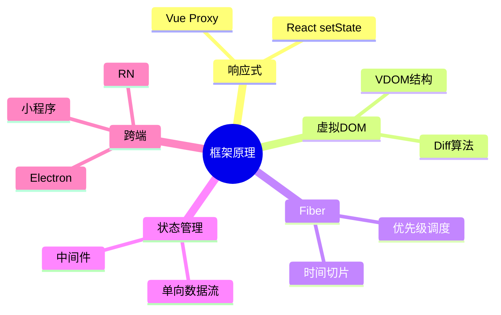
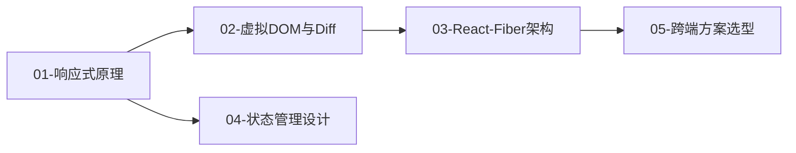

# 02-框架与底层原理 · 本章导读

## 模块定位

框架是前端应用的核心运行时。不理解响应式、虚拟 DOM、Fiber 调度，就无法：

- 做出正确的状态管理选型
- 排查"更新了但没渲染"的问题
- 评估 React vs Vue 的技术债务
- 设计高性能的组件架构

## 知识地图

## 章节依赖

**前置依赖：** 完成 [01-基础内功](../01-基础内功/00-本章导读.md)，尤其 JavaScript 核心与异步。

## 学习建议

1. 先理解 Vue 响应式（直观），再对比 React 的不可变更新
2. 手写简易 VDOM + Diff 加深理解
3. Fiber 章节偏理论，结合 React 18 Concurrent 特性理解
4. 状态管理不要急于选型，先理解"何时需要全局状态"

## 自测清单

- [ ] Vue 3 如何用 Proxy 实现依赖收集？
- [ ] React 为什么强调不可变更新？
- [ ] Diff 算法的时间复杂度是多少？key 的作用？
- [ ] Fiber 如何实现可中断渲染？
- [ ] Redux 三大原则是什么？何时用 Zustand 替代？
