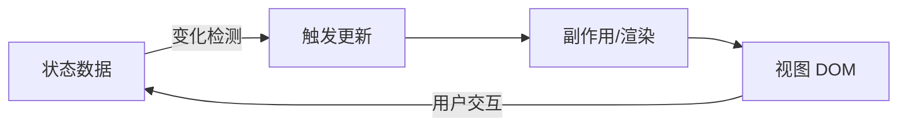
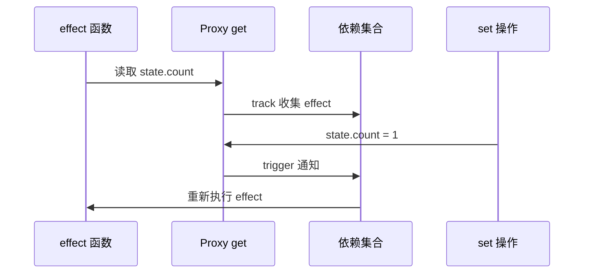
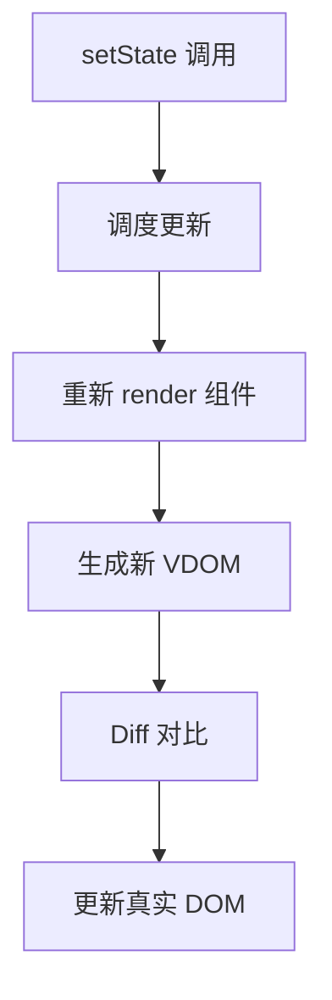

# 响应式原理

## 学习目标

- 理解"响应式"的本质：数据变化 → 自动更新视图
- 掌握 Vue 3 的 Proxy + effect 依赖收集机制
- 理解 React 的 setState 与不可变更新模型
- 对比两种响应式范式的优劣与适用场景

## 为什么需要

用户交互、网络请求都会改变应用状态，框架的核心职责是**状态与视图的同步**。响应式系统决定了：

- 开发者如何声明状态（ref、reactive、useState）
- 更新粒度（组件级 vs 属性级）
- 性能特征（细粒度 vs 批量更新）

## 核心原理

### 1. 响应式的本质



两种主流实现路径：

| 范式 | 代表 | 思路 |
|------|------|------|
| 拉（Pull） | Vue | 属性访问时收集依赖，变更时精确通知 |
| 推（Push） | React | 状态变更 → 标记组件 dirty → 重新 render |

### 2. Vue 3 响应式（Proxy + effect）

```javascript
// 简化版 reactive 实现
let activeEffect = null;
const targetMap = new WeakMap();

function track(target, key) {
  if (!activeEffect) return;
  let depsMap = targetMap.get(target);
  if (!depsMap) {
    depsMap = new Map();
    targetMap.set(target, depsMap);
  }
  let dep = depsMap.get(key);
  if (!dep) {
    dep = new Set();
    depsMap.set(key, dep);
  }
  dep.add(activeEffect);
}

function trigger(target, key) {
  const depsMap = targetMap.get(target);
  if (!depsMap) return;
  const dep = depsMap.get(key);
  if (dep) {
    dep.forEach(effect => effect());
  }
}

function reactive(obj) {
  return new Proxy(obj, {
    get(target, key, receiver) {
      track(target, key);
      return Reflect.get(target, key, receiver);
    },
    set(target, key, value, receiver) {
      const result = Reflect.set(target, key, value, receiver);
      trigger(target, key);
      return result;
    }
  });
}

function effect(fn) {
  activeEffect = fn;
  fn();
  activeEffect = null;
}

// 使用
const state = reactive({ count: 0 });
effect(() => console.log('count:', state.count));
state.count++; // 自动打印 count: 1
```

**依赖收集流程：**



**ref vs reactive：**

```javascript
// ref — 基本类型，.value 访问
const count = ref(0);
count.value++;

// reactive — 对象，直接属性访问
const state = reactive({ user: { name: 'Alice' } });
state.user.name = 'Bob';
```

### 3. React 响应式（setState + 不可变）

React 不追踪属性访问，而是**显式触发更新**：

```javascript
function Counter() {
  const [count, setCount] = useState(0);

  // 必须返回新对象/新值，React 用 Object.is 比较
  const increment = () => setCount(c => c + 1);

  return <button onClick={increment}>{count}</button>;
}
```

**更新流程：**



**不可变更新的原因：**

```javascript
// 错误 — 直接修改，引用不变，React 检测不到
state.user.name = 'Bob';
setState(state);

// 正确 — 新对象
setState(prev => ({
  ...prev,
  user: { ...prev.user, name: 'Bob' }
}));
```

### 4. 对比与选型

| 维度 | Vue 3 | React |
|------|-------|-------|
| 更新粒度 | 属性级，精确 | 组件级（可优化） |
| 心智模型 | 可变 + 自动追踪 | 不可变 + 显式 setState |
| 性能 | 细粒度，少无效渲染 | 需 memo/useMemo 优化 |
| 调试 | 依赖链较隐式 | 数据流清晰可预测 |
| 学习曲线 | 模板 + 响应式直观 | JSX + 不可变需适应 |

## 常见误区与最佳实践

| 误区 | 正确理解 |
|------|---------|
| "Vue 可变所以不安全" | 响应式系统保证变更可追踪 |
| "React 每次 setState 都渲染 DOM" | 先 VDOM Diff，再最小化 DOM 操作 |
| "响应式 = 双向绑定" | 双向绑定是 v-model，响应式是更底层机制 |
| "Proxy 比 defineProperty 只是 API 不同" | Proxy 可监听新增属性、数组索引，无需递归初始化 |

**最佳实践：**

- Vue：复杂对象用 reactive，基本类型用 ref
- React：状态尽量扁平，避免深层嵌套
- 两者都避免在 render 中创建新对象/函数（导致子组件无效重渲染）

## 小结

- 响应式 = 数据变化自动驱动视图更新
- Vue：Proxy 拦截 + 依赖收集 + effect 触发
- React：setState + 不可变 + 重新 render + Diff
- 理解两者差异有助于技术选型和性能优化

## 延伸阅读

- [Vue 3 响应式原理](https://vuejs.org/guide/extras/reactivity-in-depth.html)
- [React 文档：State as a Snapshot](https://react.dev/learn/state-as-a-snapshot)
- [Build Your Own React (pomb.us)](https://pomb.us/build-your-own-react/)
