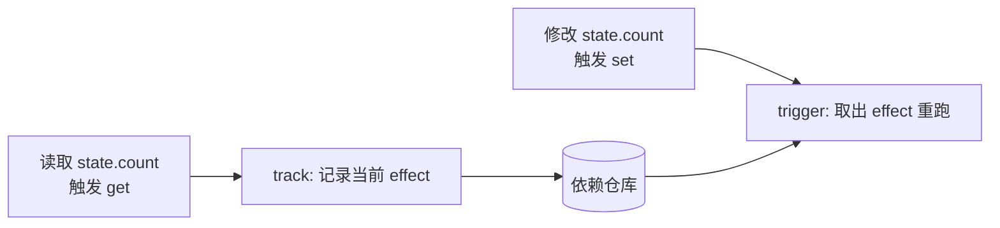
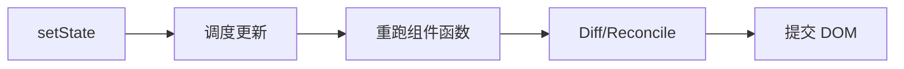

# 响应式原理

## 学习目标

- 读懂 Vue/React 两种响应式范式，能解释「更新了但没渲染」
- 能排查响应式失效、多余渲染、Hooks 闭包等真实 bug
- 掌握 computed、watch、useMemo 的选用与性能验证

## 为什么需要

「数据变了界面没变」是前端最高频 bug 之一。不懂响应式原理，你只能试 `forceUpdate` 或乱加依赖。

> 核心心法：**Vue 是「谁用了谁」自动收集；React 是「你告诉我变了」显式触发。** 排查路径完全不同。

---

## 一、心智模型

| 现象 | Vue 先查 | React 先查 |
|------|---------|-----------|
| 改了没反应 | 是否新增属性/数组索引 | 是否 mutate 原对象 |
| 更新太频繁 | watch 是否 deep 滥用 | 是否父组件 re-render 子组件 |
| 旧值 | ref 是否 .value | 闭包 stale state |
| 列表不更新 | key 是否稳定 | key + 不可变更新 |

---

## 二、底层原理：两种范式的本质

### Vue：依赖收集（Push 模型，自动追踪）

Vue 的响应式是「**谁读了我，我变了就通知谁**」——精确到属性级。



核心是一个三层依赖结构（Vue 3 源码本质）：

```javascript
// targetMap: 全局依赖仓库
// WeakMap<对象, Map<属性key, Set<effect>>>
const targetMap = new WeakMap();
let activeEffect = null; // 当前正在运行的副作用

function track(target, key) {
  if (!activeEffect) return;
  let depsMap = targetMap.get(target);
  if (!depsMap) targetMap.set(target, (depsMap = new Map()));
  let dep = depsMap.get(key);
  if (!dep) depsMap.set(key, (dep = new Set()));
  dep.add(activeEffect);          // 把「读取者」记下来
}

function trigger(target, key) {
  const dep = targetMap.get(target)?.get(key);
  dep?.forEach(effect => effect()); // 通知所有依赖此属性的副作用
}

function reactive(obj) {
  return new Proxy(obj, {
    get(t, k, r) { track(t, k); return Reflect.get(t, k, r); },
    set(t, k, v, r) { const ok = Reflect.set(t, k, v, r); trigger(t, k); return ok; },
  });
}
```

- **computed** = 一个带缓存的 effect，依赖变了才重新计算（dirty 标记）。
- **watch** = 注册一个 effect，依赖变化时执行回调。
- **为什么 Vue 3 用 Proxy 取代 Vue 2 的 `Object.defineProperty`：** 后者无法监听新增属性、数组索引、删除，需 `Vue.set` 兜底；Proxy 拦截整个对象的所有操作，天然支持。

### React：不可变 + 显式触发（Pull 模型，主动调度）

React **不追踪**你读了什么，而是「**你调用 setState，我就重新执行组件函数，再 diff**」。



- **为什么必须不可变：** React 用 `Object.is(prevState, nextState)` 浅比较决定是否更新；直接 mutate 原对象 → 引用不变 → React 认为「没变」→ 跳过更新（bailout）。
- **state 是快照：** 每次渲染的 `state` 是那一次渲染的常量。这解释了闭包 stale 问题（见下）。
- **更新粒度：** Vue 精确到属性；React 默认从触发组件**整棵子树**重新执行（靠 memo 才能剪枝）——这是两者性能优化思路不同的根源。

| 维度 | Vue | React |
|------|-----|-------|
| 追踪方式 | 自动依赖收集（Proxy） | 不追踪，显式 setState |
| 更新粒度 | 属性级精确 | 组件树级（memo 剪枝） |
| 数据写法 | 可直接 mutate | 必须不可变 |
| 心智成本 | 低（自动） | 需理解快照/不可变 |

---

## 三、Vue 3：读懂 + 排查 + 修复

### 原理速览

Proxy 拦截 get/set → track 收集 effect → trigger 通知更新（详见上节依赖收集结构）。

### 排查清单

```javascript
// 1. reactive 对象新增属性 — Vue3 可以，Vue2 不行
state.newKey = 1; // Vue3 OK

// 2. 解构丢失响应式
const { count } = reactive({ count: 0 }); // count 非响应式
const count = toRef(state, 'count'); // 正确

// 3. ref 忘记 .value（script setup 自动解包除外）
const n = ref(0);
n++; // 错
n.value++; // 对
```

### DevTools 验证

Vue DevTools → 组件 → 看 props/data 变化时组件是否高亮更新。

### 案例：表格编辑不刷新

1. **现象：** 改 cell 数据，UI 不变
2. **原因：** 直接改数组索引未触发（Vue2）或改的是普通对象副本
3. **修复：** `state.rows[i] = { ...row, field: val }` 或 Vue2 `Vue.set`
4. **验证：** DevTools 看到组件 re-render

---

## 四、React：读懂 + 排查 + 修复

### 不可变更新

```javascript
// 错
state.user.name = 'Bob';
setState(state);

// 对
setState(prev => ({ ...prev, user: { ...prev.user, name: 'Bob' } }));
```

### Hooks 顺序

```javascript
// 错 — 条件里调 Hook
if (x) useState(0);

// 对 — 顺序固定
const [a, setA] = useState(0);
```

### React DevTools Profiler

1. Profiler → 录制 → 操作界面
2. 看 **Render duration** 和 **Why did this render?**
3. 优化：memo、useMemo、useCallback、状态下放

### 案例：父组件改 state，列表全重渲染

1. **Profiler：** List 子项全部 render
2. **原因：** 父传 inline `style={{}}` 和 `onClick={()=>{}}`
3. **修复：** memo(ListItem) + 稳定 callback（useCallback）
4. **验证：** 仅改动的 item render

---

## 五、批量更新与 nextTick

```javascript
// Vue
state.a = 1; state.b = 2;
nextTick(() => console.log(dom.textContent)); // DOM 已更新

// React 18 自动批处理（含 setTimeout 内多个 setState）
```

---

## 六、项目落地

1. **Vue：** 复杂对象 reactive，基本类型 ref；大对象避免 deep watch
2. **React：** 服务端状态 React Query，UI 状态 Zustand；禁止 mutate
3. **Review：** 是否 mutate？Hook 顺序？Profiler 抽测核心页

---

## 排查实战

### 案例 A：Vue watch 死循环

- **原因：** watch 里改被 watch 的源
- **修复：** 加条件或 watchEffect 精确依赖

### 案例 B：React useEffect 无限请求

- **原因：** deps 每次新对象 `[{ id: 1 }]`
- **修复：** deps `[id]` 或 useMemo 稳定引用

---

## 手写 mini reactive（面试必考）

```javascript
let activeEffect = null;
const targetMap = new WeakMap();

function track(target, key) {
  if (!activeEffect) return;
  let depsMap = targetMap.get(target);
  if (!depsMap) targetMap.set(target, (depsMap = new Map()));
  let dep = depsMap.get(key);
  if (!dep) depsMap.set(key, (dep = new Set()));
  dep.add(activeEffect);
}

function trigger(target, key) {
  const dep = targetMap.get(target)?.get(key);
  dep?.forEach(effect => effect());
}

function reactive(obj) {
  return new Proxy(obj, {
    get(t, k) { track(t, k); return t[k]; },
    set(t, k, v) { t[k] = v; trigger(t, k); return true; },
  });
}

function effect(fn) {
  activeEffect = fn; fn(); activeEffect = null;
}
```

### 手写 mini useState

```javascript
let hookIndex = 0, hooks = [];
function useState(init) {
  const i = hookIndex++;
  if (hooks[i] === undefined) hooks[i] = init;
  const set = v => { hooks[i] = typeof v === 'function' ? v(hooks[i]) : v; render(); };
  return [hooks[i], set];
}
```

## 面试高频问答（追问链）

> 大厂对一个考点通常追问到能力边界：**概念 → 机制 → 边界 → ⭐ 原理（触底）→ 实战（落地）**。实战层是区分「背过」和「做过」的关键。

### 链一：Vue 响应式

1. **概念**：Vue2 和 Vue3 响应式区别？→ defineProperty 逐属性递归、无法监听新增/删除/数组索引；Proxy 整体代理。
2. **机制**：依赖怎么收集与触发？→ effect 运行时 track，set 时 trigger，结构 `WeakMap<target, Map<key, Set<effect>>>`。
3. **边界**：Vue2 数组新增为什么不响应？→ defineProperty 不拦截索引/length，需 `Vue.set`/`splice`。
4. **应用**：ref 和 reactive 怎么选？→ 基本类型/可替换整体用 ref，对象用 reactive。
5. ⭐ **原理（触底）**：手写一个 mini 响应式（effect + track + trigger）怎么实现嵌套 effect 和清理？→ 用 effect 栈管理嵌套、每次运行前 cleanup 删除旧依赖防止遗留触发（见本章 mini reactive）。
6. **实战（落地）**：Vue 项目里响应式更新异常怎么排查？→ DevTools 看依赖是否收集；查是否直接改 props/解构丢响应；改 reactive/ref 用法后复测，Profiler 确认组件更新次数下降。

### 链二：React 更新模型

1. **概念**：React 为什么强调不可变？→ 引用比较（Object.is）决定更新、可预测、支持时间旅行。
2. **机制**：setState 是同步还是异步？→ React18 默认批处理，回调里读到的是旧快照。
3. **边界**：computed/watch 在 React 里对应什么？→ useMemo（缓存派生）/ useEffect（副作用）。
4. ⭐ **原理（触底）**：Vue 的 Push（自动依赖）和 React 的 Pull（手动 setState + Diff）各有什么取舍？→ Vue 精确到属性、更新粒度细但有收集开销；React 粗到组件、靠 Diff/memo 控制，心智简单但易过度渲染。
5. **实战（落地）**：React 列表页过度渲染怎么优化？→ Profiler 找频繁 render 组件；加 memo + 稳定 props、状态下沉；优化前后 React Profiler 火焰图 render 次数与耗时对比。

## 小结

- 本质区别：Vue 自动依赖收集（Push、属性级），React 显式 setState（Pull、组件树级）
- Vue 原理：Proxy + `WeakMap<target, Map<key, Set<effect>>>` 收集与触发
- React 原理：不可变 + `Object.is` 浅比较决定更新，state 是快照
- 工具：Vue DevTools / React Profiler
- 闭包 stale 是两框架共同陷阱

## 延伸阅读

- [Vue Reactivity in Depth](https://vuejs.org/guide/extras/reactivity-in-depth.html)
- [React DevTools Profiler](https://react.dev/learn/react-developer-tools)
