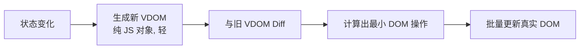
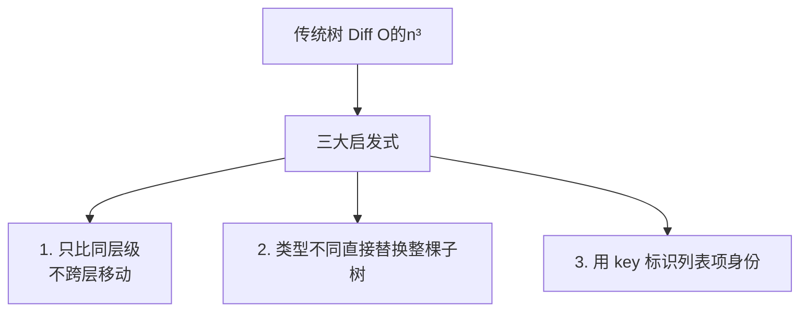

# 虚拟 DOM 与 Diff

## 学习目标

- 读懂 VDOM 解决什么问题，何时 VDOM 反而是开销
- 能排查 key 错误、列表状态错乱等真实 bug
- 会用 React/Vue DevTools 验证列表渲染性能

## 为什么需要

列表乱序、输入框失焦、状态串行——多数和 **key** 或 **Diff 复用策略** 有关。

> 核心心法：**Diff 假设同层同类型可复用；key 标识「身份」。** key 错了，DOM 复用就错。

---

## 一、心智模型

| 现象 | 先怀疑 |
|------|--------|
| 列表 reorder 后 input 内容串了 | index 作 key |
| 删除一条后状态错位 | key 不稳定 |
| 列表卡顿 | 无虚拟化 + 全量 Diff |
| 组件 state 被重置 | 父 key 变化导致 remount |

---

## 二、底层原理：为什么需要 VDOM 与 Diff

### 为什么用 VDOM

直接操作真实 DOM 很贵：DOM 节点是重对象，修改几何属性会触发重排重绘，频繁操作会卡顿。



VDOM 是用 JS 对象描述 UI：

```javascript
// <div class="box"><span>hi</span></div> 的 VDOM 表示
const vnode = {
  type: 'div',
  props: { class: 'box' },
  children: [{ type: 'span', props: {}, children: ['hi'] }],
};
```

VDOM 的真正价值不是「比 DOM 快」，而是：

1. **批量与最小化：** 把多次状态变化合并，diff 后一次性算出最小 DOM 操作。
2. **声明式抽象：** 你描述「UI 应该长这样」，框架算出「怎么改」，无需手动操作 DOM。
3. **跨平台：** VDOM 是抽象描述，可渲染到 DOM、Native（RN）、Canvas、SSR 字符串。

> 代价：VDOM 本身有内存与 diff 计算开销。所以 Svelte（编译期）、Solid（细粒度响应）选择**无 VDOM** 路线，用编译/精确订阅直接更新 DOM。VDOM 不是唯一解。

### Diff 为什么是 O(n)

完整树的最小编辑距离算法是 **O(n³)**，对 UI 不可用。React/Vue 用三条**启发式假设**把复杂度降到 **O(n)**：



| 假设 | 含义 | 对你的影响 |
|------|------|-----------|
| 同层比较 | 只对比同一层节点，不跨层 | 避免大幅移动 DOM 结构 |
| 类型决定复用 | type 变了就整棵替换 | 类型切换会丢失子树 state |
| key 标识身份 | 列表靠 key 匹配新旧节点 | key 错 → 复用错 → 状态错乱 |

理解这三条，就能解释后面所有的 key bug 和性能问题。

---

## 三、key 规则：读懂 + 验证

```jsx
// 错误 — 插入/删除时 index 错位
{items.map((item, i) => <Row key={i} data={item} />)}

// 正确 — 稳定唯一 id
{items.map(item => <Row key={item.id} data={item} />)}

// 错误 — 随机 key 导致每次 remount
<Row key={Math.random()} />
```

**验证：** React DevTools → 勾选 **Highlight updates**，操作列表看是否整列表闪动。

---

## 四、Diff 策略（排查用）

1. **不同类型** → 整棵子树替换（state 丢失）
2. **同类型** → 比 props，更新 DOM
3. **列表** → key 映射，最小移动（Vue3 用 LIS）

**反模式：**

```jsx
// 切换 tab 用三元 — OK 若类型不同会卸载
{tab === 'a' ? <PanelA /> : <PanelB />}

// 若需保留 state，用 CSS 隐藏而非卸载，或 lifting state
```

---

## 五、性能：定位 + 优化

### React Profiler

录制列表滚动 → 看 List 组件 render 次数和耗时。

### 优化手段

```jsx
const Row = memo(function Row({ item }) { /* ... */ });

// 大列表
import { FixedSizeList } from 'react-window';
<FixedSizeList height={600} itemCount={n} itemSize={50}>
  {({ index, style }) => <div style={style}>{items[index].name}</div>}
</FixedSizeList>
```

---

## 六、手写 mini Diff（理解用）

```javascript
function patch(oldVNode, newVNode) {
  if (oldVNode.type !== newVNode.type) return replace(oldVNode, newVNode);
  patchProps(oldVNode.el, oldVNode.props, newVNode.props);
  patchChildren(oldVNode, newVNode);
}
```

理解即可，生产用框架实现。

### Vue3 最长递增子序列（LIS）优化移动

Vue3 在 patchKeyedChildren 中用 LIS 找出不需要移动的节点，最小化 DOM 移动操作。时间 O(n log n)。

### React Diff 三策略（源码定位）

1. 同层比较，不跨层
2. 不同类型直接替换整棵子树
3. 同类型比较属性，递归子节点（key 标识列表项身份）

### Vue2 双端 Diff

头头、尾尾、头尾、尾头四种比较，处理列表首尾增删更高效。

---

## 面试高频问答（追问链）

> 大厂对一个考点通常追问到能力边界：**概念 → 机制 → 边界 → ⭐ 原理（触底）→ 实战（落地）**。实战层是区分「背过」和「做过」的关键。

### 链一：VDOM 与 Diff

1. **概念**：VDOM 一定更快吗？→ 否，价值在批量更新、声明式、跨平台。
2. **机制**：Diff 怎么从 O(n³) 降到 O(n)？→ 同层比较 + 类型不同直接替换 + key 复用三启发式。
3. **边界**：为什么 key 不能用 index？→ 增删重排时节点身份错乱、状态/DOM 错位。
4. **应用**：Vue3 比 Vue2 Diff 优化在哪？→ 编译期静态标记（PatchFlag）跳过静态节点 + 最长递增子序列（LIS）求最小移动。
5. ⭐ **原理（触底）**：为什么用 LIS 求最小移动？React 和 Vue 的 Diff 策略本质差异？→ LIS 找出无需移动的最长稳定序列，其余才移动，移动次数最少；React 双指针 + 单向链表移动，Vue 双端 + LIS，Vue 编译型可静态分析、React 运行时更通用。
6. **实战（落地）**：Todo 删除后 checkbox 错乱怎么修？→ 查 key 是否用 index；改 `key={todo.id}`；增删改多种顺序手测 + React DevTools 验证节点复用正确（见本章案例 A）。

## 排查实战

### 案例 A：Todo 删除后 checkbox 状态错乱

- **原因：** `key={index}`
- **修复：** `key={todo.id}`
- **验证：** 任意增删改顺序，状态正确

### 案例 B：路由切换表单未清空

- **原因：** 同组件不同路由复用，未 key route
- **修复：** `<Route element={<Form key={location.pathname} />} />`

### 案例 C：1000 行表格卡

- **原因：** 全量 DOM
- **修复：** 虚拟滚动
- **验证：** Profiler render 时间 <16ms

---

## 小结

- VDOM 是 UI 的 JS 对象描述，价值在批量最小化、声明式、跨平台（非「一定更快」）
- Diff 靠三大启发式（同层比较/类型决定复用/key 标识身份）把 O(n³) 降到 O(n)
- key 必须稳定唯一，禁用 index（动态列表）
- 性能：memo + 虚拟列表 + 稳定 props
- Profiler 验证优化效果

## 延伸阅读

- [React Preserving State](https://react.dev/learn/preserving-and-resetting-state)
- [Vue Rendering Mechanism](https://vuejs.org/guide/extras/rendering-mechanism.html)
