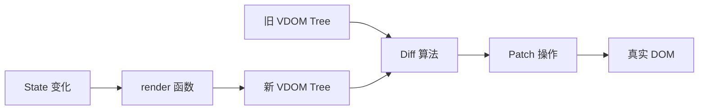

# 虚拟 DOM 与 Diff

## 学习目标

- 理解虚拟 DOM 的设计动机与数据结构
- 掌握 Diff 算法的核心策略与 time complexity
- 理解 key 的作用及错误使用方式
- 了解 Vue 与 React Diff 实现的差异

## 为什么需要

直接操作 DOM 代价高（触发 reflow/repaint）。虚拟 DOM 提供：

1. **声明式编程**：描述 UI = f(state)，框架负责 DOM 更新
2. **跨平台**：VDOM 可渲染到 DOM、Native、Canvas
3. **批量更新**：收集变更，一次性最小化 DOM 操作
4. **DevTools**：便于调试和时间旅行

## 核心原理

### 1. 虚拟 DOM 结构

VDOM 是描述 DOM 的 JavaScript 对象：

```javascript
// React Element（简化）
const vnode = {
  type: 'div',
  props: {
    className: 'container',
    children: [
      { type: 'h1', props: { children: 'Hello' } },
      { type: 'p', props: { children: 'World' } }
    ]
  }
};

// 等价 HTML
// <div class="container">
//   <h1>Hello</h1>
//   <p>World</p>
// </div>
```



### 2. Diff 算法策略

朴素 Diff 两棵树是 O(n³)，框架采用启发式策略降到 **O(n)**：

**三个假设：**

1. 不同类型的元素 → 直接替换整棵子树
2. 同一层级比较，不跨层级（认为跨层级移动极少）
3. 同一层级的列表项，用 key 标识身份

```javascript
// 简化 Diff 逻辑
function diff(oldVNode, newVNode) {
  // 1. 类型不同 → 替换
  if (oldVNode.type !== newVNode.type) {
    return { type: 'REPLACE', newVNode };
  }

  // 2. 文本节点
  if (typeof newVNode === 'string') {
    if (oldVNode !== newVNode) {
      return { type: 'TEXT', content: newVNode };
    }
    return null;
  }

  // 3. 同类型 → 比较 props 和 children
  const propPatches = diffProps(oldVNode.props, newVNode.props);
  const childPatches = diffChildren(
    oldVNode.props.children,
    newVNode.props.children
  );

  return { type: 'UPDATE', propPatches, childPatches };
}
```

### 3. 列表 Diff 与 key

**无 key — 就地复用（可能出错）：**

```
旧: A B C
新: C B A

无 key: 尝试 patch A→C, B→B, C→A（三次更新，可能状态错乱）
```

**有 key — 识别移动：**

```
旧: A(key=1) B(key=2) C(key=3)
新: C(key=3) B(key=2) A(key=1)

有 key: 识别 C、B、A 只是移动，最小化 DOM 操作
```

```jsx
// 错误：用 index 作 key
{items.map((item, index) => (
  <Item key={index} data={item} />  // 插入/删除时 key 错位
))}

// 正确：稳定唯一 id
{items.map(item => (
  <Item key={item.id} data={item} />
))}
```

### 4. Vue vs React Diff

| 特性 | Vue 3 | React (Fiber) |
|------|-------|---------------|
| 列表 Diff | 双端比较 + 最长递增子序列 | 单端 + key map |
| 组件更新 | 响应式精确到属性 | 组件级，需 memo |
| 编译优化 | 静态提升、PatchFlag | React Compiler（实验） |

**Vue 3 双端 Diff 示意：**

```
旧: A B C D
新: D A B C

头尾指针向中间移动，识别 D 移动到末尾
```

### 5. 手写简易 VDOM

```javascript
function h(type, props, ...children) {
  return { type, props: { ...props, children: children.flat() } };
}

function mount(vnode, container) {
  if (typeof vnode === 'string') {
    container.textContent = vnode;
    return;
  }
  const el = document.createElement(vnode.type);
  Object.entries(vnode.props || {}).forEach(([k, v]) => {
    if (k !== 'children') el.setAttribute(k, v);
  });
  vnode.props.children?.forEach(child => mount(child, el));
  container.appendChild(el);
}
```

## 常见误区与最佳实践

| 误区 | 正确理解 |
|------|---------|
| "VDOM 一定比直接操作 DOM 快" | 简单场景直接操作可能更快，VDOM 价值在复杂 UI 和跨平台 |
| "key 用 index 没问题" | 列表增删改时 index 变，导致错误复用 |
| "key 用 random 保证唯一" | 每次 render 新 key 导致全量重建 |
| "Diff 会比较所有层级" | 同层比较，类型不同直接替换 |

**最佳实践：**

- 列表项使用稳定、唯一的 key（id）
- 避免在 render 中创建内联对象导致子组件 always update
- React 使用 `React.memo` + 稳定 props 减少 Diff 范围

## 小结

- VDOM 是 DOM 的 JS 描述，支持声明式 UI 和跨平台
- Diff 采用 O(n) 启发式：类型不同替换、同层比较、key 标识列表项
- key 必须稳定唯一，禁用 index 作动态列表 key
- 理解 Diff 有助于优化列表渲染和组件设计

## 延伸阅读

- [React Diff 算法](https://react.dev/learn/preserving-and-resetting-state)
- [Vue 3 编译优化](https://vuejs.org/guide/extras/rendering-mechanism.html)
- [InfernoJS: Why is Virtual DOM Fast](https://infernojs.org/docs/benchmarks/)
