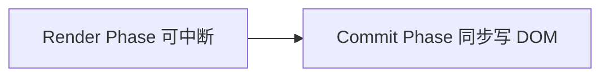

# React Fiber 架构

## 学习目标

- 读懂 Fiber 解决「长任务阻塞输入」的问题
- 会用 React Profiler 定位慢渲染，并应用 useTransition/memo
- 理解 useEffect vs useLayoutEffect 的选用

## 为什么需要

大列表过滤输入卡顿、Tab 切换掉帧——需要知道 React **何时渲染、能否中断、如何降优先级**。

> 核心心法：**Render 可中断，Commit 不可中断。** 优化要么减少 Render 工作量，要么降低更新优先级。

---

## 一、心智模型

| 用户抱怨 | 对应机制 | 工具/ API |
|---------|---------|-----------|
| 输入卡 | 长 Render 占主线程 | Profiler + useTransition |
| 闪一下 | 双重渲染 Strict Mode | 正常，生产无 |
| 测量 DOM 不准 | useEffect 太晚 | useLayoutEffect |
| 列表慢 | 全树 reconcile | memo + 虚拟列表 |

---

## 二、两阶段（排查用）



- **Render：** 执行组件函数、Diff — Profiler 里 **render** 时间
- **Commit：** 改 DOM、useLayoutEffect、paint、useEffect

---

## 三、Profiler 实操（必会）

1. React DevTools → **Profiler** → 蓝色圆录制
2. 执行卡顿操作（输入搜索、切 Tab）
3. 看 **Commit** 火焰图：哪个组件最宽最红
4. 点击组件 → **Why did this render?**

**常见结论：**

- Parent re-rendered → memo 子组件或状态下放
- Props changed (object/function) → useMemo/useCallback 稳定引用
- Hooks changed → 检查 deps

---

## 四、Concurrent API 落地

```jsx
function Search() {
  const [q, setQ] = useState('');
  const [isPending, startTransition] = useTransition();

  return (
    <>
      <input value={q} onChange={e => {
        setQ(e.target.value);
        startTransition(() => setFiltered(filter(all, e.target.value)));
      }} />
      {isPending && <Spinner />}
      <List items={filtered} />
    </>
  );
}
```

**验证：** Profiler 中 input 的 commit 仍快，List 更新标记为 transition 低优先级。

---

## 五、Effect 选用

| API | 时机 | 用途 |
|-----|------|------|
| useLayoutEffect | paint 前同步 | 测量 DOM、同步改 layout 避免闪 |
| useEffect | paint 后异步 | 请求、订阅、非阻塞逻辑 |

---

## 六、Hooks 顺序（Fiber 链表）

条件/循环中调用 Hooks → 链表错位 → 运行时崩溃或 state 错乱。**ESLint `rules-of-hooks` 必开。**

---

## 排查实战

### 案例 A：搜索 500ms 卡顿

- **Profiler：** FilterList 80ms render × 每键
- **修复：** useTransition + memo(ListItem)
- **验证：** INP <200ms

### 案例 B：Modal 打开闪动

- **原因：** useEffect 里改 position，paint 后才改
- **修复：** useLayoutEffect 同步定位
- **验证：** 无视觉跳动

### 案例 C：Strict Mode 双请求

- **原因：** 开发环境 effect 执行两次
- **处理：** cleanup abort；生产只一次

---

## 小结

- Fiber = 可中断 Render + 同步 Commit
- Profiler 是日常优化主工具
- useTransition 治输入卡；memo 治无效 render
- useLayoutEffect 治布局闪动

## 延伸阅读

- [React Profiler](https://react.dev/learn/react-developer-tools)
- [useTransition](https://react.dev/reference/react/useTransition)
