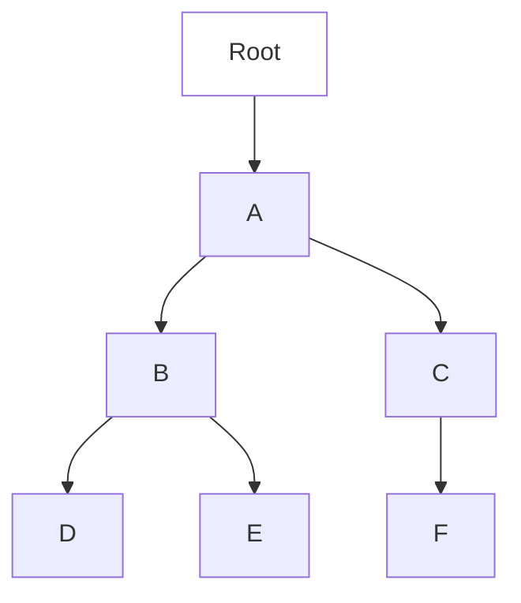
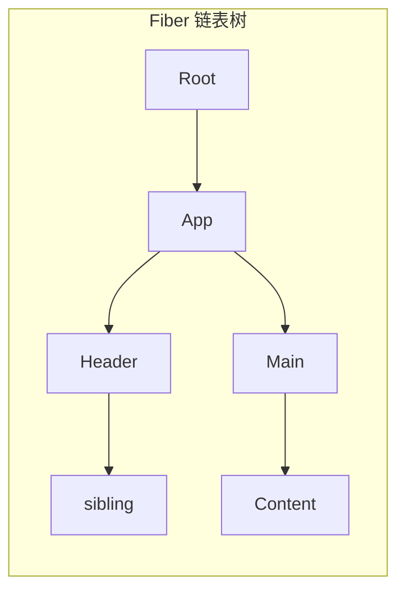
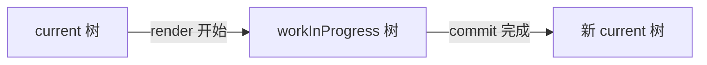
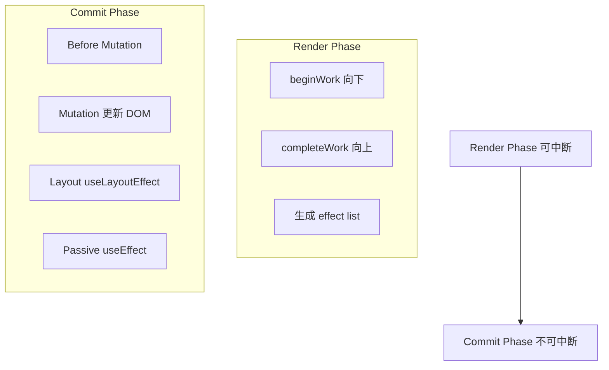
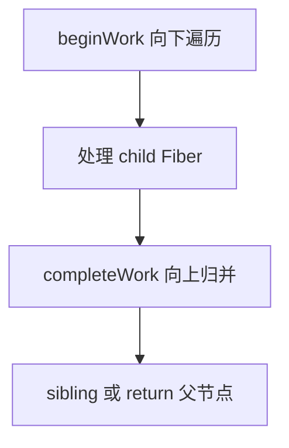

# React Fiber 架构

## 学习目标

- 理解 React 15 栈 reconciler 的问题
- 掌握 Fiber 的数据结构与双缓冲机制
- 理解时间切片（Time Slicing）与可中断渲染
- 了解优先级调度与 Concurrent Mode
- 理解 React 18 的 Concurrent Features

## 为什么需要

React 15 的 reconciler 是**同步递归**的：从根节点开始，递归整个组件树，一次性完成 Diff 和 DOM 更新。对于大型应用：

- 递归过程无法中断，长时间占用主线程
- 用户输入、动画卡顿（掉帧）
- 无法实现"可中断、可恢复"的渲染

Fiber 架构将 reconciler 重写为**增量、可中断**的工作单元，是 React 16+ 及 Concurrent 特性的基础。

## 核心原理

### 1. 问题：同步递归的局限



React 15：从 Root 递归到 F，一气呵成，期间主线程被占用。

### 2. Fiber 是什么

Fiber 是**工作单元**，每个组件对应一个 Fiber 节点，形成链表树：

```javascript
// Fiber 节点结构（简化）
{
  type: 'div',           // 组件类型
  key: null,
  stateNode: domNode,    // 对应 DOM 或 class 实例
  return: parentFiber,   // 父 Fiber
  child: firstChildFiber,
  sibling: nextSiblingFiber,
  alternate: workInProgress, // 双缓冲
  effectTag: 'UPDATE',   // Placement | Update | Deletion
  expirationTime: ...    // 优先级/过期时间
}
```



### 3. 双缓冲（Double Buffering）

维护两棵 Fiber 树：

| 树 | 说明 |
|----|------|
| current | 当前屏幕显示的 Fiber 树 |
| workInProgress | 正在构建的新树 |

渲染完成后，workInProgress 变为 current，交替使用。



### 4. 两个阶段



**Render Phase（协调）：**

- 可中断、可丢弃、可重启
- 遍历 Fiber 树，执行组件 render，Diff，标记副作用
- 时间切片：每帧执行一小段，让出主线程给浏览器

**Commit Phase（提交）：**

- 不可中断，必须同步完成
- 将 DOM 变更应用到页面
- 执行生命周期、useEffect

### 5. 时间切片与 Scheduler

```javascript
// 简化：requestIdleCallback 思想（React 用 MessageChannel 实现）
function workLoop(deadline) {
  while (nextUnitOfWork && deadline.timeRemaining() > 1) {
    nextUnitOfWork = performUnitOfWork(nextUnitOfWork);
  }
  if (nextUnitOfWork) {
    requestIdleCallback(workLoop);
  } else {
    commitRoot();
  }
}
```

**Lane 优先级（React 18）：**

| 优先级 | 场景 |
|--------|------|
| SyncLane | 离散用户输入（click） |
| DefaultLane | 普通更新 |
| TransitionLane | useTransition 包裹的更新 |
| IdleLane | 低优先级后台任务 |

```jsx
// useTransition — 低优先级更新，不阻塞输入
function SearchResults() {
  const [query, setQuery] = useState('');
  const [isPending, startTransition] = useTransition();

  const handleChange = (e) => {
    setQuery(e.target.value); // 高优先级
    startTransition(() => {
      setResults(filterHugeList(e.target.value)); // 低优先级
    });
  };
}

// useDeferredValue — 延迟更新值
const deferredQuery = useDeferredValue(query);
```

### 6. Concurrent Features

React 18 默认启用 Concurrent Mode 特性：

- **Automatic Batching**：setTimeout、Promise 中的 setState 也会批处理
- **Suspense**：异步组件加载占位
- **Transitions**：区分紧急与非紧急更新

```jsx
// Suspense 数据获取
<Suspense fallback={<Spinner />}>
  <ProfileDetails userId={id} />
</Suspense>
```

### 7. Hooks 与 memoizedState 链表

```javascript
// Fiber 节点上
{
  memoizedState: hook1 -> hook2 -> hook3, // 单向链表
  // hook: { memoizedState, next, queue }
}
// useState/useEffect/useMemo 各占一个 hook 节点，顺序固定
```

### 8. beginWork 与 completeWork



- **beginWork：** 根据 update 标记，执行组件 render，Diff children
- **completeWork：** 创建/更新 DOM，收集 effect list（Placement/Update/Deletion flags）

### 9. Suspense 原理

Suspense 捕获子组件 throw 的 Promise，暂停该子树 commit，展示 fallback；Promise resolve 后重新调度 render 并 commit。与 Concurrent 特性配合实现流式加载。

### 10. React 19 新特性概览

| 特性 | 说明 |
|------|------|
| `use()` | 在 render 中读取 Promise/Context |
| Actions | 表单异步提交、`useActionState`、`useFormStatus` |
| RSC | Server Components 默认服务端，减少客户端 bundle |
| React Compiler | 编译时自动 memo，减少手动优化 |
| Document Metadata | 内置 `<title>`、`<meta>` 支持 |

```jsx
// use() 读取 Promise
function Comments({ commentsPromise }) {
  const comments = use(commentsPromise);
  return comments.map(c => <p key={c.id}>{c.text}</p>);
}
```

## 常见误区与最佳实践

| 误区 | 正确理解 |
|------|---------|
| "Fiber 让 React 变快了" | Fiber 解决的是可中断性，复杂更新可能更慢但体验更好 |
| "useEffect 在 paint 后执行" | 正确，useLayoutEffect 在 paint 前同步执行 |
| "Concurrent 是 opt-in" | React 18 默认启用，部分 API 需显式使用 |
| "所有更新都可中断" | 仅 Render Phase 可中断，Commit 必须同步 |

**最佳实践：**

- 大列表过滤用 `useTransition` 避免输入卡顿
- 测量 DOM 用 `useLayoutEffect`，数据请求用 `useEffect`
- 理解批更新：React 18 自动批处理减少 render 次数

## 小结

- Fiber 将 reconciler 改为链表 + 工作单元，支持可中断渲染
- 双缓冲：current 与 workInProgress 交替
- Render Phase 可中断，Commit Phase 同步提交 DOM
- Scheduler 按优先级调度，时间切片避免长任务阻塞
- React 18 Concurrent 特性基于此实现更流畅的 UX

## 延伸阅读

- [React Fiber Architecture](https://github.com/acdlite/react-fiber-architecture)
- [React 18: Concurrent Rendering](https://react.dev/blog/2022/03/29/react-v18)
- [Lin Clark: A Cartoon Intro to Fiber](https://www.youtube.com/watch?v=ZCAwm00nSFs)
