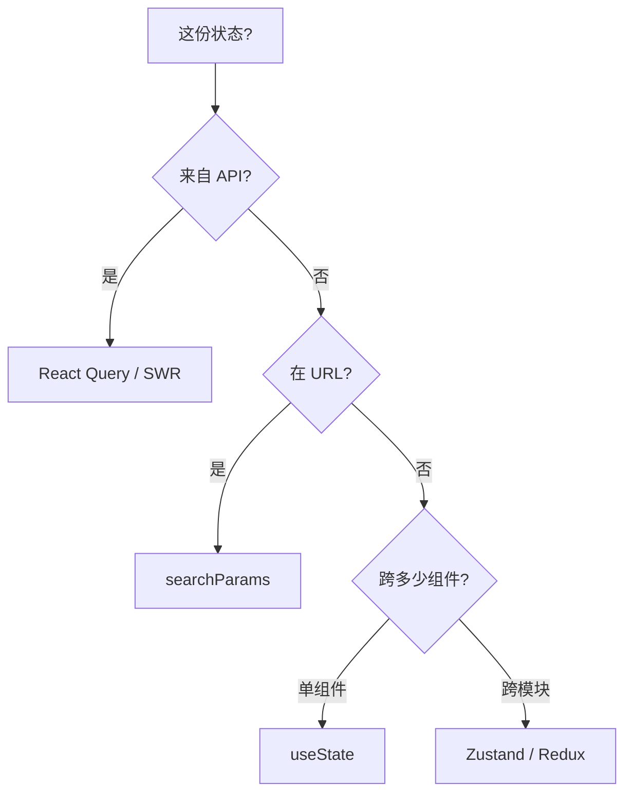
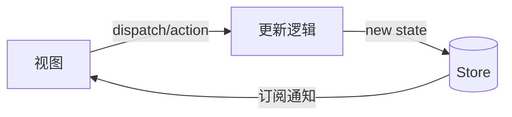
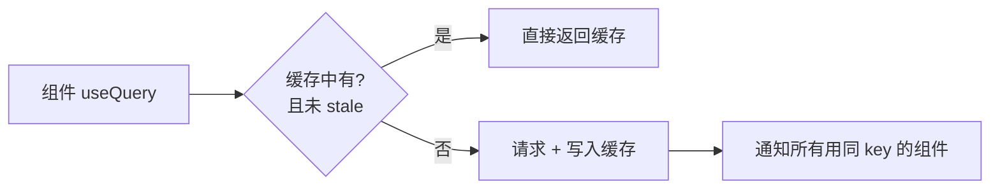

# 状态管理设计

## 学习目标

- 能判断状态该放哪一层（URL/服务端/全局/本地）
- 能在项目中落地 React Query + Zustand 分层
- 能重构「万物 Redux」或「Context 地狱」的遗留代码

## 为什么需要

状态放错地方 = 过度渲染 + 难以维护 + 竞态 bug。

> 核心心法：**先问「谁需要、更新频率、是否服务端数据」再选型。**

---

## 一、状态分层决策树



| 数据 | 方案 | 反例 |
|------|------|------|
| 用户列表 API | React Query | 放 Redux 手写 loading |
| 筛选页码 | URL | 放全局 store |
| Modal 开关 | useState | 放 Redux |
| 主题/登录用户 | Zustand | 放 Context 高频更新 |

---

## 二、底层原理：三类方案怎么工作

### 单向数据流（所有方案的共同范式）



状态只能通过明确的「动作」修改，再单向流回视图——可预测、可追踪、可调试（时间旅行）。

### Redux 原理：纯函数 reducer + 中间件洋葱

```javascript
// store = 单一状态树；reducer 是纯函数 (state, action) => newState
function reducer(state, action) {
  switch (action.type) {
    case 'inc': return { ...state, count: state.count + 1 }; // 不可变
    default: return state;
  }
}
// dispatch 经过中间件链（洋葱模型）再到 reducer
// dispatch → logger → thunk → reducer → 通知订阅者
```

- 三大原则：单一数据源、state 只读、用纯函数修改。
- 中间件拦截 dispatch，处理异步/日志/持久化。
- 代价：样板多；RTK（Redux Toolkit）大幅简化。

### Zustand 原理：发布订阅 + selector 精确更新

```javascript
// 本质：一个保存 state 的闭包 + 订阅者集合
function create(createState) {
  let state;
  const listeners = new Set();
  const setState = (partial) => {
    state = { ...state, ...(typeof partial === 'function' ? partial(state) : partial) };
    listeners.forEach(l => l());            // 通知订阅者
  };
  const getState = () => state;
  const subscribe = (l) => (listeners.add(l), () => listeners.delete(l));
  state = createState(setState, getState);
  // 组件用 selector 订阅，只有选中的切片变化才 re-render
  return (selector) => useSyncExternalStore(subscribe, () => selector(getState()));
}
```

- 无 Provider，靠 `useSyncExternalStore` 订阅外部 store。
- `selector` 让组件只订阅需要的切片 → 精确更新，避免全量 render。

### React Query 原理：服务端状态缓存层

不是「全局状态库」，而是**异步数据的缓存与同步引擎**：



- **queryKey** 是缓存主键；相同 key 的请求自动**去重**（dedupe）。
- **staleTime：** 数据「新鲜」期内不重新请求；过期后后台静默重新验证（stale-while-revalidate）。
- **gcTime：** 无组件使用后缓存保留时长，再回收。
- 自动处理：缓存、重试、窗口聚焦重取、竞态（旧请求被丢弃）。

> 关键认知：把「服务端数据」交给 React Query，你的「全局 store」就只剩少量真正的客户端 UI 状态——这是现代状态管理简化的核心。

---

## 三、React Query 落地（服务端状态）

```typescript
function UserList() {
  const { data, isLoading, error, refetch } = useQuery({
    queryKey: ['users', { page }],
    queryFn: () => fetchUsers(page),
    staleTime: 60_000,
  });
  if (isLoading) return <Skeleton />;
  if (error) return <Error onRetry={refetch} />;
  return <List data={data} />;
}
```

**验证：** Network 见 stale 内不重复请求；切页 cache 命中。

---

## 四、Zustand 落地（客户端 UI 状态）

```typescript
const useUIStore = create(set => ({
  sidebarOpen: true,
  toggle: () => set(s => ({ sidebarOpen: !s.sidebarOpen })),
}));

// 按需订阅，避免全 store 更新
const open = useUIStore(s => s.sidebarOpen);
```

---

## 五、Redux 何时还需要

- 多团队统一中间件（audit、undo）
- 复杂 action 链、时间旅行调试
- 已有 RTK 投资，迁移成本高

**中间件洋葱：** dispatch → middleware → reducer，异步用 RTK Query 或 createAsyncThunk。

---

## 六、重构实战：Context 地狱 → 分层

### Before

```tsx
<AuthProvider><ThemeProvider><CartProvider> {/* 任一更新全树 render */}
  <App />
</CartProvider></ThemeProvider></AuthProvider>
```

### After

- 用户/session → React Query
- theme → Zustand + CSS variables
- cart → Zustand 或 URL + Query

### 验证

Profiler：改 theme 不再导致 Cart 子树 render。

---

## 排查实战

### 案例 A：重复请求

- **原因：** 多组件各自 useEffect fetch
- **修复：** 统一 queryKey 的 useQuery
- **验证：** Network 单次请求

### 案例 B：刷新丢筛选

- **原因：** 筛选在 useState
- **修复：** 同步到 URL `?q=&page=`
- **验证：** 分享链接状态一致

---

## 手写 mini Redux + applyMiddleware

```javascript
function createStore(reducer, preloaded, enhancer) {
  if (enhancer) return enhancer(createStore)(reducer, preloaded);
  let state = preloaded, listeners = [];
  return {
    getState: () => state,
    dispatch: action => { state = reducer(state, action); listeners.forEach(l => l()); return action; },
    subscribe: fn => { listeners.push(fn); return () => listeners = listeners.filter(l => l !== fn); },
  };
}

function applyMiddleware(...middlewares) {
  return createStore => (reducer, preloaded) => {
    const store = createStore(reducer, preloaded);
    let dispatch = () => { throw new Error('dispatching while constructing'); };
    const api = { getState: store.getState, dispatch: (...a) => dispatch(...a) };
    const chain = middlewares.map(m => m(api));
    dispatch = chain.reduceRight((next, mw) => mw(next), store.dispatch);
    return { ...store, dispatch };
  };
}
```

### 手写 mini Zustand

```javascript
function create(fn) {
  let state, listeners = new Set();
  const set = partial => { state = { ...state, ...partial(state) }; listeners.forEach(l => l()); };
  state = fn(set, () => state);
  return selector => { const use = () => { /* useSyncExternalStore */ }; return use; };
}
```

## 面试高频问答（追问链）

> 大厂对一个考点通常追问到能力边界：**概念 → 机制 → 边界 → ⭐ 原理（触底）→ 实战（落地）**。实战层是区分「背过」和「做过」的关键。

### 链一：状态管理选型

1. **概念**：Redux 三大原则？→ 单一数据源、state 只读、纯函数 reducer。
2. **机制**：何时用 Zustand 而非 Redux？→ 中小项目、少样板、不依赖中间件生态。
3. **边界**：Context 何时不够用？→ 高频更新、大对象、多组件订阅导致全量重渲染。
4. **应用**：状态怎么分层？→ 服务端态用 Query、URL 放可分享态、全局用 Zustand、局部 useState。
5. ⭐ **原理（触底）**：Redux 中间件洋葱模型怎么实现？为什么 Zustand 不会像 Context 那样全量重渲染？→ applyMiddleware 用 compose 把 dispatch 层层包裹；Zustand 基于发布订阅 + selector 浅比较，组件只在所选片段变化时更新（见本章 mini 实现）。
6. **实战（落地）**：全局状态迁移 Redux→Zustand 怎么落地？→ 按模块渐进替换、Query 接管服务端态；保留 devtools 中间件；迁移后 bundle 减、样板代码减，Profiler 验证订阅粒度。

### 链二：服务端状态

1. **概念**：React Query 解决什么？→ 服务端状态缓存、去重、后台刷新、乐观更新。
2. **机制**：staleTime 和 cacheTime 区别？→ stale 决定何时重新请求、cache 决定何时回收。
3. **应用**：乐观更新失败怎么回滚？→ onMutate 存快照、onError 还原、onSettled 重新校验。
4. ⭐ **原理（触底）**：为什么要区分「服务端状态」和「客户端状态」？→ 服务端态是远端副本，需缓存/失效/同步，强行塞进 Redux 会写大量手动缓存逻辑且易脏。
5. **实战（落地）**：列表页数据缓存怎么配？→ React Query 设 staleTime/gcTime、key 含筛选参数；乐观更新配 onMutate 快照；Network 看重试与去重，错误率与重复请求数下降。

## 小结

- 共同范式：单向数据流（action → reducer/set → store → 视图）
- Redux=纯函数 reducer+中间件洋葱；Zustand=发布订阅+selector；React Query=服务端缓存层
- 服务端 Query，URL 放可分享状态，全局 Zustand，本地 useState
- 禁止 Context 传高频变化大对象
- 重构按分层决策树逐步迁移

## 延伸阅读

- [TanStack Query](https://tanstack.com/query)
- [Zustand](https://docs.pmnd.rs/zustand)
- [Redux Style Guide](https://redux.js.org/style-guide/)
