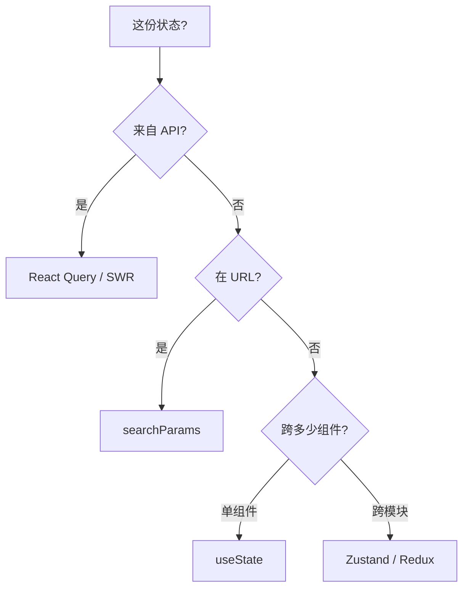

# 状态管理设计

## 学习目标

- 能判断状态该放哪一层（URL/服务端/全局/本地）
- 能在项目中落地 React Query + Zustand 分层
- 能重构「万物 Redux」或「Context 地狱」的遗留代码

## 为什么需要

状态放错地方 = 过度渲染 + 难以维护 + 竞态 bug。

> 核心心法：**先问「谁需要、更新频率、是否服务端数据」再选型。**

---

## 一、状态分层决策树



| 数据 | 方案 | 反例 |
|------|------|------|
| 用户列表 API | React Query | 放 Redux 手写 loading |
| 筛选页码 | URL | 放全局 store |
| Modal 开关 | useState | 放 Redux |
| 主题/登录用户 | Zustand | 放 Context 高频更新 |

---

## 二、React Query 落地（服务端状态）

```typescript
function UserList() {
  const { data, isLoading, error, refetch } = useQuery({
    queryKey: ['users', { page }],
    queryFn: () => fetchUsers(page),
    staleTime: 60_000,
  });
  if (isLoading) return <Skeleton />;
  if (error) return <Error onRetry={refetch} />;
  return <List data={data} />;
}
```

**验证：** Network 见 stale 内不重复请求；切页 cache 命中。

---

## 三、Zustand 落地（客户端 UI 状态）

```typescript
const useUIStore = create(set => ({
  sidebarOpen: true,
  toggle: () => set(s => ({ sidebarOpen: !s.sidebarOpen })),
}));

// 按需订阅，避免全 store 更新
const open = useUIStore(s => s.sidebarOpen);
```

---

## 四、Redux 何时还需要

- 多团队统一中间件（audit、undo）
- 复杂 action 链、时间旅行调试
- 已有 RTK 投资，迁移成本高

**中间件洋葱：** dispatch → middleware → reducer，异步用 RTK Query 或 createAsyncThunk。

---

## 五、重构实战：Context 地狱 → 分层

### Before

```tsx
<AuthProvider><ThemeProvider><CartProvider> {/* 任一更新全树 render */}
  <App />
</CartProvider></ThemeProvider></AuthProvider>
```

### After

- 用户/session → React Query
- theme → Zustand + CSS variables
- cart → Zustand 或 URL + Query

### 验证

Profiler：改 theme 不再导致 Cart 子树 render。

---

## 排查实战

### 案例 A：重复请求

- **原因：** 多组件各自 useEffect fetch
- **修复：** 统一 queryKey 的 useQuery
- **验证：** Network 单次请求

### 案例 B：刷新丢筛选

- **原因：** 筛选在 useState
- **修复：** 同步到 URL `?q=&page=`
- **验证：** 分享链接状态一致

---

## 小结

- 服务端 Query，URL 放可分享状态，全局 Zustand，本地 useState
- 禁止 Context 传高频变化大对象
- 重构按分层决策树逐步迁移

## 延伸阅读

- [TanStack Query](https://tanstack.com/query)
- [Zustand](https://docs.pmnd.rs/zustand)
- [Redux Style Guide](https://redux.js.org/style-guide/)
