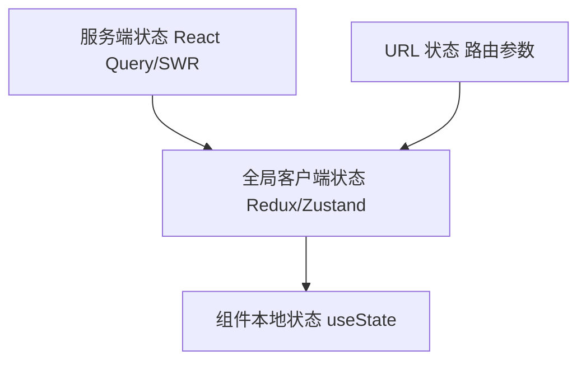
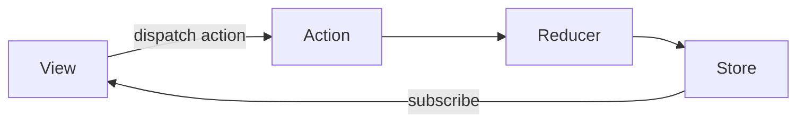

# 状态管理设计

## 学习目标

- 理解何时需要全局状态管理
- 掌握 Redux 单向数据流与三大原则
- 了解 Zustand、Pinia 等轻量方案的设计
- 能根据项目规模做出状态管理选型

## 为什么需要

组件本地 state（useState）适合组件私有数据。当多个组件共享状态、跨层级传递 props 过深时，需要**全局状态管理**：

- 用户信息、主题、权限
- 跨页面共享的业务数据
- 需要持久化、时间旅行调试的状态

**过度使用**全局状态会增加复杂度，架构师需判断"何时该用、何时过度设计"。

## 核心原理

### 1. 状态分层



**选型指南：**

| 状态类型 | 推荐方案 | 示例 |
|---------|---------|------|
| 服务端数据 | React Query / SWR / TanStack Query | 列表、详情 API |
| URL 状态 | React Router searchParams | 筛选、分页 |
| 全局 UI | Zustand / Context | 主题、侧边栏 |
| 复杂业务 | Redux Toolkit | 多模块联动、中间件 |
| 组件私有 | useState / useReducer | 表单、开关 |

### 2. Redux 单向数据流



**三大原则：**

1. **单一数据源**：整个应用 state 存于一个 store
2. **State 只读**：唯一改变 state 方式是 dispatch action
3. **纯函数 reducer**：`(state, action) => newState`，无副作用

```javascript
// Redux Toolkit 现代写法
import { createSlice, configureStore } from '@reduxjs/toolkit';

const counterSlice = createSlice({
  name: 'counter',
  initialState: { value: 0 },
  reducers: {
    increment: (state) => { state.value += 1; }, // Immer 允许"突变"
    decrement: (state) => { state.value -= 1; },
    incrementByAmount: (state, action) => {
      state.value += action.payload;
    }
  }
});

const store = configureStore({
  reducer: { counter: counterSlice.reducer }
});

// 组件中
dispatch(counterSlice.actions.increment());
const count = useSelector(state => state.counter.value);
```

**中间件 — 处理异步：**

```javascript
// Redux Thunk
const fetchUser = (id) => async (dispatch, getState) => {
  dispatch({ type: 'user/loading' });
  try {
    const user = await api.getUser(id);
    dispatch({ type: 'user/success', payload: user });
  } catch (err) {
    dispatch({ type: 'user/error', payload: err.message });
  }
};

// 或 RTK Query — 内置数据获取
```

### 3. Zustand — 轻量方案

```javascript
import { create } from 'zustand';

const useStore = create((set, get) => ({
  bears: 0,
  increase: () => set(state => ({ bears: state.bears + 1 })),
  fetchBears: async () => {
    const res = await fetch('/api/bears');
    set({ bears: await res.json() });
  }
}));

// 组件 — 按需订阅，自动优化
function BearCounter() {
  const bears = useStore(state => state.bears);
  return <div>{bears}</div>;
}
```

**对比 Redux：**

| 维度 | Redux | Zustand |
|------|-------|---------|
| 样板代码 | 多（action/type/reducer） | 少 |
| DevTools | 成熟 | 支持 |
| 中间件 | 丰富 | 简单 |
| 学习曲线 | 陡 | 平缓 |
| 适用 | 大型、多团队协作 | 中小型、快速迭代 |

### 4. Pinia（Vue 生态）

```javascript
import { defineStore } from 'pinia';

export const useUserStore = defineStore('user', {
  state: () => ({ user: null, token: '' }),
  getters: {
    isLoggedIn: (state) => !!state.token
  },
  actions: {
    async login(credentials) {
      const { user, token } = await api.login(credentials);
      this.user = user;
      this.token = token;
    }
  }
});
```

### 5. 何时不需要全局状态

```javascript
// 反模式：把所有 state 放 Redux
// 表单输入、Modal 开关、hover 状态 → 组件本地即可

// 反模式：用 Context 传递频繁变化的数据
// Context 变化会导致所有 consumer 重渲染
// 应用 Zustand 或拆分 Context
```

### 6. Redux 中间件洋葱模型

```javascript
// applyMiddleware 原理简化
function applyMiddleware(...middlewares) {
  return createStore => (reducer, preloadedState) => {
    const store = createStore(reducer, preloadedState);
    let dispatch = store.dispatch;
    const middlewareAPI = {
      getState: store.getState,
      dispatch: action => dispatch(action)
    };
    dispatch = middlewares
      .map(m => m(middlewareAPI))
      .reduce((a, b) => (...args) => a(b(...args)))(store.dispatch);
    return { ...store, dispatch };
  };
}
// 请求流：action -> middleware3 -> middleware2 -> middleware1 -> dispatch
```

### 7. Immer 原理

Redux Toolkit 内置 Immer：在 draft 代理对象上「直接修改」，Immer 基于 Proxy 记录变更并生成 immutable 新 state。

### 8. 状态范式化（Normalization）

```javascript
// 反模式 — 嵌套冗余
{ posts: [{ id: 1, author: { id: 1, name: 'A' } }] }

// 范式化 — entities + ids
{
  posts: { byId: { 1: { id: 1, authorId: 1 } }, allIds: [1] },
  users: { byId: { 1: { id: 1, name: 'A' } }, allIds: [1] }
}
```

### 9. React Query / SWR 缓存机制

**stale-while-revalidate：** 先返回缓存（可能 stale），后台 refetch，更新后触发 re-render。

```javascript
const { data } = useQuery({
  queryKey: ['user', id],
  queryFn: () => fetchUser(id),
  staleTime: 60_000,  // 60s 内视为 fresh
  gcTime: 300_000     // 缓存保留时间
});
```

### 10. 持久化与 Context 优化

```javascript
// zustand persist
import { persist } from 'zustand/middleware';
const useStore = create(persist(state => ({ ... }), { name: 'app-storage' }));

// Context 优化 — 拆分 Provider，避免单一 value 对象每次 new
const ThemeContext = createContext();
const UserContext = createContext();
```

## 常见误区与最佳实践

| 误区 | 正确理解 |
|------|---------|
| "大项目必须用 Redux" | 服务端状态用 React Query，客户端用 Zustand 可能足够 |
| "Redux 不能写异步" | 用 Thunk、Saga、RTK Query |
| "全局状态越多越好" | 能局部则局部，能 URL 则 URL |
| "Context 可以替代 Redux" | Context 适合低频更新，高频需选型 |

**架构建议：**

- 服务端状态与客户端状态分离
- 建立状态分层规范，避免"状态放哪"的随意性
- 大型项目 Redux + RTK Query，中小型 Zustand + React Query

## 小结

- 状态分层：服务端 / URL / 全局 / 本地
- Redux：单向数据流，适合复杂业务与 DevTools
- Zustand/Pinia：轻量，适合多数场景
- 避免过度设计，先问"这个状态谁需要、更新频率如何"

## 延伸阅读

- [Redux Style Guide](https://redux.js.org/style-guide/)
- [Zustand 文档](https://docs.pmnd.rs/zustand)
- [TanStack Query](https://tanstack.com/query)
- [Pinia 文档](https://pinia.vuejs.org/)
