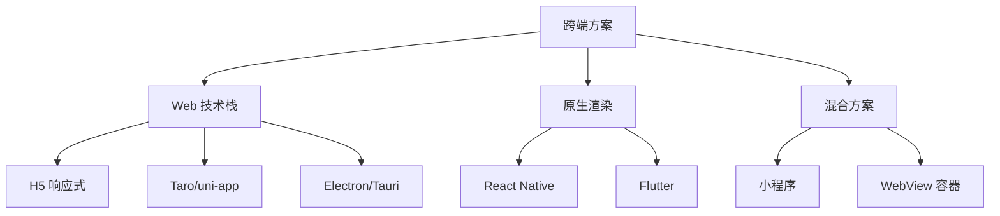
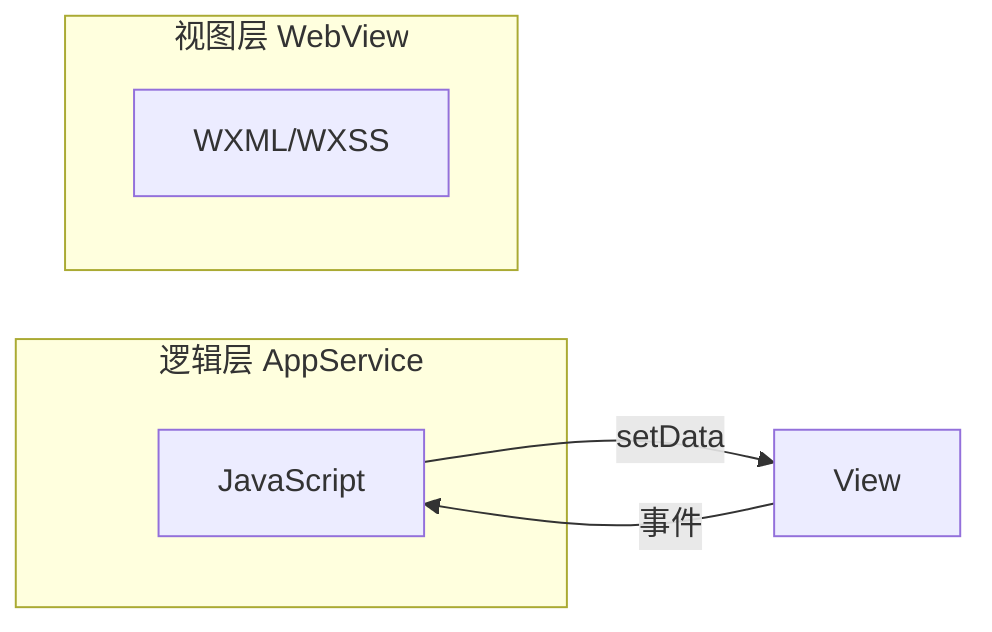
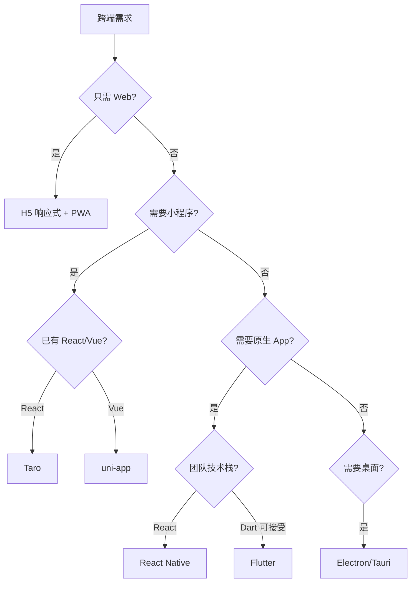
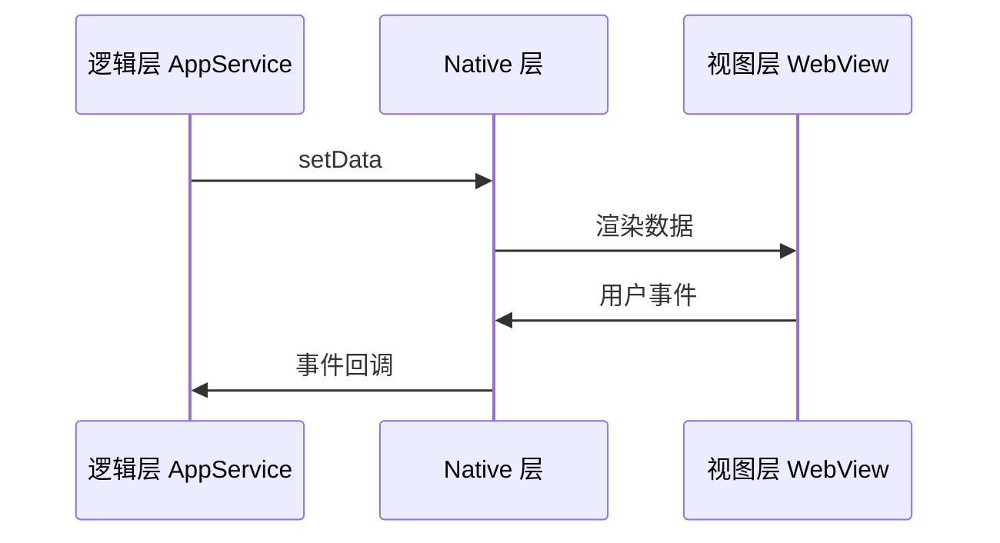

# 跨端方案选型

## 学习目标

- 了解主流跨端方案的技术原理
- 掌握各方案的优劣与适用场景
- 能从业务需求出发做跨端技术选型
- 理解"一套代码多端运行"的代价与边界

## 为什么需要

现代产品常需覆盖：

- Web（PC + 移动 H5）
- 小程序（微信/支付宝/抖音）
- 原生 App（iOS/Android）
- 桌面应用（Electron）

架构师需评估：自研 Web 能否满足、是否需要跨端、选哪条技术路线，平衡开发效率、性能、维护成本。

## 核心原理

### 1. 跨端方案分类



### 2. 各方案原理对比

| 方案 | 渲染方式 | 技术栈 | 性能 | 生态 |
|------|---------|--------|------|------|
| **H5 响应式** | 浏览器 | HTML/CSS/JS | 中 | 最好 |
| **Taro/uni-app** | 编译到各端 | React/Vue | 中 | 好 |
| **React Native** | Native 组件 | React | 较好 | 好 |
| **Flutter** | Skia 自绘 | Dart | 好 | 中 |
| **Electron** | Chromium | Web | 中 | 好 |
| **小程序** | 双线程 WebView | 类 Web | 中 | 平台绑定 |

### 3. 小程序架构



**特点：**

- 逻辑与视图分离，setData 跨线程通信有性能开销
- 包体积限制（主包 2MB 等）
- 各平台 API 有差异，Taro/uni-app 做抽象

```javascript
// 微信小程序
Page({
  data: { list: [] },
  onLoad() {
    wx.request({
      url: 'https://api.example.com/list',
      success: (res) => this.setData({ list: res.data })
    });
  }
});
```

### 4. React Native


- JS 写 React 组件，通过 Bridge 调用 Native 组件
- 新架构 Fabric + TurboModules 减少 Bridge 开销
- 适合已有 React 团队、需接近原生体验

```jsx
import { View, Text, FlatList } from 'react-native';

function App() {
  return (
    <FlatList
      data={items}
      renderItem={({ item }) => <Text>{item.title}</Text>}
    />
  );
}
```

### 5. Electron / Tauri

| 维度 | Electron | Tauri |
|------|----------|-------|
| 渲染 | Chromium | 系统 WebView |
| 后端 | Node.js | Rust |
| 包体积 | 大（~150MB+） | 小（~10MB） |
| 生态 | 成熟（VS Code、Slack） | 新兴 |
| 安全 | 需注意 Node 集成 | 默认更安全 |

**适用：** 桌面工具、内部管理系统、需系统 API 的应用

### 6. Taro / uni-app

**编译时跨端：** 一套 React/Vue 代码，编译到 H5、小程序、RN 等。

```jsx
// Taro React
import { View, Text } from '@tarojs/components';

export default function Index() {
  return (
    <View className="index">
      <Text>Hello Taro</Text>
    </View>
  );
}
```

**权衡：**

- 优点：开发效率高，代码复用率高
- 缺点：受限于最小公约数，各端差异需条件编译

```javascript
// 条件编译
// #ifdef MP-WEIXIN
wx.login({ ... });
// #endif
// #ifdef H5
window.location.href = '/login';
// #endif
```

### 7. 选型决策树



### 8. 小程序双线程与分包



**分包：** 主包 2MB 限制，按功能拆分 subpackages，按需下载。

### 9. RN 新架构

| 组件 | 作用 |
|------|------|
| JSI | JS 直接调用 C++，绕过 Bridge |
| Fabric | 新渲染器，同步布局 |
| TurboModules | 懒加载 Native 模块 |
| Hermes | 字节码引擎，启动更快 |

### 10. Flutter 渲染管线

Skia 2D 引擎自绘 UI（不依赖平台控件），Impeller 为新渲染后端，预编译 shader 减少 jank。Dart AOT 编译为原生代码。

### 11. JSBridge 原理

```javascript
// H5 调用 Native — 常见方案
window.webkit.messageHandlers.bridge.postMessage({ method: 'scan', params: {} });
// 或 iframe src 触发拦截、prompt 等
```

Native 回调 H5：`window.__bridgeCallback(id, result)`。

### 12. PWA 与鸿蒙简介

**PWA：** Service Worker + Web App Manifest，可安装、离线、推送（iOS 支持有限）。

**鸿蒙：** ArkTS/ArkUI，面向多设备；Web 技术栈可通过 Web 组件嵌入，跨端需单独评估。

---

## 实战：一次跨端选型走查

**背景：** 电商需 H5 + 微信小程序 + 未来 App，团队 8 人，主栈 React。

| 步骤 | 动作 | 结论 |
|------|------|------|
| 1 | 列约束：小程序必做、App 半年内 | 排除纯 H5 |
| 2 | 选项：Taro / uni-app / RN | React 团队 → Taro |
| 3 | POC 2 周：列表+支付+分享 | Taro 小程序 OK，RN 招聘成本高 |
| 4 | ADR 记录权衡 | 接受条件编译、包体积限制 |
| 5 | 验证 | 三端核心流程跑通 |

**踩坑：** 小程序 setData 频繁 → 合并更新；RN 老项目 Bridge 慢 → 评估新架构迁移。

## 常见误区与最佳实践

| 误区 | 正确理解 |
|------|---------|
| "跨端 = 一次编写到处运行" | 各端差异需适配，100% 复用不现实 |
| "RN/Flutter 完全替代原生" | 复杂原生能力仍需 Native 模块 |
| "小程序和 H5 一样" | 双线程、包体积、API 都不同 |
| "Electron 适合所有桌面应用" | 包体积和资源占用需考虑 |

**架构建议：**

- 优先 Web，确实需要再跨端
- 小程序量大：Taro/uni-app + 条件编译
- 原生 App：RN（React 团队）或 Flutter（性能优先）
- 桌面内部工具：Tauri 优先于 Electron（体积）

## 小结

- 跨端方案分 Web 系、Native 系、混合系
- 小程序双线程，setData 有开销
- RN 通过 Bridge 渲染 Native 组件
- Taro/uni-app 编译时跨端，需接受最小公约数
- 选型看团队栈、性能要求、目标平台

## 延伸阅读

- [Taro 文档](https://docs.taro.zone/)
- [React Native 新架构](https://reactnative.dev/architecture/overview)
- [Flutter 架构](https://docs.flutter.dev/resources/architectural-overview)
- [Tauri 文档](https://tauri.app/)
