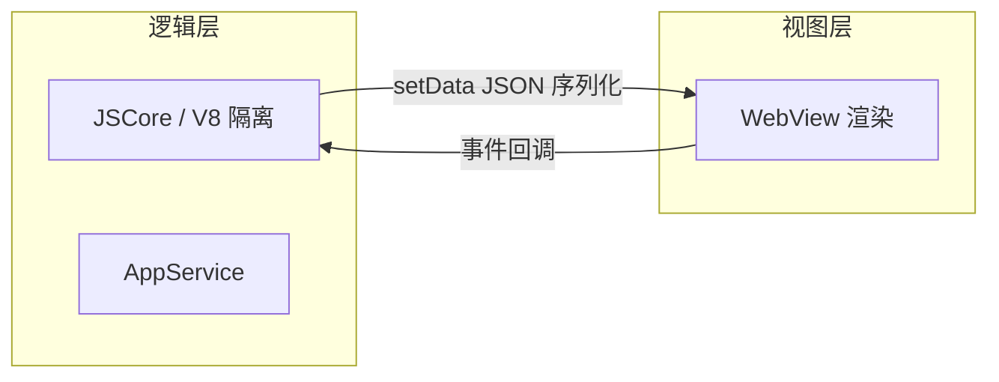

# 跨端原理深挖

## 学习目标

- 理解小程序、RN、Flutter、Hybrid 各端渲染与通信原理
- 能手写简易 JSBridge 与跨端通信协议
- 能在面试中讲清「为什么选型 A 不选 B」的技术本质

## 为什么需要

大厂架构师常负责多端统一：现有 `05-跨端方案选型` 解决「选什么」，本章解决「怎么工作」——面试深挖必问。

## 一、小程序双线程架构



**核心机制**：
- **逻辑层**与**视图层**分离，无法直接操作 DOM
- `setData` 将数据序列化传到视图层，有通信开销 → 频繁 setData 是性能杀手
- 双线程隔离安全，但限制 DOM API 能力

**优化要点**：
- 合并 setData，减少通信次数
- 避免在 data 中放大数据对象
- 使用自定义组件减少渲染范围

## 二、React Native：Bridge → JSI → Fabric

### 2.1 旧架构（Bridge）

```
JS 线程 ←→ JSON 序列化 Bridge ←→ Native 线程
```

- 异步通信，大批量调用有瓶颈
- UI 更新需跨线程序列化

### 2.2 新架构（JSI + Fabric + TurboModules）

- **JSI**：JS 直接持有 C++ 对象引用，同步调用 Native
- **Fabric**：新渲染器，Shadow Tree 在 C++ 层，减少跨线程
- **TurboModules**：按需加载 Native 模块，编译时类型安全

**面试答法**：RN 新架构解决 Bridge 序列化瓶颈，向「近原生」靠拢，但生态迁移仍在进行。

## 三、Flutter 渲染原理

```
Dart 代码 → Skia 绑制引擎 → GPU
```

- **不依赖原生控件**，自绘引擎（Skia/Impeller）
- **Widget** 是配置，**Element** 是实例，**RenderObject** 负责布局绑制
- 一致性最好，包体积较大

| 维度 | RN | Flutter |
|------|-----|---------|
| 渲染 | 原生组件映射 | 自绘 |
| 语言 | JS/TS | Dart |
| 包体积 | 较小 | 较大 |
| 一致性 | 中 | 高 |

## 四、Hybrid JSBridge 手写

```javascript
// H5 端
function setupBridge() {
  const callbacks = {};
  let id = 0;

  window.JSBridge = {
    call(method, params) {
      return new Promise((resolve, reject) => {
        const cbId = `cb_${++id}`;
        callbacks[cbId] = { resolve, reject };
        // iOS: webkit.messageHandlers
        // Android: window.AndroidBridge
        const payload = JSON.stringify({ method, params, cbId });
        if (window.webkit?.messageHandlers?.bridge) {
          window.webkit.messageHandlers.bridge.postMessage(payload);
        } else if (window.AndroidBridge) {
          window.AndroidBridge.postMessage(payload);
        } else {
          reject(new Error('Bridge not available'));
        }
      });
    },
    // Native 回调入口
    _callback(cbId, error, result) {
      const cb = callbacks[cbId];
      if (!cb) return;
      error ? cb.reject(error) : cb.resolve(result);
      delete callbacks[cbId];
    },
  };
}

// 使用
// await JSBridge.call('getLocation', {});
```

**协议设计要点**：
- 统一 `{ method, params, cbId }` 格式
- 支持 Promise 化与超时
- 版本号兼容（`bridgeVersion` 字段）
- 安全：校验 method 白名单

## 五、WebView 与端内安全

- JSBridge 暴露面是攻击入口，需 method 白名单
- 端内页面同样面临 XSS，token 存储更敏感
- 与 [07-安全](../07-安全/01-前端安全攻防.md) 联动

## 面试高频问答（追问链）

> 大厂对一个考点通常追问到能力边界：**概念 → 机制 → 边界 → ⭐ 原理（触底）→ 实战（落地）**。实战层是区分「背过」和「做过」的关键。

### 链一：小程序双线程

1. **概念**：小程序为什么不能直接操作 DOM？→ 双线程隔离，逻辑层无 DOM 环境，兼顾安全与性能。
2. **机制**：setData 慢的根因？→ 逻辑层数据需序列化跨线程到视图层。
3. **应用**：怎么优化 setData？→ 合并调用、路径更新（`'a.b': x`）、减少数据量、避免高频。
4. ⭐ **原理（触底）**：双线程对比 Web 单线程，长列表/复杂交互瓶颈在哪？怎么破？→ 瓶颈在通信而非渲染；用骨架分页、虚拟列表、`createSelectorQuery` 减少往返，必要时用原生组件/Skyline 渲染引擎。
5. **实战（落地）**：小程序长列表 setData 卡顿怎么优化？→ 合并 setData、路径更新 `'list[0].title'`、分页加载；Performance 面板看通信次数；优化后滚动 FPS 与 setData 调用次数可量化下降。

### 链二：RN 架构与 JSBridge

1. **概念**：RN 新架构解决什么？→ Bridge 异步序列化瓶颈，JSI 同步调用、Fabric 统一渲染。
2. **机制**：和 Flutter 区别？→ RN 映射原生组件、Flutter 自绘（Skia），一致性 Flutter 更好。
3. **应用**：怎么设计一个 JSBridge？→ 统一协议、Promise 化、回调表、白名单、超时、版本兼容。
4. ⭐ **原理（触底）**：H5 调 Native、Native 回调 H5 分别怎么实现？→ H5 通过 scheme/prompt/注入对象发起，Native 处理后注入全局 `_callback(cbId, err, res)` 按 id 回调对应 Promise。
5. **实战（落地）**：Hybrid 页 JSBridge 怎么落地？→ 统一 JSON 协议 + Promise 封装 + 白名单方法；Native 回调走 cbId 表；联调用 Charles 抓 bridge 调用，超时与错误码 E2E 覆盖。

## 小结

- 小程序：双线程 + setData 通信，性能关键是减少通信
- RN：Bridge → JSI 演进，关注新架构
- Flutter：自绘一致性最好
- JSBridge：协议 + Promise + 白名单是手写核心

## 延伸阅读

- [React Native 新架构](https://reactnative.dev/architecture/overview)
- [微信小程序运行机制](https://developers.weixin.qq.com/miniprogram/dev/framework/runtime/operating-mechanism.html)
