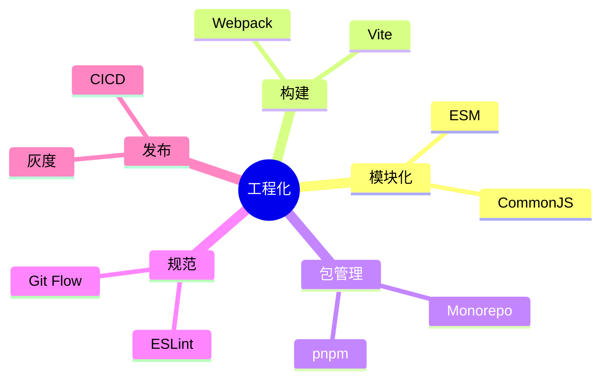

# 03-工程化 · 本章导读

## 模块定位

工程化是前端架构师的**核心竞争力**。模块化、构建工具、Monorepo、规范与 CI/CD 决定了团队能否高效、稳定地交付代码。

## 知识地图

## 章节列表

| 文件 | 主题 |
|------|------|
| [01-模块化演进与原理](./01-模块化演进与原理.md) | CJS/ESM、模块加载 |
| [02-构建工具原理](./02-构建工具原理(Webpack-Vite).md) | Webpack/Vite |
| [03-包管理与Monorepo](./03-包管理与Monorepo.md) | pnpm、workspace |
| [04-规范化与Git工作流](./04-规范化与Git工作流.md) | ESLint、Husky |
| [05-CICD与发布](./05-CICD与发布.md) | 自动化、灰度 |

## 前置依赖

完成 [01-基础内功](../01-基础内功/00-本章导读.md)、[02-框架与底层原理](../02-框架与底层原理/00-本章导读.md)。

## 自测清单

- [ ] CommonJS 和 ESM 的区别？循环依赖如何处理？
- [ ] Webpack 的 loader 和 plugin 分别做什么？
- [ ] Vite 为什么开发时快？生产构建用什么？
- [ ] pnpm 为什么省磁盘？Monorepo 如何管理多包？
- [ ] Git Flow 和 Trunk Based 的区别？
