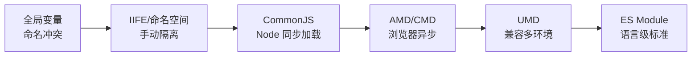
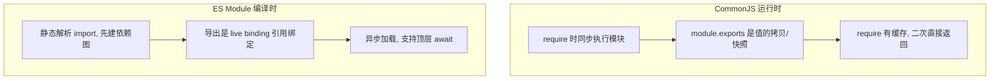

# 模块化演进与原理

## 学习目标

- 读懂 CJS/ESM 差异，能排查「引了却 undefined」「双实例 React」
- 能在 package.json 正确配置 exports
- 能定位循环依赖、幽灵依赖问题

## 为什么需要

`Cannot use import outside module`、`React invalid hook call`、生产环境偶发 undefined——常是模块系统问题。

> 核心心法：**CJS 运行时拷贝，ESM 编译时绑定。** 混用时最容易翻车。

---

## 一、心智模型

| 报错/现象 | 先查 |
|----------|------|
| invalid hook call | 两份 react |
| import 报错 | type module / 扩展名 |
| 循环依赖 undefined | 依赖环 |
| 用了未声明的包 | 幽灵依赖（pnpm 严格） |

---

## 二、模块化演进史（为什么会有这么多方案）

每一代方案都是为了解决上一代的痛点：



| 阶段 | 方案 | 解决什么 | 遗留问题 |
|------|------|---------|---------|
| 无模块 | `<script>` 全局变量 | — | 命名冲突、依赖靠顺序 |
| 命名空间 | IIFE、`window.App.xxx` | 隔离作用域 | 依赖关系隐式 |
| CommonJS | Node 的 `require/module.exports` | 服务端模块化、同步加载 | 同步不适合浏览器 |
| AMD/CMD | RequireJS/SeaJS | 浏览器异步加载 | 语法繁琐、回调嵌套 |
| UMD | 兼容 CJS+AMD+全局 | 一份代码多环境 | 模板冗余 |
| ESM | `import/export` 语言标准 | 静态分析、Tree Shaking、统一 | 与 CJS 互操作成本 |

---

## 三、底层机制：CJS vs ESM 的本质区别

这是所有模块问题的根因，必须理解透。



```javascript
// === CommonJS：值拷贝（快照）===
// counter.cjs
let count = 0;
module.exports = { count, inc: () => count++ };
// main.cjs
const m = require('./counter.cjs');
m.inc();
console.log(m.count); // 仍是 0！导出的是 count 的值拷贝

// === ESM：live binding（引用绑定）===
// counter.mjs
export let count = 0;
export const inc = () => count++;
// main.mjs
import { count, inc } from './counter.mjs';
inc();
console.log(count); // 1！import 绑定的是实时引用
```

| 维度 | CommonJS | ES Module |
|------|----------|-----------|
| 加载时机 | 运行时同步加载 | 编译时静态分析 |
| 导出本质 | 值的拷贝（快照） | live binding（引用） |
| 加载方式 | 动态（可在 if 里 require） | 静态（import 提升到顶部） |
| this 指向 | module.exports | undefined |
| Tree Shaking | 不支持（动态、无法静态分析） | 支持（静态结构可分析） |
| 循环依赖 | 返回未完成的 exports（易拿到 undefined） | 靠 live binding 缓解 |

> **为什么 ESM 能 Tree Shaking：** import/export 是静态的，构建工具在不运行代码的情况下就能分析出「哪些导出没被用到」，从而删除。CJS 的 `require` 是动态的（可拼字符串、可放条件里），无法静态分析，所以摇不了树。这是现代库优先发 ESM 的根本原因。

---

## 四、CJS vs ESM 项目落地

```json
// 新项目 package.json
{ "type": "module" }
```

```javascript
// 动态加载
const mod = await import('./heavy.js');

// CJS 中加载 ESM — 仅 dynamic import
```

---

## 五、dual package 排查

**现象：** Context 失效、hooks 报错

**定位：**

```bash
pnpm why react
# 若出现多个版本或 CJS+ESM 双路径 → 问题
```

**修复：** 统一 `"exports"` 入口；库作者只发 ESM 或 `"imports"` 对齐。

---

## 六、循环依赖

```javascript
// a.js
import { b } from './b.js';
export const a = () => b();

// b.js
import { a } from './a.js';
export const b = () => a(); // 可能 TDZ
```

**修复：** 抽公共模块 `c.js`；或 lazy require 内部函数。

---

## 排查实战

### 案例：升级后 `lodash` 子路径失效

- **原因：** package exports 限制子路径
- **修复：** `import debounce from 'lodash/debounce'` → `lodash-es` 或完整 import
- **验证：** 构建通过，bundle 仍 tree-shake

---

## 项目 Checklist

- [ ] 统一 `"type": "module"` 或明确 .cjs/.mjs
- [ ] `pnpm why react` 单一版本
- [ ] 库发布配 `exports` + `types`
- [ ] 禁止深层循环依赖（eslint import/no-cycle）

## 手写简易模块加载器

```javascript
const modules = {}, cache = {};
function require(id) {
  if (cache[id]) return cache[id].exports;
  const fn = modules[id];
  const module = { exports: {} };
  cache[id] = module;
  fn(module.exports, module, require);
  return module.exports;
}
```

## 面试高频问答（追问链）

> 大厂对一个考点通常追问到能力边界：**概念 → 机制 → 边界 → ⭐ 原理（触底）→ 实战（落地）**。实战层是区分「背过」和「做过」的关键。

### 链一：CJS 与 ESM

1. **概念**：CJS 和 ESM 核心区别？→ CJS 运行时同步加载 + 值拷贝；ESM 编译时静态 + live binding。
2. **机制**：为什么 ESM 能 Tree Shaking？→ 静态导入导出可分析未使用导出。
3. **边界**：循环依赖在两者下表现？→ CJS 拿到未完成的部分导出；ESM 有 TDZ 报错，需架构拆分。
4. ⭐ **原理（触底）**：live binding 和值拷贝的本质差异，举个会出 bug 的例子？→ CJS 导入是值快照，导出方后续改值导入方看不到；ESM 导入是只读引用绑定，能看到最新值（如计数器模块）。
5. **实战（落地）**：项目里 CJS/ESM 混用踩过什么坑、怎么落地修复？→ 升级后某第三方库只发 ESM，CJS 项目 `require` 报 `ERR_REQUIRE_ESM`；落地用动态 `import()` 桥接 + 入口标 `"type":"module"` + 用 tsup 输出 cjs+esm 双格式产物；验证 `node dist/index.cjs` 与 ESM 入口均能跑、单测覆盖两套入口；结果消除偶发 undefined，发版回归 0 模块加载报错。

### 链二：双包与单例

1. **概念**：dual package hazard 是什么？→ 同包 CJS+ESM 双入口导致两份实例。
2. **机制**：会引发什么问题？→ 两个 React/单例状态分裂、instanceof 失效。
3. **应用**：怎么排查？→ `pnpm why react` 查重复，配 dedupe/resolutions。
4. ⭐ **原理（触底）**：怎么发一个同时安全支持 CJS/ESM 的库？→ 用 exports 字段条件导出、保证无状态或单实例、避免双入口共享可变状态，必要时把状态外置。
5. **实战（落地）**：线上出现两份 React 实例你是怎么定位和根治的？→ Context 失效 + hooks 报错，先 `pnpm why react` 发现某依赖锁了不同 minor 版本；落地用 `resolutions`/`overrides` 统一版本 + dedupe，组件库把 react 设为 peerDependencies 不打进产物；验证打包后 bundle 仅一份 react、`instanceof`/Context 一致；结果单例状态恢复正常、hooks 报错消失。

## 小结

- 演进史：全局 → IIFE → CommonJS → AMD → UMD → ESM，每代解决上代痛点
- 本质：CJS 运行时同步加载+值拷贝；ESM 编译时静态分析+live binding
- ESM 静态结构才能 Tree Shaking，这是库优先发 ESM 的原因
- ESM 为默认；CJS 遗留用 dynamic import 桥接
- dual package 和 duplicate react 用 pnpm why 查
- 循环依赖靠架构拆分

## 延伸阅读

- [Node.js Package Entry Points](https://nodejs.org/api/packages.html)
