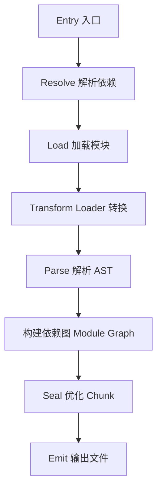
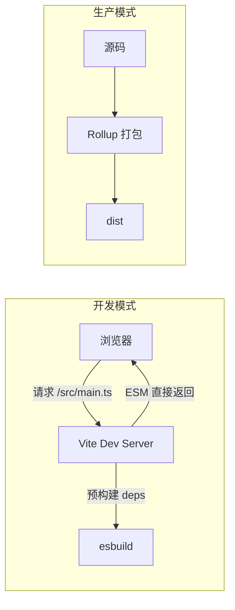

# 构建工具原理（Webpack / Vite）

## 学习目标

- 理解 Webpack 的核心概念：entry、output、loader、plugin
- 掌握 Webpack 打包流程与 Tapable 插件机制
- 理解 Vite 的开发时 ESM 与生产 Rollup 构建
- 了解常见构建优化策略

## 为什么需要

浏览器不能直接运行 JSX、TS、SCSS，模块需打包合并。构建工具负责：

- 转译、打包、代码分割
- 开发热更新（HMR）
- 生产优化（压缩、Tree Shaking）

架构师需选型 Webpack vs Vite，配置优化，必要时编写 plugin/loader。

## 核心原理

### 1. Webpack 打包流程



**核心概念：**

| 概念 | 说明 |
|------|------|
| Entry | 打包入口 |
| Output | 输出配置 |
| Loader | 转换非 JS 模块（css、ts、图片） |
| Plugin | 扩展构建生命周期 |
| Chunk | 代码块，可 split |
| Module | 单个文件模块 |

```javascript
// webpack.config.js 简化
module.exports = {
  entry: './src/index.js',
  output: {
    path: path.resolve(__dirname, 'dist'),
    filename: '[name].[contenthash].js'
  },
  module: {
    rules: [
      { test: /\.tsx?$/, use: 'ts-loader' },
      { test: /\.css$/, use: ['style-loader', 'css-loader'] }
    ]
  },
  plugins: [
    new HtmlWebpackPlugin({ template: './index.html' })
  ],
  optimization: {
    splitChunks: { chunks: 'all' }
  }
};
```

### 2. Loader 与 Plugin

**Loader：** 文件级转换，链式执行

```javascript
// 自定义 loader 示例
module.exports = function(source) {
  return source.replace(/console\.log\([^)]*\)/g, '');
};
```

**Plugin：** 基于 Tapable 事件，介入构建生命周期

```javascript
class MyPlugin {
  apply(compiler) {
    compiler.hooks.emit.tapAsync('MyPlugin', (compilation, callback) => {
      // 在 emit 前修改 assets
      callback();
    });
  }
}
```

### 3. Vite 原理



**开发时快的原因：**

1. **原生 ESM**：不打包，按需编译单个文件
2. **esbuild 预构建**：node_modules 用 esbuild 转成 ESM，秒级
3. **HMR**：模块级热更新，保留状态

**生产构建：** 使用 Rollup，Tree Shaking 更成熟

```javascript
// vite.config.ts
import { defineConfig } from 'vite';
import react from '@vitejs/plugin-react';

export default defineConfig({
  plugins: [react()],
  build: {
    rollupOptions: {
      output: {
        manualChunks: {
          vendor: ['react', 'react-dom']
        }
      }
    }
  }
});
```

### 4. Webpack vs Vite

| 维度 | Webpack | Vite |
|------|---------|------|
| 开发启动 | 全量打包，慢 | 按需 ESM，快 |
| 热更新 | 模块替换 | 更快，ESM 原生 |
| 生产 | Webpack | Rollup |
| 生态 | 最丰富 | 快速增长 |
| 配置 | 灵活复杂 | 约定优于配置 |
| 适用 | 复杂定制、老项目 | 新项目、Vue/React |

### 5. 构建优化

```javascript
// 1. 代码分割
optimization: {
  splitChunks: {
    chunks: 'all',
    cacheGroups: {
      vendor: { test: /node_modules/, name: 'vendor' }
    }
  }
}

// 2. Tree Shaking — ESM + sideEffects: false
// package.json
{ "sideEffects": false }

// 3. 持久化缓存
optimization: {
  moduleIds: 'deterministic',
  runtimeChunk: 'single'
}

// 4. 分析包体积
// webpack-bundle-analyzer
```

## 常见误区与最佳实践

| 误区 | 正确理解 |
|------|---------|
| "Vite 不用 Webpack 所以不打包" | 生产仍打包，用 Rollup |
| "Loader 和 Plugin 随便用" | Loader 转文件，Plugin 介入生命周期 |
| "开发快 = 生产快" | 生产需单独优化 |
| "所有依赖都打包进 bundle" | externals 可排除 CDN 加载的库 |

**最佳实践：**

- 新项目优先 Vite
- 生产 filename 带 contenthash，配合 CDN 长缓存
- 定期 bundle analyze，清理无用依赖
- 大型项目考虑 Module Federation 微前端

## 小结

- Webpack：entry → 依赖图 → loader 转换 → plugin 扩展 → 输出
- Vite：开发 ESM + esbuild 预构建，生产 Rollup
- Loader 转文件，Plugin 扩展构建
- 优化：代码分割、Tree Shaking、缓存

## 延伸阅读

- [Webpack 概念](https://webpack.js.org/concepts/)
- [Vite 原理](https://vitejs.dev/guide/why.html)
- [Rollup 文档](https://rollupjs.org/)
