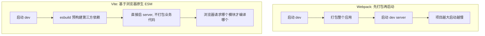

# 构建工具原理（Webpack / Vite）

## 学习目标

- 读懂构建流程，能用 bundle 分析器定位体积问题
- 能在 Vite/Webpack 项目中落地代码分割、缓存、提速
- 能排查 HMR 失效、构建慢、Tree Shaking 无效

## 为什么需要

「首屏 JS 2MB」「改一行全量编译 3 分钟」——架构师必须能读构建产物并优化。

> 核心心法：**构建 = 依赖图 + 转换 + 分包 + 输出。** 优化就是减图、减转换、减输出。

---

## 一、心智模型

| 现象 | 先查 |
|------|------|
| 包太大 | analyzer 看谁占体积 |
| 构建慢 | 缓存、thread、减少 loader |
| HMR 全刷新 | 边界模块、循环依赖 |
| 摇树无效 | sideEffects、CJS 依赖 |

---

## 二、底层原理：构建工具在做什么

### 通用构建流程

无论 Webpack 还是 Vite（生产），核心都是这条流水线：


1. **构建依赖图：** 从 entry 出发，用 AST 解析每个文件的 `import/require`，递归找出所有依赖，形成依赖图（module graph）。
2. **转换：** 每个模块经 loader/plugin 转换——TS→JS、JSX→JS、Sass→CSS、图片→base64/URL。
3. **优化：** Tree Shaking 删死代码、代码分割、作用域提升（scope hoisting）、压缩（minify）。
4. **输出：** 生成浏览器可运行的 bundle + runtime（模块加载器）。

### Webpack vs Vite 的本质区别（高频考点）



| 维度 | Webpack | Vite（dev） |
|------|---------|------------|
| dev 启动 | 先打包全部，慢 | 不打包，秒启 |
| 模块处理 | 全量构建 bundle | 浏览器原生 ESM 按需编译 |
| 依赖预构建 | — | esbuild（Go 写，极快）预打包 node_modules |
| HMR | 重新构建受影响 chunk | 精确到单模块，几乎瞬时 |
| 生产构建 | Webpack 自身 | Rollup（更优的 Tree Shaking） |

> **为什么 Vite dev 快：** 它利用浏览器原生支持 ESM，dev 阶段**不打包**业务代码，浏览器请求某个模块时才即时编译该模块（esbuild）。Webpack 必须先把整个依赖图打包成 bundle 才能提供服务，项目越大启动越慢。代价：Vite 生产仍需 Rollup 打包（避免大量 HTTP 请求）。

### Tree Shaking 原理

```javascript
// utils.js
export function used() {}
export function unused() {}   // 没人 import → 标记为 dead code

// main.js
import { used } from './utils.js';
used();
// 构建后 unused 被删除（DCE: Dead Code Elimination）
```

- 依赖 **ESM 静态结构**：构建工具不运行代码就能分析出哪些 export 没被引用。
- `sideEffects: false` 告诉工具「这个包的模块没有副作用，可放心删除未用部分」。
- **CJS 摇不了树**：`require` 是动态的（运行时才确定），无法静态分析（见模块化篇）。

---

## 三、体积分析（第一步必做）

```bash
# Vite
npx vite-bundle-visualizer

# Webpack
npx webpack-bundle-analyzer dist/stats.json
```

**常见发现：** 整包 lodash、moment locale、重复 react、未 lazy 的路由。

---

## 四、优化落地清单

### 代码分割

```javascript
// 路由 lazy
const Admin = lazy(() => import('./pages/Admin'));

// Vite manualChunks
build: {
  rollupOptions: {
    output: {
      manualChunks: { vendor: ['react', 'react-dom'] }
    }
  }
}
```

### Tree Shaking

```json
// package.json 库作者
{ "sideEffects": false }
```

```javascript
// 应用侧
import debounce from 'lodash-es/debounce'; // 不要 import _ from 'lodash'
```

### 构建提速

```javascript
// Webpack 5
cache: { type: 'filesystem' }

// Vite 已 esbuild 预构建；大型项目 tuning optimizeDeps.include
```

---

## 五、HMR 排查

1. 改组件是否整页刷新？→ 看控制台 HMR 日志
2. 是否改到 entry 边界外不可 HMR 模块？
3. 是否 `accept` 链断裂（Webpack）

---

## 排查实战

### 案例 A：主包 1.8MB

- **analyzer：** echarts 全量 + moment
- **修复：** echarts 按需 `echarts/core`；dayjs 替 moment
- **验证：** 主包 420KB，Lighthouse TBT 降 40%

### 案例 B：CI 构建 8 分钟

- **原因：** 无 persistent cache，每次全量
- **修复：** Webpack filesystem cache + Turborepo 远程 cache
- **验证：** 二次构建 <2 分钟

---

## 项目落地步骤

1. 接入 bundle analyzer，设预算（script <300KB gzip）
2. 路由全 lazy + vendor split
3. CI 跑 `pnpm build` + Lighthouse CI
4. PR 模板要求附 analyzer 截图（体积变更时）

## 手写 Loader / Plugin / 简易打包器

```javascript
// Loader：转换单个模块
module.exports = function (source) {
  return source.replace(/console\.log\([^)]*\);?/g, '');
};

// Plugin：监听构建生命周期
class BundleAnalyzerPlugin {
  apply(compiler) {
    compiler.hooks.done.tap('Analyzer', stats => {
      console.log(stats.toJson().assets.map(a => a.name));
    });
  }
}

// 简易打包器核心
function bundle(entry, graph) {
  const modules = {};
  for (const id in graph) {
    modules[id] = `(function(modules) {
      function require(id) { /* ... */ }
      ${graph[id].code}
    })(modules)`;
  }
  return modules[entry];
}
```

**Rspack/Turbopack**：Rust 重写核心，兼容 Webpack 生态，dev 更快。

## 面试高频问答（追问链）

> 大厂对一个考点通常追问到能力边界：**概念 → 机制 → 边界 → ⭐ 原理（触底）→ 实战（落地）**。实战层是区分「背过」和「做过」的关键。

### 链一：构建原理

1. **概念**：Webpack 和 Vite dev 差异？→ Webpack 打包后服务；Vite 原生 ESM 按需编译。
2. **机制**：Vite 为什么快？→ esbuild 预构建依赖（Go 多线程）+ 浏览器按需请求源码。
3. **边界**：Vite dev 和 build 行为不一致风险？→ dev 用 esbuild、build 用 Rollup，需测试产物。
4. **应用**：Tree Shaking 条件？→ ESM 静态结构 + sideEffects:false + 无副作用导出。
5. ⭐ **原理（触底）**：构建本质流程是什么？为什么 Rspack/Turbopack 更快？→ 建依赖图 → AST 转换 → 优化(摇树/分包/压缩) → 输出；Rust/Go 重写并行化 + 增量编译 + 持久缓存，解决 JS 单线程瓶颈。
6. **实战（落地）**：你做过的最有效的一次构建优化是什么？→ 首屏 JS 1.8MB，接 visualizer 发现 echarts/moment 全量引入；落地 echarts 按需 `echarts/core` + dayjs 替 moment + 路由 lazy + manualChunks 拆 vendor，并在 CI 设 bundle 预算；验证主包降到 420KB、Lighthouse TBT 降 40%、PR 体积超标自动报警；结果首屏 FCP 提升且体积不再悄悄回涨。

### 链二：HMR 与体积优化

1. **概念**：HMR 原理？→ 模块热替换，保留状态只更新变更模块。
2. **机制**：边界怎么确定？→ 沿依赖向上找接受更新的边界，找不到则整页刷新。
3. **应用**：怎么分析包体积、拆包？→ visualizer/analyzer 找大头，动态 import + manualChunks。
4. ⭐ **原理（触底）**：手写一个 Loader 和 Plugin 的区别？→ Loader 是转换函数（链式处理单文件内容）；Plugin 基于 Tapable 钩子介入整个编译生命周期（见本章手写）。
5. **实战（落地）**：HMR 失效或构建慢你怎么排查落地？→ 改一行全量编译 3 分钟，定位无持久缓存 + 大量 babel loader；落地 Webpack5 filesystem cache + Turborepo 远程缓存 + thread-loader，HMR 失效则查 accept 链断裂/循环依赖；验证二次构建 <2 分钟、改组件不再整页刷新；结果本地迭代体验与 CI 时长双优化。

## 小结

- 构建本质：建依赖图 → 转换 → 优化(摇树/分包/压缩) → 输出
- Webpack 先打包再启 dev；Vite 用原生 ESM 按需编译 + esbuild 预构建，dev 更快
- Tree Shaking 依赖 ESM 静态结构 + sideEffects；CJS 摇不了树
- analyzer 找大头；lazy + manualChunks 拆包
- cache 提速；HMR 看边界与日志

## 延伸阅读

- [Vite Build](https://vitejs.dev/guide/build.html)
- [Webpack Code Splitting](https://webpack.js.org/guides/code-splitting/)
