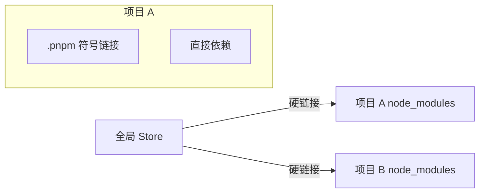
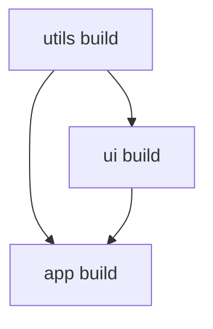

# 包管理与 Monorepo

## 学习目标

- 理解 npm/yarn/pnpm 的差异与 pnpm 原理
- 掌握 Monorepo 的概念与 workspace 配置
- 了解 Turborepo、Nx 等 Monorepo 工具
- 能设计多包项目的依赖与发布策略

## 为什么需要

现代前端项目常包含：

- 主应用 + 组件库 + 工具包 + 共享配置
- 多应用共享代码（微前端、多端）

Monorepo 将多个包放在同一仓库，统一版本、依赖、构建，是大型团队的标准实践。

## 核心原理

### 1. 包管理器对比

| 特性 | npm | yarn | pnpm |
|------|-----|------|------|
| node_modules | 扁平/嵌套 | 扁平 | 内容寻址 + 硬链接 |
| 磁盘占用 | 高（重复安装） | 高 | 低（全局 store） |
| 安装速度 | 中 | 快 | 最快 |
| 幽灵依赖 | 有 | 有 | 无（严格） |

**pnpm 原理：**



- 全局 store 存所有包版本
- 项目 node_modules 硬链接到 store，节省磁盘
- 依赖通过 `.pnpm` 严格隔离，无法访问未声明的依赖

### 2. Monorepo 结构

```
my-monorepo/
├── packages/
│   ├── app/           # 主应用
│   ├── ui/            # 组件库
│   ├── utils/         # 工具函数
│   └── config-eslint/ # 共享 ESLint 配置
├── package.json       # 根 package.json
├── pnpm-workspace.yaml
└── turbo.json
```

### 3. pnpm workspace

```yaml
# pnpm-workspace.yaml
packages:
  - 'packages/*'
  - 'apps/*'
```

```json
// 根 package.json
{
  "name": "my-monorepo",
  "private": true,
  "scripts": {
    "build": "turbo run build",
    "dev": "turbo run dev"
  },
  "devDependencies": {
    "turbo": "^2.0.0"
  }
}

// packages/ui/package.json
{
  "name": "@myorg/ui",
  "version": "1.0.0",
  "main": "./dist/index.js"
}

// packages/app/package.json
{
  "name": "app",
  "dependencies": {
    "@myorg/ui": "workspace:*"
  }
}
```

`workspace:*` 表示依赖 workspace 内的包，发布时替换为实际版本。

### 4. Turborepo

```json
// turbo.json
{
  "$schema": "https://turbo.build/schema.json",
  "tasks": {
    "build": {
      "dependsOn": ["^build"],
      "outputs": ["dist/**"]
    },
    "dev": {
      "cache": false,
      "persistent": true
    }
  }
}
```

**特性：**

- **任务编排**：`dependsOn` 定义 build 顺序
- **远程缓存**：CI 共享构建缓存
- **增量构建**：只构建变更的包



### 5. 版本与发布

**Changesets：** 管理多包版本与 changelog

```bash
pnpm changeset          # 选择变更的包，写 changelog
pnpm changeset version    # 更新版本号
pnpm changeset publish    # 发布到 npm
```

**策略：**

- 内部包：`workspace:*`，不单独发布
- 对外组件库：独立版本，semver
- 统一 lint/test 在根目录执行

## 常见误区与最佳实践

| 误区 | 正确理解 |
|------|---------|
| "Monorepo = 一个大 package.json" | 多 package，workspace 关联 |
| "pnpm 和 npm 完全一样" | pnpm 严格隔离，需显式声明依赖 |
| "所有代码放一个包" | 按职责拆包，避免循环依赖 |
| "Monorepo 一定比 Multi-repo 好" | 小团队单应用 Multi-repo 更简单 |

**最佳实践：**

- 新项目 Monorepo + pnpm + Turborepo
- 包边界清晰：ui、utils、config 分离
- 根目录统一 ESLint、TypeScript、Prettier
- CI 用 turbo run build --filter=...[changed]

## 小结

- pnpm 通过 store + 硬链接省磁盘、防幽灵依赖
- Monorepo 多包同仓，workspace 协议关联
- Turborepo 任务编排 + 缓存加速构建
- Changesets 管理多包版本发布

## 延伸阅读

- [pnpm 文档](https://pnpm.io/)
- [Turborepo 文档](https://turbo.build/repo/docs)
- [Changesets](https://github.com/changesets/changesets)
