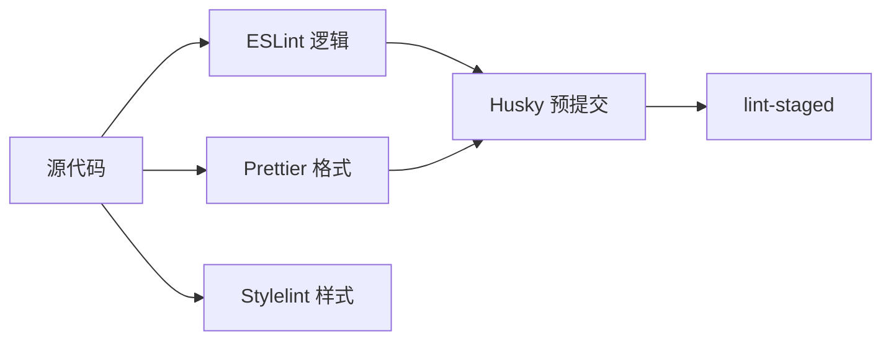
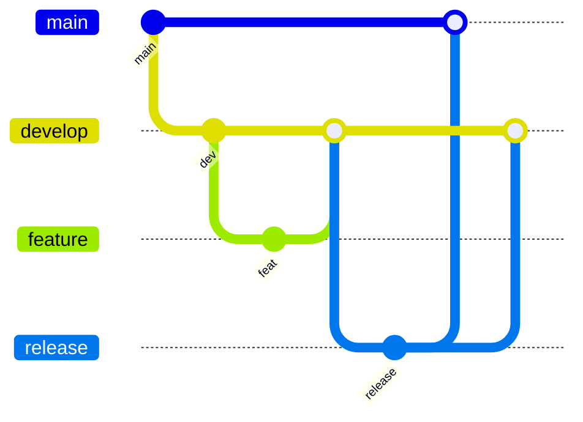

# 规范化与 Git 工作流

## 学习目标

- 理解代码规范工具链：ESLint、Prettier、Stylelint
- 掌握 Git 提交规范与 Commitlint
- 了解 Git Flow、Trunk Based 等工作流
- 能搭建 Husky + lint-staged 预提交检查

## 为什么需要

团队协作需要统一标准：

- **代码风格**：减少 diff 噪音、CR 焦点在逻辑
- **提交信息**：可追溯、自动生成 changelog
- **分支策略**：明确发布、热修复流程

架构师负责制定并落地团队规范。

## 核心原理

### 1. 规范工具链



**ESLint：** 代码质量、潜在错误

```javascript
// eslint.config.js (Flat Config)
import js from '@eslint/js';
import tseslint from 'typescript-eslint';

export default [
  js.configs.recommended,
  ...tseslint.configs.recommended,
  {
    rules: {
      'no-console': 'warn',
      '@typescript-eslint/no-unused-vars': 'error'
    }
  }
];
```

**Prettier：** 纯格式化，与 ESLint 分工（eslint-config-prettier 避免冲突）

```json
{
  "semi": true,
  "singleQuote": true,
  "tabWidth": 2
}
```

### 2. Husky + lint-staged

```bash
pnpm add -D husky lint-staged
npx husky init
```

```json
// package.json
{
  "lint-staged": {
    "*.{js,ts,tsx}": ["eslint --fix", "prettier --write"],
    "*.{css,scss}": ["stylelint --fix"]
  }
}
```

```bash
# .husky/pre-commit
pnpm exec lint-staged
```

仅对 staged 文件检查，速度快。

### 3. Commit 规范

**Conventional Commits：**

```
<type>(<scope>): <subject>

feat: 新功能
fix: 修复
docs: 文档
style: 格式
refactor: 重构
test: 测试
chore: 构建/工具
```

```bash
pnpm add -D @commitlint/cli @commitlint/config-conventional
```

```javascript
// commitlint.config.js
export default { extends: ['@commitlint/config-conventional'] };
```

```bash
# .husky/commit-msg
pnpm exec commitlint --edit $1
```

### 4. Git 工作流

**Git Flow：**



- main：生产
- develop：开发集成
- feature/*：功能分支
- release/*：发布准备
- hotfix/*：生产热修复

**Trunk Based：**

- 主干开发，短生命周期分支
- 配合 Feature Flag 隐藏未完成功能
- 适合持续部署、小步提交

| 工作流 | 适用 |
|--------|------|
| Git Flow | 版本发布、多环境 |
| Trunk Based | 持续部署、快速迭代 |
| GitHub Flow | 简单 PR 合并 main |

### 5. Code Review 机制

- PR 必须通过 CI（lint、test、build）
- 至少 1 人 approve
- 禁止直接 push main
- 分支保护规则

## 常见误区与最佳实践

| 误区 | 正确理解 |
|------|---------|
| "Prettier 能替代 ESLint" | Prettier 只管格式，ESLint 管逻辑 |
| "规范太严影响效率" | 自动化后长期提效 |
| "commit 随便写" | 规范 commit 便于 revert 和 changelog |
| "Git Flow 唯一正确" | 按团队发布节奏选择 |

**最佳实践：**

- 根目录共享 eslint、prettier、tsconfig
- pre-commit 跑 lint-staged，commit-msg 跑 commitlint
- CI 全量 lint + test，与本地一致
- 文档化分支策略和 CR 规范

## 小结

- ESLint 质量、Prettier 格式、Stylelint 样式
- Husky + lint-staged 预提交自动化
- Conventional Commits + Commitlint
- Git Flow vs Trunk Based 按团队选择

## 延伸阅读

- [Conventional Commits](https://www.conventionalcommits.org/)
- [Husky 文档](https://typicode.github.io/husky/)
- [Trunk Based Development](https://trunkbaseddevelopment.com/)
