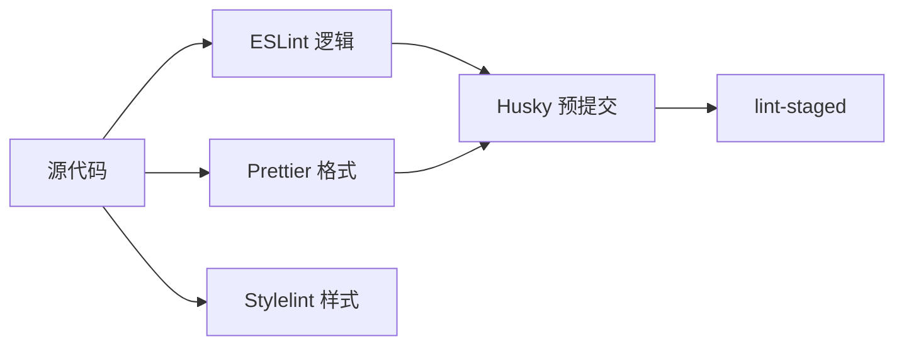
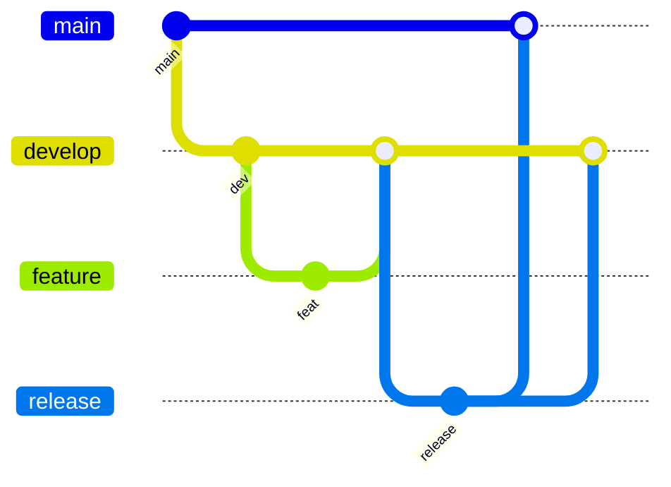
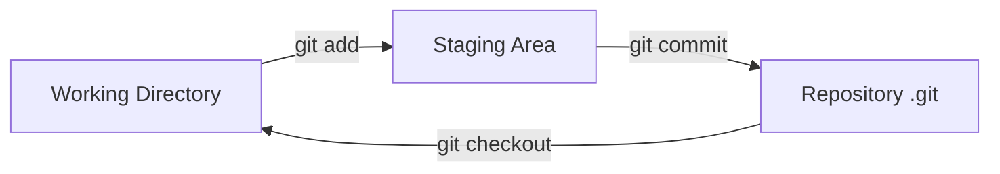

# 规范化与 Git 工作流

## 学习目标

- 理解代码规范工具链：ESLint、Prettier、Stylelint
- 掌握 Git 提交规范与 Commitlint
- 了解 Git Flow、Trunk Based 等工作流
- 能搭建 Husky + lint-staged 预提交检查

## 为什么需要

团队协作需要统一标准：

- **代码风格**：减少 diff 噪音、CR 焦点在逻辑
- **提交信息**：可追溯、自动生成 changelog
- **分支策略**：明确发布、热修复流程

架构师负责制定并落地团队规范。

## 核心原理

### 1. 规范工具链



**ESLint：** 代码质量、潜在错误

```javascript
// eslint.config.js (Flat Config)
import js from '@eslint/js';
import tseslint from 'typescript-eslint';

export default [
  js.configs.recommended,
  ...tseslint.configs.recommended,
  {
    rules: {
      'no-console': 'warn',
      '@typescript-eslint/no-unused-vars': 'error'
    }
  }
];
```

**Prettier：** 纯格式化，与 ESLint 分工（eslint-config-prettier 避免冲突）

```json
{
  "semi": true,
  "singleQuote": true,
  "tabWidth": 2
}
```

### 2. Husky + lint-staged

```bash
pnpm add -D husky lint-staged
npx husky init
```

```json
// package.json
{
  "lint-staged": {
    "*.{js,ts,tsx}": ["eslint --fix", "prettier --write"],
    "*.{css,scss}": ["stylelint --fix"]
  }
}
```

```bash
# .husky/pre-commit
pnpm exec lint-staged
```

仅对 staged 文件检查，速度快。

### 3. Commit 规范

**Conventional Commits：**

```
<type>(<scope>): <subject>

feat: 新功能
fix: 修复
docs: 文档
style: 格式
refactor: 重构
test: 测试
chore: 构建/工具
```

```bash
pnpm add -D @commitlint/cli @commitlint/config-conventional
```

```javascript
// commitlint.config.js
export default { extends: ['@commitlint/config-conventional'] };
```

```bash
# .husky/commit-msg
pnpm exec commitlint --edit $1
```

### 4. Git 工作流

**Git Flow：**



- main：生产
- develop：开发集成
- feature/*：功能分支
- release/*：发布准备
- hotfix/*：生产热修复

**Trunk Based：**

- 主干开发，短生命周期分支
- 配合 Feature Flag 隐藏未完成功能
- 适合持续部署、小步提交

| 工作流 | 适用 |
|--------|------|
| Git Flow | 版本发布、多环境 |
| Trunk Based | 持续部署、快速迭代 |
| GitHub Flow | 简单 PR 合并 main |

### 5. Code Review 机制

- PR 必须通过 CI（lint、test、build）
- 至少 1 人 approve
- 禁止直接 push main
- 分支保护规则

### 6. Git 对象模型与三区域



| 对象 | 说明 |
|------|------|
| blob | 文件内容 |
| tree | 目录结构 |
| commit | 提交，含 tree + parent + message |
| tag | 标签 |

**rebase vs merge：**

- **merge：** 保留分支历史，产生 merge commit
- **rebase：** 变基到目标分支，历史线性，不改写已 push 的公共分支

### 7. ESLint Flat Config 深入

```javascript
export default [
  { files: ['**/*.ts'], languageOptions: { parser: tsParser } },
  { rules: { 'no-unused-vars': 'off' } }
];
// 规则基于 AST 节点访问，自定义规则用 espree + visitor 模式
```

### 8. EditorConfig 与自动 Changelog

```ini
# .editorconfig
root = true
[*]
indent_style = space
indent_size = 2
end_of_line = lf
```

**release-please / changesets** 根据 Conventional Commits 自动生成 CHANGELOG 和版本 PR。

### 9. Monorepo 增量 lint

```bash
# 仅 lint 变更包
pnpm turbo run lint --filter=...[origin/main]
```

---

## 实战：规范工具链一次配齐

```bash
pnpm add -D eslint prettier husky lint-staged @commitlint/cli @commitlint/config-conventional
npx husky init
echo "pnpm exec lint-staged" > .husky/pre-commit
echo "pnpm exec commitlint --edit \$1" > .husky/commit-msg
```

**验证：** 故意提交 `console.log` 未修复 → pre-commit 拦截；commit message `fix bug` → commitlint 拒绝。

## 常见误区与最佳实践

| 误区 | 正确理解 |
|------|---------|
| "Prettier 能替代 ESLint" | Prettier 只管格式，ESLint 管逻辑 |
| "规范太严影响效率" | 自动化后长期提效 |
| "commit 随便写" | 规范 commit 便于 revert 和 changelog |
| "Git Flow 唯一正确" | 按团队发布节奏选择 |

**最佳实践：**

- 根目录共享 eslint、prettier、tsconfig
- pre-commit 跑 lint-staged，commit-msg 跑 commitlint
- CI 全量 lint + test，与本地一致
- 文档化分支策略和 CR 规范

## 手写 ESLint 规则（AST）

```javascript
module.exports = {
  create(context) {
    return {
      CallExpression(node) {
        if (node.callee.name === 'eval') {
          context.report({ node, message: '禁止使用 eval' });
        }
      },
    };
  },
};
```

## Git 对象模型（简述）

- **blob**：文件内容
- **tree**：目录结构
- **commit**：指向 tree + 父 commit + 元信息
- **ref**：分支/标签指针

## 面试高频问答（追问链）

> 大厂对一个考点通常追问到能力边界：**概念 → 机制 → 边界 → ⭐ 原理（触底）→ 实战（落地）**。实战层是区分「背过」和「做过」的关键。

### 链一：Git 工作流

1. **概念**：Git Flow vs Trunk Based？→ Git Flow 多分支适合版本发布；Trunk 适合持续部署。
2. **机制**：rebase 和 merge 区别？→ rebase 线性历史、merge 保留分叉。
3. **边界**：rebase 有什么风险？→ 改写历史，已推送的公共分支不能 rebase。
4. ⭐ **原理（触底）**：Git 怎么存储一次 commit？→ 内容寻址对象库：blob(文件)→tree(目录)→commit(指向 tree+父 commit)，SHA-1 去重，分支是指向 commit 的可变指针（见本章对象模型）。
5. **实战（落地）**：团队 Git 工作流和分支保护你怎么落地的？→ 多人协作分支混乱、误推 main，落地 Trunk Based + 短分支 + PR 必过 CI（lint/test/build）+ 至少 1 approve + 禁止直推 main 的分支保护；验证直推被拒、未过 CI 无法合并、release-please 自动出版本 PR；结果发布可追溯、回滚有据、main 始终可发布。

### 链二：规范化工具链

1. **概念**：lint-staged 做什么？→ 只检查暂存区文件，加速 pre-commit。
2. **机制**：Husky 怎么挂钩子？→ 安装 Git hooks 指向脚本，提交时触发。
3. **应用**：Conventional Commits 格式与价值？→ `type(scope): subject`，可自动生成 changelog/版本。
4. ⭐ **原理（触底）**：ESLint 怎么工作的？怎么写一条自定义规则？→ 源码 parse 成 AST，规则在 traverse 时监听节点类型并 report/fix（见本章手写 AST 规则）。
5. **实战（落地）**：你怎么落地一套规范工具链并让团队接受？→ diff 噪音大、commit 信息混乱，落地 ESLint+Prettier+Stylelint + Husky+lint-staged（只查暂存区）+ commitlint 约束 Conventional Commits；验证提交 `console.log` 被 pre-commit 拦截、`fix bug` 被 commitlint 拒绝、CI 全量 lint 与本地一致；结果 CR 聚焦逻辑、changelog 自动生成、代码风格统一。

## 小结

- ESLint 质量、Prettier 格式、Stylelint 样式
- Husky + lint-staged 预提交自动化
- Conventional Commits + Commitlint
- Git Flow vs Trunk Based 按团队选择

## 延伸阅读

- [Conventional Commits](https://www.conventionalcommits.org/)
- [Husky 文档](https://typicode.github.io/husky/)
- [Trunk Based Development](https://trunkbaseddevelopment.com/)
