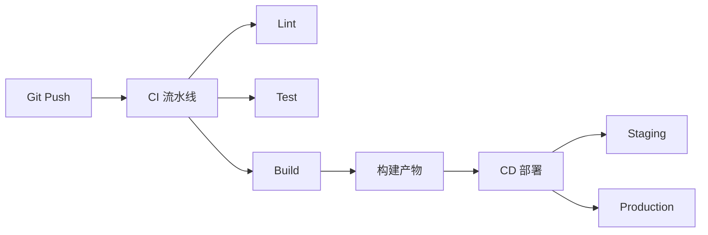
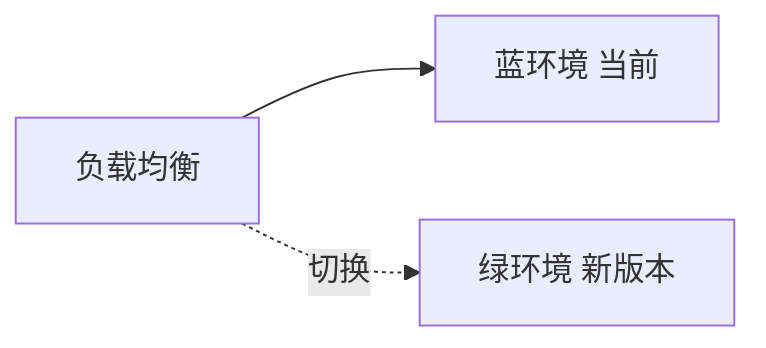
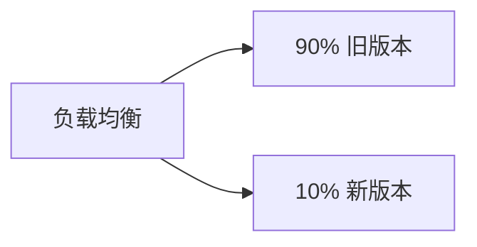
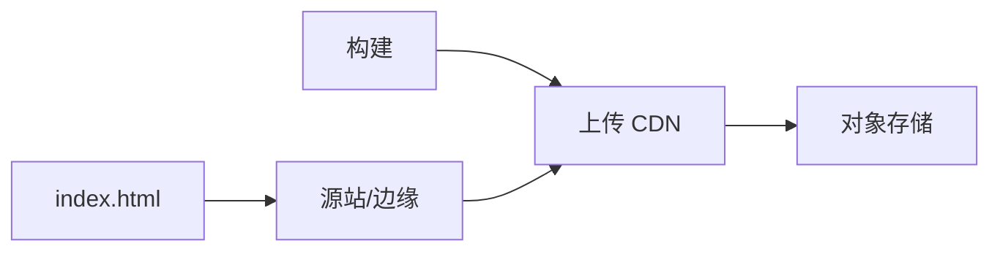
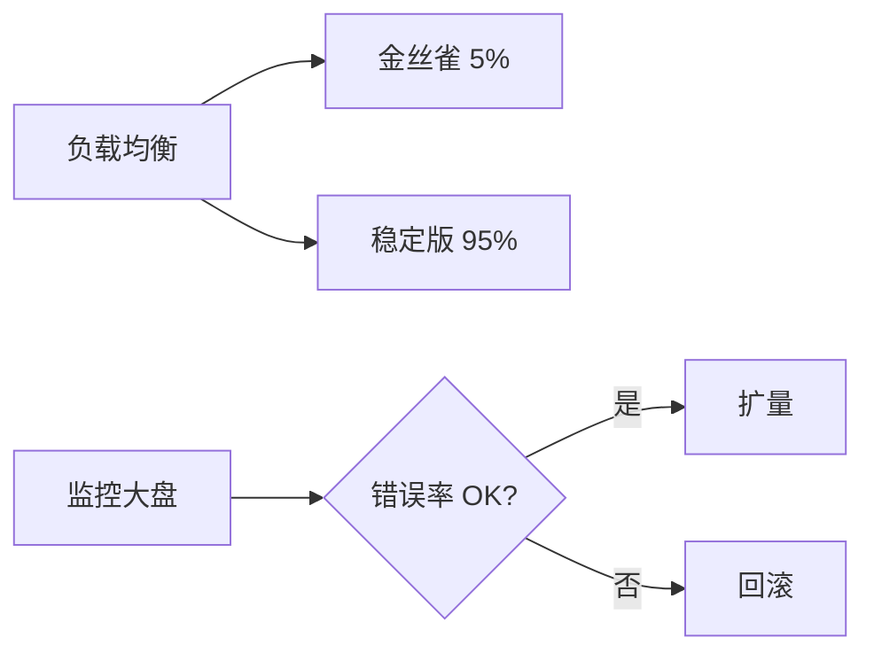

# CI/CD 与发布

## 学习目标

- 理解 CI/CD 的概念与价值
- 掌握前端 CI 流水线典型步骤
- 了解部署策略：蓝绿、金丝雀、灰度
- 理解环境管理与版本回滚

## 为什么需要

手动构建部署易出错、不可重复。CI/CD 实现：

- **持续集成**：每次提交自动 lint、test、build
- **持续部署**：通过流水线自动发布到各环境
- **可追溯**：每次发布对应 commit、可回滚

架构师需设计流水线、环境策略、发布流程。

## 核心原理

### 1. CI/CD 流程



### 2. 典型 CI 配置（GitHub Actions）

```yaml
# .github/workflows/ci.yml
name: CI

on:
  push:
    branches: [main, develop]
  pull_request:
    branches: [main]

jobs:
  build:
    runs-on: ubuntu-latest
    steps:
      - uses: actions/checkout@v4

      - uses: pnpm/action-setup@v2
        with:
          version: 8

      - uses: actions/setup-node@v4
        with:
          node-version: 20
          cache: 'pnpm'

      - run: pnpm install --frozen-lockfile
      - run: pnpm lint
      - run: pnpm test
      - run: pnpm build

      - uses: actions/upload-artifact@v4
        with:
          name: dist
          path: dist/
```

### 3. 部署策略

**蓝绿部署：**



- 两套环境，切换流量，秒级回滚

**金丝雀 / 灰度：**



- 先小流量验证，逐步放量
- 前端常按用户 ID、地域、百分比灰度

```javascript
// 简单灰度逻辑
function shouldUseNewVersion(userId) {
  const hash = hashCode(userId) % 100;
  return hash < 10; // 10% 用户
}
```

### 4. 环境管理

| 环境 | 用途 | 部署触发 |
|------|------|---------|
| dev | 开发联调 | 推送 develop |
| staging | 预发验证 | 合并 main 前 |
| production | 生产 | tag / main 合并 |

**环境变量：**

```bash
# .env.production
VITE_API_URL=https://api.example.com
VITE_SENTRY_DSN=xxx
```

构建时注入，不同环境不同配置。

### 5. 静态资源发布



- JS/CSS/图片 → CDN，长缓存 + contenthash
- index.html → 短缓存或 no-cache
- 回滚：切换 CDN 指向上一版本目录

### 6. 版本与回滚

```bash
# 语义化版本
v1.2.3  # major.minor.patch

# Git tag 触发发布
git tag v1.2.3
git push origin v1.2.3
```

**回滚策略：**

- 保留最近 N 个版本的构建产物
- 一键切换 CDN/容器镜像到上一版本
- 数据库迁移需考虑 backward compatible

### 7. Docker 容器化

```dockerfile
# 多阶段构建 — 减小镜像
FROM node:20-alpine AS builder
WORKDIR /app
COPY package*.json pnpm-lock.yaml ./
RUN corepack enable && pnpm install --frozen-lockfile
COPY . .
RUN pnpm build

FROM nginx:alpine
COPY --from=builder /app/dist /usr/share/nginx/html
```

### 8. 制品管理与质量门禁

- **制品：** 构建产物上传 S3/OSS/Artifactory，带版本 tag
- **质量门禁：** PR 必须通过 lint、test、coverage 阈值、Lighthouse CI 分数

```yaml
- run: pnpm test --coverage
- uses: treosh/lighthouse-ci-action@v10
  with:
    urls: |
      https://staging.example.com
    budgetPath: ./lighthouse-budget.json
```

### 9. Secrets 与 CI 平台对比

| 平台 | 特点 |
|------|------|
| GitHub Actions | 与 GitHub 深度集成 |
| GitLab CI | 内置 Registry、Pages |
| Jenkins | 自托管，插件丰富 |

Secrets 存于 CI 变量，不写入代码；生产密钥与 staging 分离。

### 10. 部署后验证与 GitOps

```bash
# 冒烟测试
curl -f https://prod.example.com/health || exit 1
```

**GitOps：** 以 Git 为单一事实来源，Argo CD / Flux 监听 repo 变更自动同步集群状态。

---

## 实战：GitHub Actions 最小 CI（30 分钟）

```yaml
# .github/workflows/ci.yml
on: [push, pull_request]
jobs:
  ci:
    runs-on: ubuntu-latest
    steps:
      - uses: actions/checkout@v4
      - uses: pnpm/action-setup@v4
      - uses: actions/setup-node@v4
        with: { node-version: 20, cache: pnpm }
      - run: pnpm install --frozen-lockfile
      - run: pnpm lint && pnpm test && pnpm build
      - uses: actions/upload-artifact@v4
        with: { name: dist, path: dist }
```

**灰度验证：** 发布后用 `curl -f https://prod/health` 冒烟；监控错误率 10 分钟无 spike 再全量。

## 常见误区与最佳实践

| 误区 | 正确理解 |
|------|---------|
| "CI 就是跑 test" | 包含 lint、build、安全扫描等 |
| "部署就是上传文件" | 需考虑缓存、灰度、回滚 |
| "生产直接改配置" | 配置应版本化，走 CI |
| "回滚很简单" | 需保留产物、兼容 API/数据 |

**最佳实践：**

- PR 必须通过 CI 才能合并
- staging 与 production 环境一致
- 静态资源 CDN + hash，HTML 短缓存
- 关键发布用灰度，监控错误率后再全量
- 文档化发布 checklist 和回滚步骤

## 灰度发布系统设计



**前端部署架构**：构建产物 → OSS → CDN → 用户；HTML 短缓存，静态资源 hash 长缓存；保留 N 版本产物一键回滚。

## 面试高频问答（追问链）

> 大厂对一个考点通常追问到能力边界：**概念 → 机制 → 边界 → ⭐ 原理（触底）→ 实战（落地）**。实战层是区分「背过」和「做过」的关键。

### 链一：发布策略

1. **概念**：蓝绿 vs 金丝雀？→ 蓝绿瞬时切换两套环境；金丝雀逐步放量。
2. **机制**：前端怎么做灰度？→ 按用户标签/比例下发不同版本 HTML 或资源清单。
3. **边界**：回滚策略？→ 保留 hash 产物、HTML 指回旧版本、CDN 刷新即可秒回滚。
4. ⭐ **原理（触底）**：前端灰度系统怎么设计？发版瞬间用户拿到新旧资源混用怎么办？→ 网关按规则路由 HTML 版本，资源带 hash 不覆盖、长缓存共存；用版本号原子切换 + 资源清单一致性，避免「新 HTML 引旧 chunk」404。
5. **实战（落地）**：你设计/落地过的灰度发布是怎样的？→ 大版本怕全量翻车，落地网关按用户比例下发不同版本 HTML + 静态资源带 hash 长缓存共存 + 监控大盘看错误率；验证先放 5% 流量、10 分钟错误率无 spike 再逐步扩量、异常时 HTML 一键指回旧版本秒回滚；结果发布事故影响面可控、回滚 RTO 秒级。

### 链二：CI/CD 与容器

1. **概念**：CI 质量门禁包含什么？→ lint + test + build + 覆盖率 + Lighthouse CI。
2. **机制**：Docker 在前端的作用？→ SSR 服务容器化、环境一致、K8s 编排。
3. **应用**：怎么加速 CI？→ 依赖缓存、并行任务、affected 检测、产物缓存。
4. ⭐ **原理（触底）**：怎么保证「构建一次、多环境部署」？→ 产物与环境配置分离（运行时注入 env/config），同一不可变产物晋级 test→staging→prod，避免各环境重新构建引入差异。
5. **实战（落地）**：你怎么把一条慢/不稳的 CI 流水线优化落地？→ CI 8 分钟且偶发不一致，落地依赖缓存 + 任务并行 + affected 检测 + 不可变产物晋级（一次构建多环境部署，运行时注入 env）；验证二次构建 <2 分钟、test→staging→prod 用同一产物、质量门禁卡覆盖率/Lighthouse；结果 CI 提速且消除环境差异引入的偶发故障。

## 小结

- CI：提交触发 lint、test、build
- CD：自动化部署到各环境
- 蓝绿、金丝雀降低发布风险
- 静态资源 CDN + hash，保留回滚能力

## 延伸阅读

- [GitHub Actions 文档](https://docs.github.com/en/actions)
- [The Twelve-Factor App](https://12factor.net/)
- [语义化版本](https://semver.org/)
