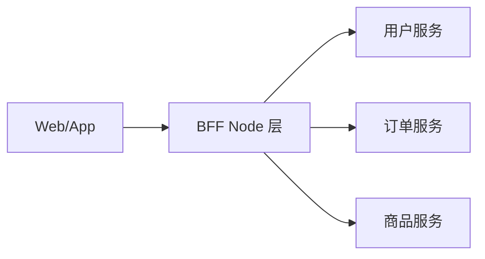

# Node.js 与 BFF 服务端

## 学习目标

- 理解 Node 事件循环与浏览器的差异
- 掌握 BFF 层设计、中间件模式、SSR 服务部署
- 能在面试中设计前端网关/BFF 架构

## 为什么需要

阿里/腾讯/字节中台、SSR、微前端场景普遍需要 Node 中间层。架构师需懂 Node 边界：何时用 BFF、如何保障性能与安全。

## 一、Node 事件循环差异

| 阶段 | 浏览器 | Node.js |
|------|--------|---------|
| 微任务 | Promise、MutationObserver | Promise、process.nextTick |
| 宏任务 | setTimeout、IO、UI | setTimeout、setImmediate、IO |
| 特有 | requestAnimationFrame | process.nextTick（微任务优先）、setImmediate |

```javascript
// 经典输出题
setTimeout(() => console.log('timeout'), 0);
setImmediate(() => console.log('immediate'));
process.nextTick(() => console.log('nextTick'));
Promise.resolve().then(() => console.log('promise'));
// nextTick → promise → timeout/immediate（取决于上下文）
```

**架构启示**：
- CPU 密集任务阻塞事件循环 → 用 Worker Threads 或拆服务
- 大文件用 Stream，避免一次性读入内存

## 二、Stream 与背压

```javascript
import { createReadStream, createWriteStream } from 'fs';
import { pipeline } from 'stream/promises';

await pipeline(
  createReadStream('large.zip'),
  transformStream,
  createWriteStream('out.zip')
);
// pipeline 自动处理背压（backpressure）
```

## 三、BFF 架构



**BFF 职责**：
- **聚合**：多接口合并为一次请求，减少客户端往返
- **裁剪**：按端（Web/App/小程序）返回不同字段
- **鉴权**：统一 token 校验、权限
- **适配**：协议转换、错误码统一
- **缓存**：热点数据短期缓存

**示例（Express）**：

```javascript
app.get('/api/dashboard', async (req, res) => {
  const [user, orders, stats] = await Promise.all([
    userService.getProfile(req.userId),
    orderService.getRecent(req.userId),
    statsService.getSummary(req.userId),
  ]);
  res.json({ user, orders, stats });
});
```

## 四、中间件模式

```javascript
// 洋葱模型
function compose(middlewares) {
  return (ctx) => middlewares.reduceRight(
    (next, fn) => () => fn(ctx, next),
    () => Promise.resolve()
  )();
}
```

**常用中间件**：日志、CORS、鉴权、限流、错误处理、请求 ID（TraceId）。

## 五、SSR 服务

- Next.js / Nuxt 的 Node 服务处理 SSR、API Routes
- 部署：PM2 集群、Docker、K8s
- 关注：冷启动、内存泄漏、连接池

## 六、cluster 多进程与 PM2

```javascript
import cluster from 'cluster';
import os from 'os';

if (cluster.isPrimary) {
  const cpus = os.cpus().length;
  for (let i = 0; i < cpus; i++) cluster.fork();
  cluster.on('exit', (worker) => {
    console.log(`Worker ${worker.process.pid} died, restarting...`);
    cluster.fork(); // 进程守护
  });
} else {
  // 每个 worker 独立事件循环，共享同一端口
  require('./app.js');
}
```

**PM2 常用**：
```bash
pm2 start app.js -i max          # 集群模式，CPU 核数
pm2 reload app                   # 零停机热重载
pm2 monit                        # 监控 CPU/内存
```

### 优雅退出

```javascript
process.on('SIGTERM', async () => {
  server.close(() => console.log('HTTP closed'));
  await drainConnections();  // 等待进行中请求完成
  process.exit(0);
});
```

## 七、内存调优与泄漏排查

| 手段 | 用途 |
|------|------|
| `node --inspect` | Chrome DevTools 连 Node 堆 |
| `heapdump` / `clinic heapprofiler` | 生成堆快照对比 |
| `process.memoryUsage()` | rss/heapUsed 监控 |

**常见泄漏**：全局 Map 无限增长、闭包持有大对象、未清理定时器/EventEmitter。

## 八、限流中间件（手写）

```javascript
function rateLimit({ windowMs = 60000, max = 100 } = {}) {
  const hits = new Map();
  return (req, res, next) => {
    const key = req.ip;
    const now = Date.now();
    const bucket = hits.get(key) || { count: 0, reset: now + windowMs };
    if (now > bucket.reset) { bucket.count = 0; bucket.reset = now + windowMs; }
    bucket.count++;
    hits.set(key, bucket);
    if (bucket.count > max) return res.status(429).json({ error: 'Too Many Requests' });
    next();
  };
}
```

**Token Bucket / 滑动窗口** 适合更高精度限流；生产可用 `express-rate-limit` + Redis 分布式限流。

## 面试高频问答（追问链）

> 大厂对一个考点通常追问到能力边界：**概念 → 机制 → 边界 → ⭐ 原理（触底）→ 实战（落地）**。实战层是区分「背过」和「做过」的关键。

### 链一：BFF 架构

1. **概念**：为什么需要 BFF？→ 聚合降 RTT、按端裁剪、统一鉴权与错误、隔离后端复杂度。
2. **机制**：BFF 和 API Gateway 区别？→ BFF 面向特定前端产品；Gateway 面向全公司流量治理。
3. **边界**：BFF 会不会变成新的「大泥球」？→ 会，需限定职责（聚合/裁剪/适配），不放业务逻辑。
4. **应用**：怎么保障 BFF 稳定性？→ 超时、熔断、限流、降级缓存、健康检查、无状态水平扩展。
5. ⭐ **原理（触底）**：手写一个令牌桶限流中间件的核心逻辑？→ 按时间补充令牌、请求取令牌、不足则拒绝/排队；分布式需 Redis + Lua 保证原子（见本章限流实现）。
6. **实战（落地）**：你设计的 BFF 怎么保障聚合性能和稳定性？→ Dashboard 串行调多个后端接口首屏慢，落地 BFF 用 `Promise.all` 并发聚合 + 按端裁剪字段 + 热点数据短缓存 + 超时/熔断/限流中间件；验证压测下从多次往返降到一次、某下游挂掉时降级返回缓存不雪崩；结果首屏接口耗时下降、BFF 无状态水平扩展抗住峰值。

### 链二：Node 运行时

1. **概念**：Node 适合 CPU 密集吗？→ 不适合，单线程事件循环会被阻塞。
2. **机制**：怎么处理 CPU 密集？→ Worker Threads / 拆服务 / 换语言；大文件用 Stream + 分片 + 对象存储直传。
3. **边界**：cluster 和 Worker Threads 区别？→ cluster 多进程共享端口适合 IO；Worker Threads 同进程多线程适合 CPU。
4. **应用**：PM2 reload 和 restart？→ reload 零停机逐个替换 worker；restart 直接重启。
5. ⭐ **原理（触底）**：Node 内存泄漏怎么定位？背压（backpressure）不处理会怎样？→ 多时间点 heap snapshot 对比找增长对象（全局缓存/闭包/定时器）；Stream 不处理背压会内存暴涨 OOM，需 pipe/await drain。
6. **实战（落地）**：线上 Node 服务内存涨/CPU 打满你怎么定位修复？→ 服务运行几天内存持续涨最终 OOM，落地多时间点 `heapdump` 对比定位到全局 Map 无限增长 + 未清理定时器；修复加 LRU 上限 + 清理定时器 + Stream 处理大文件防背压 + CPU 密集任务移到 Worker Threads；验证内存曲线平稳、`process.memoryUsage` 不再单调增、压测无 OOM；结果服务稳定、事件循环不再被阻塞。

## 小结

- Node 事件循环有 nextTick/setImmediate，与浏览器不同
- BFF 核心价值：聚合、裁剪、鉴权、适配
- cluster + PM2 多进程利用多核，Worker Threads 处理 CPU 密集
- Stream 处理大文件，限流防雪崩，优雅退出保障发布安全
- 内存用 heap snapshot 对比排查泄漏

## 延伸阅读

- [Node.js Event Loop](https://nodejs.org/en/docs/guides/event-loop-timers-and-nexttick)
- [BFF Pattern - Sam Newman](https://samnewman.io/patterns/architectural/bff/)
