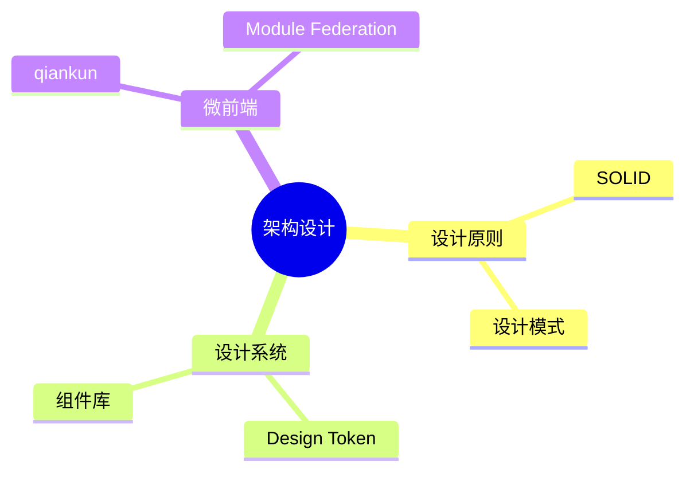

# 04-架构设计 · 本章导读

## 模块定位

架构设计是将工程化能力转化为**可扩展、可维护**系统结构的关键。涵盖设计原则、设计系统、微前端等。

## 知识地图

## 章节列表

| 文件 | 主题 |
|------|------|
| [01-设计原则与模式](./01-设计原则与模式.md) | SOLID、前端设计模式 |
| [02-组件库与设计系统](./02-组件库与设计系统.md) | Token、主题化 |
| [03-微前端架构](./03-微前端架构.md) | 微前端方案 |
| [04-前端系统设计专题](./04-前端系统设计专题.md) | 监控SDK/低代码/编辑器/IM |

## 前置依赖

完成 [01-基础内功](../01-基础内功/00-本章导读.md)、[02-框架与底层原理](../02-框架与底层原理/00-本章导读.md)、[03-工程化](../03-工程化/00-本章导读.md)。

## 自测清单

- [ ] SOLID 原则在前端如何体现？
- [ ] Design Token 和设计系统的关系？
- [ ] 微前端解决什么问题？有哪些实现方案？
- [ ] 如何设计监控 SDK / 大文件断点续传 / 低代码引擎？
- [ ] 能手写沙箱（快照/Proxy）和设计模式（策略/观察者）？
- [ ] 富文本编辑器数据模型？IM 消息乱序怎么处理？
