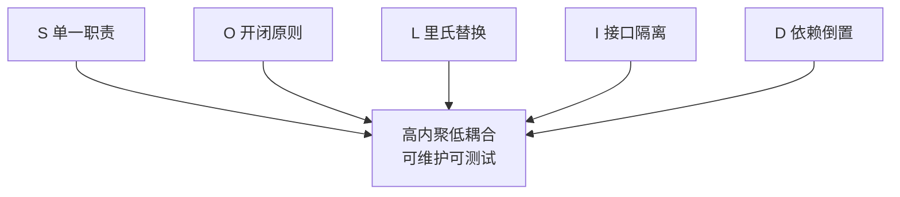

# 设计原则与模式

## 学习目标

- 能在 Code Review 中识别坏味道并用原则指导重构
- 掌握「识别 → 重构 → 验证」闭环
- 能落地 Feature 目录规范与 CR 检查清单

## 为什么需要

项目变大后，问题不是「不会写组件」，而是「组件职责混乱、改一处崩三处」。

> 核心心法：**SOLID 不是论文，是 CR 时可执行的问句。** 「这个组件是否只有一个变化理由？」

---

## 一、原理：SOLID 原则与设计模式

### SOLID 五原则（前端语境）



| 原则 | 含义 | 前端落地 | 违反信号 |
|------|------|---------|---------|
| **SRP** 单一职责 | 一个模块只有一个变化理由 | 数据用 hook、UI 纯展示、页面只组合 | 组件既请求又渲染又处理表单 |
| **OCP** 开闭原则 | 对扩展开放、对修改关闭 | 用 variant 映射/策略表代替改原组件 | 加类型就改巨型 switch |
| **LSP** 里氏替换 | 子类型可替换父类型 | 封装组件保持与原生一致的 props 契约 | 自定义 Input 不支持 onChange |
| **ISP** 接口隔离 | 不强迫依赖用不到的接口 | 拆小 props/细粒度 hook | 一个组件 30 个 props |
| **DIP** 依赖倒置 | 依赖抽象而非具体 | 组件依赖注入的数据源/service，便于 mock | 组件内直接 `fetch('/api')` |

```typescript
// DIP 示例：依赖抽象，便于替换与测试
interface UserSource { getUsers(): Promise<User[]>; }
function useUserList(source: UserSource) {  // 不关心是 fetch 还是 mock
  return useQuery({ queryKey: ['users'], queryFn: () => source.getUsers() });
}
```

### 设计模式的本质

设计模式是「**针对反复出现的问题的、被验证过的解法模板**」。前端最常用的几类：

| 模式 | 解决的问题 | 原理 |
|------|-----------|------|
| 策略（Strategy） | 多分支算法切换 | 把每种算法封装成可替换的对象/函数，运行时选用 |
| 适配器（Adapter） | 接口不兼容 | 包一层把 A 接口转成 B 接口 |
| 组合组件（Compound） | 灵活配置的复合 UI | 父子组件通过 Context 隐式通信，对外是整体 |
| 观察者（Observer） | 状态变化通知 | 发布订阅，解耦生产者与消费者（响应式、事件总线） |
| 工厂（Factory） | 按条件创建对象 | 把创建逻辑集中，调用方不关心具体类型 |

> **YAGNI 与 KISS：** 模式是用来「降低已出现的复杂度」，不是提前套用。没有重复/变化诉求时，直白的代码优于模式。过度设计和上帝组件一样是坏味道。

---

## 二、CR 检查清单（可直接贴到 PR 模板）

| 原则 | Review 问句 | 红灯信号 |
|------|------------|---------|
| SRP | 改 A 功能是否要改这个文件？ | 500 行 + 请求+表单+图表 |
| OCP | 加新 variant 是否要改原组件？ | 巨型 switch |
| DIP | 能否 mock 数据源做测试？ | 组件内直接 fetch |
| 组合 | 能否拆成更小子组件？ | props 20+ |

---

## 三、坏味道 → 重构 → 验证

### 案例 A：上帝组件（违反 SRP）

**Before：** `UserPage.tsx` 800 行，含 tab、表格、权限、导出

**重构步骤：**

1. 拆 `UserTable`、`UserFilters`、`ExportButton`
2. 数据 `useUsers()` hook，UI 纯展示
3. 页面只做组合

**验证：** 单测可测 hook；Profiler 改 filter 不 rerender 整表（memo 子项）

### 案例 B：Props  drilling（应用组合/DI）

**Before：** 5 层传 `theme`

**After：** Context 仅 theme token / 或 CSS variables；业务 state 不下沉

### 案例 C：重复校验逻辑（策略模式）

```typescript
const rules = {
  email: (v: string) => /\S+@\S+/.test(v) || '邮箱无效',
  required: (v: string) => v.length > 0 || '必填',
};
function validate(values: Record<string, string>, fields: string[]) {
  return fields.reduce((err, f) => {
    const msg = rules[f]?.(values[f]);
    return msg ? { ...err, [f]: msg } : err;
  }, {});
}
```

---

## 四、目录落地（Feature-Sliced）

```
src/
├── app/           # 路由、Provider
├── pages/         # 页面组合
├── features/      # auth, checkout — 业务用例
├── entities/      # user, product — 实体 UI+model
├── shared/        # Button, api, utils
```

**规则：** features 可依赖 entities/shared，禁止 features 互相 import。

---

## 五、模式选用表

| 场景 | 模式 | 避免 |
|------|------|------|
| 逻辑复用 | Custom Hook | 嵌套 5 层 HOC |
| Tabs/Modal | Compound Components | 巨型 props |
| 多支付方式 | Strategy | if-else 堆叠 |
| API 差异 | Adapter | 页面里 parse 三种格式 |

---

## 项目落地步骤

1. 定 CR 清单（上表）全员共识
2. 选一个最烂页面做 refactor pilot
3. eslint `max-lines`、import 边界规则
4. 复盘：bug 率、PR 大小、review 时间

---

## 设计模式手写（前端落地）

```javascript
// 观察者 / 发布订阅
class EventBus { /* 同 EventEmitter */ }

// 单例
const Config = (() => { let inst; return { get() { return inst ??= {}; } }; })();

// 策略模式
const payStrategies = { wechat: payWechat, alipay: payAlipay };
function pay(type, amount) { return payStrategies[type](amount); }

// 装饰器（增强函数）
function withLog(fn) {
  return (...args) => { console.log('call', fn.name); return fn(...args); };
}
```

## 面试高频问答（追问链）

> 大厂对一个考点通常追问到能力边界：**概念 → 机制 → 边界 → ⭐ 原理（触底）→ 实战（落地）**。实战层是区分「背过」和「做过」的关键。

### 链一：SOLID 与模式落地

1. **概念**：SOLID 在前端怎么体现？→ SRP 拆组件、OCP 扩展 props、DIP 依赖注入 Context。
2. **机制**：策略 vs 工厂区别？→ 策略换算法行为，工厂创建对象。
3. **边界**：什么时候不用设计模式？→ 无重复/变化时 YAGNI，直白代码优先。
4. ⭐ **原理（触底）**：举一个你用设计模式重构的真实例子，量化收益？→ 如多渠道支付用策略模式替代 if-else，新增渠道改动从 N 处降为 1 处、圈复杂度下降、单测可独立（附 before/after）。
5. **实战（落地）**：讲一个你用设计模式重构上帝组件的真实案例和量化收益？→ `UserPage` 800 行混了请求/表单/图表，落地按 SRP 拆 `useUsers` hook + 子组件 + 策略表替代校验 if-else；验证单测可独立测 hook、Profiler 显示改 filter 不重渲染整表、文件行数从 800 降到 <200；结果 bug 率下降、PR 变小、review 时间缩短。

### 链二：架构分层

1. **概念**：Feature-Sliced 分层？→ app/pages/widgets/features/entities/shared。
2. **机制**：分层依赖方向规则？→ 上层依赖下层、同层不互相依赖、shared 最底。
3. **应用**：怎么防止循环依赖与跨层耦合？→ ESLint 边界规则（如 import/no-restricted-paths）。
4. ⭐ **原理（触底）**：业务复杂度上升时，怎么判断该拆分层/拆包/拆服务？→ 看变更耦合度与团队边界，按康威定律对齐组织；先模块化再考虑物理拆分，避免过早拆分带来分布式成本。
5. **实战（落地）**：你怎么在团队里落地分层规范防止架构腐化？→ 项目 features 互相 import 导致循环依赖，落地 Feature-Sliced 目录 + ESLint `import/no-restricted-paths` 强制依赖方向 + `max-lines`；验证违规 import 在 CI 直接报错、依赖图无环、新人按目录约定开发；结果跨层耦合被工具拦住、模块边界清晰、后续按需才物理拆包。

## 小结

- SOLID 五原则核心是高内聚低耦合，落地为 CR 问句与目录规范
- 设计模式是针对重复问题的解法模板（策略/适配器/组合/观察者/工厂）
- 重构必附 before/after（行数、测试、Profiler）
- YAGNI/KISS：没有重复或变化诉求时，直白代码优于模式

## 延伸阅读

- [Refactoring - Martin Fowler](https://refactoring.com/)
- [Feature-Sliced Design](https://feature-sliced.design/)
