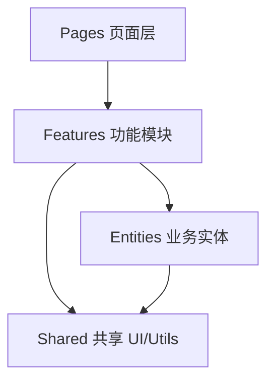

# 设计原则与模式

## 学习目标

- 理解 SOLID 原则在前端的应用
- 掌握常见前端设计模式：HOC、Render Props、Compound Components
- 了解关注点分离与分层架构
- 能在组件/模块设计中应用原则

## 为什么需要

随着项目规模增长，代码易出现：

- 组件职责过重、难以测试
- 修改一处影响多处
- 重复逻辑散落各处

设计原则与模式提供**可复用的结构经验**，帮助架构师建立一致的代码组织方式。

## 核心原理

### 1. SOLID 原则

**S - 单一职责（Single Responsibility）**

```tsx
// 反模式：一个组件做太多
function UserDashboard() {
  // 获取数据、渲染图表、处理表单、权限检查...
}

// 正模式：拆分
function UserDashboard() {
  return (
    <>
      <UserProfile userId={id} />
      <UserChart data={chartData} />
      <UserSettings onSave={handleSave} />
    </>
  );
}
```

**O - 开闭（Open/Closed）**

对扩展开放，对修改关闭。

```tsx
// 通过组合扩展，而非修改原组件
function Button({ variant = 'primary', children, ...props }) {
  const styles = {
    primary: 'bg-blue-500',
    secondary: 'bg-gray-500',
    danger: 'bg-red-500'
  };
  return <button className={styles[variant]} {...props}>{children}</button>;
}
```

**L - 里氏替换（Liskov Substitution）**

子类型可替换父类型。React 中：props 接口保持一致，不破坏预期行为。

**I - 接口隔离（Interface Segregation）**

```tsx
// 反模式：臃肿 props
interface ButtonProps {
  onClick, loading, icon, tooltip, badge, ... // 20+ props
}

// 正模式：拆分或组合
interface ButtonProps { onClick; children; variant?; }
interface IconButtonProps extends ButtonProps { icon: ReactNode; }
```

**D - 依赖倒置（Dependency Inversion）**

依赖抽象而非具体实现。

```tsx
// 依赖注入 — 便于测试和替换
function UserList({ fetchUsers = defaultFetchUsers }) {
  const [users, setUsers] = useState([]);
  useEffect(() => { fetchUsers().then(setUsers); }, [fetchUsers]);
  return users.map(u => <UserCard key={u.id} user={u} />);
}
```

### 2. 前端设计模式

**Compound Components（复合组件）：**

```tsx
const Tabs = ({ children, defaultIndex = 0 }) => {
  const [index, setIndex] = useState(defaultIndex);
  return (
    <TabsContext.Provider value={{ index, setIndex }}>
      {children}
    </TabsContext.Provider>
  );
};
Tabs.List = TabList;
Tabs.Panel = TabPanel;

// 使用
<Tabs defaultIndex={0}>
  <Tabs.List>
    <Tabs.Tab index={0}>Tab 1</Tabs.Tab>
    <Tabs.Tab index={1}>Tab 2</Tabs.Tab>
  </Tabs.List>
  <Tabs.Panel index={0}>Content 1</Tabs.Panel>
  <Tabs.Panel index={1}>Content 2</Tabs.Panel>
</Tabs>
```

**Render Props / Custom Hooks：**

```tsx
// 逻辑复用 — Custom Hook 是现代首选
function useFetch(url) {
  const [data, setData] = useState(null);
  const [loading, setLoading] = useState(true);
  useEffect(() => {
    fetch(url).then(r => r.json()).then(setData).finally(() => setLoading(false));
  }, [url]);
  return { data, loading };
}
```

**Container/Presentational：**

```tsx
// Container — 数据与逻辑
function UserListContainer() {
  const { data, loading } = useFetch('/api/users');
  if (loading) return <Spinner />;
  return <UserListView users={data} />;
}

// Presentational — 纯展示
function UserListView({ users }) {
  return <ul>{users.map(u => <li key={u.id}>{u.name}</li>)}</ul>;
}
```

### 3. 分层架构



**Feature-Sliced Design 思路：**

```
src/
├── app/          # 应用入口、路由
├── pages/        # 页面
├── features/     # 功能模块（auth、cart）
├── entities/     # 业务实体（user、product）
├── shared/       # UI 组件、utils、api
```

## 常见误区与最佳实践

| 误区 | 正确理解 |
|------|---------|
| "设计模式越多越好" | 简单场景 YAGNI，过度抽象增加复杂度 |
| "HOC 是最佳复用" | Hooks 更简洁，HOC 仍有场景（如 withRouter） |
| "SOLID 只适用于 OOP" | 原则适用于模块/组件设计 |
| "文件夹结构不重要" | 结构体现架构，影响可维护性 |

**最佳实践：**

- 组件超 300 行考虑拆分
- 业务逻辑抽到 hooks 或 service
- 建立团队目录规范，新功能按 feature 组织
- CR 时关注职责是否单一

## 小结

- SOLID 指导组件与模块设计
- Compound Components、Hooks 是主流复用方式
- 分层/Feature 结构提升可维护性
- 原则服务于可读性和可测试性，避免过度设计

## 延伸阅读

- [Patterns.dev](https://www.patterns.dev/)
- [Feature-Sliced Design](https://feature-sliced.design/)
- 《重构》Martin Fowler
