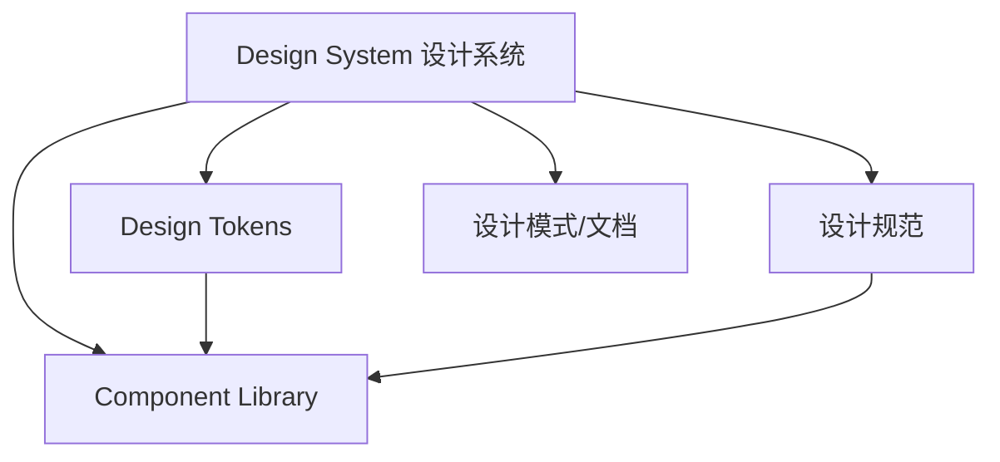
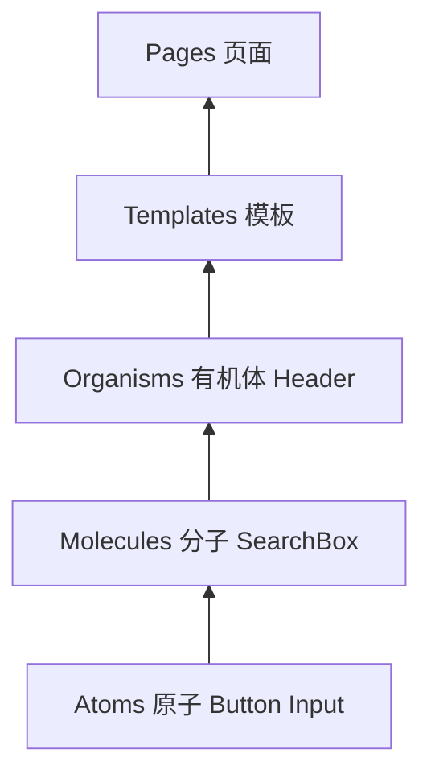

# 组件库与设计系统

## 学习目标

- 理解 Design System 与 Component Library 的关系
- 掌握 Design Token 的概念与实现
- 了解组件库架构：原子设计、主题化
- 能规划团队设计系统的技术方案

## 为什么需要

多产品、多团队协作时，UI 不一致导致：

- 用户体验割裂
- 重复开发相同组件
- 品牌视觉难以统一

设计系统提供**设计决策的单一来源**，组件库是其工程实现。

## 核心原理

### 1. 设计系统层次



| 层次 | 说明 | 示例 |
|------|------|------|
| Design Tokens | 设计决策的原子值 | color.primary, spacing.md |
| 组件库 | 可复用 UI 组件 | Button, Input, Modal |
| 设计规范 | 使用指南 | 何时用 primary button |
| 设计模式 | 组合模式 | 表单布局、空状态 |

### 2. Design Token

```javascript
// tokens.js — 设计 token 定义
export const tokens = {
  color: {
    primary: { value: '#0066cc' },
    text: { value: '#333333' },
    background: { value: '#ffffff' }
  },
  spacing: {
    xs: { value: '4px' },
    sm: { value: '8px' },
    md: { value: '16px' },
    lg: { value: '24px' }
  },
  radius: {
    sm: { value: '4px' },
    md: { value: '8px' }
  },
  typography: {
    fontSize: {
      sm: { value: '14px' },
      md: { value: '16px' },
      lg: { value: '20px' }
    }
  }
};
```

**CSS Variables 实现主题：**

```css
:root {
  --color-primary: #0066cc;
  --color-text: #333;
  --spacing-md: 16px;
}

[data-theme="dark"] {
  --color-primary: #4da6ff;
  --color-text: #eee;
}
```

```tsx
function Button({ variant = 'primary', children }) {
  return (
    <button
      style={{
        background: 'var(--color-primary)',
        padding: 'var(--spacing-md)'
      }}
    >
      {children}
    </button>
  );
}
```

### 3. 原子设计（Atomic Design）



- **Atoms**：Button、Input、Label
- **Molecules**：SearchBox = Input + Button
- **Organisms**：Header = Logo + Nav + SearchBox

### 4. 组件库架构

```
design-system/
├── packages/
│   ├── tokens/        # Design Tokens
│   ├── icons/         # 图标
│   ├── components/    # React 组件
│   └── docs/          # Storybook 文档
├── apps/
│   └── storybook/     # 组件文档站
```

**组件 API 设计原则：**

```tsx
interface ButtonProps {
  variant?: 'primary' | 'secondary' | 'ghost';
  size?: 'sm' | 'md' | 'lg';
  disabled?: boolean;
  loading?: boolean;
  children: React.ReactNode;
  onClick?: () => void;
}

// 一致性：variant、size 命名统一
// 可组合：asChild、leftIcon、rightIcon
// 可访问：aria-*、keyboard 支持
```

### 5. Storybook 文档化

```tsx
// Button.stories.tsx
export default {
  title: 'Components/Button',
  component: Button
};

export const Primary = {
  args: { variant: 'primary', children: 'Button' }
};

export const AllVariants = () => (
  <div style={{ display: 'flex', gap: 8 }}>
    <Button variant="primary">Primary</Button>
    <Button variant="secondary">Secondary</Button>
  </div>
);
```

## 常见误区与最佳实践

| 误区 | 正确理解 |
|------|---------|
| "组件库 = 设计系统" | 设计系统包含规范、token、模式，组件库是部分 |
| "直接抄 Ant Design 就行" | 需品牌化 token 和部分定制 |
| "Token 就是 CSS 变量" | Token 是抽象层，可输出 CSS/JS/iOS 等 |
| "组件越全越好" | 优先核心组件，按需扩展 |

**最佳实践：**

- Token 先行，组件消费 token
- Monorepo 管理 tokens + components + docs
- Storybook 作为唯一文档源
- em  Semver 发布，breaking change 大版本

## 小结

- 设计系统 = Token + 规范 + 组件库 + 文档
- Design Token 是主题化和一致性的基础
- 原子设计指导组件分层
- Storybook 文档化，Monorepo 工程化

## 延伸阅读

- [Design Tokens W3C](https://design-tokens.github.io/community-group/format/)
- [Storybook 文档](https://storybook.js.org/)
- [Atomic Design - Brad Frost](https://atomicdesign.bradfrost.com/)
