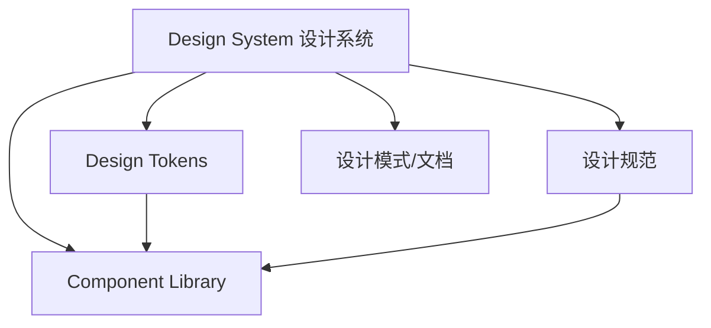
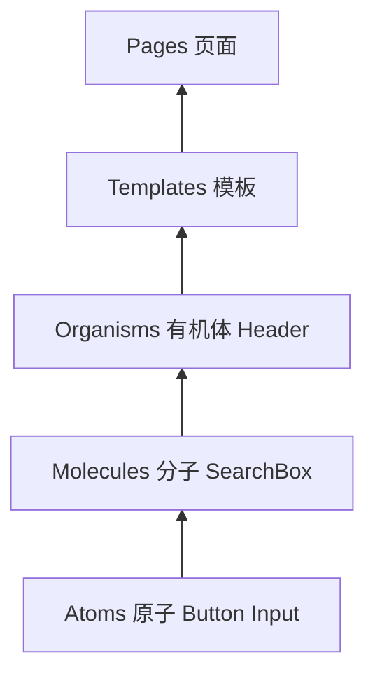

# 组件库与设计系统

## 学习目标

- 理解 Design System 与 Component Library 的关系
- 掌握 Design Token 的概念与实现
- 了解组件库架构：原子设计、主题化
- 能规划团队设计系统的技术方案

## 为什么需要

多产品、多团队协作时，UI 不一致导致：

- 用户体验割裂
- 重复开发相同组件
- 品牌视觉难以统一

设计系统提供**设计决策的单一来源**，组件库是其工程实现。

## 核心原理

### 1. 设计系统层次



| 层次 | 说明 | 示例 |
|------|------|------|
| Design Tokens | 设计决策的原子值 | color.primary, spacing.md |
| 组件库 | 可复用 UI 组件 | Button, Input, Modal |
| 设计规范 | 使用指南 | 何时用 primary button |
| 设计模式 | 组合模式 | 表单布局、空状态 |

### 2. Design Token

```javascript
// tokens.js — 设计 token 定义
export const tokens = {
  color: {
    primary: { value: '#0066cc' },
    text: { value: '#333333' },
    background: { value: '#ffffff' }
  },
  spacing: {
    xs: { value: '4px' },
    sm: { value: '8px' },
    md: { value: '16px' },
    lg: { value: '24px' }
  },
  radius: {
    sm: { value: '4px' },
    md: { value: '8px' }
  },
  typography: {
    fontSize: {
      sm: { value: '14px' },
      md: { value: '16px' },
      lg: { value: '20px' }
    }
  }
};
```

**CSS Variables 实现主题：**

```css
:root {
  --color-primary: #0066cc;
  --color-text: #333;
  --spacing-md: 16px;
}

[data-theme="dark"] {
  --color-primary: #4da6ff;
  --color-text: #eee;
}
```

```tsx
function Button({ variant = 'primary', children }) {
  return (
    <button
      style={{
        background: 'var(--color-primary)',
        padding: 'var(--spacing-md)'
      }}
    >
      {children}
    </button>
  );
}
```

### 3. 原子设计（Atomic Design）



- **Atoms**：Button、Input、Label
- **Molecules**：SearchBox = Input + Button
- **Organisms**：Header = Logo + Nav + SearchBox

### 4. 组件库架构

```
design-system/
├── packages/
│   ├── tokens/        # Design Tokens
│   ├── icons/         # 图标
│   ├── components/    # React 组件
│   └── docs/          # Storybook 文档
├── apps/
│   └── storybook/     # 组件文档站
```

**组件 API 设计原则：**

```tsx
interface ButtonProps {
  variant?: 'primary' | 'secondary' | 'ghost';
  size?: 'sm' | 'md' | 'lg';
  disabled?: boolean;
  loading?: boolean;
  children: React.ReactNode;
  onClick?: () => void;
}

// 一致性：variant、size 命名统一
// 可组合：asChild、leftIcon、rightIcon
// 可访问：aria-*、keyboard 支持
```

### 5. Storybook 文档化

```tsx
// Button.stories.tsx
export default {
  title: 'Components/Button',
  component: Button
};

export const Primary = {
  args: { variant: 'primary', children: 'Button' }
};

export const AllVariants = () => (
  <div style={{ display: 'flex', gap: 8 }}>
    <Button variant="primary">Primary</Button>
    <Button variant="secondary">Secondary</Button>
  </div>
);
```

### 6. 受控与非受控组件

```tsx
// 受控 — 状态由 React 管理
<input value={value} onChange={e => setValue(e.target.value)} />

// 非受控 — DOM 自身管理，ref 读取
<input defaultValue="hello" ref={inputRef} />
```

表单复杂时用受控；简单场景或非 React 集成可用非受控。

### 7. 可访问性（a11y）

```tsx
<button aria-label="关闭" aria-pressed={isOpen}>
  <CloseIcon aria-hidden />
</button>

// 键盘：Tab 顺序、Enter/Space 触发、Esc 关闭 Modal
// 焦点管理：Modal 打开时 focus trap
```

WCAG 2.1 等级 AA 是常见合规目标。

### 8. Headless UI 与 API 设计

**Radix / Headless UI：** 只提供行为与 a11y，样式完全自定义。

```tsx
// polymorphic — 渲染为不同元素
<Button as="a" href="/home">Link Button</Button>

// asChild / Slot — 合并 props 到子元素
<Button asChild>
  <a href="/home">Home</a>
</Button>
```

### 9. i18n 与 Style Dictionary

```tsx
import { useTranslation } from 'react-i18next';
const { t } = useTranslation();
<span>{t('welcome', { name: user.name })}</span>
```

**Style Dictionary：** Token 定义一次，输出 CSS/JS/iOS/Android 多端格式。

### 10. 视觉回归（Chromatic）

Storybook + Chromatic 对组件截图对比，PR 中自动检测 UI 意外变更。

---

## 实战：从 0 做一个 Button（半天）

1. **Token：** `--color-primary`, `--spacing-md` in `:root`
2. **组件：** variant/size/disabled/loading props
3. **Storybook：** Primary, Secondary, Loading stories
4. **测试：** `@testing-library/react` 点击 + a11y axe
5. **发布：** `@myorg/ui` workspace 包，app `import { Button } from '@myorg/ui'`

**验证：** Storybook 文档齐全；改 token 全局主题变；单元测试 CI 绿。

## 常见误区与最佳实践

| 误区 | 正确理解 |
|------|---------|
| "组件库 = 设计系统" | 设计系统包含规范、token、模式，组件库是部分 |
| "直接抄 Ant Design 就行" | 需品牌化 token 和部分定制 |
| "Token 就是 CSS 变量" | Token 是抽象层，可输出 CSS/JS/iOS 等 |
| "组件越全越好" | 优先核心组件，按需扩展 |

**最佳实践：**

- Token 先行，组件消费 token
- Monorepo 管理 tokens + components + docs
- Storybook 作为唯一文档源
- Semver 发布，breaking change 走大版本

## 复杂组件设计（Table / Form 引擎）

**Table**：虚拟滚动 + 列配置化 + 受控排序筛选 + 服务端分页。
**Form**：Schema 驱动 + 字段联动 `visibleWhen` + 异步校验 + 嵌套表单。

```typescript
interface FormField {
  name: string;
  type: 'input' | 'select';
  rules?: Rule[];
  visibleWhen?: (values: Record<string, unknown>) => boolean;
}
```

**按需加载**：`package.json exports` 子路径 + `sideEffects:false` + ESM。

## 面试高频问答（追问链）

> 大厂对一个考点通常追问到能力边界：**概念 → 机制 → 边界 → ⭐ 原理（触底）→ 实战（落地）**。实战层是区分「背过」和「做过」的关键。

### 链一：组件设计

1. **概念**：受控和非受控组件？→ 受控 value 由 React 管，非受控 ref/DOM 管。
2. **机制**：Headless UI 价值？→ 逻辑与样式分离，灵活定制外观。
3. **应用**：复杂组件（Table/Form）怎么设计 API？→ 组合式 + 配置式双形态、插槽/render props 扩展。
4. ⭐ **原理（触底）**：设计一个高性能可扩展的 Table 引擎要解决什么？→ 大数据虚拟滚动、列固定/合并、可编辑、受控选择、按需渲染与 memo 控制重渲染（见本章 Table 引擎）。
5. **实战（落地）**：你设计过的最复杂组件（如 Table 引擎）怎么落地的？→ 万级数据表格卡顿，落地虚拟滚动 + 列配置化 + 受控排序筛选 + 服务端分页 + 子项 memo 控重渲染；验证滚动稳定 60fps、改单元格不整表重渲染、Storybook 覆盖各形态；结果大数据下流畅、API 兼具组合式与配置式满足多场景。

### 链二：设计系统与质量

1. **概念**：Design Token 怎么落地？→ Style Dictionary 输出 CSS/JS/iOS 多端。
2. **机制**：主题切换怎么实现？→ CSS 变量 + Token 分层（全局/语义/组件）。
3. **应用**：组件库怎么保障质量？→ Storybook + 单测 + Chromatic 视觉回归 + a11y 检查。
4. ⭐ **原理（触底）**：组件库怎么做按需加载和 Tree Shaking？→ ESM + sideEffects 标记 + 每组件独立入口/样式，配 babel-plugin-import 或 exports 子路径导出。
5. **实战（落地）**：你怎么从 0 落地团队设计系统并保障质量？→ 多产品 UI 不一致、重复造轮子，落地 Token 先行（Style Dictionary 输出多端）+ Monorepo 管 tokens/components/docs + Storybook 唯一文档源 + Chromatic 视觉回归 + a11y 检查；验证改一个 token 全局主题联动、组件 PR 自动跑视觉 diff、按需加载 Tree Shaking 生效；结果 UI 一致性提升、复用率高、breaking change 走大版本可控。

## 小结

- 设计系统 = Token + 规范 + 组件库 + 文档
- Design Token 是主题化和一致性的基础
- 原子设计指导组件分层
- Storybook 文档化，Monorepo 工程化

## 延伸阅读

- [Design Tokens W3C](https://design-tokens.github.io/community-group/format/)
- [Storybook 文档](https://storybook.js.org/)
- [Atomic Design - Brad Frost](https://atomicdesign.bradfrost.com/)
