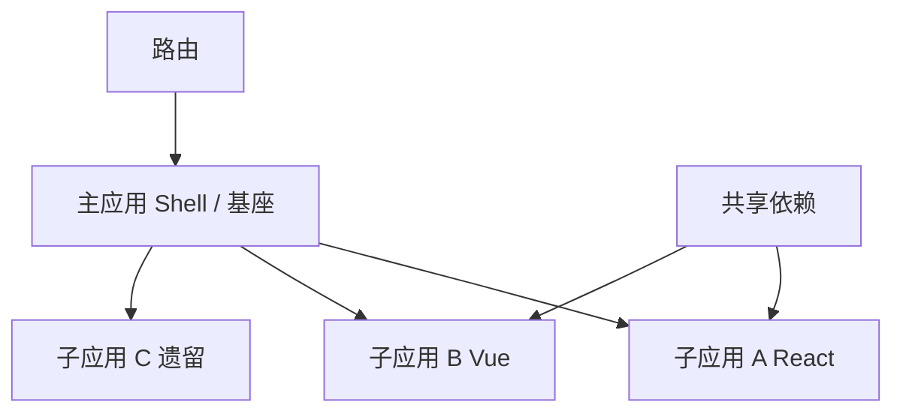
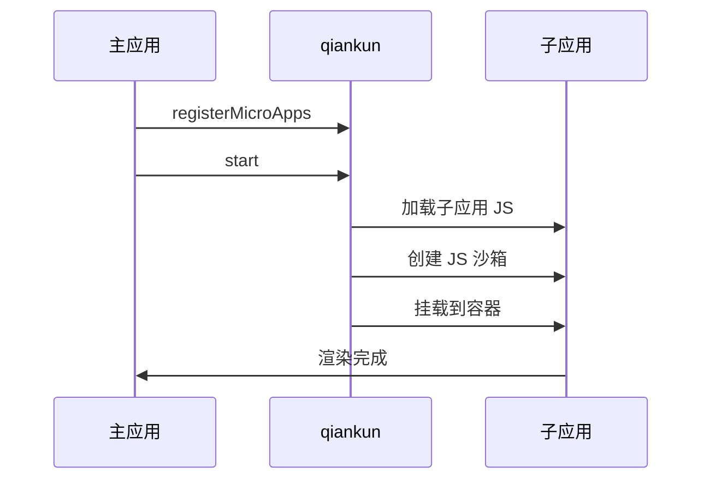
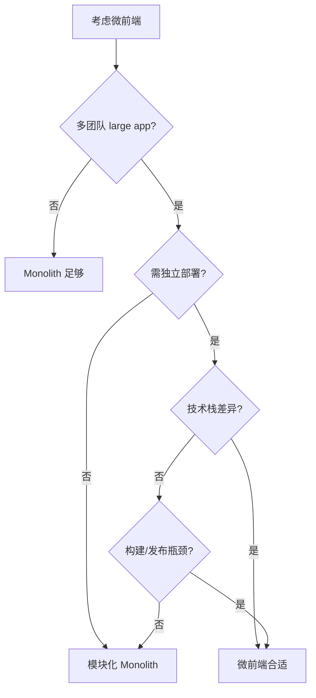

# 微前端架构

## 学习目标

- 理解微前端要解决的问题与适用场景
- 掌握 qiankun、Module Federation 等方案原理
- 了解微前端的挑战：样式隔离、路由、通信
- 能评估是否引入微前端及选型

## 为什么需要

大型组织常见问题：

- 多团队维护同一单体应用，发布耦合
- 技术栈无法升级（遗留 Angular + 新 React）
- 构建缓慢，局部变更需全量发布

微前端将**前端应用拆分为可独立开发、部署的子应用**，各团队自治。

## 核心原理

### 1. 微前端架构



**核心价值：**

- 独立开发、独立部署
- 技术栈无关
- 团队边界清晰

**代价：**

- 复杂度增加
- 包体积可能重复
- 样式、状态隔离需额外方案

### 2. 实现方案对比

| 方案 | 原理 | 优点 | 缺点 |
|------|------|------|------|
| **qiankun** | 基于 single-spa，JS 沙箱 + 样式隔离 | 成熟、框架无关 | 运行时集成 |
| **Module Federation** | Webpack 5 模块共享 | 构建时集成、共享依赖 | 绑定 Webpack |
| **iframe** | 完全隔离 | 简单、隔离好 | 体验差、通信麻烦 |
| **Web Components** | 标准组件 | 原生、隔离 | 生态、兼容性 |

### 3. qiankun 原理



```javascript
// 主应用
import { registerMicroApps, start } from 'qiankun';

registerMicroApps([
  {
    name: 'app-react',
    entry: '//localhost:3001',
    container: '#subapp-container',
    activeRule: '/react'
  },
  {
    name: 'app-vue',
    entry: '//localhost:3002',
    container: '#subapp-container',
    activeRule: '/vue'
  }
]);

start({ sandbox: { strictStyleIsolation: true } });
```

```javascript
// 子应用需导出生命周期
export async function bootstrap() { /* 初始化 */ }
export async function mount(props) { /* 渲染 */ }
export async function unmount() { /* 卸载 */ }
```

**JS 沙箱：** Proxy 代理 window，子应用全局变量不污染主应用

**样式隔离：** Shadow DOM 或 scoped CSS

### 4. Module Federation

```javascript
// webpack.config.js — 主应用
new ModuleFederationPlugin({
  name: 'shell',
  remotes: {
    app1: 'app1@http://localhost:3001/remoteEntry.js'
  },
  shared: { react: { singleton: true }, 'react-dom': { singleton: true } }
});

// 主应用使用
const RemoteApp = React.lazy(() => import('app1/App'));
```

**共享依赖：** react、react-dom 只加载一份

### 5. 关键挑战

**路由：**

- 主应用负责顶层路由
- 子应用 base 路径配置
- 浏览器前进后退同步

**通信：**

```javascript
// 自定义事件
window.dispatchEvent(new CustomEvent('global-event', { detail: data }));

// 共享状态 — 慎用，增加耦合
// props 传递、URL 参数、全局 event bus
```

**样式隔离：**

- CSS Modules、Shadow DOM
- 命名约定（BEM 前缀）
- qiankun strictStyleIsolation

### 6. 何时引入微前端



**不适合：** 小团队、小项目、无独立部署需求

## 常见误区与最佳实践

| 误区 | 正确理解 |
|------|---------|
| "微前端是银弹" | 复杂度换自治，小项目得不偿失 |
| "iframe 最简单最好用" | 体验、SEO、通信都是问题 |
| "子应用完全独立" | 需约定路由、通信、设计规范 |
| "Module Federation 只能 Webpack" | Vite 有 federation 插件 |

**最佳实践：**

- 先模块化 Monolith，确实瓶颈再微前端
- 统一 Design System，保证视觉一致
- 共享依赖 react/vue 避免重复打包
- 建立子应用模板和规范文档

## 小结

- 微前端：独立开发部署的子应用 + 主应用编排
- qiankun：运行时集成，沙箱 + 样式隔离
- Module Federation：构建时共享模块
- 引入需权衡复杂度，非小项目首选

## 延伸阅读

- [qiankun 文档](https://qiankun.umijs.org/)
- [Module Federation](https://webpack.js.org/concepts/module-federation/)
- [Micro Frontends - martinfowler.com](https://martinfowler.com/articles/micro-frontends.html)
