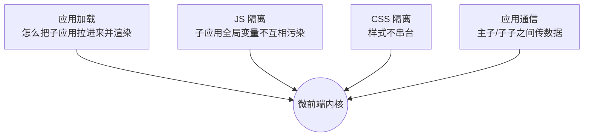
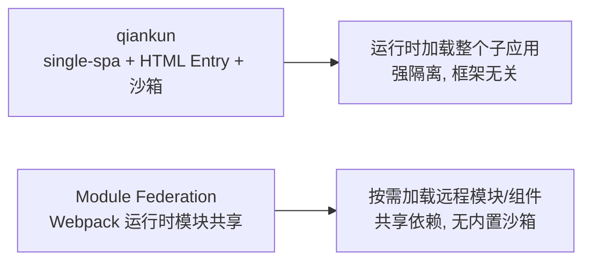

# 微前端架构

## 学习目标

- 判断项目是否真的需要微前端
- 掌握从单体拆子应用的落地步骤与踩坑排查
- 能配置 qiankun/Module Federation 并解决样式、路由、通信问题

## 为什么需要

多团队共仓库、发布互相阻塞时，微前端是选项之一——但复杂度很高，**不能为了架构而架构**。

> 核心心法：**先模块化 Monolith，确实瓶颈再微前端。** 80% 团队用不到。

---

## 一、是否需要？决策表

| 条件 | 需要微前端？ |
|------|-------------|
| 单团队 <15 人 | 否 |
| 多团队独立发布 | 可能 |
| 技术栈必须共存（Angular+React） | 是 |
| 只是代码多 | 否，拆 package |

---

## 二、底层原理：微前端要解决的核心问题

微前端 = 让多个独立应用「拼」在一个页面里且互不干扰。本质要解决四件事：



### 1. 应用加载（HTML Entry）

qiankun 用 `import-html-entry` 拉取子应用的 HTML，解析出 JS/CSS 并执行，拿到子应用导出的生命周期（bootstrap/mount/unmount）。相比只配 JS entry，HTML Entry 让子应用能独立运行、接入成本低。

### 2. JS 沙箱（隔离全局污染）

子应用会改 `window`，多个子应用切换时必须隔离：

| 沙箱类型 | 原理 | 适用 |
|---------|------|------|
| 快照沙箱（Snapshot） | mount 前记录 window 快照，unmount 时还原 | 单实例、不支持并存 |
| 代理沙箱（Proxy） | 用 Proxy 给每个子应用一个「假 window」，写入隔离到自身 | 多实例并存（现代默认） |

```javascript
// Proxy 沙箱核心思想
function createSandbox() {
  const fakeWindow = {};
  return new Proxy(window, {
    get: (target, key) => fakeWindow[key] ?? target[key],
    set: (target, key, value) => { fakeWindow[key] = value; return true; }, // 不污染真 window
  });
}
```

### 3. CSS 隔离

| 方案 | 原理 | 代价 |
|------|------|------|
| Shadow DOM（strictStyleIsolation） | 子应用挂到 shadow root，样式天然隔离 | 弹窗/portal 易出问题 |
| 运行时加作用域前缀（experimentalStyleIsolation） | 给子应用样式加 `div[data-qiankun]` 前缀 | 动态改写有开销 |
| 约定 BEM/CSS Modules | 命名空间隔离 | 靠约定 |

### 4. 应用通信

- **props 下发：** 主应用注册时把数据/方法作为 props 传给子应用。
- **全局状态：** qiankun 的 `initGlobalState` 发布订阅；或共享一个 store。
- **自定义事件：** `window.dispatchEvent(new CustomEvent(...))` 跨应用通信。

### qiankun vs Module Federation（机制本质）



- **qiankun：** 以「应用」为单位运行时集成，强隔离，框架无关；适合多技术栈、独立子应用。
- **Module Federation：** 以「模块」为单位运行时共享，依赖 `shared` 复用（如单例 React），无内置沙箱；适合同构 Webpack 体系、细粒度共享组件。

---

## 三、落地步骤（qiankun 为例）

### Phase 0：基座准备（1 周）

```javascript
// main-app
import { registerMicroApps, start } from 'qiankun';

registerMicroApps([
  {
    name: 'sub-react',
    entry: '//localhost:7100',
    container: '#subapp',
    activeRule: '/react',
  },
]);

start({ sandbox: { strictStyleIsolation: true } });
```

### Phase 1：子应用改造（每个 1-2 周）

```javascript
// sub-app 导出生命周期
export async function bootstrap() {}
export async function mount(props) {
  ReactDOM.createRoot(props.container).render(<App />);
}
export async function unmount(props) {
  root.unmount();
}
```

**Checklist：**

- [ ] 独立 `pnpm dev` 可运行
- [ ] 独立 `pnpm build` 产出
- [ ] 路由 base 与 activeRule 一致
- [ ] 公共依赖 react  externals 或 shared

### Phase 2：联调与上线

- [ ] 样式不污染（strictStyleIsolation / CSS Modules）
- [ ] 主应用路由前进后退正常
- [ ] 子应用 JS 错误不白屏主应用（ErrorBoundary）

---

## 四、问题排查

| 现象 | 原因 | 修复 |
|------|------|------|
| 子应用空白 | entry 跨域/CORS | devServer headers |
| 样式乱 | 全局 CSS 泄漏 | 沙箱/前缀 |
| 双 react | 未 shared | webpack externals |
| 路由 404 | history 模式 base | activeRule + publicPath |

---

## 五、Module Federation 快速对照

```javascript
// host webpack.config
new ModuleFederationPlugin({
  remotes: { remote: 'remote@http://localhost:3001/remoteEntry.js' },
  shared: { react: { singleton: true }, 'react-dom': { singleton: true } },
});
```

适合 Webpack 体系、需要运行时加载远程模块。

---

## 排查实战

### 案例：子应用卸载后内存涨

- **原因：** 未 unmount root / 全局 listener 未清
- **修复：** unmount 里 dispose + removeEventListener
- **验证：** Memory snapshot 稳定

---

## 沙箱手写

```javascript
// 快照沙箱（单实例）
class SnapshotSandbox {
  constructor() { this.snapshot = {}; }
  active() {
    for (const k of Object.getOwnPropertyNames(window)) {
      this.snapshot[k] = window[k];
    }
  }
  inactive() {
    for (const k of Object.getOwnPropertyNames(window)) {
      window[k] = this.snapshot[k];
    }
  }
}

// Proxy 沙箱（多实例）
class ProxySandbox {
  constructor() {
    const fakeWindow = {};
    this.proxy = new Proxy(fakeWindow, {
      get: (t, k) => k in t ? t[k] : window[k],
      set: (t, k, v) => { t[k] = v; return true; },
    });
  }
}
```

**样式隔离**：Shadow DOM（强隔离）/ CSS Modules（约定前缀）/ `strictStyleIsolation`。

## 面试高频问答（追问链）

> 大厂对一个考点通常追问到能力边界：**概念 → 机制 → 边界 → ⭐ 原理（触底）→ 实战（落地）**。实战层是区分「背过」和「做过」的关键。

### 链一：微前端选型与隔离

1. **概念**：什么时候需要微前端？→ 多团队独立交付、技术栈异构、独立发版；否则单体模块化优先。
2. **机制**：qiankun vs Module Federation？→ qiankun 应用级强隔离（HTML Entry + 沙箱）；MF 模块级共享依赖。
3. **边界**：子应用样式污染怎么隔离？→ Shadow DOM / 前缀 / CSS Modules / scoped。
4. **应用**：双 React 实例问题怎么解？→ MF shared singleton；qiankun 沙箱隔离 + 共享运行时。
5. ⭐ **原理（触底）**：JS 沙箱怎么实现？快照沙箱和 Proxy 沙箱区别？→ 快照沙箱记录/还原 window diff（单实例）；Proxy 沙箱给每个子应用 fakeWindow 代理读写（多实例并存），后者支持同时运行多个子应用（见本章手写沙箱）。
6. **实战（落地）**：你落地微前端时踩过的最大坑和怎么解决？→ 子应用切换后样式串台 + 卸载内存涨，落地 strictStyleIsolation/CSS Modules 隔离样式 + unmount 里 `root.unmount` + removeEventListener + 清定时器 + 公共依赖 externals/shared singleton 防双 React；验证多子应用并存样式不污染、Memory snapshot 稳定、无双实例报错；结果子应用独立发版、主应用稳定不白屏。

### 链二：通信与治理

1. **概念**：微前端应用间怎么通信？→ props 下发、全局事件总线、共享状态、URL。
2. **机制**：怎么避免共享状态耦合？→ 明确契约、最小共享、用事件解耦。
3. **应用**：公共依赖怎么共享避免重复加载？→ MF shared / externals + import map。
4. ⭐ **原理（触底）**：微前端最大的隐性成本是什么？→ 治理成本：版本一致性、公共依赖升级、跨应用调试与监控；很多场景模块化单体 + Monorepo 更划算。
5. **实战（落地）**：复盘下来你的项目到底该不该上微前端？→ 评估发现是单团队 15 人单技术栈，主要痛点是代码多而非独立发版，落地选择模块化单体 + Monorepo 拆 package 而非微前端；验证构建用 Turbo affected 加速、包边界用 ESLint 约束、未引入沙箱/治理成本；结果省掉版本一致性与跨应用调试的隐性成本，团队迭代更快。

## 小结

- 微前端四大核心：应用加载(HTML Entry) + JS 沙箱 + CSS 隔离 + 应用通信
- JS 隔离：快照沙箱(单实例) vs Proxy 沙箱(多实例并存)
- 决策先于技术；Monolith 模块化是第一步
- qiankun 以「应用」为单位强隔离；MF 以「模块」为单位共享依赖
- MF：shared singleton 防双 React；每子应用独立 CI/CD

## 延伸阅读

- [qiankun 文档](https://qiankun.umijs.org/)
- [Module Federation](https://webpack.js.org/concepts/module-federation/)
