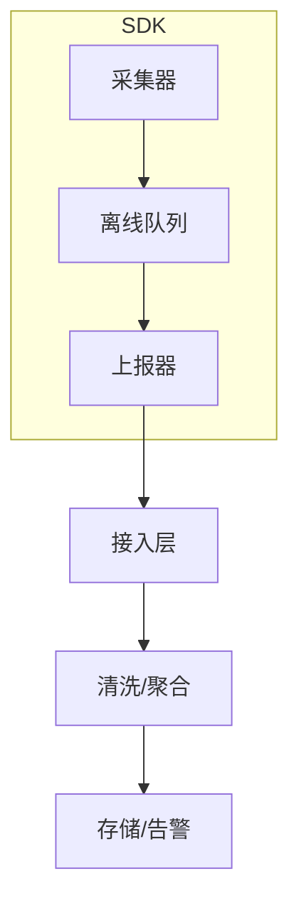
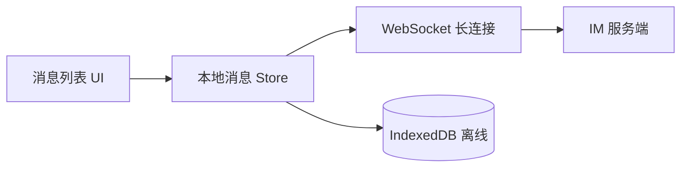

# 前端系统设计专题

## 学习目标

- 掌握大厂架构师「设计一个 XX」的答题方法论
- 能设计监控 SDK、大文件上传、低代码引擎、权限系统等核心场景
- 能讲清模块划分、数据流、扩展性与 trade-off

## 为什么需要

阿里 P7+、字节高级面试后半段常出系统设计题。与后端不同，前端系统设计考察：**组件化、状态、性能、体验、工程化**的综合架构能力。

## 一、答题骨架（15-30 分钟）

1. **澄清需求**：用户量、端、核心功能、非功能（性能/安全/离线）
2. **估算规模**：QPS、包体积、列表量级
3. **高层架构**：画图（模块 + 数据流）
4. **核心模块深入**：选 1-2 个最难的讲透
5. **扩展与边界**：错误处理、降级、监控
6. **Trade-off**：为什么这样设计，备选方案

---

## 二、设计监控 SDK

### 需求澄清

- 采集：JS 错误、Promise 未捕获、资源加载失败、Core Web Vitals、白屏
- 上报：批量、采样、离线队列
- 安全：Source Map 私有上传，不暴露给用户

### 架构



### 核心实现要点

```javascript
// 错误采集
window.addEventListener('error', (e) => {
  report({ type: 'error', msg: e.message, stack: e.error?.stack, url: location.href });
}, true);

window.addEventListener('unhandledrejection', (e) => {
  report({ type: 'promise', reason: String(e.reason) });
});

// 批量上报 + 采样
function report(data) {
  if (Math.random() > sampleRate) return;
  queue.push({ ...data, traceId, release, timestamp: Date.now() });
  if (queue.length >= BATCH_SIZE) flush();
}
```

**追问准备**：如何防重复？→ fingerprint 聚合。如何关联链路？→ TraceId 贯穿。

---

## 三、设计大文件断点续传

### 流程

1. 前端计算文件 hash（spark-md5 分片）
2. 请求服务端查询已上传分片
3. 并发上传缺失分片（限流）
4. 服务端合并（或对象存储 multipart）

```javascript
async function uploadFile(file, { chunkSize = 5 * 1024 * 1024, concurrency = 3 }) {
  const chunks = sliceFile(file, chunkSize);
  const hash = await computeHash(chunks);
  const uploaded = await api.getUploadedChunks(hash);
  const pending = chunks.filter((_, i) => !uploaded.includes(i));
  await pool(pending.map((chunk, i) => () => api.uploadChunk(hash, i, chunk)), concurrency);
  return api.mergeChunks(hash, file.name);
}
```

**Trade-off**：直传 OSS 预签名 vs 经 BFF 中转 → 大流量用直传减服务器压力。

---

## 四、设计低代码搭建引擎

### 核心模型

```typescript
interface PageSchema {
  id: string;
  components: ComponentNode[];
  dataSources: DataSourceConfig[];
}

interface ComponentNode {
  type: string;        // 物料类型
  props: Record<string, unknown>;
  children?: ComponentNode[];
}
```

### 模块划分

| 模块 | 职责 |
|------|------|
| 物料市场 | 组件注册、版本、文档 |
| 编辑器 | 拖拽、选中、属性面板 |
| 渲染器 | Schema → React/Vue 运行时 |
| 数据源 | API 绑定、变量、表达式 |
| 发布 | Schema 存储、预览、灰度 |

**关键难点**：表达式沙箱（禁止任意 JS）、循环渲染性能、版本兼容。

---

## 五、设计权限系统（前端）

### RBAC 模型

```javascript
// 路由权限
const routes = filterRoutes(allRoutes, user.permissions);

// 按钮权限
function AuthButton({ permission, children }) {
  const { permissions } = useAuth();
  if (!permissions.includes(permission)) return null;
  return children;
}
```

### 设计要点

- 权限数据放哪：登录后接口返回 / JWT claims
- 路由守卫 + 组件级 + API 级（前端隐藏不等于安全，后端必校验）
- 动态菜单生成

---

## 六、设计 Table / Form 引擎

**Table**：虚拟滚动 + 列配置化 + 服务端分页/排序/筛选
**Form**：Schema 驱动（JSON Schema / 自研） + 联动 + 校验 + 异步校验

```typescript
interface FormSchema {
  fields: Array<{
    name: string;
    type: 'input' | 'select' | 'date';
    rules?: Rule[];
    visibleWhen?: (values) => boolean;
  }>;
}
```

---

## 七、设计富文本 / 图形编辑器

### 架构选型

| 方案 | 原理 | 适用 |
|------|------|------|
| contenteditable | 浏览器原生编辑，DOM 即文档 | 轻量富文本 |
| 自绘 Canvas/SVG | 完全控制渲染与命中 | 图形/白板/流程图 |
| ProseMirror/Slate | 结构化文档模型 + 操作变换 | 协作编辑、复杂格式 |

### 核心模型（命令模式 + 历史栈）

```typescript
interface EditorState {
  doc: DocumentNode;       // 树形文档 AST
  selection: Selection;
  history: { past: Op[]; future: Op[] };  // undo/redo
}

interface Op {
  type: 'insert' | 'delete' | 'format';
  apply(state: EditorState): EditorState;
  invert(): Op;  // 用于 undo
}
```

**关键模块**：文档模型、选区管理、命令系统、协作 OT/CRDT（多人）、渲染层、插件生态。

**Trade-off**：contenteditable 快但 DOM 难控；自绘灵活但开发成本高。

---

## 八、设计 IM 消息系统（前端）



### 核心问题

| 问题 | 方案 |
|------|------|
| 消息有序 | 服务端 seq + 客户端按 seq 插入，乱序缓冲 |
| 去重 | clientMsgId 幂等 |
| 已读回执 | 本地标记 + 批量上报 |
| 离线 | IndexedDB 持久化 + 上线后增量同步 |
| 重连 | 指数退避 + 心跳 + 鉴权 token 刷新 |

```javascript
class MessageStore {
  constructor() { this.pending = new Map(); this.seq = 0; }
  onMessage(msg) {
    if (msg.seq <= this.seq) return; // 去重
    if (msg.seq === this.seq + 1) {
      this.append(msg); this.seq++;
      this.flushPending();
    } else {
      this.pending.set(msg.seq, msg); // 乱序缓冲
    }
  }
}
```

---

## 九、设计图片懒加载库

### 模块划分

| 模块 | 职责 |
|------|------|
| Observer | IntersectionObserver 监听进入视口 |
| Loader | 加载真实 src、占位图、错误图 |
| Cache | 已加载 URL 缓存，避免重复请求 |
| Decoder | 渐进式 JPEG / WebP 解码策略 |

```javascript
class LazyLoad {
  constructor({ rootMargin = '200px', threshold = 0 } = {}) {
    this.observer = new IntersectionObserver(this._onIntersect.bind(this), {
      rootMargin, threshold,
    });
  }
  observe(el) {
    el.dataset.src && this.observer.observe(el);
  }
  _onIntersect(entries) {
    entries.forEach(e => {
      if (!e.isIntersecting) return;
      const img = e.target;
      img.src = img.dataset.src;
      img.onload = () => { img.classList.add('loaded'); this.observer.unobserve(img); };
      img.onerror = () => { img.src = img.dataset.fallback || ''; };
    });
  }
}
```

**进阶**：虚拟列表 + 懒加载联动；响应式 `srcset`；CDN 裁剪参数。

---

## 十、SDK 设计通用方法论

1. **单一职责**：采集 / 队列 / 上报 / 配置 分离
2. **可配置**：采样率、上报地址、开关项运行时调整
3. **无侵入**：自动采集 + 手动 API 并存
4. **容错**：上报失败入队重试，不阻塞业务
5. **版本化**：`sdkVersion` 字段，支持灰度升级
6. **Tree-shaking**：按需引入子模块

---

## 面试高频问答（追问链）

> 大厂对一个考点通常追问到能力边界：**概念 → 机制 → 边界 → ⭐ 原理（触底）→ 实战（落地）**。实战层是区分「背过」和「做过」的关键。系统设计题就是层层追问，下面给出典型深挖链。

### 链一：监控 SDK 设计

1. **概念**：监控 SDK 采什么？→ JS 错误、资源错误、接口错误、性能(Web Vitals)、白屏、行为。
2. **机制**：怎么不影响主应用性能？→ 批量 + 采样 + requestIdleCallback + sendBeacon。
3. **边界**：页面关闭时数据怎么不丢？→ sendBeacon + 离线队列(IndexedDB)补传。
4. **应用**：错误怎么聚合去重？→ stack + message 生成 fingerprint 归并。
5. ⭐ **原理（触底）**：怎么定位线上压缩代码的报错并关联用户链路？→ Source Map 私有上传 + Release 关联 + TraceId 串联前后端 + 用户行为录制还原现场。
6. **实战（落地）**：你做过的监控 SDK 落地后怎么真正帮团队定位线上问题？→ 线上压缩代码报错看不懂堆栈，落地 Source Map 私有上传 + Release 关联 + TraceId 串前后端 + 行为录制还原；验证报错能还原到源码行、能下钻到单个用户会话、采样+sendBeacon 不影响主应用性能；结果线上问题平均定位时间从小时级降到分钟级、白屏/错误率纳入发布门禁。

### 链二：大文件断点续传

1. **概念**：整体方案？→ 切片 + 并发上传 + 服务端合并。
2. **机制**：怎么实现秒传和续传？→ 文件 hash 标识，服务端返回已传分片跳过。
3. **边界**：hash 计算大文件卡 UI 怎么办？→ Web Worker + 抽样 hash（分片采样）。
4. ⭐ **原理（触底）**：并发上传怎么控并发、失败怎么重试、合并怎么保证一致？→ 并发池限流 + 分片级重试 + 合并前校验分片数与总 hash，断网恢复从已传位置续传。
5. **实战（落地）**：你实现的大文件上传怎么扛住大文件和弱网？→ GB 级文件上传易失败，落地 Web Worker 抽样 hash + 分片并发池限流 + 秒传(查已传分片) + 分片级重试 + 断网从已传位置续传 + 直传 OSS 预签名减服务器压力；验证 hash 不卡 UI、断网恢复不重传已完成分片、合并前校验分片数与总 hash；结果大文件上传成功率显著提升、服务器带宽压力下降。

### 链三：富文本/协作编辑器

1. **概念**：富文本为什么难？→ 文档模型、选区、undo/redo、粘贴净化、性能。
2. **机制**：为什么不用 contenteditable 直接搞？→ 浏览器行为不一致，需自建模型 + 受控渲染。
3. **应用**：协作冲突怎么解决？→ OT（操作变换）或 CRDT（无冲突复制数据类型）。
4. ⭐ **原理（触底）**：OT 和 CRDT 怎么选？→ OT 中心化、需服务端转换、实现复杂但数据小；CRDT 去中心化、可离线合并但元数据大；文档协作多用 OT，本地优先/离线多用 CRDT。
5. **实战（落地）**：你做协作编辑器时怎么落地冲突解决和性能？→ 多人同时编辑出现内容错乱，落地自建文档模型 + 受控渲染 + OT 操作变换走中心化服务端转换 + 粘贴净化 + 长文档分块渲染；验证多人并发编辑最终一致、undo/redo 正确、长文档输入不卡；结果协作冲突消除、编辑流畅，离线优先场景再评估换 CRDT。

### 链四：低代码搭建引擎

1. **概念**：低代码引擎核心模块有哪些？→ 物料市场、编辑器(拖拽/属性面板)、渲染器(Schema→运行时)、数据源、发布。
2. **机制**：页面怎么描述和渲染？→ 用 PageSchema(组件树 + props + 数据源)描述，渲染器递归把 Schema 映射成 React/Vue 组件树。
3. **边界**：最大的挑战是什么？→ Schema 版本演进兼容、表达式沙箱安全、循环渲染性能、物料治理。
4. ⭐ **原理（触底）**：表达式/自定义逻辑怎么防 XSS 和沙箱逃逸？→ 不直接 eval，用受限解释器(jsep + 白名单)或 iframe 沙箱 + CSP，隔离 window/document 访问。
5. **实战（落地）**：你落地低代码引擎怎么解决渲染性能和版本兼容？→ 拖拽大页面卡顿且老 Schema 渲染崩，落地 Schema 节点 memo + 局部更新(只重渲染变更节点) + Schema 加 version 字段做兼容迁移 + 物料按需加载；验证拖拽百级组件不掉帧、旧版本 Schema 经迁移层正常渲染、表达式在沙箱内无法访问 window；结果搭建流畅、历史页面不因升级白屏。

### 链五：IM 消息系统

1. **概念**：前端 IM 要解决哪些核心问题？→ 消息有序、去重、已读回执、离线持久化、断线重连。
2. **机制**：消息怎么保证有序？→ 服务端 seq + 客户端按 seq 插入，乱序时缓冲、连续才渲染。
3. **边界**：消息怎么不丢不重？→ clientMsgId 幂等去重 + ack 机制 + 上线后拉取补偿。
4. ⭐ **原理（触底）**：断线重连和离线消息怎么设计？→ WebSocket 指数退避重连 + 心跳保活 + token 刷新；离线消息 IndexedDB 持久化，上线后按 seq 增量同步。
5. **实战（落地）**：你做的 IM 在弱网下怎么保证体验？→ 弱网频繁断连、消息乱序丢失，落地乱序缓冲 Store + IndexedDB 离线队列 + 指数退避重连 + 发送态(发送中/成功/失败重发) + 已读批量上报；验证断网重连后消息按 seq 补齐不重复、离线消息上线同步、UI 不卡；结果消息可靠有序、弱网体验接近原生。

### 链六：图片懒加载库

1. **概念**：懒加载为什么用 IntersectionObserver？→ 异步不阻塞主线程、自动解绑、优于监听 scroll 频繁回调。
2. **机制**：核心模块怎么划分？→ Observer 监听进视口、Loader 加载真实 src/占位/错误图、Cache 缓存已加载 URL、Decoder 选 WebP/渐进式策略。
3. **边界**：和虚拟列表怎么配合？→ 虚拟列表只渲染可视项，懒加载再控制图片真正加载时机，二者联动避免重复请求。
4. ⭐ **原理（触底）**：怎么兼顾首屏体验和带宽？→ rootMargin 提前预加载 + 响应式 srcset + CDN 裁剪参数按 DPR/容器尺寸取图，占位图防布局抖动(CLS)。
5. **实战（落地）**：你在长列表落地图片懒加载的效果？→ 长列表一次性加载几百张图拖垮带宽和首屏，落地 IntersectionObserver(rootMargin 200px 预加载) + srcset/CDN 裁剪 + 占位图 + 已加载缓存 + 与虚拟列表联动；验证首屏只加载可视区图片、滚动按需加载、CLS 接近 0；结果首屏流量和 LCP 显著下降、滚动流畅。

## 小结

- 系统设计先澄清再画图再深入核心模块
- 监控 SDK、大文件上传、低代码、权限、编辑器、IM、懒加载是最高频场景
- 每个方案都要准备 trade-off 和备选

## 延伸阅读

- [06-监控与告警](../06-质量与稳定性/02-监控与告警.md)
- [02-加载与运行时优化](../05-性能优化/02-加载与运行时优化.md)
