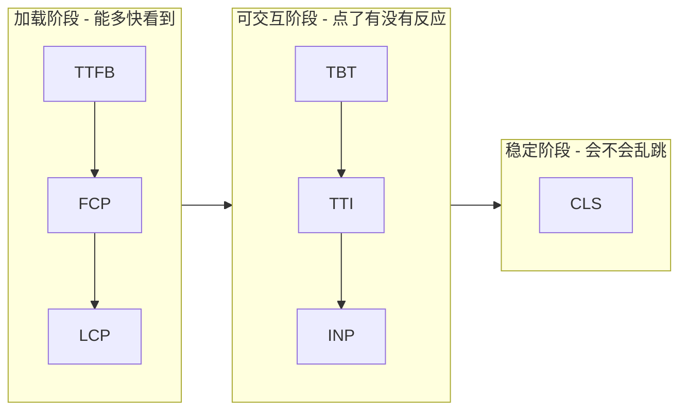
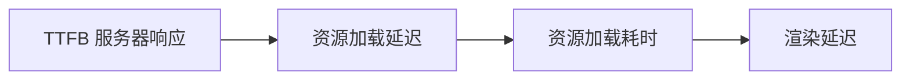
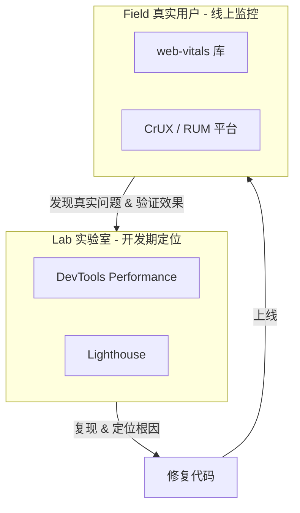
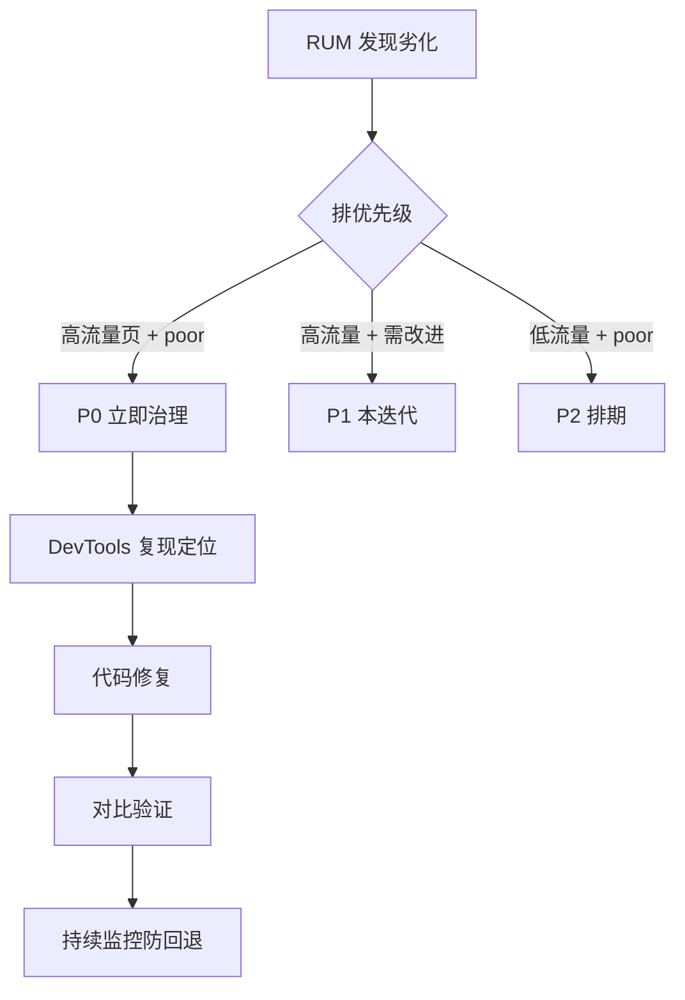

# 性能指标体系

## 学习目标

- 真正**读懂**每个性能指标背后代表的用户体验问题
- 掌握从"指标异常"到"定位根因"再到"代码修复"的完整闭环
- 能在真实项目中落地采集、监控、告警、优化的全流程
- 学会用 DevTools、Lighthouse、RUM 三类工具互相印证

## 为什么需要

"感觉快"不可量化、不可对比、无法追责。作为开发者，你需要回答三个问题：

1. **现在好不好？** —— 用指标衡量现状（基线）
2. **问题在哪？** —— 从指标下钻到具体资源/代码
3. **改完有没有效果？** —— 用同一指标对比验证

> 核心心法：**指标不是用来"刷分"的，而是用来"找问题"的。** 每一个变差的指标，背后一定对应一段可定位、可修复的代码或资源。

---

## 一、先建立正确的"看指标"心智模型

很多开发者看指标的误区是：盯着一个总分（如 Lighthouse 85 分）焦虑，却不知道这个分怎么来的、该改哪里。正确的思路是把指标拆成**用户旅程的三个阶段**：



| 用户视角的问题 | 对应指标 | 你该排查的方向 |
|---------------|---------|---------------|
| "页面怎么还是白的？" | TTFB、FCP | 服务端响应、阻塞资源 |
| "主要内容什么时候出来？" | LCP | 最大元素（图/标题）加载链路 |
| "我点了按钮怎么没反应？" | INP、TBT | 主线程长任务、重渲染 |
| "内容怎么自己跳来跳去？" | CLS | 无尺寸图片、动态插入、字体 |

记住这张表，你看到任何一个指标变差，就知道**先怀疑什么**。

---

## 二、逐个指标：怎么读懂 + 怎么定位 + 怎么解决

### 2.1 LCP（最大内容绘制）

**怎么读懂它：** LCP 记录视口内**最大的那个元素**（通常是首屏大图、H1 标题、视频封面）渲染完成的时间点。它代表"用户认为页面主要内容已经出现"的时刻。

**LCP 的时间构成（关键！优化前必须先拆解）：**



| 子阶段 | 含义 | 占比大时说明 |
|--------|------|-------------|
| TTFB | 拿到 HTML 首字节 | 后端慢 / 没用 CDN |
| Load Delay | 发现 LCP 资源前的延迟 | 资源发现晚，没 preload |
| Load Time | LCP 资源本身下载耗时 | 图片太大 / 未压缩 |
| Render Delay | 下载完到绘制的延迟 | 被 JS/CSS 阻塞 |

**定位步骤（DevTools）：**

1. 打开 Chrome DevTools → **Performance** 面板 → 勾选录制并刷新
2. 在 **Timings** 轨道找到 `LCP` 标记，点击它
3. 下方 Summary 会显示 LCP 元素是哪个 DOM 节点
4. 用上面的"四段式"判断瓶颈在哪一段（看 Network 瀑布图）

也可以直接用代码把 LCP 元素打印出来：

```javascript
new PerformanceObserver((list) => {
  const entries = list.getEntries();
  const last = entries[entries.length - 1]; // LCP 取最后一个
  console.log('LCP元素:', last.element);     // 直接拿到 DOM 节点
  console.log('LCP时间:', last.startTime);
  console.log('LCP资源URL:', last.url);
}).observe({ type: 'largest-contentful-paint', buffered: true });
```

**针对性解决方案：**

```html
<!-- 问题1: LCP 是首屏大图，但发现得晚 → 提升优先级 + 预加载 -->
<link rel="preload" as="image" href="/hero.webp" fetchpriority="high">


<!-- 问题2: 图片太大 → 用现代格式 + 响应式尺寸 -->


<!-- 问题3: 懒加载误伤首屏图 → 首屏图绝不能 loading=lazy -->

```

```javascript
// 问题4: TTFB 慢 → SSR/SSG 预渲染 + CDN + 接口缓存
// 问题5: Render Delay 大 → 移除阻塞 LCP 的 JS，关键 CSS 内联
```

| LCP 子阶段瓶颈 | 首选解决方案 |
|---------------|-------------|
| TTFB 大 | CDN、SSG/ISR、服务端缓存、减少重定向 |
| Load Delay 大 | `preload` + `fetchpriority=high`、提前发现资源 |
| Load Time 大 | WebP/AVIF、压缩、响应式图片、CDN |
| Render Delay 大 | 关键 CSS 内联、移除阻塞 JS、避免客户端渲染首屏 |

---

### 2.2 INP（交互到下一次绘制）

**怎么读懂它：** 用户每次点击/输入/按键后，浏览器**多久才能把反馈画到屏幕上**。INP 取整个会话中**最差的那次交互**（近似）。它代表页面的"跟手程度"。

**一次交互的耗时构成：**


| 子阶段 | 含义 | 常见原因 |
|--------|------|---------|
| Input Delay | 输入到开始处理的等待 | 主线程被长任务占用 |
| Processing | 事件回调执行时间 | 回调里干了重活 |
| Presentation Delay | 处理完到重绘 | 大量 DOM 变更、复杂样式 |

**定位步骤：**

1. DevTools → **Performance** → 录制时去点击那个"卡"的按钮
2. 在 **Interactions** 轨道找到这次交互，看它压住了哪段主线程
3. 展开 **Main** 线程，找红色三角标记的**长任务（Long Task）**
4. 点进长任务看调用栈，定位是哪个函数/组件耗时

代码层面捕获最差交互：

```javascript
new PerformanceObserver((list) => {
  list.getEntries().forEach((entry) => {
    if (entry.duration > 200) { // 超过 200ms 的交互需关注
      console.warn('慢交互:', entry.name, entry.duration, entry.target);
    }
  });
}).observe({ type: 'event', durationThreshold: 200, buffered: true });
```

**针对性解决方案：**

```javascript
// 问题1: 事件回调里做重计算 → 拆分 + 让出主线程
button.addEventListener('click', async () => {
  updateUIImmediately();        // 先给用户即时反馈
  await scheduler.yield?.();     // 让出主线程（新 API）
  doHeavyWork();                 // 重活延后
});

// 问题2: 大列表过滤阻塞输入（React） → useTransition 降优先级
const [isPending, startTransition] = useTransition();
input.onChange = (e) => {
  setQuery(e.target.value);                    // 高优先级：输入框立即更新
  startTransition(() => setList(filter(e.target.value))); // 低优先级
};

// 问题3: 长任务 → 时间切片，分批处理
async function processInChunks(items) {
  for (let i = 0; i < items.length; i += 100) {
    process(items.slice(i, i + 100));
    await new Promise(r => setTimeout(r)); // 每批让出一次
  }
}

// 问题4: 纯计算密集 → 移到 Web Worker
const worker = new Worker('heavy.js');
worker.postMessage(data);
worker.onmessage = (e) => render(e.data);
```

| INP 瓶颈 | 解决方案 |
|----------|---------|
| Input Delay 大 | 拆分长任务、减少首屏 JS 执行 |
| Processing 大 | 防抖节流、计算移 Worker、`startTransition` |
| Presentation Delay 大 | 减少 DOM 节点、虚拟列表、避免强制同步布局 |

---

### 2.3 CLS（累积布局偏移）

**怎么读懂它：** 页面元素在用户**没有交互**的情况下"自己跳动"的累积程度。最典型的体验是：你正要点按钮，广告/图片突然撑开，按钮跑了，你点错了。

**CLS 分数 = 影响范围 × 移动距离**，越接近 0 越好。

**定位步骤：**

1. DevTools → **Performance** → 录制并复现页面加载
2. 在 **Experience** 轨道看到红色的 **Layout Shift** 条
3. 点击它，下方高亮**发生偏移的元素**和移动前后的位置
4. 或开启 **Rendering** 面板 → 勾选 **Layout Shift Regions**，偏移区域会闪蓝色

代码定位偏移元素：

```javascript
new PerformanceObserver((list) => {
  list.getEntries().forEach((entry) => {
    if (!entry.hadRecentInput) { // 排除用户交互引起的合理偏移
      entry.sources.forEach(s => console.warn('偏移元素:', s.node));
    }
  });
}).observe({ type: 'layout-shift', buffered: true });
```

**针对性解决方案：**

```html
<!-- 问题1: 图片/视频没尺寸 → 必须写 width/height 或 aspect-ratio -->

<style>.media { aspect-ratio: 16 / 9; width: 100%; }</style>

<!-- 问题2: 动态插入内容（广告/banner）→ 预留占位高度 -->
<div class="ad-slot" style="min-height: 250px;"><!-- 广告异步填充 --></div>

<!-- 问题3: 字体切换抖动(FOIT/FOUT) → font-display + 预加载 -->
<link rel="preload" href="/font.woff2" as="font" crossorigin>
<style>@font-face { font-family: App; src: url(/font.woff2); font-display: optional; }</style>
```

```css
/* 问题4: 用 transform 做动画，而不是改 top/left/width/height */
.toast { transform: translateY(-100%); transition: transform .3s; } /* 不引起布局偏移 */
```

---

### 2.4 辅助指标：TTFB / FCP / TBT / TTI

这些是 CWV 的"上游因子"，用来进一步下钻：

| 指标 | 读懂它 | 异常时排查 |
|------|--------|-----------|
| **TTFB** | 服务器吐出第一个字节的时间 | 后端慢、无 CDN、重定向链、冷启动 |
| **FCP** | 第一个像素（任意内容）出现 | 阻塞 CSS/JS、TTFB 拖累 |
| **TBT** | 加载期间主线程被阻塞的总时长（Lab 端 INP 的代理） | 第三方脚本、大 bundle 解析执行 |
| **TTI** | 页面稳定可交互 | 长任务密集、hydration 慢 |

> 实战关系：**TBT 高，线上 INP 大概率也差**；**TTFB 高，LCP 一定好不了**。所以 Lab 阶段先压 TBT 和 TTFB，往往能同时改善线上 CWV。

---

## 三、工具怎么配合用（Lab vs Field）



| 场景 | 用哪个工具 |
|------|-----------|
| 开发时定位某个慢元素/慢交互 | DevTools Performance（最精准，有调用栈） |
| 提交前/CI 卡门禁 | Lighthouse CI |
| 了解真实用户分布（不同机型/网络） | web-vitals 上报 + RUM 平台 |
| 看竞品/行业基线 | CrUX（公开数据） |

**关键认知：Lab 数据是"可复现的体检"，Field 数据才是"真实病情"。** 实验室满分但线上 P75 很差，说明你的测试环境（高端机 + 快网）掩盖了真实用户（低端机 + 弱网）的问题。永远看 **P75/P95 分位**，不要看平均值。

---

## 四、在项目中落地的完整流程（手把手）

### 步骤 1：接入采集（半天）

```javascript
// src/monitoring/web-vitals.ts
import { onLCP, onINP, onCLS, onTTFB, onFCP } from 'web-vitals';

function report(metric) {
  const body = JSON.stringify({
    name: metric.name,
    value: metric.value,
    rating: metric.rating,        // 'good' | 'needs-improvement' | 'poor'
    id: metric.id,
    page: location.pathname,
    // 关键：带上分析维度
    device: navigator.userAgent,
    conn: navigator.connection?.effectiveType, // 4g/3g/2g
    attribution: metric.attribution,           // 归因数据（见下）
  });
  navigator.sendBeacon('/api/rum', body); // sendBeacon 不阻塞卸载
}

onLCP(report); onINP(report); onCLS(report); onTTFB(report); onFCP(report);
```

> 进阶：用 `web-vitals/attribution` 入口，上报会自带"归因"信息（如 LCP 元素、INP 的目标元素），线上不用猜就知道是哪个元素出问题。

### 步骤 2：建立基线与看板（1-2 天）

- 把上报数据落到时序库/RUM 平台（Grafana、Sentry、阿里 ARMS、自建）
- 按 **页面 × 设备 × 网络** 维度统计 **P75**
- 形成一张基线表：

| 页面 | LCP P75 | INP P75 | CLS P75 | 状态 |
|------|---------|---------|---------|------|
| 首页 | 2.1s | 180ms | 0.05 | 良好 |
| 列表页 | 3.8s | 420ms | 0.18 | 需改进 |
| 详情页 | 5.2s | 650ms | 0.30 | 差 |

### 步骤 3：设定性能预算 + CI 门禁（1 天）

```json
// lighthouse-budget.json
{
  "timings": [
    { "metric": "largest-contentful-paint", "budget": 2500 },
    { "metric": "total-blocking-time", "budget": 300 },
    { "metric": "cumulative-layout-shift", "budget": 0.1 }
  ],
  "resourceSizes": [
    { "resourceType": "script", "budget": 300 },
    { "resourceType": "image", "budget": 500 },
    { "resourceType": "total", "budget": 1000 }
  ]
}
```

```yaml
# .github/workflows/lighthouse.yml
- name: Lighthouse CI
  uses: treosh/lighthouse-ci-action@v11
  with:
    urls: https://staging.example.com/
    budgetPath: ./lighthouse-budget.json
    uploadArtifacts: true
# 超预算 → CI 失败，阻止劣化合入
```

### 步骤 4：按优先级排期治理

用"影响面 × 严重度"排序，而不是凭感觉：



### 步骤 5：修复 → 验证闭环

每个性能 PR 必须附 **before/after 数据**（Lighthouse 截图 + 关键指标对比表），否则不予合入。上线后观察 RUM 1-2 周确认 P75 真实下降。

---

## 五、排查实战案例

### 案例 A：列表页 LCP 5.2s

1. **RUM 报警**：详情页 LCP P75 = 5.2s（poor），且集中在 4G 用户
2. **复现定位**：DevTools Performance 录制，LCP 元素是顶部 banner 图（2.3MB PNG）
3. **拆解**：四段式发现 Load Time 占 3.5s（图太大），且没 preload（Load Delay 0.8s）
4. **修复**：PNG → WebP（2.3MB → 280KB）+ `preload fetchpriority=high` + 响应式 srcset
5. **验证**：Lighthouse LCP 5.2s → 1.9s；一周后 RUM P75 → 2.0s ✅

### 案例 B：搜索框输入卡顿 INP 650ms

1. **现象**：用户反馈打字卡；RUM INP P75 = 650ms
2. **定位**：Performance 录制输入，发现每次 `onChange` 同步过滤 1 万条数据，长任务 600ms+
3. **修复**：`useTransition` 把过滤降为低优先级 + 结果列表用 `react-window` 虚拟化
4. **验证**：INP 650ms → 90ms ✅

### 案例 C：CLS 0.30 内容乱跳

1. **定位**：Rendering 面板开 Layout Shift Regions，发现轮播图和广告位加载时撑开页面
2. **修复**：图片补 `width/height`；广告位 `min-height` 预留占位；字体 `font-display: optional`
3. **验证**：CLS 0.30 → 0.02 ✅

---

## 常见误区与最佳实践

| 误区 | 正确理解 |
|------|---------|
| "Lighthouse 100 分就够了" | Lab ≠ 真实用户，必须结合 RUM 看 P75 |
| "看平均值优化" | 平均值掩盖长尾，要看 P75/P95 分位 |
| "只优化 LCP" | INP、CLS 同样影响体验和 SEO 排名 |
| "性能是前端一个人的事" | TTFB 靠后端，CDN 靠运维，需协作 |
| "本地快就上线" | 本地是高端机快网，用户多是中低端 + 弱网 |
| "优化全站" | 按流量 × 严重度排序，先治高价值页面 |
| "改完凭感觉就行" | 必须 before/after 数据 + 线上验证 |

**最佳实践清单：**

- 先采集建基线，再谈优化（没有度量就没有改进）
- 三层工具配合：DevTools 定位 → Lighthouse CI 守门 → RUM 看真实
- 用归因（attribution）数据，线上直接知道是哪个元素
- 性能预算写进 CI，防止劣化偷偷合入
- 每个性能 PR 带 before/after，上线后回看 RUM 防回退

## 小结

- 把指标映射到"加载/交互/稳定"三阶段，看到异常就知道先查什么
- 每个指标都有**子阶段拆解** + **DevTools 定位法** + **针对性代码修复**
- LCP 拆四段、INP 拆三段、CLS 看偏移源，是定位根因的关键
- 落地是闭环：采集基线 → 预算门禁 → 排优先级 → 修复 → 验证 → 监控
- 永远以真实用户的 P75 为准，Lab 数据只用来复现和定位

## 延伸阅读

- [web.dev/vitals](https://web.dev/vitals/) — 官方指标定义
- [Optimize LCP](https://web.dev/articles/optimize-lcp) / [Optimize INP](https://web.dev/articles/optimize-inp) / [Optimize CLS](https://web.dev/articles/optimize-cls)
- [web-vitals 库（含 attribution）](https://github.com/GoogleChrome/web-vitals)
- [Chrome DevTools Performance 面板](https://developer.chrome.com/docs/devtools/performance)
- [Lighthouse CI](https://github.com/GoogleChrome/lighthouse-ci)
