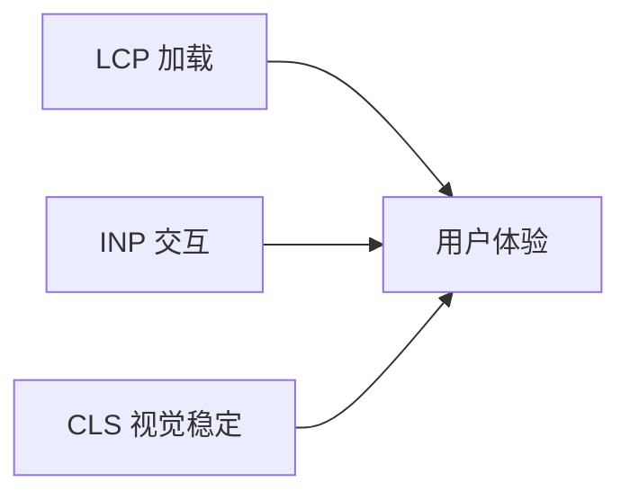

# 性能指标体系

## 学习目标

- 理解 Core Web Vitals 及 Google 排名关系
- 掌握 LCP、INP、CLS 的含义与优化方向
- 了解性能度量工具：Lighthouse、Web Vitals、RUM
- 能建立团队性能监控基线

## 为什么需要

"感觉快"不够，需要**可量化、可对比**的指标：

- 用户体验与转化率相关（Amazon：100ms 延迟 = 1% 销售损失）
- SEO：Core Web Vitals 影响搜索排名
- 架构决策需数据支撑

## 核心原理

### 1. Core Web Vitals



| 指标 | 衡量 | 良好 | 需改进 | 差 |
|------|------|------|--------|-----|
| **LCP** Largest Contentful Paint | 最大内容绘制时间 | ≤2.5s | ≤4s | >4s |
| **INP** Interaction to Next Paint | 交互到下一帧 | ≤200ms | ≤500ms | >500ms |
| **CLS** Cumulative Layout Shift | 累积布局偏移 | ≤0.1 | ≤0.25 | >0.25 |

**LCP 元素通常是：** 大图、视频 poster、块级文本

**INP 替代 FID：** 衡量所有交互的响应延迟，非仅首次

**CLS：** 元素意外移动，如图片无尺寸、动态插入内容

### 2. 其他重要指标

| 指标 | 说明 |
|------|------|
| **FCP** First Contentful Paint | 首次内容绘制 |
| **TTFB** Time to First Byte | 首字节时间，偏服务端 |
| **TTI** Time to Interactive | 可交互时间 |
| **TBT** Total Blocking Time | 主线程阻塞总时间 |

### 3. 度量方式

**Lab Data（实验室）：**

- Lighthouse（Chrome DevTools）
- WebPageTest
- 固定设备、网络，可复现

**Field Data（真实用户 RUM）：**

- Chrome UX Report (CrUX)
- web-vitals 库上报
- 反映真实用户环境

```javascript
import { onLCP, onINP, onCLS } from 'web-vitals';

function sendToAnalytics(metric) {
  const body = JSON.stringify({
    name: metric.name,
    value: metric.value,
    id: metric.id
  });
  navigator.sendBeacon('/analytics', body);
}

onLCP(sendToAnalytics);
onINP(sendToAnalytics);
onCLS(sendToAnalytics);
```

### 4. 优化方向速查

| 指标 | 常见原因 | 优化方向 |
|------|---------|---------|
| LCP 慢 | 大图、慢 TTFB、阻塞 JS | 优化图片、CDN、preload、SSR |
| INP 高 | 长任务、重渲染 | 代码分割、Web Worker、memo |
| CLS 高 | 无尺寸图片、字体 FOIT | width/height、font-display |

### 5. Performance API 与 Timing

```javascript
// Navigation Timing
const [nav] = performance.getEntriesByType('navigation');
console.log('TTFB', nav.responseStart - nav.requestStart);
console.log('DOMContentLoaded', nav.domContentLoadedEventEnd);

// Resource Timing — 单资源加载
performance.getEntriesByType('resource').forEach(r => {
  console.log(r.name, r.duration);
});

// PerformanceObserver — 监听 LCP 等
const po = new PerformanceObserver(list => {
  list.getEntries().forEach(entry => console.log(entry.name, entry.startTime));
});
po.observe({ type: 'largest-contentful-paint', buffered: true });
```

### 6. 白屏与 Long Tasks

```javascript
// 首屏时间 — 自定义 mark
performance.mark('first-content');
// FCP 可用 PerformancePaintTiming

// Long Task — 阻塞主线程 > 50ms
const obs = new PerformanceObserver(list => {
  list.getEntries().forEach(e => console.warn('Long task', e.duration));
});
obs.observe({ type: 'longtask', buffered: true });
```

### 7. 性能预算与 RUM 采样

```json
// lighthouse-budget.json
{
  "resourceSizes": [{ "resourceType": "script", "budget": 300 }],
  "timings": [{ "metric": "interactive", "budget": 5000 }]
}
```

**RUM 采样：** 生产环境 1%-10% 采样上报，降低成本；关键页面可提高采样率。

## 常见误区与最佳实践

| 误区 | 正确理解 |
|------|---------|
| "Lighthouse 100 分就够了" | 需结合 RUM，实验室≠真实用户 |
| "只优化 LCP" | 三个 CWV 都影响体验和 SEO |
| "性能是前端 alone" | TTFB 需后端，CDN 需运维 |
| "本地快就行" | 关注 P75/P95 分位，弱网用户 |

**最佳实践：**

- 建立性能预算（如 LCP < 2.5s，bundle < 200KB）
- CI 集成 Lighthouse CI
- 生产 RUM 监控，告警超阈值
- 性能优化 PR 需 before/after 数据

## 小结

- Core Web Vitals：LCP、INP、CLS
- Lab + Field 结合度量
- web-vitals 库上报 RUM
- 优化需针对性，建立基线和预算

## 延伸阅读

- [web.dev/vitals](https://web.dev/vitals/)
- [Chrome UX Report](https://developers.google.com/web/tools/chrome-user-experience-report)
- [web-vitals 库](https://github.com/GoogleChrome/web-vitals)
