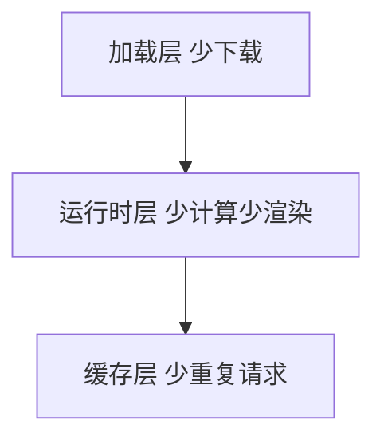

# 加载与运行时优化

## 学习目标

- 能按「体积 → 首屏 → 运行时」三层逐项优化并验证
- 会用 analyzer、Coverage、Performance 定位问题
- 能在项目中落地 lazy、缓存、虚拟列表、Worker

## 为什么需要

性能指标文档告诉你「LCP 差」——本章告诉你**具体改哪段代码、怎么验证**。

> 核心心法：**先量后优。** 没有 analyzer 截图的优化 PR 不合并。

---

## 一、三层优化地图



| 层 | 手段 | 验证 |
|----|------|------|
| 加载 | lazy、split、图片、CDN | Network 体积、LCP |
| 运行时 | memo、虚拟列表、Worker | Profiler、INP |
| 缓存 | HTTP、SW、Query cache | Network disk cache |

---

## 二、底层原理：每类优化为什么有效

不理解机制就会「优化错地方」。每个手段都对应一个明确的瓶颈：

### 加载层：JS 的代价不只是下载


- **JS 是「解析阻塞」资源**：1MB JS 不只是下载时间，浏览器还要解析、编译、执行，全程占用主线程。这就是为什么「同样体积，JS 比图片更伤性能」。
- **代码分割（split/lazy）为何有效**：首屏只下载并执行当前路由必需的代码，其余按需加载 → 减少首屏 Parse/Compile/Execute 时间 → LCP/TTI 提前。
- **图片优化为何关键**：LCP 元素通常是首屏大图，图片下载耗时直接决定 LCP。WebP/AVIF 减体积、`fetchpriority` 提前发现、尺寸属性防 CLS。
- **字体 `font-display: swap`**：避免字体加载期间文字不可见（FOIT）。

### 运行时层：主线程是唯一的瓶颈


- **主线程单线程**：渲染、JS 执行、事件响应都在主线程排队。一个长任务（>50ms）会让点击/输入「卡住」（INP/TBT 变差）。
- **虚拟列表为何有效**：1 万条数据只渲染可视区的 ~20 个 DOM 节点，避免创建上万 DOM 与对应的 Layout/Paint。
- **Web Worker 为何有效**：把大计算（解析、加解密、图像处理）放到 worker 线程，主线程腾出来响应交互。
- **memo/useMemo 为何有效**：跳过不必要的组件重渲染与 VDOM diff（见框架原理篇），减少主线程计算。
- **useTransition 为何有效**：把非紧急更新降级为可中断的低优先级任务，保证输入即时响应（见 Fiber 篇）。

### 缓存层：最快的请求是不发请求

- 强缓存命中 = 0 网络往返；React Query 缓存 = 跨组件复用数据、去重请求（见缓存篇与状态管理篇）。

> 一句话总结原理：**加载层减少主线程「要处理的字节」，运行时层减少主线程「要做的计算」，缓存层减少「要重复做的事」。**

---

## 三、加载层落地

### 步骤 1：analyzer 找 Top5 模块

### 步骤 2：路由 lazy

```tsx
const Dashboard = lazy(() => import('./Dashboard'));
<Suspense fallback={<Skeleton />}><Dashboard /></Suspense>
```

### 步骤 3：图片

```html


```

### 步骤 4：字体

```css
@font-face { font-family: App; src: url(/f.woff2); font-display: swap; }
```

**验证：** Lighthouse 「Reduce unused JavaScript」项下降；LCP 前后对比。

---

## 四、运行时层落地

```tsx
// 搜索 — useTransition
startTransition(() => setFiltered(filter(data, q)));

// 长列表 — react-window
<FixedSizeList height={600} itemCount={n} itemSize={48}>...</FixedSizeList>

// 重计算 — Worker
worker.postMessage(largeDataset);
```

**验证：** Performance 无 >50ms long task；Profiler commit <16ms。

---

## 五、缓存层

```javascript
// React Query
useQuery({ queryKey: ['users'], staleTime: 60_000 });

// Service Worker — workbox precache 静态
```

---

## 排查实战

### 案例 A：首屏 JS 1.2MB

- analyzer：antd 全量 + moment
- 修复：按需 import + dayjs
- 结果：380KB gzip，LCP -1.2s

### 案例 B：滚动掉帧

- Performance：scroll handler 里强制 layout
- 修复：passive listener + transform 动画
- 结果：FPS 60

### 案例 C：重复 API

- React Query dedupe + staleTime
- Network 请求数 -70%

---

## 项目 Checklist

- [ ] 路由全 lazy，vendor split
- [ ] 首屏图 preload + 尺寸
- [ ] 列表 >100 条虚拟化
- [ ] PR 附 analyzer before/after

## 虚拟滚动手写 + 大文件断点续传

```javascript
// 虚拟滚动核心
function VirtualList({ items, itemHeight, height }) {
  const [scrollTop, setScrollTop] = useState(0);
  const start = Math.floor(scrollTop / itemHeight);
  const visible = Math.ceil(height / itemHeight) + 1;
  const slice = items.slice(start, start + visible);
  return (
    <div style={{ height, overflow: 'auto' }} onScroll={e => setScrollTop(e.target.scrollTop)}>
      <div style={{ height: items.length * itemHeight }}>
        <div style={{ transform: `translateY(${start * itemHeight}px)` }}>
          {slice.map(item => <Row key={item.id} item={item} />)}
        </div>
      </div>
    </div>
  );
}
```

断点续传见 [04-前端系统设计专题](../04-架构设计/04-前端系统设计专题.md)。

## 面试高频问答（追问链）

> 大厂对一个考点通常追问到能力边界：**概念 → 机制 → 边界 → ⭐ 原理（触底）→ 实战（落地）**。实战层是区分「背过」和「做过」的关键。

### 链一：加载优化

1. **概念**：代码分割策略？→ 路由级 lazy + vendor split + 动态 import。
2. **机制**：prefetch 和 preload 区别？→ preload 当前页必需高优先；prefetch 下一页空闲预取。
3. **边界**：首屏秒开怎么做？→ 关键 CSS 内联、骨架屏、SSR/SSG、资源优先级、字体优化。
4. ⭐ **原理（触底）**：拆包过细反而变慢，为什么？怎么平衡？→ 请求数增多 + HTTP 开销 + 缓存碎片；按路由 + 公共依赖合理分组，结合 HTTP/2 多路复用与缓存命中率权衡。
5. **实战（落地）**：你怎么把一个首屏 4s 的页面优化到秒开？→ 场景：bundle 1.8MB、首屏白屏约 4s；步骤：bundle analyzer 找体积大头 → 路由级 lazy + vendor split + 动态 import 合理拆包 → 关键 CSS 内联 + 骨架屏 + 字体 preload；验证：Network 看首包体积与请求数、Lighthouse before/after 对比；结果：首屏 JS 1.8MB→320KB、FCP 4s→1.2s，按路由分组避免拆包过细导致请求数爆炸。

### 链二：运行时优化

1. **概念**：Web Worker 适用场景？→ 大计算、加解密、图片处理，不碰 DOM。
2. **机制**：长列表为什么卡？怎么解？→ DOM 过多重排重绘，用虚拟滚动只渲染可视区。
3. **应用**：怎么定位运行时卡顿？→ Performance 面板看长任务（>50ms）、火焰图归因。
4. ⭐ **原理（触底）**：手写虚拟滚动的核心？动态高度怎么处理？→ 算可视区起止索引 + 偏移撑高占位；动态高度用预估高度 + 渲染后测量缓存 + 二分定位（见本章实现）。
5. **实战（落地）**：长列表卡顿你实际怎么解的？→ 场景：1 万条搜索结果，输入即卡顿 INP 650ms；步骤：Performance 录制定位 onChange 同步过滤是长任务 → useTransition 把过滤降为低优先级 + react-window 虚拟滚动只渲染可视区 + 动态高度用预估+测量缓存；验证：录制确认长任务消失、监控 INP 上报；结果：INP 650ms→90ms，滚动 60fps 不掉帧。

## 小结

- 原理：加载层减少要处理的字节，运行时层减少要做的计算，缓存层减少重复
- JS 是解析阻塞资源（下载+解析+编译+执行全占主线程）
- 主线程单线程，长任务阻塞输入；虚拟列表/Worker/memo 各解一类瓶颈
- 加载看 Network/analyzer，运行看 Profiler
- 优化顺序：大头体积 → LCP 资源 → 长任务，每项必须可度量验证

## 延伸阅读

- [web.dev/fast](https://web.dev/fast/)
- 本模块 [01-性能指标体系](./01-性能指标体系.md)
