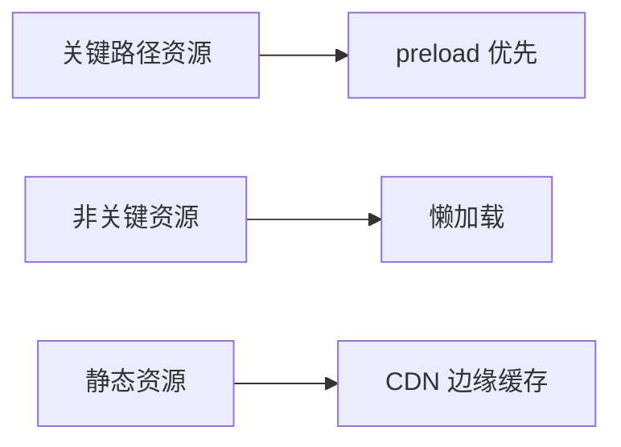
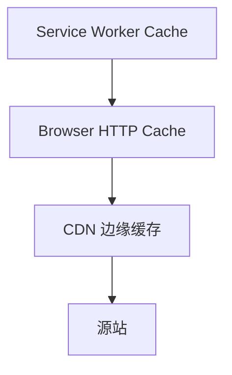

# 加载与运行时优化

## 学习目标

- 掌握资源加载优化：懒加载、预加载、CDN
- 理解代码分割与 Tree Shaking
- 了解运行时优化：虚拟列表、防抖节流、Web Worker
- 能制定前端性能优化 checklist

## 为什么需要

首屏加载慢、交互卡顿是用户流失主因。加载优化减少**等待**，运行时优化减少**卡顿**。

## 核心原理

### 1. 加载优化



**代码分割：**

```javascript
// 路由级分割
const Dashboard = lazy(() => import('./pages/Dashboard'));

// 组件级
const HeavyChart = lazy(() => import('./HeavyChart'));

// Webpack magic comment
import(/* webpackChunkName: "admin" */ './admin');
```

**Tree Shaking：** ESM 静态分析，移除未使用导出

```json
// package.json
{ "sideEffects": false }
// 或 "sideEffects": ["*.css"]
```

**资源提示：**

```html
<link rel="preload" href="hero.webp" as="image">
<link rel="prefetch" href="next-page.js">
<link rel="preconnect" href="https://api.example.com">
<link rel="dns-prefetch" href="https://cdn.example.com">
```

**图片优化：**

```html

```

### 2. 运行时优化

**虚拟列表 — 长列表：**

```tsx
import { FixedSizeList } from 'react-window';

function VirtualList({ items }) {
  return (
    <FixedSizeList
      height={600}
      itemCount={items.length}
      itemSize={50}
      width="100%"
    >
      {({ index, style }) => (
        <div style={style}>{items[index].name}</div>
      )}
    </FixedSizeList>
  );
}
// 只渲染可见区域 DOM，10000 条也流畅
```

**React 渲染优化：**

```tsx
// memo 避免 props 未变时的重渲染
const Expensive = memo(function Expensive({ data }) {
  return <ComplexChart data={data} />;
});

// useMemo 缓存计算
const sorted = useMemo(() => [...list].sort(compare), [list]);

// useCallback 稳定函数引用
const handleClick = useCallback(() => { ... }, [dep]);
```

**防抖与节流：**

```javascript
// 防抖 — 搜索输入，停止输入后执行
function debounce(fn, delay) {
  let timer;
  return (...args) => {
    clearTimeout(timer);
    timer = setTimeout(() => fn(...args), delay);
  };
}

// 节流 — 滚动、resize，固定间隔执行
function throttle(fn, interval) {
  let last = 0;
  return (...args) => {
    const now = Date.now();
    if (now - last >= interval) {
      last = now;
      fn(...args);
    }
  };
}
```

**Web Worker — 重计算移出主线程：**

```javascript
// worker.js
self.onmessage = (e) => {
  const result = heavyCompute(e.data);
  self.postMessage(result);
};

// main.js
const worker = new Worker('worker.js');
worker.postMessage(data);
worker.onmessage = (e) => setResult(e.data);
```

### 3. 优化 Checklist

**加载：**
- [ ] 路由/组件懒加载
- [ ] 第三方库按需引入（lodash-es）
- [ ] 图片 WebP/AVIF、懒加载、尺寸
- [ ] 静态资源 CDN + 长缓存
- [ ] 关键 CSS 内联，非关键异步

**运行时：**
- [ ] 长列表虚拟化
- [ ] 避免 render 中新建对象/函数
- [ ] 动画用 transform/opacity
- [ ] 重计算放 Worker 或空闲时

### 4. 缓存策略分层



**Service Worker 离线：**

```javascript
// workbox 或手写 — cache-first 静态，network-first API
self.addEventListener('fetch', event => {
  event.respondWith(caches.match(event.request).then(cached => cached || fetch(event.request)));
});
```

### 5. 骨架屏、字体与懒加载

```html
<!-- 骨架屏 — 占位减少 CLS -->
<div class="skeleton" aria-busy="true"></div>

<!-- 字体优化 -->
<link rel="preload" href="/fonts.woff2" as="font" crossorigin>
<style>
  @font-face {
    font-family: 'App';
    src: url('/fonts.woff2') format('woff2');
    font-display: swap; /* 避免 FOIT */
  }
</style>


```

```javascript
// IntersectionObserver 懒加载
const io = new IntersectionObserver(entries => {
  entries.forEach(e => {
    if (e.isIntersecting) {
      e.target.src = e.target.dataset.src;
      io.unobserve(e.target);
    }
  });
});
document.querySelectorAll('img[data-src]').forEach(img => io.observe(img));
```

### 6. React 并发与 Compiler

```tsx
const [isPending, startTransition] = useTransition();
startTransition(() => setFilteredHugeList(filter(query))); // 低优先级

// React Compiler — 编译时自动 memo，减少手写 useMemo/useCallback
```

### 7. 内存泄漏排查

Chrome DevTools → Memory → Heap snapshot，对比操作前后快照，查找 Detached DOM、未清理的 listener/timer。

## 常见误区与最佳实践

| 误区 | 正确理解 |
|------|---------|
| "useMemo  everywhere" | 有测量依据再用，本身有成本 |
| "懒加载所有组件" | 首屏需要的不要懒加载 |
| "压缩就够了" | 传输量、解析、执行都需优化 |
| "虚拟列表万能" | 动态高度需 VariableSizeList |

## 小结

- 加载：代码分割、Tree Shaking、preload、CDN、图片优化
- 运行时：虚拟列表、memo、防抖节流、Worker
- 优化需测量驱动，避免过早优化

## 延伸阅读

- [web.dev/fast](https://web.dev/fast/)
- [react-window](https://github.com/bvaughn/react-window)
- [Webpack Code Splitting](https://webpack.js.org/guides/code-splitting/)
