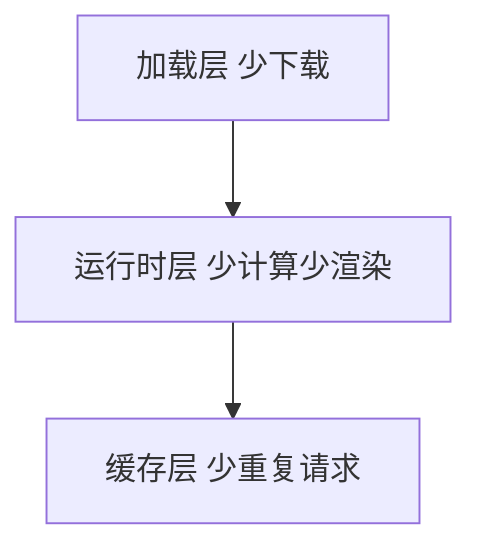

# 加载与运行时优化

## 学习目标

- 能按「体积 → 首屏 → 运行时」三层逐项优化并验证
- 会用 analyzer、Coverage、Performance 定位问题
- 能在项目中落地 lazy、缓存、虚拟列表、Worker

## 为什么需要

性能指标文档告诉你「LCP 差」——本章告诉你**具体改哪段代码、怎么验证**。

> 核心心法：**先量后优。** 没有 analyzer 截图的优化 PR 不合并。

---

## 一、三层优化地图



| 层 | 手段 | 验证 |
|----|------|------|
| 加载 | lazy、split、图片、CDN | Network 体积、LCP |
| 运行时 | memo、虚拟列表、Worker | Profiler、INP |
| 缓存 | HTTP、SW、Query cache | Network disk cache |

---

## 二、加载层落地

### 步骤 1：analyzer 找 Top5 模块

### 步骤 2：路由 lazy

```tsx
const Dashboard = lazy(() => import('./Dashboard'));
<Suspense fallback={<Skeleton />}><Dashboard /></Suspense>
```

### 步骤 3：图片

```html


```

### 步骤 4：字体

```css
@font-face { font-family: App; src: url(/f.woff2); font-display: swap; }
```

**验证：** Lighthouse 「Reduce unused JavaScript」项下降；LCP 前后对比。

---

## 三、运行时层落地

```tsx
// 搜索 — useTransition
startTransition(() => setFiltered(filter(data, q)));

// 长列表 — react-window
<FixedSizeList height={600} itemCount={n} itemSize={48}>...</FixedSizeList>

// 重计算 — Worker
worker.postMessage(largeDataset);
```

**验证：** Performance 无 >50ms long task；Profiler commit <16ms。

---

## 四、缓存层

```javascript
// React Query
useQuery({ queryKey: ['users'], staleTime: 60_000 });

// Service Worker — workbox precache 静态
```

---

## 排查实战

### 案例 A：首屏 JS 1.2MB

- analyzer：antd 全量 + moment
- 修复：按需 import + dayjs
- 结果：380KB gzip，LCP -1.2s

### 案例 B：滚动掉帧

- Performance：scroll handler 里强制 layout
- 修复：passive listener + transform 动画
- 结果：FPS 60

### 案例 C：重复 API

- React Query dedupe + staleTime
- Network 请求数 -70%

---

## 项目 Checklist

- [ ] 路由全 lazy，vendor split
- [ ] 首屏图 preload + 尺寸
- [ ] 列表 >100 条虚拟化
- [ ] PR 附 analyzer before/after

## 小结

- 加载看 Network/analyzer，运行看 Profiler
- 优化顺序：大头体积 → LCP 资源 → 长任务
- 每项优化必须可度量验证

## 延伸阅读

- [web.dev/fast](https://web.dev/fast/)
- 本模块 [01-性能指标体系](./01-性能指标体系.md)
