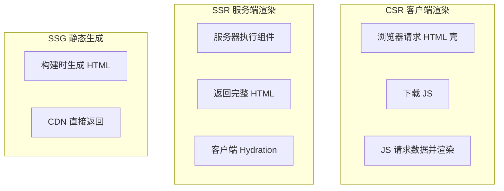
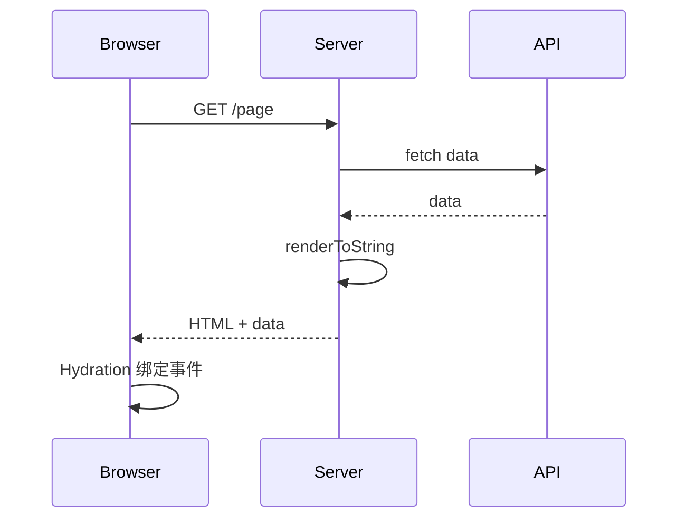
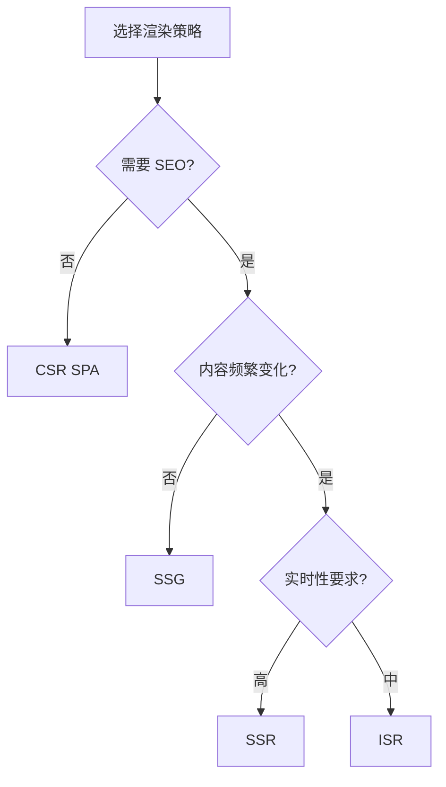

# 渲染策略（CSR / SSR / SSG / ISR）

## 学习目标

- 理解 CSR、SSR、SSG、ISR 的原理与差异
- 掌握各策略的适用场景与权衡
- 了解 Next.js、Nuxt 等框架的渲染模式
- 能为项目选择合适的渲染策略

## 为什么需要

不同页面对 SEO、首屏、交互的需求不同：

- 营销页：SEO 重要 → SSR/SSG
- 后台 Dashboard：SEO 无关 → CSR
- 新闻/电商详情：内容更新 → ISR

架构师需在**体验、成本、复杂度**间权衡。

## 核心原理

### 1. 四种策略对比



| 策略 | 渲染时机 | 首屏 | SEO | 服务器负载 |
|------|---------|------|-----|-----------|
| **CSR** | 浏览器 | 慢 | 差 | 低 |
| **SSR** | 每次请求 | 快 | 好 | 高 |
| **SSG** | 构建时 | 最快 | 好 | 极低 |
| **ISR** | 构建 + 按需更新 | 快 | 好 | 中 |

### 2. CSR（Client-Side Rendering）

```html
<!-- 初始 HTML 几乎为空 -->
<div id="root"></div>
<script src="app.js"></script>
```

```javascript
// app.js 挂载 React
createRoot(document.getElementById('root')).render(<App />);
// App 内 fetch 数据再渲染
```

**优点：** 简单、交互好、服务器压力小  
**缺点：** 首屏白屏、SEO 差、弱网体验差

### 3. SSR（Server-Side Rendering）



```jsx
// Next.js App Router
async function Page() {
  const data = await fetch('https://api.example.com/data');
  const json = await data.json();
  return <div>{json.title}</div>;
}
// 服务端执行，返回 HTML
```

**Hydration：** 客户端 JS 加载后，将事件绑定到已有 DOM，使静态 HTML "可交互"

**优点：** 首屏快、SEO 好  
**缺点：** 服务器成本、TTFB 受数据请求影响、Hydration 成本

### 4. SSG（Static Site Generation）

```javascript
// Next.js getStaticProps (Pages Router)
export async function getStaticProps() {
  const res = await fetch('https://api.example.com/posts');
  const posts = await res.json();
  return { props: { posts } };
}

// 构建时执行，生成静态 HTML
```

**适用：** 博客、文档、营销页、内容不频繁变化

### 5. ISR（Incremental Static Regeneration）

```javascript
// Next.js
export async function getStaticProps() {
  const data = await fetchData();
  return {
    props: { data },
    revalidate: 60 // 60 秒后 stale，下次请求后台重新生成
  };
}
```

- 静态 + 按需更新
- 兼顾 SSG 性能和 SSR  freshness

### 6. 选型决策



**混合策略（推荐）：**

- 营销/文档：SSG
- 商品详情：ISR 或 SSR
- 用户 Dashboard：CSR（登录后，SEO 无关）
- 首页：SSR 或 SSG

### 7. 流式 SSR（Streaming）

```jsx
// React 18 Suspense + Streaming
<Suspense fallback={<Skeleton />}>
  <SlowComponent />
</Suspense>
// 服务器先发送 Shell，SlowComponent 就绪后流式发送
```

减少 TTFB，渐进式展示内容。

## 常见误区与最佳实践

| 误区 | 正确理解 |
|------|---------|
| "SSR 一定比 CSR 快" | 数据慢时 TTFB 高，需 Streaming |
| "全站 SSR" | 按页面选型，后台可 CSR |
| "SSG 不能动态" | ISR、客户端 fetch 可补充 |
| "Hydration 无成本" | 大页面 Hydration 耗时，考虑 Partial Hydration |

**最佳实践：**

- 按路由选择策略，Next.js 支持 per-route
- 静态资源仍 CDN + 长缓存
- 监控 TTFB、LCP，SSR 页面关注服务端性能
- 敏感数据 SSR 时注意 XSS，做 escape

## 小结

- CSR：简单，首屏和 SEO 弱
- SSR：每次请求渲染，首屏和 SEO 好
- SSG：构建时生成，性能最佳
- ISR：静态 + 按需更新
- 混合策略按页面需求选型

## 延伸阅读

- [Next.js Rendering](https://nextjs.org/docs/app/building-your-application/rendering)
- [Nuxt Rendering Modes](https://nuxt.com/docs/guide/concepts/rendering)
- [Patterns.dev - Rendering Patterns](https://www.patterns.dev/vanilla/rendering-patterns/)
