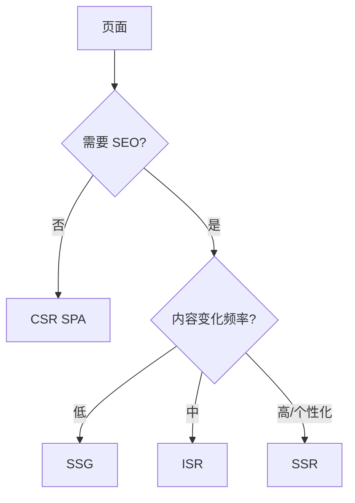
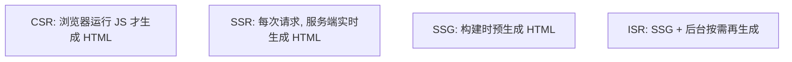
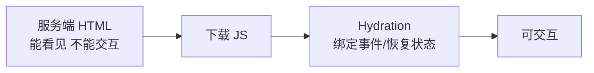

# 渲染策略（CSR / SSR / SSG / ISR）

## 学习目标

- 能为每个页面选对 CSR/SSR/SSG/ISR
- 能在 Next.js 中落地并验证 SEO、TTFB、Hydration
- 能排查 Hydration mismatch、SEO 不收录

## 为什么需要

「全站 SSR」和「全站 CSR」都是错的——**按页面特征选型**才是架构师工作。

> 核心心法：**需要 SEO/首屏？考虑 SSR/SSG。纯后台？CSR。** 混合架构是常态。

---

## 一、页面选型决策树



| 页面类型 | 推荐 | 理由 |
|---------|------|------|
| 营销首页 | SSG/ISR | 快+SEO |
| 商品详情 | ISR/SSR | SEO+库存更新 |
| 用户 Dashboard | CSR | 登录后，SEO 无关 |
| 文档站 | SSG | 纯静态 |

---

## 二、底层原理：四种渲染模式怎么工作

核心区别是「**HTML 在哪里、何时生成**」。



| 模式 | HTML 生成时机 | TTFB | 首屏/SEO | 内容新鲜度 | 代价 |
|------|--------------|------|---------|-----------|------|
| **CSR** | 浏览器执行 JS 时 | 快（空壳） | 慢、SEO 差 | 实时 | 首屏白屏、爬虫拿空 HTML |
| **SSR** | 每次请求服务端生成 | 较慢 | 快、SEO 好 | 实时 | 服务器压力、TTFB 受 API 拖累 |
| **SSG** | 构建时一次生成 | 最快（CDN） | 最快、SEO 好 | 构建时快照 | 内容更新需重新构建 |
| **ISR** | 构建生成 + 后台再生 | 最快（CDN） | 最快、SEO 好 | 可定时更新 | 有「短暂旧数据」窗口 |

```html
<!-- CSR 的 HTML：爬虫和首屏看到的是空壳 -->
<div id="root"></div>
<script src="/bundle.js"></script>  <!-- 执行后才有内容 -->

<!-- SSR/SSG 的 HTML：直接含正文，View Source 可见 -->
<div id="root"><article><h1>标题</h1><p>正文...</p></article></div>
```

### Hydration（注水）原理 —— SSR/SSG 的关键一步

服务端返回的 HTML 是「**死的**」：能看见，但按钮点了没反应。浏览器下载 JS 后，React/Vue 会复用这段 HTML、给它绑定事件、恢复状态，让它「活过来」——这就是 **Hydration**。



- 这解释了 SSR 的体验曲线：**FCP 早（看得见）但 TTI 晚（要等 JS 下载+hydrate 才能点）**，中间是「可见不可点」的尴尬期。
- **Hydration mismatch 的根源**：服务端生成的 HTML 与客户端首次渲染结果不一致（如 `Date.now()`、随机数、`typeof window` 分支），React 会警告甚至丢弃服务端 HTML 重渲染。
- **优化方向**：Streaming SSR（边生成边发送，渐进 hydrate）、React Server Components（部分组件零客户端 JS，减少 hydrate 量，见 React 19 篇）、Islands 架构（只 hydrate 交互岛屿）。

---

## 三、Next.js App Router 落地

### SSG/ISR

```tsx
// app/blog/[slug]/page.tsx
export async function generateStaticParams() {
  return posts.map(p => ({ slug: p.slug }));
}

export default async function Page({ params }) {
  const post = await getPost(params.slug); // 构建时/按需
  return <Article post={post} />;
}

export const revalidate = 3600; // ISR 1h
```

### SSR（动态）

```tsx
export const dynamic = 'force-dynamic';
export default async function Page() {
  const data = await fetch('https://api...', { cache: 'no-store' });
  return <div>{data.title}</div>;
}
```

### CSR 岛屿

```tsx
'use client';
export function InteractiveChart() { /* 仅客户端 */ }
```

---

## 四、Hydration 问题排查

**报错：** Text content does not match server-rendered HTML

**常见原因：**

- `Date.now()` / `Math.random()` 服务端客户端不一致
- 浏览器扩展改 DOM
- 错误嵌套 `<p><div></div></p>`

**修复：** 仅客户端值放 `useEffect`；或 `suppressHydrationWarning`（慎用）

**验证：** 生产 build `pnpm build && pnpm start`，Console 无 hydration error。

---

## 五、SEO 验证

1. View Source 看是否有正文 HTML（非空 div#root）
2. Google Rich Results Test
3. `sitemap.xml` + `robots.txt` + meta/JSON-LD

---

## 排查实战

### 案例 A：详情页 Google 不收录

- **原因：** 纯 CSR，爬虫空 HTML
- **修复：** 改 SSR/SSG，View Source 可见内容
- **验证：** Search Console 抓取成功

### 案例 B：TTFB 2s

- **原因：** SSR 每次打慢 API
- **修复：** ISR + CDN cache `s-maxage`
- **验证：** TTFB <600ms

---

## 项目落地步骤

1. 页面清单 + 选型表（上表）
2. Next 路由划分 Server/Client Component
3. 配 `revalidate` / `cache`
4. CI 跑 build + hydration 冒烟

## 流式渲染与边缘渲染

- **Streaming SSR**：分块发送 HTML，浏览器渐进渲染，改善 TTFB 体感
- **RSC**：服务端组件零客户端 JS，减少 bundle
- **Edge Rendering**：CDN 边缘节点执行 SSR，降低延迟

| 策略 | SEO | TTFB | 交互 | 复杂度 |
|------|-----|------|------|--------|
| CSR | 差 | 快 | 中 | 低 |
| SSR | 好 | 中 | 中 | 高 |
| SSG | 好 | 快 | 中 | 中 |
| ISR | 好 | 快 | 中 | 中高 |

## 面试高频问答（追问链）

> 大厂对一个考点通常追问到能力边界：**概念 → 机制 → 边界 → ⭐ 原理（触底）→ 实战（落地）**。实战层是区分「背过」和「做过」的关键。

### 链一：渲染模式选型

1. **概念**：CSR/SSR/SSG/ISR 本质区别？→ HTML 在哪/何时生成：浏览器/每次请求/构建时/构建+后台再生。
2. **机制**：SSR 缺点？→ 服务器压力、TTFB 依赖后端、Hydration 成本。
3. **边界**：什么时候用 ISR？→ 内容定期更新、高流量、可接受短暂旧数据。
4. **应用**：怎么选渲染模式？→ 营销 SSG、详情 ISR、后台 CSR，混合架构。
5. ⭐ **原理（触底）**：SSR 的 FCP 早但 TTI 晚为什么？怎么缓解？→ HTML 先到但需下载+hydrate 才可交互；用 Streaming SSR 分块、Selective Hydration、RSC 减少客户端 JS、islands 架构局部注水。
6. **实战（落地）**：一个真实项目你怎么做渲染选型？→ 场景：电商站营销页要 SEO+秒开、商品详情高流量且内容半小时更新、后台管理纯交互；步骤：营销页 SSG 构建预渲染、详情页 ISR(revalidate=1800)、后台 CSR；验证：View Source 确认 SSG/SSR 页有内容、Lighthouse SEO=100、监控 TTFB 与 ISR 命中率；结果：营销页 LCP<1.5s 且被搜索收录，详情页用静态+后台再生扛住大促流量。

### 链二：Hydration

1. **概念**：Hydration 是什么？→ 给服务端 HTML 注水绑定事件。
2. **机制**：mismatch 原因？→ 服务端/客户端渲染不一致（Date、随机数、浏览器 API）。
3. **应用**：怎么避免 mismatch？→ 用 useEffect 处理客户端独有逻辑、suppressHydrationWarning 兜底。
4. ⭐ **原理（触底）**：RSC 怎么减少 hydration 成本？→ 服务端组件不下发 JS、无需注水，只有交互的客户端组件 hydrate，bundle 与 TTI 双降。
5. **实战（落地）**：你遇到过 hydration mismatch 怎么排查修复？→ 场景：SSR 页控制台报 hydration mismatch、首屏闪动；步骤：定位是 `new Date()`/`Math.random()`/`localStorage` 在渲染期产生服务端与客户端差异 → 把客户端独有逻辑移进 useEffect、必要处 suppressHydrationWarning 兜底；验证：清掉 console warning、对比 SSR HTML 与首帧一致；结果：消除闪动，交互组件改用 islands/RSC 局部注水进一步降 TTI。

## 小结

- 四模式本质是「HTML 在哪/何时生成」：CSR 浏览器、SSR 每次请求、SSG 构建时、ISR 构建+后台再生
- Hydration = 给服务端 HTML 注水绑事件；FCP 早但 TTI 晚是其固有特征
- 混合架构：营销 SSG、详情 ISR、后台 CSR
- Hydration mismatch 源于服务端/客户端渲染不一致
- SEO 必须 View Source 有内容；进阶用 Streaming SSR / RSC 减少 hydrate

## 延伸阅读

- [Next.js Rendering](https://nextjs.org/docs/app/building-your-application/rendering)
